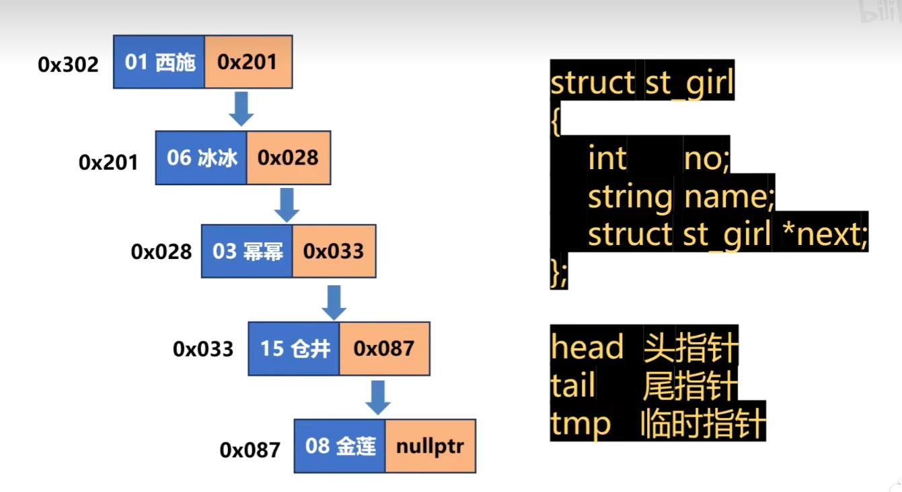

> 如果结构体中有一个本结构体的指针，它就是链表。

`struct st_girl`

`{`

​    `int no;`

​    `string name;`

​    `struct st_girl *next;`

`};`



示例：

```c++
#include <iostream>     // 包含头文件。
using namespace std;    // 指定缺省的命名空间。

struct st_girl   // 超女单链表。
{
    int no;            // 超女编号。
    string name;         // 超女姓名。
    struct st_girl *next;   // 下一个超女节点的地址，如果本节点是最后一条记录，填nullptr。
};

int main() {
    st_girl *head = nullptr, *tail = nullptr, *tmp = nullptr;  // head头指针、tail尾指针、tmp临时指针。

    tmp = new st_girl({1, "西施", nullptr});   // 分配第一个节点。

    head = tail = tmp;

    tmp = new st_girl({6, "冰冰", nullptr});   // 分配第二个节点。

    tail->next = tmp;   // 把上一个节点的next指针指向新节点。

    tail = tmp;         // 移动尾指针，让尾指针指向刚分配出来的新节点。

    tmp = new st_girl({3, "幂幂", nullptr});   // 分配第三个节点。

    tail->next = tmp;   // 把上一个节点的next指针指向新节点。

    tail = tmp;         // 移动尾指针，让尾指针指向刚分配出来的新节点。

    // 遍历链表。

    tmp = head;       // 从头节点开始。

    while (tmp != nullptr) {
        cout << "no=" << tmp->no << "name=" << tmp->name << "tmp->next=" << tmp->next << endl;
        tmp = tmp->next;  // 顺着next指向往后面找。

    }

    // 释放链表。

    while (head != nullptr) {
        tmp = head;        // 让临时节点指向头节点。

        head = head->next; // 头节点后移。

        delete tmp;         // 删除临时节点。

    }

}
```

