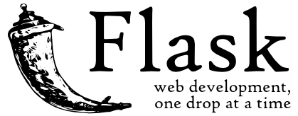

1. 从0开始入手到上手一个新的框架，应该怎么展开？
2. flask这种轻量级的框架与django这种的重量级框架的区别？
3. 针对web开发过程中，常见的数据库ORM的操作。
4. 跟着学习flask的过程中，自己去学习和了解一个新的框架（Sanic，FastAPI）

旧的常用框架：django(3.0以后支持异步)，flask(2.0以后支持异步)和 tornado（异步），twisted（异步） 

新的常用框架：FastAPI，sanic，django4.0（目前的版本属于从同步到异步改造过程中），flask2.0(目前的版本属于从同步到异步改造过程中)

Sanic：https://sanicframework.org/zh/guide/

FastAPI：https://fastapi.tiangolo.com/zh/tutorial/first-steps/

# Flask

Flask诞生于2010年，是Armin ronacher（阿明·罗纳彻）用 Python 语言基于 Werkzeug 工具箱编写的轻量级Web开发框架。

Flask 本身相当于一个内核，其他几乎所有的功能都要用到扩展（邮件扩展Flask-Mail，用户认证Flask-Login，数据库Flask-SQLAlchemy），都需要用第三方的扩展来实现。比如可以用 Flask 扩展加入ORM、窗体验证工具，文件上传、身份验证等。Flask 没有默认使用的数据库，你可以选择 MySQL，也可以用 NoSQL。

flask的 WSGI 工具箱采用 Werkzeug（路由模块），模板引擎则使用 Jinja2。Itsdangrous（token加密模块），Click(终端命令管理工具)，flask内核本身，这5个核心模块组成 Flask 框架。

官网: https://flask.palletsprojects.com/en/2.0.x/

官方文档: [https://dormousehole.readthedocs.io/en/latest/index.html](http://docs.jinkan.org/docs/flask/)

**Flask常用第三方扩展包：**

- Flask-SQLAlchemy：操作数据库,ORM；
- Flask-script：终端脚本工具，脚手架； ( 淘汰，官方内置脚手架：Click)
- Flask-migrate：管理迁移数据库；
- Flask-Session：Session存储方式指定；
- Flask-Mail：邮件；
- Flask-Login：认证用户状态；（django内置Auth模块，用于实现用户登录退出，）
- Flask-OpenID：认证, OAuth；（三方授权，）
- Flask-RESTful：开发REST API的工具；
- Flask JSON-RPC:  开发json-rpc远程服务[过程]调用
- Flask-Bable：提供国际化和本地化支持，翻译；
- Flask-Moment：本地化日期和时间
- Flask-Admin：简单而可扩展的管理接口的框架
- Flask-Bootstrap：集成前端Twitter Bootstrap框架（前后端分离，除了admin站点，基本不用这玩意）
- Flask-WTF：表单生成模块；（前后端分离，除了admin站点，基本不用这玩意）
- Flask-Marshmallow：序列化（类似djangorestframework的序列化器）

可以通过  https://pypi.org/search/?c=Framework+%3A%3A+Flask 查看更多flask官方推荐的扩展
