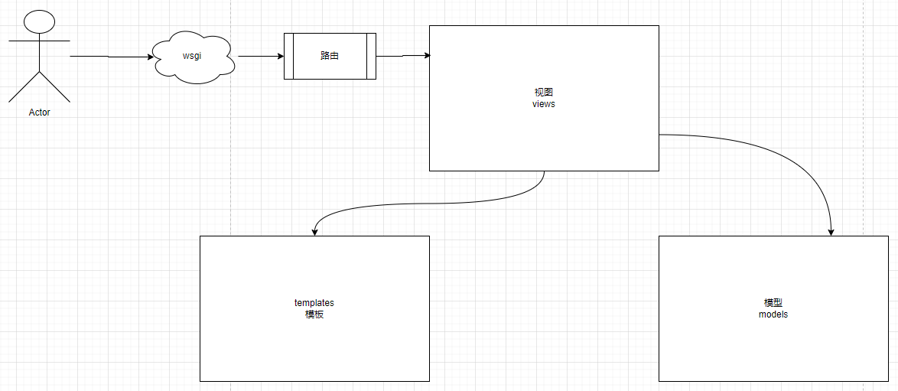
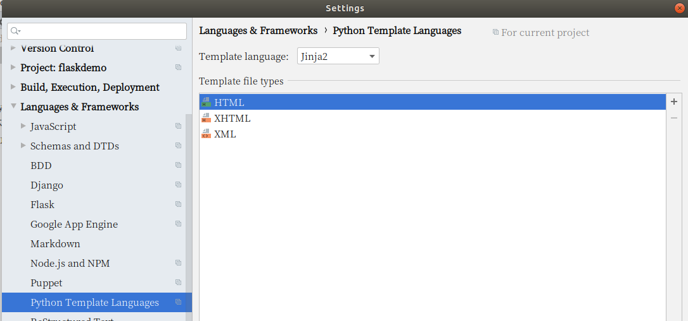
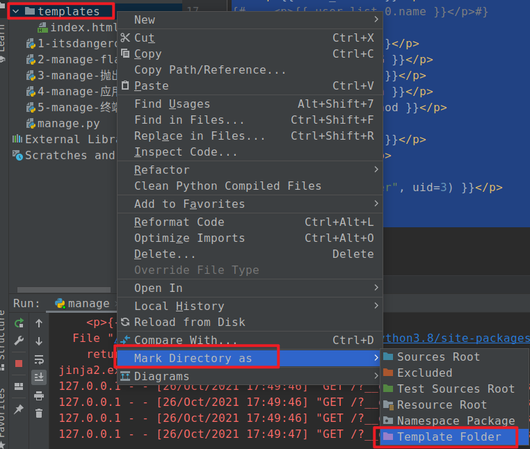
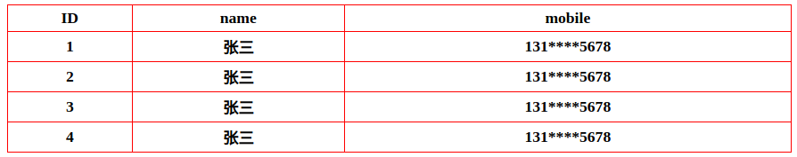

# Jinja2模板引擎

个人感觉这部分看看就行，知道有这个功能，后期前后端分离，有专门的前端框架来做这部分内容



Flask内置的模板语言Jinja2，它的设计思想来源于 Django 的模板引擎DTP(DjangoTemplates)，并扩展了其语法和一系列强大的功能。

- Flask提供的 **render_template** 函数封装了该模板引擎Jinja2
- **render_template** 函数的第一个参数是模板的文件名，后面的参数都是键值对，表示模板中变量对应的数据值。


## 模板基本使用

1. 在flask应用对象创建的时候，设置template_folder参数，默认值是templates也可以自定义为其他目录名，需要手动创建模板目录。

   ```python
   from flask import Flask, render_template
   
   app = Flask(__name__, template_folder="templates")
   ```

2. 在手动创建 `templates` 目录下创建一个模板html文件 `index.html`，代码：

   ```django
   <!DOCTYPE html>
   <html lang="en">
   <head>
     <meta charset="UTF-8">
     <title>{{title}}</title>
   </head>
   <body>
     <h1>{{content}}</h1>
   </body>
   </html>
   ```

3. 在视图函数设置渲染模板并设置模板数据

   ```python
   from flask import Flask, render_template
   
   app = Flask(__name__, template_folder="templates")
   
   
   @app.route("/")
   def index():
       title = "网页标题"
       content = "网页正文内容"
       return render_template("index.html", **locals())
   
   if __name__ == '__main__':
       app.run()
   
   ```

flask中提供了2个加载模板的函数：render_template与render_template_string。

render_template：基于参数1的模板文件路径，读取html模板内容，返回渲染后的HTML页面内容。

render_template_string：基于参数1的模板内容，返回渲染后的HTML页面内容。

```python
from flask import Flask, render_template, render_template_string

app = Flask(__name__, template_folder="templates")


@app.route("/")
def index():
    title = "网页标题"
    content = "网页正文内容"
    html = render_template("index.html", **locals())
    print(html, type(html))
    return html


@app.route("/tmp")
def tmp():
    title = "网页标题"
    content = "网页正文内容"
    temp = """<!DOCTYPE html>
<html lang="en">
<head>
  <meta charset="UTF-8">
  <title>{{title}}</title>
</head>
<body>
  <h1>{{content}}</h1>
</body>
</html>
    """
    html = render_template_string(temp, **locals())
    print(html, type(html))
    return html

if __name__ == '__main__':
    app.run(debug=True)
```


### 输出变量

```
{{ 变量名 }}，这种 {{ }} 语法叫做 变量代码块
```

视图代码：

```python
from flask import Flask, render_template, session, g

app = Flask(__name__, template_folder="templates")

app.config["SECRET_KEY"] = "my secret key"

@app.route("/")
def index():
    # 基本类型
    num = 100
    num2 = 3.14
    is_bool = True
    title = "网页标题"

    # 复合类型
    set_var = {1,2,3,4}
    list_var = ["小明", "小红", "小白"]
    dict_var = {"name": "root", "pwd": "1234557"}
    tuple_var = (1,2,3,4)

    # 更复杂的数据结构
    book_list = [
        {"id": 10, "title": "图书标题10a", "description": "图书介绍",},
        {"id": 13, "title": "图书标题13b", "description": "图书介绍",},
        {"id": 21, "title": "图书标题21c", "description": "图书介绍",},
    ]

    session["uname"] = "root"
    g.num = 300

    html = render_template("index.html", **locals())
    return html

if __name__ == '__main__':
    app.run(debug=True)

```

模板代码，template/index.html，代码：

```jinja2
<!DOCTYPE html>
<html lang="en">
<head>
  <meta charset="UTF-8">
  <title>{{title}}</title>
</head>
<body>
  <p>
    基本类型<br>
    num = {{num}}<br>
    {{num2}}<br>
    {{is_bool}}<br>
    {{title}}<br>
  </p>
  <p>
    复合类型<br>
    {{set_var}}<br>
    {{set_var.pop()}}<br>
    {{list_var}}<br>
    {{list_var[1]}}<br>
    {{list_var.0}}<br>
    {{list_var[-1]}}，点语法不能写负数下标<br>
    {{dict_var}}<br>
    {{dict_var["name"]}}<br>
    {{dict_var.name}}<br>
    {{tuple_var}}<br>
    {{tuple_var.0}}<br>
  </p>
  <p>
    更复杂的数据结构<br>
    {{book_list}}<br>
    {{book_list.2}}<br>
    {{book_list.1.title}}<br>
  </p>

  <p>
    内置的全局变量 <br>
    {{request}}<br>
    {{request.path}}<br>
    {{request.method}}<br>
    {{session.get("uname")}}<br>
    {{g.num}}<br>
  </p>

</body>
</html>
```

pycharm中设置当前项目的模板语言：

files/settings/languages & frameworks/python template languages。

设置下拉框为jinja2，保存



设置指定目录为模板目录，鼠标右键->Mark Directory as ...-> Template Folder




Jinja2 模版中的变量代码块的输出的内容可以是Python的任意类型数据或者对象，只要它能够被 Python 的 `__str__` 方法或者str()转换为一个字符串就可以。


使用 {# #} 进行注释，注释的内容不会在html中被渲染出来

```jinja2
<!DOCTYPE html>
<html lang="en">
<head>
  <meta charset="UTF-8">
  <title>{{title}}</title>
</head>
<body>
  <p>
    基本类型<br>
    num = {{num}}<br>
    {{num2}}<br>
    {{is_bool}}<br>
    {{title}}<br>
  </p>
  <p>
    {# 此处为模板注释 #}
    复合类型<br>
{#    {{set_var}}<br>#}
    {{set_var.pop()}}<br>
    {{list_var}}<br>
    {{list_var[1]}}<br>
    {{list_var.0}}<br>
    {{list_var[-1]}}，点语法不能写负数下标<br>
    {{dict_var}}<br>
    {{dict_var["name"]}}<br>
    {{dict_var.name}}<br>
    {{tuple_var}}<br>
    {{tuple_var.0}}<br>
  </p>
  <p>
    更复杂的数据结构<br>
    {{book_list}}<br>
    {{book_list.2}}<br>
    {{book_list.1.title}}<br>
  </p>

  <p>
    内置的全局变量 <br>
    {{request}}<br>
    {{request.path}}<br>
    {{request.method}}<br>
    {{session.get("uname")}}<br>
    {{g.num}}<br>
  </p>

</body>
</html>
```


## 模板中内置的变量和函数

你可以在自己的模板中访问一些 Flask 默认内置的函数和对象

#### config

你可以从模板中直接访问Flask当前的config对象:

```jinja2
    <p>{{ config.ENV }}</p>
    <p>{{ config.DEBUG }}</p>
```

#### request

就是flask中代表当前请求的request对象：

```jinja2
    <p>{{ request.url }}</p>
    <p>{{ request.path }}</p>
    <p>{{ request.method }}</p>
```

#### session

为Flask的session对象，显示session数据

```jinja2
{{session.new}}
False
```

#### g变量

在视图函数中设置g变量的 name 属性的值，然后在模板中直接可以取出

```jinja2
{{ g.name }}
```

#### url_for()

url_for会根据传入的路由器函数名,返回该路由对应的URL,在模板中始终使用url_for()就可以安全的修改路由绑定的URL,则不比担心模板中渲染出错的链接:

```jinja2
{{url_for('home')}}
```

如果我们定义的路由URL是带有参数的,则可以把它们作为关键字参数传入url_for(),Flask会把他们填充进最终生成的URL中:

```jinja2
{{ url_for('index', id=1)}}
/index/1      {#  /index/<int:id> id被声明成路由参数 #}
/index?id=1   {#  /index          id被声明成路由参数 #}
```

课堂代码：

主程序 manage.py：

```python
from flask import Flask, render_template, session, g

app = Flask(__name__, template_folder="templates")

app.config["SECRET_KEY"] = "my secret key"

@app.route("/")
def index():
    # 基本类型
    num = 100
    num2 = 3.14
    is_bool = True
    title = "网页标题"

    # 复合类型
    set_var = {1,2,3,4}
    list_var = ["小明", "小红", "小白"]
    dict_var = {"name": "root", "pwd": "1234557"}
    tuple_var = (1,2,3,4)

    # 更复杂的数据结构
    book_list = [
        {"id": 10, "title": "图书标题10a", "description": "图书介绍",},
        {"id": 13, "title": "图书标题13b", "description": "图书介绍",},
        {"id": 21, "title": "图书标题21c", "description": "图书介绍",},
    ]

    session["uname"] = "root"
    g.num = 300

    html = render_template("index.html", **locals())
    return html

@app.route("/user/<uid>")
def user1(uid):
    return "ok"

@app.route("/user")
def user2():
    return "ok"

if __name__ == '__main__':
    app.run(debug=True)

```

模板 templates/index.html：

```jinja2
<!DOCTYPE html>
<html lang="en">
<head>
  <meta charset="UTF-8">
  <title>{{title}}</title>
</head>
<body>
  <p>
    基本类型<br>
    num = {{num}}<br>
    {{num2}}<br>
    {{is_bool}}<br>
    {{title}}<br>
  </p>
  <p>
    {# 此处为模板注释 #}
    复合类型<br>
{#    {{set_var}}<br>#}
    {{set_var.pop()}}<br>
    {{list_var}}<br>
    {{list_var[1]}}<br>
    {{list_var.0}}<br>
    {{list_var[-1]}}，点语法不能写负数下标<br>
    {{dict_var}}<br>
    {{dict_var["name"]}}<br>
    {{dict_var.name}}<br>
    {{tuple_var}}<br>
    {{tuple_var.0}}<br>
  </p>
  <p>
    更复杂的数据结构<br>
    {{book_list}}<br>
    {{book_list.2}}<br>
    {{book_list.1.title}}<br>
  </p>

  <p>
    内置的全局变量 <br>
    {{request}}<br>
    {{request.path}}<br>
    {{request.method}}<br>
    {{session.get("uname")}}<br>
    {{g.num}}<br>
  </p>

  <p>{{ config.ENV }}</p>
  <p>{{ url_for("user1", uid=3) }}</p>    {# /user/3 #}
  <p>{{ url_for("user2", uid=3) }}</p>    {# /user?uid=3 #}
</body>
</html>
```


## 流程控制

主要包含两个：

```
- if / elif /else / endif
   - if .... endif
   - if ... else ... endif
   - if ... elif ... elif ... elif .... endif
   - if ... elif ... elif ... elif .... else .... endif

- for / else / endfor
   - for .... endfor
   - for .... else .... endfor
```


### if语句

Jinja2 语法中的if语句跟 Python 中的 if 语句相似,后面的布尔值或返回布尔值的表达式将决定代码中的哪个流程会被执行.

用 ``  定义的**控制代码块**，可以实现一些语言层次的功能，比如循环或者if语句

视图代码：

```python
import random

from flask import Flask, render_template

app = Flask(__name__, template_folder="templates")

@app.route("/")
def index():
    score = random.randint(1, 100)
    html = render_template("index2.html", **locals())
    return html

if __name__ == '__main__':
    app.run(debug=True)

```

templates/index2.html，模板代码：

```jinja2
<!doctype html>
<html lang="en">
<head>
  <meta charset="UTF-8">
  <title>Document</title>
</head>
<body>
  <p>if判断</p>
  <p>{{ request.args.get("state") }}</p>
  
    <p>state的值是123456</p>
  

  <hr>
  {% if request.args.get("num", 0) | int % 2 == 0 %}
    <p>num是偶数，值为={{ request.args.get("num", 0) }}</p>
  
    <p>num是奇数，值为={{ request.args.get("num", 0) }}</p>
  
  <hr>
  
  <p>本次考试不及格！</p>
  
  <p>不够优秀，下次继续努力！</p>
  
  <p>很棒，下次再加把劲，就要满分了！</p>
  
  <p>学霸！厉害！</p>
  

</body>
</html>
```


### 循环语句

- 我们可以在 Jinja2 中使用循环来迭代任何列表或者生成器函数
- 循环和if语句可以组合使用
- 在循环内部,你可以使用一个叫做loop的特殊变量来获得关于for循环的一些信息

视图代码：

```python
import random

from flask import Flask, render_template

app = Flask(__name__, template_folder="templates")

@app.route("/")
def index():

    book_list = [
        {"id": 10, "title": "图书标题10a", "description": "图书介绍",},
        {"id": 13, "title": "图书标题13b", "description": "图书介绍",},
        {"id": 21, "title": "图书标题21c", "description": "图书介绍",},
        {"id": 10, "title": "图书标题10a", "description": "图书介绍", },
        {"id": 13, "title": "图书标题13b", "description": "图书介绍", },
        {"id": 21, "title": "图书标题21c", "description": "图书介绍", },
        {"id": 10, "title": "图书标题10a", "description": "图书介绍", },
        {"id": 13, "title": "图书标题13b", "description": "图书介绍", },
        {"id": 21, "title": "图书标题21c", "description": "图书介绍", },
    ]

    data_list = [
        {"id": 1, "name": "小明", "sex": 1},
        {"id": 2, "name": "小花", "sex": 0},
        {"id": 3, "name": "小白", "sex": 1},
    ]

    html = render_template("index3.html", **locals())
    return html

if __name__ == '__main__':
    app.run(debug=True)

```

templates/index3.html，模板代码：

```jinja2
<!doctype html>
<html lang="en">
<head>
  <meta charset="UTF-8">
  <title>Document</title>
  <style>
  .table{
      border: 1px solid red;
      border-collapse: collapse;
      width: 800px;
  }
  .table tr th,
  .table tr td{
      border: 1px solid red;
      text-align: center;
  }
  </style>
</head>
<body>
  <table class="table">
    <tr>
      <th>序号</th>
      <th>ID</th>
      <th>标题</th>
      <th>描述</th>
    </tr>
    
    
    <tr bgcolor="aqua">
    
    <tr bgcolor="aqua">
    
    <tr bgcolor="#faebd7">
    
      <td>
        {{ loop.index }}
        {{ loop.index0 }}
        {{ loop.revindex }}
        {{ loop.revindex0 }}
        {{ loop.length }}
      </td>
      <td>{{ book.id }}</td>
      <td>{{ book.title }}</td>
      <td>{{ book.description }}</td>
    </tr>
    
  </table>
  <br>

  <table class="table">
    <tr>
      <th>ID</th>
      <th>姓名</th>
      <th>性别</th>
    </tr>
    
      <tr>
        <td>{{ data.id }}</td>
        <td>{{ data.name }}</td>
        <td>{{ loop.cycle("男","女")}}，原始值={{ data.sex }}</td>
      </tr>
    

  </table>

</body>
</html>
```

在一个 for 循环块中可以访问这些特殊的变量：

| 变量           | 描述                                           |
| :------------- | :--------------------------------------------- |
| loop.index     | 当前循环迭代的次数（从 1 开始）                |
| loop.index0    | 当前循环迭代的次数（从 0 开始）                |
| loop.revindex  | 到循环结束需要迭代的次数（以 1 结束）          |
| loop.revindex0 | 到循环结束需要迭代的次数（以 0 结束）          |
| loop.first     | 如果是第一次迭代，为 True 。                   |
| loop.last      | 如果是最后一次迭代，为 True 。                 |
| loop.length    | 序列中的项目数。                               |
| loop.cycle     | 在一串序列间期取值的辅助函数。见下面示例程序。 |


## 过滤器

django中的模板引擎里面曾经使用过滤器，在flask中也有过滤器，并且也可以被用在 if 语句或者for语句中:

视图代码：

```python
import random

from flask import Flask, render_template

app = Flask(__name__, template_folder="templates")

@app.route("/")
def index():
    book_list = [
        {"id": 1, "price": 78.50,   "title":"javascript入门",    "cover": ""},
        {"id": 2, "price": 78.5,    "title":"python入门",        "cover": ""},
        {"id": 3, "price": 78.6666, "title":"django web项目实战", "cover": ""},
        {"id": 4, "price": 78.6666, "title":"django web项目实战", "cover": "<script>alert('hello!')</script>"},
    ]
    html = render_template("index4.html", **locals())
    return html

if __name__ == '__main__':
    print(app.url_map)
    app.run(debug=True)

```

index8.html，模板代码：

```html
<!doctype html>
<html lang="en">
<head>
  <meta charset="UTF-8">
  <title>Document</title>
  <style>
  .table{
      border: 1px solid red;
      border-collapse: collapse;
      width: 800px;
  }
  .table tr th,
  .table tr td{
      border: 1px solid red;
      text-align: center;
  }
  img{
      max-width: 100%;
      max-height: 50px;
  }
  </style>
</head>
<body>
  <table class="table">
    <tr>
      <th>ID</th>
      <th>标题</th>
      <th>价格</th>
      <th>封面</th>
    </tr>
    
    <tr>
      <th>{{ book.id }}</th>
      <th>{{ book.title }}</th>
{#      <th>{{ "%.2f" % book.price }}</th>#}
      <th>{{ "%.2f" | format(book.price) }}</th>
      <th>{{ book.cover | safe }}</th>
    </tr>
    
    
  </table>

</body>
</html>
```

flask中 **过滤器的本质就是函数**。有时候我们不仅仅只是需要输出变量的值，我们还需要修改变量的显示，甚至格式化、运算等等，而在模板中是不能直接调用 Python 的方法，那么这就用到了过滤器。

使用方式：

- 过滤器的使用方式为：变量名 | 过滤器 | 。。。。。

```python
{{ 代码段或变量 | filter_name(args1,args2,....)}}  # 过滤器左边的内容永远作为过滤器的第一个参数
```

- 如果没有任何参数传给过滤器,则可以把括号省略掉

```python
{{ 代码段或变量 | title }}
```

- 如：`title`过滤器的作用：把变量的值的首字母转换为大写，其他字母转换为小写

在 jinja2 中，过滤器是可以支持链式调用的，示例如下：

```python
  <p>{{ "HELLO WORLD".title() }}</p>
  <p>{{ "HELLO WORLD" | title | reverse | upper }}</p>
```


### 常见的内建过滤器

源代码：`from jinja2.filters import FILTERS`

#### 字符串操作

| 过滤器       | 描述                                                         | 代码                                                         |
| ------------ | ------------------------------------------------------------ | ------------------------------------------------------------ |
| **safe**     | 禁用实体字符的转义                                           | `{{ '<h1>hello</h1>' | safe}}`                               |
| lower        | 把字母转成小写                                               | `{{ 'HELLO' | lower }}`                                      |
| upper        | 把字母转成大写                                               | `{{ 'hello' | upper }}`                                      |
| **reverse**  | 序列类型的数据反转，支持字符串、列表、元祖                   | `{{ 'olleh' | reverse }}`                                    |
| format       | 格式化输出                                                   | `{{ '%s = %d' | format('name',17) }}`<br>`{{ '%s = %d' % ('name', 17) }}` |
| striptags    | 渲染之前把值中所有的HTML标签都删掉                           | `{{ '<script>alert("hello")</script>' |  striptags }}`<br>如内容中存在大小于号的情况，则不要使用这个过滤器，容易误删内容。<br>`{{ "如果x<y，z>x，那么x和z之间是否相等？" | striptags }}` |
| **truncate** | 字符串截断<br>truncate(截取长度, 是否强制截取False, 省略符号...) | `{{ 'hello every one'  | truncate(9)}}`                      |

视图代码：

```python
from flask import Flask, render_template

app = Flask(__name__, template_folder="templates")

@app.route("/")
def index():
    html = render_template("index5.html", **locals())
    return html

if __name__ == '__main__':
    print(app.url_map)
    app.run(debug=True)

```

tempaltes/index5.html，代码：

```jinja2
<!doctype html>
<html lang="en">
<head>
  <meta charset="UTF-8">
  <title>Document</title>
</head>
<body>
  <p>{{ "HELLO WORLD".title() }}</p>
  <p>{{ "HELLO WORLD" | title | reverse | upper }}</p>

  <p>{{ age | default(10)}}</p>
  <p>{{ age | d(10)}}</p>

  <p>{{ "hello" | last }}</p>

  
    {{ item }},
  

  <p>
    {{ '<script>alert("hello")</script>' | striptags }}
  </p>

  <p>
    {{ "如果x<y，z>x，那么x和z之间是否相等？" | striptags }}
  </p>

  <p>
    {{ 'hello every one'  | truncate(9)}}
  </p>

  <p>{{ "foo bar baz qux www"|truncate(11) }}</p>
  {# foo bar... #}

  <p>{{ "foo bar baz qux"|truncate(11, True, '...') }}</p>
  {# foo bar ... #}
</body>
</html>
```


#### 列表操作

| 过滤器 | 描述                             | 代码                           |
| ------ | -------------------------------- | ------------------------------ |
| first  | 取序列类型变量的第一个元素       | `{{ [1,2,3,4,5,6] | first }}`  |
| last   | 取序列类型变量的最后一个元素     | `{{ [1,2,3,4,5,6] | last }}`   |
| length | 获取序列类型变量的长度           | `{{ [1,2,3,4,5,6] | length }}` |
| count  | 获取序列类型变量的长度           | `{{ [1,2,3,4,5,6] | count }}`  |
| sum    | 列表求和，成员只能是数值类型！！ | `{{ [1,2,3,4,5,6] | sum }}`    |
| sort   | 列表排序                         | `{{ [6,2,3,1,5,4] | sort }}`   |

视图代码：

```python
from flask import Flask, render_template

app = Flask(__name__, template_folder="templates")

@app.route("/")
def index():
    html = render_template("index6.html", **locals())
    return html

if __name__ == '__main__':
    print(app.url_map)
    app.run(debug=True)

```

templates/index6.html，代码：

```jinja2
<!doctype html>
<html lang="en">
<head>
  <meta charset="UTF-8">
  <title>Document</title>
</head>
<body>
<p>{{ [1,2,3,4,5,6] | first }}</p>
<p>{{ [1,2,3,4,5,6] | last }}</p>
<p>{{ [1,2,3,4,5,6] | length }}</p>
<p>{{ [1,2,3,4,5,6] | count }}</p>
<p>{{ [1,2,3,4,5,6] | sum }}</p>
<p>{{ [1,2,3,4,5,6] | sort }}</p>
<p>{{ [1,2,3,4,5,6] | sort(reverse=True) }}</p>
</body>
</html>
```


#### 语句块过滤

```pyhton

    <p>abc</p>
    <p>{{ ["a","c"] }}</p>
    <p>{{ ["a","c"] }}</p>
    <p>{{ ["a","c"] }}</p>
    <p>{{ ["a","c"] }}</p>

```


### 自定义过滤器

过滤器的本质是函数。当模板内置的过滤器不能满足项目需求，可以自定义过滤器。自定义过滤器有两种实现方式：

- 一种是通过Flask应用对象的 **app.add_template_filter** 方法进行注册
- 通过装饰器来实现自定义过滤器进行注册

**注意：自定义的过滤器名称如果和内置的过滤器重名，会覆盖内置的过滤器。**


需求：编写一个过滤器，保留n位小数

方式一

通过调用应用程序实例的 add_template_filter 方法实现自定义过滤器。该方法第一个参数是函数名，第二个参数是自定义的过滤器名称：

filters.py，代码：

```python
def do_fixed(data, length=2):
    return f"%.{length}f" % data

def do_yuan(data):
    return f"{data}元"

FILTERS = {
    "fixed": do_fixed,
    "yuan": do_yuan,
}

```

视图代码：

```python
from flask import Flask, render_template

app = Flask(__name__, template_folder="templates")

"""第一种注册过滤器的方式"""
# 批量注册自定义过滤器
from filters import FILTERS
for key, value in FILTERS.items():
    app.add_template_filter(value, key)

@app.route("/")
def index():
    html = render_template("index7.html", **locals())
    return html

if __name__ == '__main__':
    print(app.url_map)
    app.run(debug=True)

```

templates/index7.html，模板代码：

```jinja2
<!doctype html>
<html lang="en">
<head>
  <meta charset="UTF-8">
  <title>Document</title>
</head>
<body>
  <p>{{ 10 | fixed }}</p>
  <p>{{ 10 | yuan }}</p>
</body>
</html>
```


方式二

用装饰器来实现自定义过滤器。装饰器传入的参数是自定义的过滤器名称。

```python
from flask import Flask, render_template

app = Flask(__name__, template_folder="templates")

"""第一种注册过滤器的方式"""
# 批量注册自定义过滤器
from filters import FILTERS
for key, value in FILTERS.items():
    app.add_template_filter(value, key)


"""第二种注册过滤器的方式"""
@app.template_filter("fixed2")
def do_fixed2(data):
    return f"{data:.2f}"


@app.route("/")
def index():
    html = render_template("index7.html", **locals())
    return html

if __name__ == '__main__':
    print(app.url_map)
    app.run(debug=True)

```

templates/html7.html调用过滤器，模板代码：

```html
<!doctype html>
<html lang="en">
<head>
  <meta charset="UTF-8">
  <title>Document</title>
</head>
<body>
  <p>{{ 10 | fixed }}</p>
  <p>{{ 10 | yuan }}</p>
  <p>{{ 10 | fixed2 }}</p>
</body>
</html>
```


#### 练习：给手机进行部分屏蔽 `13112345678` ---> `131****5678`

视图代码：

```python
from flask import Flask, render_template

app = Flask(__name__, template_folder="templates")

def do_mobile(data, dot="*"):
    return data[:3] + dot*4 + data[-4:]

app.add_template_filter(do_mobile, "mobile")

@app.route("/")
def index():
    user_list = [
        {"id":1,"name":"张三","mobile":"13112345678"},
        {"id":2,"name":"张三","mobile":"13112345678"},
        {"id":3,"name":"张三","mobile":"13112345678"},
        {"id":4,"name":"张三","mobile":"13112345678"},
    ]
    html = render_template("index8.html", **locals())
    return html

if __name__ == '__main__':
    app.run(debug=True)

```

templates/index8.html，模板代码：

```html
<!doctype html>
<html lang="en">
<head>
  <meta charset="UTF-8">
  <title>Document</title>
  <style>
  .table{
      border: 1px solid red;
      border-collapse: collapse;
      width: 800px;
  }
  .table tr th,
  .table tr td{
      border: 1px solid red;
      text-align: center;
  }
  img{
      max-width: 100%;
      max-height: 50px;
  }
  </style>
</head>
<body>
  <table class="table">
    <tr>
      <th>ID</th>
      <th>账号</th>
      <th>手机</th>
    </tr>
    
    <tr>
      <td>{{ user.id }}</td>
      <td>{{ user.name }}</td>
      <td>{{ user.mobile | mobile }}</td>
    </tr>
    

  </table>
</body>
</html>
```

效果：




## 模板继承

在模板中，可能会遇到以下情况：

- 多个模板具有完全相同的顶部和底部内容
- 多个模板中具有相同的模板代码内容，但是内容中部分值不一样，弹窗
- 多个模板中具有完全相同的 html 代码块内容，侧边栏

像遇到这种情况，可以使用 JinJa2 模板中的 **模板继承** 来进行实现

模板继承是为了重用模板中的公共内容。一般Web开发中，继承主要使用在网站的顶部菜单、底部、弹窗。这些内容可以定义在父模板中，子模板直接继承，而不需要重复书写。

- block 标签定义的可重写的内容范围

```python
 

  

例如：顶部菜单

```

- block相当于在父模板中挖个坑，当子模板继承父模板时，可以进行对应指定同名区块进行代码填充。
- 子模板使用 extends 标签声明继承自哪个父模板，一个项目中可以有多个父模板，但每个子模板只能继承一个父模板。
- 父模板中定义的区块在子模板中被重新定义，在子模板中调用父模板的内容可以使用super()调用父模板声明的区块内容。


manage.py，视图代码：

```python
from flask import Flask, render_template

app = Flask(__name__, template_folder="templates")

def do_mobile(data, dot="*"):
    return data[:3] + dot*4 + data[-4:]

app.add_template_filter(do_mobile, "mobile")

@app.route("/")
def index():
    title = "站点首页"
    html = render_template("index9.html", **locals())
    return html

@app.route("/list")
def list():
    title = "商品列表页"
    html = render_template("index10.html", **locals())
    return html

@app.route("/user")
def user():
    title = "用户中心"
    html = render_template("index11.html", **locals())
    return html

if __name__ == '__main__':
    app.run(debug=True)
```


父模板代码：

templates/common/base.html

```jinja2
<!doctype html>
<html lang="en">
<head>
  <meta charset="UTF-8">
  <title>{{ title }}</title>
</head>
<body>
      <h1>头部公共内容-[菜单]-登录窗口</h1>
      
      
      
      
</body>
</html>
```


子模板代码：

- extends指令声明这个模板继承自哪

templates/index9.html，代码：

```jinja2



<h1>站点首页的主要内容！！！</h1>

```

templates/index10.html，代码：

```html



  <h1>商品列表页的商品信息！！！</h1>

```

templates/index11.html，代码：

```python

```


模板继承使用时注意点：

1. 不支持多继承，在同一个模板中不能使用多个extends

2. 为了便于阅读，在子模板中使用extends时，尽量写在模板的第一行。

3. 不能在一个模板文件中定义多个相同名字的block标签，否则会覆盖。

4. 当在页面中使用多个block标签时，建议给结束标签endblock补充区块名，当多个block嵌套时，阅读性更好。


## CSRF 攻击防范

官方文档：http://www.pythondoc.com/flask-wtf/

CSRF: 跨域请求伪造攻击。

```bash
pip install flask_wtf
```

flask_wtf本身提供了生成表单HTML页面的功能(基于wtforms提供)，常用于开发前后端不分离的表单页面，同时Flask-wtf 扩展模块还提供了一套完善的 csrf 防护体系，对于我们开发者来说，使用flask_wtf模块就可以非常简单解决CSRF攻击问题。

1. 设置应用程序的 secret_key，用于加密生成的 csrf_token 的值

2. 导入 flask_wtf 中的 CSRFProtect类，进行初始化，并在初始化的时候关联 app

```python
from flask import Flask, render_template
from flask_wtf import CSRFProtect

app = Flask(__name__, template_folder="templates")
app.config["SECRET_KEY"] = " my secret key"

csrf = CSRFProtect()
csrf.init_app(app)

def do_mobile(data, dot="*"):
    return data[:3] + dot*4 + data[-4:]

app.add_template_filter(do_mobile, "mobile")

@app.route("/user")
def user():
    title = "用户中心"
    html = render_template("index12.html", **locals())
    return html

@app.route("/transfer", methods=["post"])
def transfer():
    return "转账成功！"

if __name__ == '__main__':
    app.run(debug=True)
```

在表单中使用 CSRF 令牌:

<!doctype html>
<html lang="en">
<head>
  <meta charset="UTF-8">
  <title>Document</title>
</head>
<body>
  <form action="http://127.0.0.1:5000/transfer" method="post">
    <input type="hidden" name="csrf_token" value="{{ csrf_token() }}">
    账号：<input type="text" name="username"><br><br>
    密码：<input type="text" name="password"><br><br>
    <input type="submit" value="转账">
  </form>
</body>
</html>

