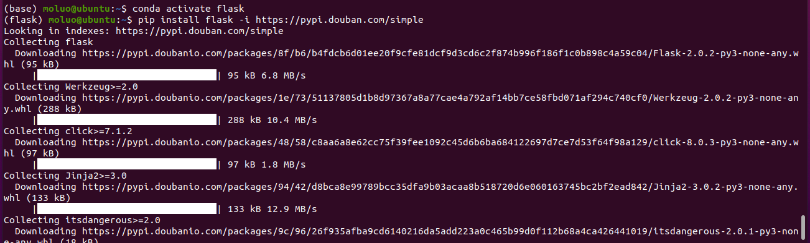

## 准备

```bash
# anaconda创建虚拟环境
conda create -n flask python=3.9
# 进入/切换到指定名称的虚拟环境，如果不带任何参数，则默认回到全局环境base中。
# conda activate  <虚拟环境名称>
conda activate flask 
# 退出当前虚拟环境
conda deactivate
```


安装flask，则以下命令：

```
pip install flask -i https://pypi.douban.com/simple
```

