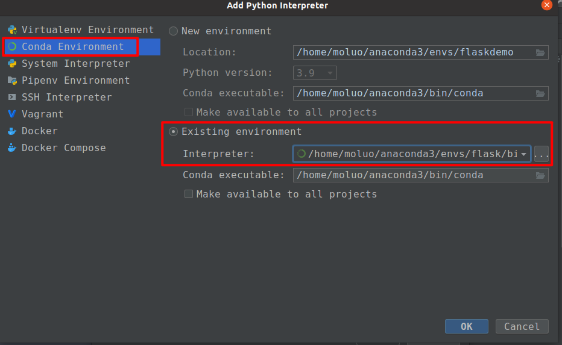

## 创建flask项目

与django不同,flask不会提供任何的自动操作，所以需要手动创建项目目录,需要手动创建启动项目的管理文件

例如,创建项目目录 flaskdemo,在目录中创建manage.py.在pycharm中打开项目并指定上面创建的虚拟环境



创建一个flask框架的启动入口文件。名字可以是`app.py/run.py/main.py/index.py/manage.py/start.py`

manage.py，代码：

```python
# 1. 导入flask核心类
from flask import Flask

# 2. 初始化web应用程序的实例对象
app = Flask(__name__)


# 4. 可以通过实例对象app提供的route路由装饰器，绑定视图与uri地址的关系
@app.route("/")
def index():
    # 5. 默认flask支持函数式视图，视图的函数名不能重复，否则报错！！！
    # 视图的返回值将被flask包装成响应对象的HTML文档内容，返回给客户端。
    return "<h1>hello flask</h1>"


if __name__ == '__main__':
    # 3. 运行flask提供的测试web服务器程序
    app.run(host="0.0.0.0", port=5000, debug=True)
```


代码分析: 

```python
# 导入Flask类
from flask import Flask

"""
Flask类的实例化参数：
import_name      Flask程序所在的包(模块)，传 __name__ 就可以
                           其可以决定 Flask 在访问静态文件时查找的路径
static_path          静态文件存储访问路径(不推荐使用，使用 static_url_path 代替)
static_url_path    静态文件的url访问路径，可以不传，默认为：/ + static_folder
static_folder        静态文件存储的文件夹，可以不传，默认为 static
template_folder  模板文件存储的文件夹，可以不传，默认为 templates
"""
app = Flask(__name__)

# 编写路由视图
# flask的路由是通过给视图添加装饰器的方式进行编写的。当然也可以分离到另一个文件中。
# flask的视图函数，flask中默认允许通过return返回html格式数据给客户端。
@app.route('/')
def index():
    # 返回值如果是字符串，被自动作为参数传递给response对象进行实例化返回客户端
    return "<h1>hello flask</h1>"

# 指定服务器IP和端口
if __name__ == '__main__':
    # 运行flask
    app.run(host="0.0.0.0", port=5000, debug=True)
```


#### flask加载项目配置的二种方式

```python
# 1. 导入flask核心类
from flask import Flask

# 2. 初始化web应用程序的实例对象
app = Flask(__name__)

"""第一种：flask项目加载站点配置的方式"""
# app.config["配置项"] = 配置项值
# app.config["DEBUG"] = False

"""第二种：flask项目加载站点配置的方式"""
# app.config是整个flask项目默认的配置属性，里面包含了所有的可用配置项，配置项的属性名都是大写字母或大小字母+下划线组成
config = {
    "DEBUG": True
}
app.config.update(config)

# 4. 可以通过实例对象app提供的route路由装饰器，绑定视图与uri地址的关系
@app.route("/")
def index():
    # 5. 默认flask支持函数式视图，视图的函数名不能重复，否则报错！！！
    # 视图的返回值将被flask包装成响应对象的HTML文档内容，返回给客户端。
    return "<h1>hello flask</h1>"


if __name__ == '__main__':
    # 3. 运行flask提供的测试web服务器程序
    app.run(host="0.0.0.0", port=5000)
```

