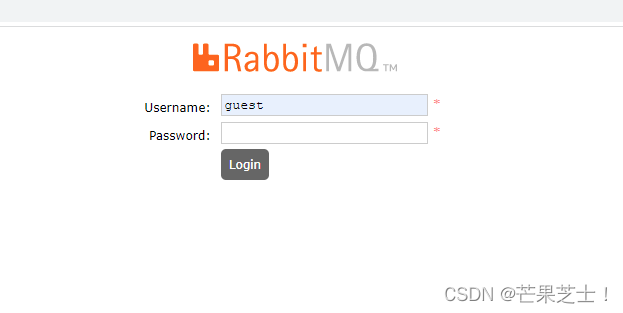
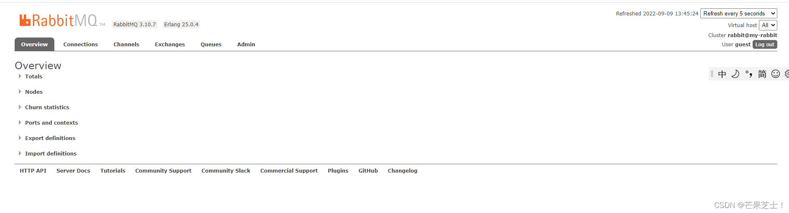

```
docker search rabbitmq
docker run --restart=always -d --hostname my_rabbit --name rabbit -p 15672:15672 -p 5673:5672 rabbitmq

docker exec -it 容器id /bin/bash 
rabbitmq-plugins enable rabbitmq_management
```

安装web管理插件rabbitmq_management：

**注意**：不安装web管理插件，通过http://ip:15672可能访问不了，或者台管理页面点击 Channels 报错，**提示Stats in management UI are disabled on this node**。

1）先执行docker ps 拿到当前的镜像ID
2）进入rabbitMq容器：

```java
docker exec -it  {rabbitmq容器id} /bin/bash
1
```

3）查看配置文件

```java
cat /etc/rabbitmq/conf.d/management_agent.disable_metrics_collector.conf
1
```

4）将配置文件内容，true改为false：

```java
cd  /etc/rabbitmq/conf.d/
echo management_agent.disable_metrics_collector = false > management_agent.disable_metrics_collector.conf
12
```

5）.退出容器：

```java
exit
1
```

6）输入指令，安装插件：

```java
docker exec -it {rabbitmq容器名称或者id} rabbitmq-plugins enable rabbitmq_management
1
```

5.重启容器：

```java
docker restart {rabbitmq容器id}
1
```

###### 浏览器访问地址：

http://ip地址:15672，这里的用户名和密码默认都是guest

正常页面：


###### 消息中间件RabbitMQ常用的的6个端口的作用：

| 端口       | 作用                                                 |
| ---------- | ---------------------------------------------------- |
| 15672      | 管理界面ui使用的端口                                 |
| 15671      | 管理监听端口                                         |
| 5672，5671 | AMQP 0-9-1 without and with TLSclient端通信口        |
| 4369       | （epmd)epmd代表 Erlang端口映射守护进程，erlang发现口 |
| 25672      | ( Erlang distribution） server间内部通信口           |

***注意***：为了省事，推荐直接拉取有managment的镜像，它自带web管理，不需要再手动安装;
如果docker pull rabbitmq后面不带management，启动rabbitmq后是会报错的的（，所以要下载带management插件的rabbitMQ。

例如：安装指定版本有managment的镜像，也可不带版本编号，docker pull rabbitmq:management

```bash
docker pull rabbitmq:3.20-management
```