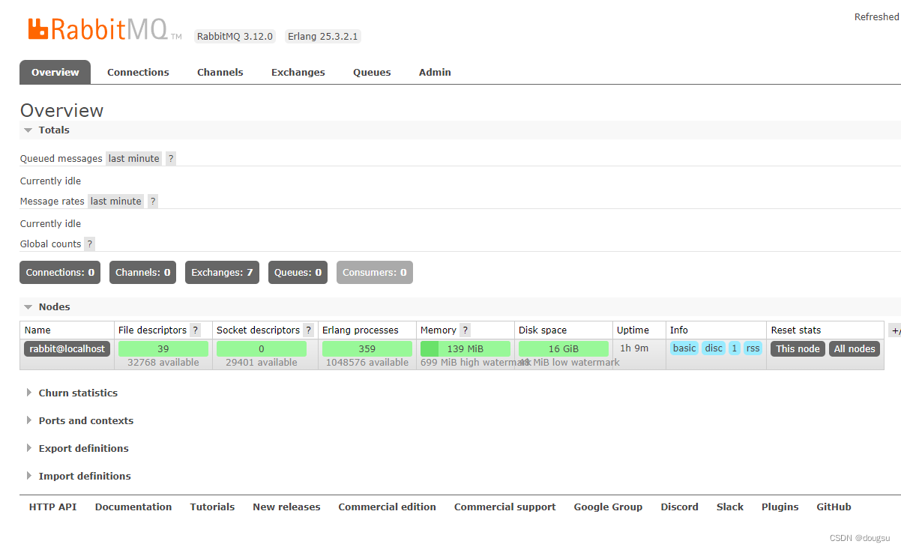
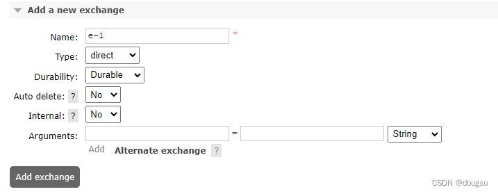

#### 文章目录

- [1. 引言](https://blog.csdn.net/dougsu/article/details/131078226#1__1)
- [2. RabbitMQ 管理页面的概览](https://blog.csdn.net/dougsu/article/details/131078226#2_RabbitMQ__8)
- [3. 探索 RabbitMQ 管理页面的主要功能](https://blog.csdn.net/dougsu/article/details/131078226#3__RabbitMQ__28)
- - [3.1 连接](https://blog.csdn.net/dougsu/article/details/131078226#31__32)
  - [3.2 通道](https://blog.csdn.net/dougsu/article/details/131078226#32__38)
  - [3.3 交换机](https://blog.csdn.net/dougsu/article/details/131078226#33__44)
  - [3.4 队列](https://blog.csdn.net/dougsu/article/details/131078226#34__50)
  - [3.5 生产者](https://blog.csdn.net/dougsu/article/details/131078226#35__55)
  - [3.6 消费者](https://blog.csdn.net/dougsu/article/details/131078226#36__59)
- [4. RabbitMQ 的实战例子](https://blog.csdn.net/dougsu/article/details/131078226#4_RabbitMQ__66)
- - [4.1 创建虚拟机](https://blog.csdn.net/dougsu/article/details/131078226#41__70)
  - [4.2 连接和通道](https://blog.csdn.net/dougsu/article/details/131078226#42__87)
  - [4.3 建立交换机](https://blog.csdn.net/dougsu/article/details/131078226#43__90)
  - - [4.3.1 交换机类型](https://blog.csdn.net/dougsu/article/details/131078226#431__94)
    - [4.3.2 创建一个交换机](https://blog.csdn.net/dougsu/article/details/131078226#432__104)
  - [4.4 创建队列](https://blog.csdn.net/dougsu/article/details/131078226#44__124)
  - - [4.4.1 队列类型](https://blog.csdn.net/dougsu/article/details/131078226#441__128)
    - [4.4.2 创建一个队列](https://blog.csdn.net/dougsu/article/details/131078226#442__136)
    - [4.4.3 发送消息](https://blog.csdn.net/dougsu/article/details/131078226#443__143)
    - [4.4.4 消费消息](https://blog.csdn.net/dougsu/article/details/131078226#444__152)
- [5. 总结](https://blog.csdn.net/dougsu/article/details/131078226#5__165)

## 1. 引言

  在前一篇文章[在centos stream 9环境中部署和使用rabbitMQ](https://blog.csdn.net/dougsu/article/details/131038545)，我们已经详细介绍了如何在CentOS下安装和配置RabbitMQ，我们不仅启动了RabbitMQ服务,还通过插件安装了管理后台，并且登陆到管理页面。
  RabbitMQ管理后台提供了一个直观的[用户界面](https://edu.csdn.net/cloud/pm_summit?utm_source=blogglc&spm=1001.2101.3001.7020)，允许我们查看和管理RabbitMQ服务器的各种方面。包括查看消息队列状态，管理交换机，设置用户权限，监控服务器状态等等。现在，我们将开始探索RabbitMQ的管理后台。
下面是登陆到管理后台的预览页面：

## 2. RabbitMQ 管理页面的概览

RabbitMQ的管理页面是一个内置的、基于web的用户界面，允许用户查看和管理RabbitMQ服务器的状态和行为。

登录RabbitMQ管理页面后，会看到以下几个主要部分：

1. **Overview**: 这个页面显示了RabbitMQ服务器的一般信息，例如节点的名字、状态、运行时间等。
2. **Connections**: 在这里，可以查看、管理和关闭当前所有的TCP连接。
3. **Channels**: 这个页面展示了所有当前打开的通道以及它们的详细信息。
4. **Exchanges**: 可以在这里查看、创建和删除交换机。
5. **Queues**: 这个页面展示了所有当前的队列以及它们的详细信息。
6. **Admin**: 在这里，可以查看系统中所有的操作用户。

在接下来的章节中，我们将详细介绍这些功能，并通过实际操作例子进行演示。

## 3. 探索 RabbitMQ 管理页面的主要功能

在本章节中，我们将深入探讨RabbitMQ管理页面的主要功能，包括**连接**、**通道**、**交换机**、**队列**、**生产者**和**消费者**的管理。

### 3.1 连接

在RabbitMQ的管理页面中，“Connections” 部分列出了所有当前的TCP连接。每个连接都关联了它的详细信息，如用户、主机、运行状态等。

### 3.2 通道

“Channels” 页面列出了所有当前的通道。通道在RabbitMQ中扮演着重要的角色，所有的消息发布和接收都是通过通道进行的。

### 3.3 交换机

在 “Exchanges” 页面，你可以查看所有的交换机。交换机是RabbitMQ消息路由的重要组成部分，它决定了消息如何被路由到正确的队列。

### 3.4 队列

在 “Queues” 页面，你可以查看所有当前的队列。队列是RabbitMQ的核心，它保存了所有待处理的消息。

### 3.5 生产者

RabbitMQ管理页面并没有一个专门的页面来显示所有的生产者，因为生产者在RabbitMQ中是无状态的。但是，你可以通过查看 “Exchanges” 页面来了解消息被发布的情况。

### 3.6 消费者

在 “Admin” 页面，你可以查看所有当前服务的所有操作用户，并提供了添加用户和授予虚拟机的功能等。(*右侧还可以切换其他的功能，下面章节用到的时候会说明*)

## 4. RabbitMQ 的实战例子

在本章节中，我将通过实际的操作示例来演示如何使用RabbitMQ管理页面。

### 4.1 创建虚拟机

  在RabbitMQ中，**虚拟机**（Virtual Host）是一种**逻辑分区**机制，用于将RabbitMQ资源进行逻辑隔离和管理。每个虚拟机都是一个**独立的消息代理环境**，拥有自己的交换机、队列、绑定和权限。

虚拟机提供了一种将应用程序或用户分组和隔离的方式。不同的应用程序或用户可以在各自的虚拟机中操作和管理自己的消息队列，而不会影响其他虚拟机中的队列。

每个虚拟机都有一个名称，通过该名称可以在连接时指定要使用的虚拟主机。虚拟机名称以正斜杠（/）作为前缀，例如`/v-1`。
打开**Admin**选项卡，选择右侧的**Virtual Host**，展开**Add a new virtual host \**，带红色\*的是必填，即虚拟机的名称，填好点击\**Add virtual host**即可创建虚拟机。

创建好后会列出虚拟机的状态信息：

因为我当前的登陆用户是 **tom**，切换到**]Users**可以看到自动授予了**v-1**虚拟机的权限

再RabbitMQ中，用户的操做是需要基于虚拟机授权的，点击用户的名字可以展开权限操作

另外，创建虚拟机后，还会默认给我们创建了交换机（下面的章节说明）

### 4.2 连接和通道

本教程因为不涉及客户端的操作，所以连接和通道不做介绍，在后面的博客中有专门使用客户端操作的讲解。

### 4.3 建立交换机

  在RabbitMQ中，交换机（Exchange）是消息路由的中心组件之一。它接收从生产者发送的消息，并根据一定的规则将消息路由到一个或多个队列，以便消费者可以接收并处理这些消息。
 交换机的主要作用是根据消息的路由键（Routing Key）将消息发送到合适的队列。当生产者发布消息时，会指定一个交换机和一个路由键。交换机根据规则来确定如何将消息路由到队列，这些规则定义了交换机的类型。

#### 4.3.1 交换机类型

RabbitMQ提供了以下几种常见的交换机类型：

- **Direct**（直连交换机）：根据消息的路由键精确匹配将消息发送到指定队列。当消息的路由键与绑定到交换机上的队列的绑定键（Binding Key）完全匹配时，消息会被路由到相应的队列。
- **Fanout**（扇形交换机）：将消息广播到所有绑定到交换机的队列。无需匹配路由键，所有队列都会接收到相同的消息。
- **Topic**（主题交换机）：根据通配符匹配将消息路由到队列。通配符使用特殊符号"#“（表示零个或多个词）和”*"（表示一个词）来匹配路由键，允许更灵活的路由。
- **Headers**（头交换机）：根据消息的头部属性进行匹配路由，而不是使用路由键。在Headers交换机中，可以定义一组键值对的头部属性，并通过匹配这些属性将消息路由到队列。

#### 4.3.2 创建一个交换机

  交换机通过绑定（Binding）与队列进行关联。绑定定义了交换机和队列之间的关系，包括交换机、队列和绑定键的组合。生产者发布消息时，指定的交换机和路由键需要与队列的绑定相匹配，才能将消息正确地路由到相应的队列中。(后面会有介绍根据不同的类型在不同场景下使用的文章)
  在上面创建虚拟机后会自动给我们创建默认的交换机，我们还可以点击**Add a new exchange**进行手动创建(目前管理页面是无法在创建交换机指定虚拟机的，所以通过页面创建的都是建立在/虚拟机下)

- **Name**（名称）：交换机的唯一标识符，用于在RabbitMQ中识别交换机。名称是必需的，并且需要是唯一的。
- **Type**（类型）：指定交换机的类型，决定了交换机的路由策略。常见的交换机类型有Direct、Fanout、Topic和Headers。不同类型的交换机对应不同的路由规则。
- **Durable**（持久化）：指定交换机是否持久化到磁盘。如果将该参数设置为true，交换机将在RabbitMQ服务器重启后仍然存在。默认情况下，交换机是非持久化的。
- **Auto-delete**（自动删除）：指定交换机在不被使用时是否自动删除。如果将该参数设置为true，当没有与之绑定的队列或连接时，交换机将被自动删除。默认情况下，交换机是不会自动删除的。
- **Internal**（内部交换机）：指定交换机是否为内部交换机。内部交换机只能被直接连接到的交换机使用，而无法通过路由键绑定到队列。该参数为可选参数，用于特定的高级使用场景。
- **Arguments**参数允许在创建交换机时指定一些额外的自定义参数。这些参数可以根据特定的需求来定义交换机的行为和特性。Arguments参数是一个键值对的字典，其中键和值的类型可以是字符串、数字、布尔值等。不同的交换机类型支持不同的参数。一些常见的Arguments参数包括：

> **Alternate Exchange**（备用交换机）：指定一个备用交换机，当消息无法被路由到任何绑定的队列时，将消息转发到备用交换机。这可以提供消息的备份或延迟处理等功能。
> **Message TTL**（消息过期时间）：指定消息的生存时间（Time To Live），即消息在交换机中存储的有效期限。超过该时间的消息将被丢弃或进入死信队列。
> **Dead-Letter Exchange**（死信交换机）：指定一个死信交换机，用于处理无法被消费者成功处理的消息。当消息被拒绝、超过最大重试次数或过期时，将消息转发到死信交换机。
> **Queue Mode**（队列模式）：用于定义队列的模式，例如懒惰队列（lazy queues）模式，可以在需要时才创建队列，以减少资源消耗。
> **x-match**：用于Topic交换机，指定如何匹配路由键和绑定键的模式，可以是任意（[any](https://marketing.csdn.net/p/3127db09a98e0723b83b2914d9256174?pId=2782?utm_source=glcblog&spm=1001.2101.3001.7020)）或全部（all）。

### 4.4 创建队列

点击页面顶部的 “Queues” 标签。这会打开一个页面，显示当前的所有队列，目前我们还没创建，所以all queues是0

#### 4.4.1 队列类型

在 RabbitMQ 中，队列的类型主要可以分为以下几种：

- **Classic 队列**：这是 RabbitMQ 最初的队列模型。这种队列类型以可靠和广泛的方式提供了多种消息交付模式，包括消息确认，消息持久化，消费者流量控制等。Classic队列也支持优先级队列、镜像队列等高级功能。然而，Classic队列在集群节点间同步消息时，可能会造成大量的磁盘和网络资源消耗。
- **Quorum 队列**：Quorum 队列是 RabbitMQ 3.8 版本引入的新特性，用于替代之前版本的镜像队列。这种队列类型基于 [Raft 共识算法](https://raft.github.io/)实现，主要目标是提供更高的[数据安全](https://edu.csdn.net/cloud/sd_summit?utm_source=glcblog&spm=1001.2101.3001.7020)性和可用性。Quorum队列在处理大量消息，尤其是持久化消息时，性能更优，资源消耗更少。推荐使用这种类型。
- **Stream 队列**：Stream 队列是 RabbitMQ 3.9 版本新增的功能，它提供了对消息流的支持。这种队列类型适合处理大数据工作负载和流处理，它将消息存储在磁盘上，允许消费者异步[并行](https://marketing.csdn.net/p/3127db09a98e0723b83b2914d9256174?pId=2782?utm_source=glcblog&spm=1001.2101.3001.7020)读取，从而提供了高吞吐量和低延迟的性能。需要注意的是，Stream 队列需要安装和启用 stream 插件。

#### 4.4.2 创建一个队列

虚拟机选择v-1，类型选择仲裁队列，输入队列名称q1

点击**Add queue**创建队列

点击**q1**可以进去队列管理页面

#### 4.4.3 发送消息

展开 **Publish message**，在**Payload**输入消息，点击**Publish message**发送消息

发送后在上面预览就可以看到队列**q1**中的消息统计信息

**Ready**：未消费的消息数量
**Unacked**：未应答的消息数量
**Total**：总共的消息数量（Ready+Unacked）

#### 4.4.4 消费消息

展开**Get messages**，应答模式有：
**Nack message requeue true**：不应答并且将消息重新入队
**Automatic ack**：自动应答，稍后消息就被删除
**Reject requeue true**：将消息拒绝并重新入队
**Reject requeue false**：将消息拒绝但不重新入队，即丢弃消息
这里我选择自动应答

点击**Get Message(s)**获取消息

再获取一次，可以看到已经消费的消息不会再出现

## 5. 总结

  本文提供了一份全面的 RabbitMQ 入门指南，专注于 RabbitMQ 管理页面的详细介绍和实战操作。可以通过本文了解 RabbitMQ 管理页面的主要功能，包括连接、通道、交换机、队列、生产者和消费者。本文提供的实战例子展示了如何在 RabbitMQ 中创建虚拟机、建立连接和通道，并创建和配置交换机、队列，以及发送和消费消息。旨在帮助初学者深入理解 RabbitMQ 的管理页面，并提供实用的操作示例。希望你能从本文中获得有关 RabbitMQ 管理页面的相关指导。