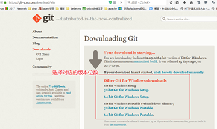
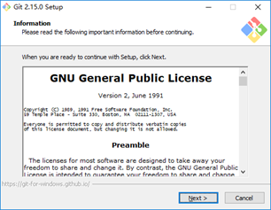
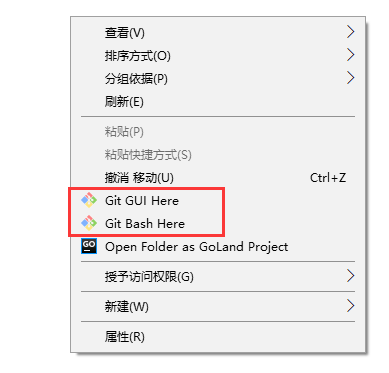
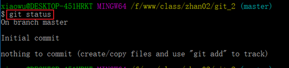
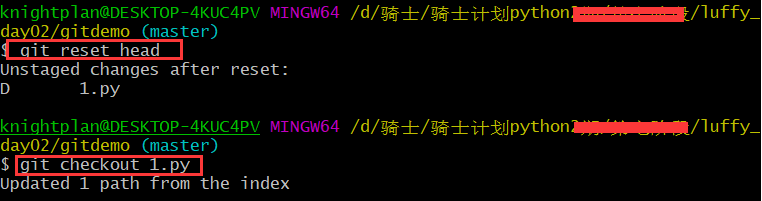
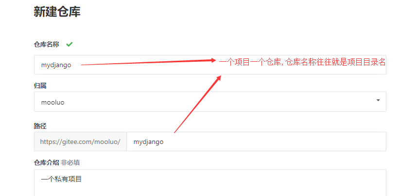
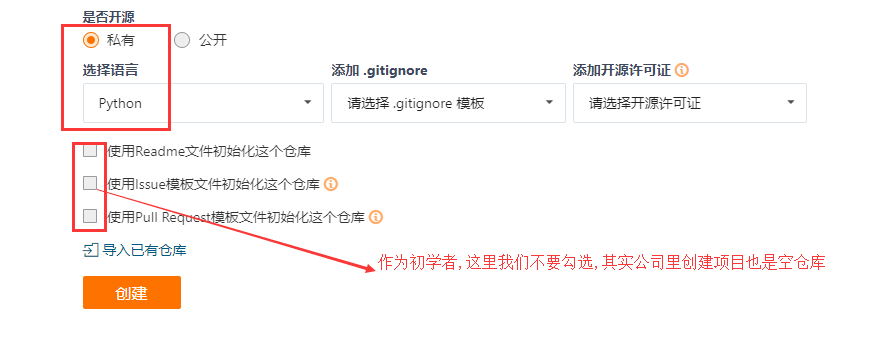

# 如何多人协同开发同一个项目？

使用代码版本控制[version control]软件,

目前市面上比较流行的代码版本控制器有: git,svn,csv


# 1. 使用git管理代码版本

本项目使用git管理项目代码，代码库放在gitee码云平台。（注意，公司中通常放在gitlab私有服务器中）


## 1.1 Git 的诞生

2005 年 4 月3 日，Git 是目前世界上最先进的分布式版本控制系统（没有之一）

作用：源代码管理

**为什么要进行源代码管理?**

- 方便多人协同开发
- 方便版本控制


## 1.2 git与svn区别

SVN 都是集中控制管理的，也就是有一个中央服务器，大家都把代码提交到中央服务器，而
git 是分布式的版本控制工具，也就是说没有中央服务器，每个节点的地位平等。

SVN


Git


## Git的windows下安装

官网地址：

https://git-scm.com/download





下载到本地磁盘


安装




一路【next】就可以了


注意：**openssl  一定选它**

安装完成后，右击菜单栏，有如下菜单，表示安装完成




进入git bash选项


Git工作区、暂存区和版本库


git reset hard

## 1、工作区介绍

就是在你本要电脑磁盘上能看到的目录。

## 2、暂存区介绍

一般存放在【.git】目录下的index文件(.git/index) 中，所以我们把暂存区有时也叫作索引。

## 3、版本库介绍

工作区有一个隐藏目录.git，这个不算工作区，而是Git的版本库。git中的head/master是分支，是版本库。


#### git项目仓库的本地搭建

```
cd进入到自己希望存储代码的目录路径，并创建本地仓库.git
新创建的本地仓库.git是个空仓库

  cd 目录路径
  git init gitdemo  # 如果没有声明目录,则自动把当前目录作为git仓库
```

创建仓库


#### 仓库目录的结构

```bash
branches/   分支管理目录
config      当前项目仓木的配置信息
description 当前项目的描述
HEAD        当前项目仓库的当前版本信息
hooks       当前项目仓库的钩子目录[可以利用这个目录下面的文件实现自己拉去代码到服务器]
info        仓库相关信息
objects     仓库版本信息
refs        引用信息
```


#### 配置用户名和邮箱

```
git config --global user.name 'stoner'
git config --global user.email 'carl3633524461@outlook.com'
```


#### 查看仓库状态

```
git status

git status –s 简约显示
```

- 红色表示新建文件或者新修改的文件,都在工作区.
- 绿色表示文件在暂存区
- 新建的`login.py`文件在工作区，需要添加到暂存区并提交到仓库区





上图表示： 暂时没有新文件需要提交到暂存区


#### 添加文件到暂存区

```
  # 添加项目中所有文件
  git add .
  或者
  # 添加指定文件
  git add login.py
```

例如： 创建3个文件 ，并查看状态.


#### 提交到版本库

```
 git commit -am "版本描述"
```


#### 手动删除文件

```
手动操作删除 或者 在命令行下 使用 rm 文件名 删除 都是表示在工作区删除.
对于这种删除,如果还原,则可以使用 git checkout 文件名
```


#### 版本删除

```
如果使用 git rm 文件名, 这种操作属于暂存区删除,这种删除无法直接git checkout 文件名 来还原.
如果直接执行git checkout 命令,则报错如下:
```


```
如果要还原在暂存区中删除的文件,必须先执行 git reset head
```




#### 查看历史版本[查看日志]

```
git log   或者   git reflog
 
过滤查看日志
  git log –p 
  退出按【q】键
  ctrl+f向下分页
  ctrl+b 向上分页

显示指定日期之后的日志   git log --after  '2018-11-6'
显示指定日期之前的日志   git log --before '2018-11-6'

指定显示指定开发者的日志  git log --author 'lisi'
```


**回退版本**

- **方案一：**

  - `HEAD`表示当前最新版本

  - `HEAD^`表示当前最新版本的前一个版本

  - `HEAD^^`表示当前最新版本的前两个版本，**以此类推...**

  - `HEAD~1`表示当前最新版本的前一个版本

  - `HEAD~10`表示当前最新版本的前10个版本，**以此类推...**

    ```
    git reset --hard HEAD^
    ```


**方案二：当版本非常多时可选择的方案**

- 通过每个版本的版本号回退到指定版本

  ```
    git reset --hard 版本号
  ```


取消暂存

```
git reset head
git reset <file> ：从暂存区恢复到工作文件
git reset -- ：从暂存区恢复到工作文件
```


## 查看文件状态

**针对与文件所处的不同分区，文件所处的状态:**

(1)未追踪, 文件第一次出现在工作区, 版本库还没有存储该文件的状态

(2)已追踪, 只要第一次,git add了文件, 文件就是已追踪

(3)未修改, 文件在工作区未被编辑

(4)已修改, 文件在工作区被修改

(5)未暂存, 文件已修改, 但是没有add到暂存区

(6)已暂存, 已经将修改的文件add到暂存区

(7)未提交, 已暂存的文件, 没有commit提交. 处于暂存区

(8)已提交, 提交到版本库的文件修改,只有commit以后才会有仓库的版本号生成


注意：

```
公司一般使用git管理项目,往往会搭建一个gitlab自己内部管理代码,也有公司选择使用码云的企业版仓库来管理

使用git开发项目时，有时候不一定通过https协议提交代码的。也有的公司是通过ssh协议提交,此时需要生成ssh公钥和提交公钥给仓库。[码云这些官网都会有详细的提示说明]

生成SSH公钥【必须安装git bash才可以使用这个命令，而且还要把git bash添加到系统变量里面】
  ssh-keygen -t rsa -C "lisi@163.com"

参考：https://gitee.com/help/articles/4180
```


# 2. 在git平台创建工程

1） 创建私有项目库





创建私有空仓库以后的界面:


2）克隆项目到本地

```
git clone 仓库地址
注意，如果当前目录下出现git仓库同名目录时，会克隆失败。
```


3）创建并切换分支到dev

```
# git branch dev      # 创建本地分支dev,dev是自定义
# git checkout dev    # 切换本地分支代码
git checkout -b dev   # 这里是上面两句代码的简写
```


git提交

```shell
git add 代码目录
git status
git commit -m '添加项目代码'
```

推送到远端

```shell
git push origin dev:dev
```

如果推送代码,出现以下提示: git pull ....,则表示当前本地的代码和线上的代码版本不同.

```
1. 把线上的代码执行以下命令,拉取到本地,进行同步
git pull

2. 根据提示,移除多余的冲突的文件,也可以删除.
完成这些步骤以后,再次add,commit,push即可.
```

