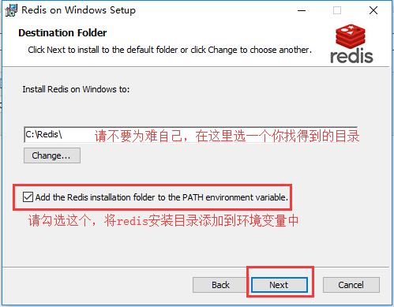

window系统的redis是微软团队根据官方的linux版本高仿的

官方原版: https://redis.io/

中文官网:http://www.redis.cn

## 3.1 redis下载和安装

下载地址： https://github.com/MicrosoftArchive/redis/releases

 





 


使用以下命令启动redis服务端

```
redis-server C:/tool/redis/redis.windows.conf
```


关闭上面这个cmd窗口就关闭redis服务器服务了。


**redis作为windows服务启动方式**

```
redis-server --service-install redis.windows.conf
```


启动服务：redis-server --service-start
停止服务：redis-server --service-stop


启动内置客户端连接redis服务：

