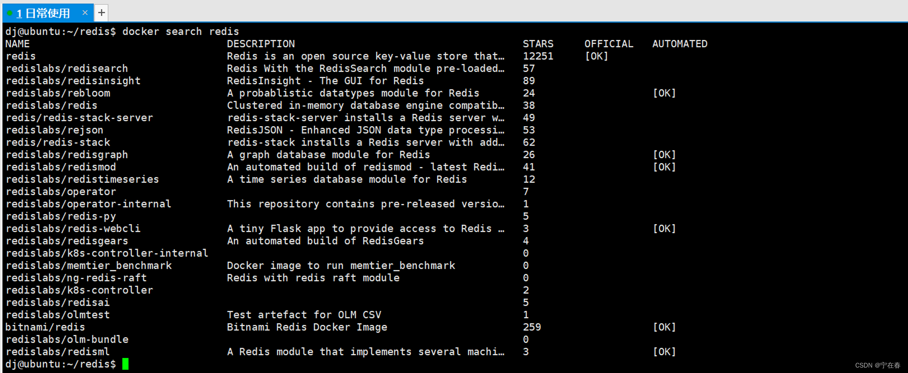

#### 指定redis.conf 启动 redis 容器

启动命令，我去掉了之前的一些繁琐的参数，比如大家常常说指定日志文件大小

`-log-opt max-size=100m --log-opt max-file=2` 从而导致报错之类的，现在的话，大伙可以看自己的需求是否需要添加。

```bash
docker run --restart=always -p 6379:6379 --name myredis -v  D:\00_docker_volume\redis/redis.conf:/etc/redis/redis.conf -v  D:\00_docker_volume\redis/data:/data -d redis:7.0.12 redis-server /etc/redis/redis.conf
```


笔者宿主机的文件目录如下：（供参考）


各参数的意义：

1）**-restart=always** 总是开机启动
2）**-p 6379:6379** 将6379端口挂载出去
3）**–name** 给这个容器取一个名字
4）**-v 数据卷挂载** /home/dj/redis/redis.conf:/etc/redis/redis.conf

此处是将宿主机 /home/dj/redis/redis.conf 文件映射到 redis 容器下的 /etc/redis/redis.conf，此处你也可以理解为docker容器和宿主机共享这个文件。

5）**-d redis:7.0.12 后台运行容器，不加-d就是直接在控制台输出，关闭窗口即停止容器。**

6） **redis-server /etc/redis/redis.conf** 以配置文件启动redis，加载容器内的 redis.conf文件，最终找到的是挂载的目录 /etc/redis/redis.conf 也就是宿主机下共享的 /home/dj/redis/redis.conf。

补充：如果有权限相关的问题，可以给容器一个特权模式。加一个 `--privileged`

7）`--log-opt max-size=100m --log-opt max-file=3`

max-size：指定日志文件大小上限

max-file：指定日志文件个数

**查看启动日志**

```bash
docker logs myredis # 后面跟容器名 or 容器ID 都可以
docker logs --since 30m <容器名> # --since 30m 是查看此容器30分钟之内的日志情况。
12
```


**测试连接**

使用交互方式进入到容器内部：

```bash
docker exec -it myredis bash
redis-cli
set k1 v1 #你会发现失败的
get k1
auth ningzaichun # 验证密码
12345
```


外部测试连接，其实也一样


### 三、Docker 停止、删除、重启、启动容器

正常删除容器，一般是先停止容器，再进行删除

```bash
docker stop [容器名|容器ID] #停止容器
docker start   [容器名|容器ID]  #启动停止的容器
docker restart  [容器名|容器ID]  # 将容器重新启动
docker kill [容器名|容器ID] #强行终止
docker rm [容器名|容器ID]   # 删除停止的容器

123456
```


其他的同等意思。

**docker stop和 docker kill容器有一些区别**，stop 是会等待容器内的应用终止的，但是kill不会给容器内应用任何时间，会直接kill掉，这一点和 linux中的 kill -15 和 kill -9 是类似的。

备注：**kill -9 PID 是操作系统从内核级别强制杀死一个进程. kill -15 PID 可以理解为操作系统发送一个通知告诉应用主动关闭. SIGNTERM（15） 的效果是正常退出进程，退出前可以被阻塞或回调处理**。

**强行删除**

```bash
docker rm -f [容器名|容器ID]
1
```


### 四、Docker 搜索、拉取、删除、查看镜像

四行命令都很简单：

```bash
docker search redis #查找公开仓库中的redis镜像，这里貌似不能指定具体的版本号，只会提供最新的，上文已经谈过了
docker pull redis[:tag] #拉取镜像，tag 同上
docker rmi redis[:tag] #删除镜像，这里也可以跟镜像ID， 即 docker rmi 镜像ID
docker images #查看所有的镜像
1234
```

备注：不添加[:tag]的情况下，默认是 latest 版本。



不加版本号的时候，默认就是 latest 版本


#### 4.1、**Untagged 和 Deleted**

**Untagged**

我们首先都知道镜像的唯一标识是其 ID 和摘要，但一个镜像可以有多个标签

因此当我们使用上面命令删除镜像的时候，实际上是在要求删除某个标签的镜像。所以首先需要做的是将满足我们要求的所有镜像标签都取消，这就是我们看到的 Untagged 的信息。因为一个镜像可以对应多个标签，因此当我们删除了所指定的标签后，可能还有别的标签指向了这个镜像，如果是这种情况，那么 Delete 行为就不会发生。所以并非所有的 docker rmi 都会产生删除镜像的行为，有可能仅仅是取消了某个标签而已。

**Delated**

当一个镜像所有的标签都被取消了，该镜像很可能会失去了存在的意义，因此会触发删除行为。镜像是多层存储结构，因此在删除的时候也是从上层向基础层方向依次进行判断删除。镜像的多层结构让镜像复用变动非常容易，因此很有可能某个其它镜像正依赖于当前镜像的某一层。这种情况，依旧不会触发删除该层的行为。直到没有任何层依赖当前层时，才会真实的删除当前层。所以delated命令触发的判断机制要比 untagged 要难上许多。

### 五、在评论区收集的问题

#### 5.1、挂载参数问题&删除卷问题


1、回答第一个问题，我原版文章中使用的也是具名挂载。

具名挂载的语法是：`-v hostPath:containerPath` 有需求自己删除宿主机的目录即可。

2、这篇文章使用的是 7.0.12 版本，为了回答问题，我又再去尝试了一遍 redis:latest 版本。

```bash
docker pull redis # 默认会拉取最新的版本

# 启动命令如下
docker run --restart=always \
-p 6379:6379 \
--name myredis \
-v /home/dj/redis/redis.conf:/etc/redis/redis.conf \
-v /home/dj/redis/data:/data \
-d redis redis-server /etc/redis/redis.conf
123456789
```

完整的过程


从这个过程也可以看出来，我们是使用了自己宿主机挂载进去的配置文件的。

#### 5.2、–restart=always 和 docker restart <容器ID or 容器名> 重启

`--restart=always` 参数能够使我们在重启 docker 时，自动启动相关容器。应用场景就是服务器关机重启了，不需要我们手动去启动每个容器。

`docker restart` 的意思就是重启容器，不需要添加其他参数，就是直接重启。

#### 5.3、driver failed programming external connectivity on endpoint myredis

此错误我没有复现出来，但是我在网上查找了一番信息，说的是端口映射错误或者是网络方面的问题。

https://stackoverflow.com/questions/44414130/docker-on-windows-10-driver-failed-programming-external-connectivity-on-endpoinhttps://github.com/docker/for-win/issues/1038

他的方式是重启了 docker 并重启容器，执行：

```
systemctl restart docker
docker start .....
12
```

此回答出处来自于CSDN博主「SunnyJim」的原创文章https://blog.csdn.net/baobaoxiannv/article/details/96482560

#### 5.4、挂载文件的问题


先抽取一下这个问题：

说的**是 docker run -v 指令挂载针对是文件夹**，所以我命令中所要挂载的 redis.conf 配置文件会转换为一个 redis.conf 的文件夹被挂载进去。这也就意味着 redis 启动的时候是没法加载自定义配置文件的。小伙伴的解决方案是新建一个 conf 文件夹，将redis.conf 放到conf文件夹下，然后挂载这个文件夹。

**所以我在测试这一步的时候，我首先将我本地 redis 的容器和镜像全部删除掉，然后才执行的这条命令**。

```bash
docker run --restart=always \
-p 6379:6379 \
--name myredis \
-v /home/dj/redis/myredis.conf:/etc/redis/redis.conf \
-v /home/dj/redis/data:/data \
-d redis redis-server /etc/redis/redis.conf
123456
```

执行的完整流程图：


容器内配置文件位置


**首先说结论，是可以成功启动的，也是可以成功读取共享的配置文件的**。

现在我来回答第一个问题里面另一个小问题，小伙伴说的是 **docker run -v 挂载针对的是配置文件**，但实际上，在这条命令中，我成功将宿主机内的 myredis.conf 配置文件挂载到容器内，一同共享这个文件。

我在回答前，有去看了其他的博主的描述，也查了官方资料（没说这个问题），有说可以挂载的，也有说挂载是针对文件夹，我看到唯一感觉靠谱的答案，说的是更建议挂载文件夹，而不是挂载具体的某个文件而已。

**最后补充一个底层原理，Docker 使用了文件系统的特性和 Linux 的挂载命令来实现卷的挂载。当使用 \**`-v`\** 参数时，Docker Daemon 将根据提供的路径信息，将宿主机上的文件或文件夹映射到容器中的指定位置。这种映射是通过 Linux 的 Mount Namespace 功能实现的，它允许在容器中看到宿主机的一部分文件系统，从而实现了挂载的效果**。

#### 5.5、连接不上Redis

注意以下几点：

1、请先使用 `docker exec -it <容器ID|容器名> bash`，进入容器内部，使用 redis-cli 看是否可以进入

2、`docker logs <容器ID|容器名>` 查看相关日志

3、确保端口映射正确

4、虚拟机记得关闭防火墙，或者放行某个端口

5、云服务器，请去服务器管理界面，安全组管理，放开相关端口

6、是否允许远程连接，配置文件中的 bind 项是否做了修改等等。

#### 5.6、关于是否需要添加–privileged=true问题

`--privileged=true` 准确的术语的称呼为 Docker 容器的特权模式，使用特权模式启动容器，可以获取大量设备文件访问权限。因为当 root 用户执行 `docker run --privileged` 时，Docker容器将被允许访问主机上的所有设备，并可以执行mount命令进行挂载。

当控制使用特权模式启动的容器时，docker管理员可通过mount命令将外部宿主机磁盘设备挂载进容器内部，获取对整个宿主机的文件读写权限，此外还可以通过写入计划任务等方式在宿主机执行命令。
**关于是否需要开启特权模式**，如果你报这个权限不足的问题，那就加上就好啦。但如果没有，我不建议你加。容器内可以操作宿主机的资源，这是非常不安全的一件事情。

**一般更加适用的场景多半是docker容器需要调用到宿主机硬件资源或者某些特殊依赖，才会开启特权模式。**

#### 5.7、如何进行排错和定位问题

1、学会查看日志，学会查找关键字，定位问题，确定问题所在。

2、然后再学会如何合理使用各大搜索引擎或者GPT，帮助你提供相关的解决方案。

3、最后都解决不了时，请回忆自己做过的相关关键操作，提供于其他开发者，便于其他开发者快速复现错误。

**以现在的Docker的发展程度，基本你在初级阶段遇上的错误，大都数都能在网上找到类似的错误**。

### 笔者后记

不知道还会不会有人回过头来阅读这篇文章，更不知道这部分的文字，会不会被人所认真阅读啦，但我还是写下来啦。