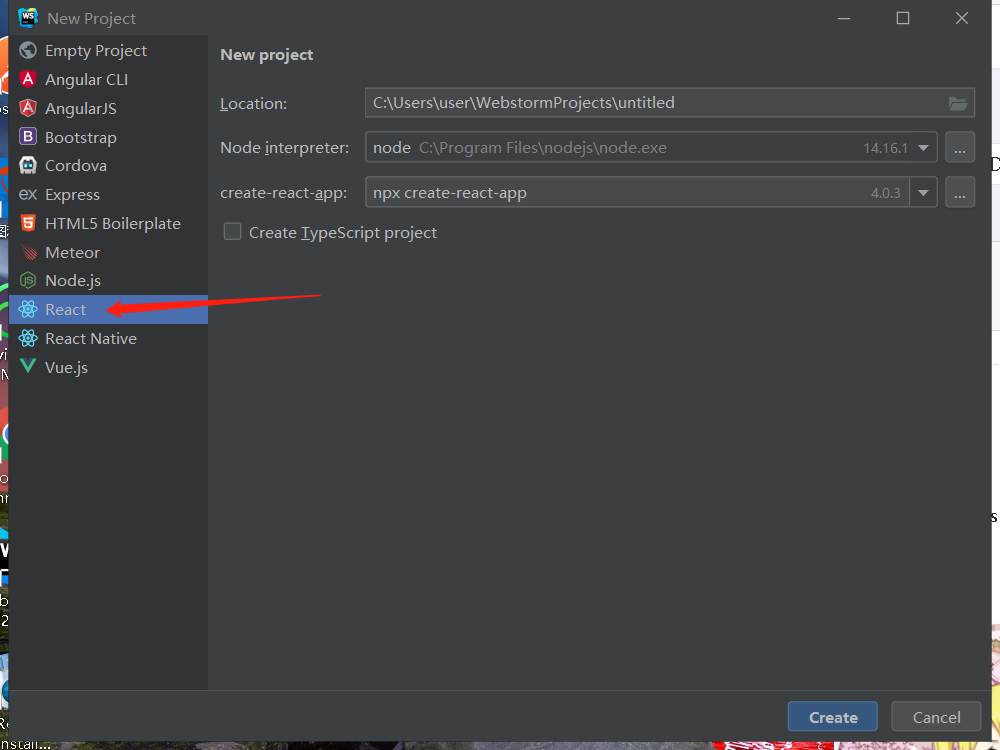
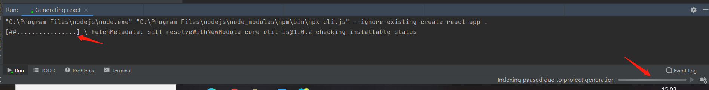
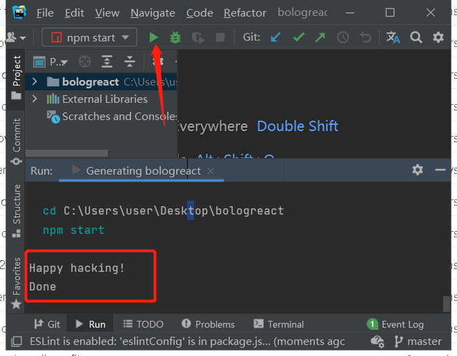
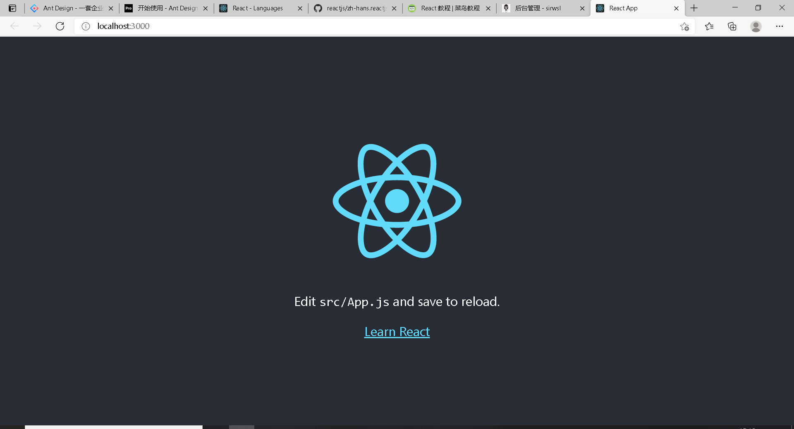
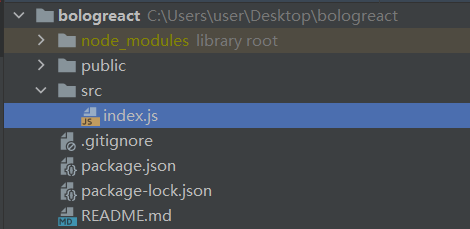
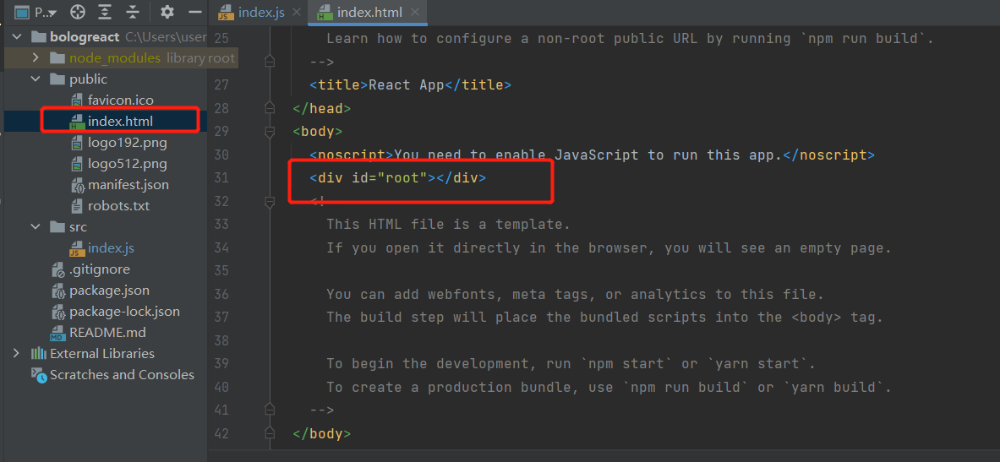
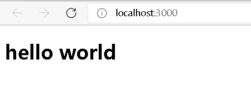
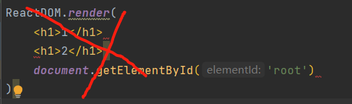

### 废话

有的人会很懵逼把，为什么我想学习Ant Design Pro，却来学习[React](https://so.csdn.net/so/search?q=React&spm=1001.2101.3001.7020)，这是因为**Ant Design Pro作为开箱即用的中台框架，你需要有React基础，因为里面全TM是JS或者TS（typeScript）**，如果有React基础的请跳过React教学部分。

**PS:本文不会对React展开全部叙述，只是对部分东西进行学习，达到能够上手AntD做准备**

**如果想好好学习React可以看一下[React 官方中文文档 – 用于构建用户界面的 JavaScript 库 (docschina.org)](https://react.docschina.org/)**

### React是什么

在React官网文档是这样说的：

> React 是一个声明式，高效且灵活的用于构建用户界面的 JavaScript 库。使用 React 可以将一些简短、独立的代码片段组合成复杂的 UI 界面，这些代码片段被称作“组件”。

在菜鸟教程中可以看到

> React 是一个用于构建用户界面的 JAVASCRIPT 库。
>
> React 主要用于构建UI，很多人认为 React 是 MVC 中的 V（视图）。
>
> React 起源于 Facebook 的内部项目，用来架设 Instagram 的网站，并于 2013 年 5 月开源。
>
> React 拥有较高的性能，代码逻辑非常简单，越来越多的人已开始关注和使用它。

**React 特点：**

**简洁、高效、灵活、JSX格式、组件复用、相应流**

### 开始

接下来以WebStorm为例：

1. 创建项目

注意：项目名字只能是小写，不能大小写混合



1. 等待加载



1. 加载结束、运行项目



1. 访问项目：



到这里你已经成功创建项目

1. 打开src目录，保留index.js文件，删除其余文件



1. 在index.js内写HelloWorld

```js
import React from 'react';
import ReactDOM from 'react-dom';

ReactDOM.render(
    <h1>hello world</h1>,
  document.getElementById('root')
);

12345678
```

其中documet.getElementById(‘root’)是获取public文件夹下的index.html文件中id为root的节点



1. 查看效果



接下来你就可以开始学习React了。

### React渲染

在刚刚的例子中，我们看到，在ReactDOM.render中的helloworld被渲染出来了，此时我们记住，**ReactDOM.render是用来渲染的,** 它将对应的元素插入到相应的节点中。

在刚刚例子中，public目录下有index.html文件，文件中有id为root的节点，所以< h1 >就被渲染到对应的节点中去了。

接下来我们在刚刚基础上变形,将index.js文件改为以下内容

```js
import React from 'react';
import ReactDOM from 'react-dom';

const element = <h1 >this is a demo</h1>;
ReactDOM.render(
    element,
    document.getElementById('root')
);

```

注意：在react中插入元素，不允许存在同级标签，以下是错误的

接下来再来感受两个例子：

```
import React from 'react';
import ReactDOM from 'react-dom';
function tick() {
    const element = (
        <div>
            <h1>nowtime：</h1>
            <h2> {new Date().getTime()}.</h2>
        </div>
    );
    ReactDOM.render(
        element,
        document.getElementById('root')
    );
}
setInterval(tick, 100);

12345678910111213141516
import React from 'react';
import ReactDOM from 'react-dom';
function tick() {
    const element = (
        <ul>
            <li>1</li>
            <li>2</li>
            <li>3</li>
        </ul>
    );
    ReactDOM.render(
        element,
        document.getElementById('root')
    );
}
setInterval(tick, 100);

1234567891011121314151617
```

### 组件

在React中组件是很重要的一部分，为了简化代码，就出现组件复用的概念，接下来看一下这个demo，明白一下组件是啥

```js
import React from 'react';
import ReactDOM from 'react-dom';
function Hello() {
    return <h1>Hello World!</h1>;
}

const element = <Hello />;

ReactDOM.render(
    element,
    document.getElementById('root')
);
```

注意看标签Hello标签，其实这个标签是不存在的，是我们自定义的，因此**可以把组件简单理解为自定义标签**

**注意：自定义标签首字符一定要大写，一定要大写，Hello不能写成小写的hello**，因为html原生标签是小写字母开头的，为了识别出来，自定义的标签一定要大写

然后在来看看下面例子加深印象

```
import React from 'react';
import ReactDOM from 'react-dom';

function Name() {
    return <h1>姓名：sirwsl</h1>;
}
function Age(){
    return <h1>年龄：24</h1>
}
function Sex(){
    return <h1>性别：男</h1>
}
ReactDOM.render(
    <div>
        <Name />
        <Age />
        <Sex />
    </div>,
    document.getElementById('root')
);
1234567891011121314151617181920
```

这时候我们会想要是我想让上面相关的变量不写死怎么办呢？

```js
import React from 'react';
import ReactDOM from 'react-dom';

function Name(props) {
    return <h1>姓名：{props.name}</h1>;
}
function Age(props){
    return <h1>年龄：{props.age}</h1>
}
function Sex(props){
    return <h1>性别：{props.temp}</h1>
}

ReactDOM.render(
    <div>
        <Name name='sirwsl'/>
        <Age age='24'/>
        <Sex temp= '男'/>
    </div>,
    document.getElementById('root')
);
123456789101112131415161718192021
```

### 类

我们看一下下面的例子：

```
import React from 'react';
import ReactDOM from 'react-dom';

class Index extends React.Component{
    //构造器
    constructor() {
        super();
        this.state = {count : 0};
    }

    render() {
        return <h1>count:{this.state.count}</h1>
    }
}

ReactDOM.render(
    <Index />,
    document.getElementById('root')
);
12345678910111213141516171819
```

在这个例子中我们看到开始出现像JAVA一样的class与extends关键字，结构和java也很类似。

constructor是构造器，初始化的数据一般都在这，render()是将这个类中所有要渲染的东西都放在这里渲染、返回。

### State与Props

react其实就是这样，接下来我们在看State与Props时，我们先看个例子·

```
import React from 'react';
import ReactDOM from 'react-dom';

class Index extends React.Component{
    //构造器
    constructor(props) {
        super(props);
        this.state = {count: 0};
	//绑定事件，一般来说onClick都需要有bind
        this.add = this.add.bind(this);
        this.inc = this.inc.bind(this);
    }
    add(){
        this.setState({count:this.state.count+1});
    }

    inc(){
        this.setState({count:this.state.count-1});
    }

    render() {
        return <>
        <button onClick={this.add}>点击+1</button>
        <button onClick={this.inc}>点击-1</button>
            <h1>count:{this.state.count}</h1>
        </>
    }
}

ReactDOM.render(
    <Index />,
    document.getElementById('root')
);
123456789101112131415161718192021222324252627282930313233
```

这里我看看到开始引入了state，如果对于学过java或者C#之类的人来说，state的作用其实就是定义变量，就相当于java中的类的私有变量，在本类中提供给其他方法使用的，也就是在类中是共享的。

```
import React from 'react';
import ReactDOM from 'react-dom';

class Index extends React.Component {

    constructor() {
        super();
    }

    render() {
        return <>
            <h2>我是Index(父亲)要给儿子传值</h2>
        <Demo value = {123} />
        </>
    }
}

class Demo extends React.Component{
    constructor(props) {
        super(props);
        this.state = {indexValue:this.props.value};
    }

    render() {
        return <>
        <h1>这是父亲给我的值:{this.state.indexValue}</h1>
        </>
    }
}

ReactDOM.render(
    <Index />,
    document.getElementById('root')
);
12345678910111213141516171819202122232425262728293031323334
```

在上面的例子中我们看到，父亲Index调用Demo,在调用的时候给了儿子一个值‘123’，儿子通过props获取到爹给值，然后显示了出来。

从两个例子中大概归纳一下就是：

**props 相当于组件的数据流，它总是会从父组件向下传递至所有的子组件中**

**state组件内的调用，类似组件内共享数据**

**props是父子组件之间调用，子组件获取父组件的值**

再来看一组例子加深一下印象：

```
import React from 'react';
import ReactDOM from 'react-dom';

class WebSite extends React.Component {
    constructor() {
        super();
        this.state = {
            name: "sirwsl",
            site: "https://www.wslhome.top"
        }
    }
    render() {
        return (
            <div>
                <Name name={this.state.name} />
                <Link site={this.state.site} />
            </div>
        );
    }
}
class Name extends React.Component {
    render() {
        return (
            <h1>{this.props.name}</h1>
        );
    }
}
class Link extends React.Component {
    render() {
        return (
            <a href={this.props.site}>
                {this.props.site}
            </a>
        );
    }
}
ReactDOM.render(
    <WebSite />,
    document.getElementById('root')
);

1234567891011121314151617181920212223242526272829303132333435363738394041
```

写不动了，收拾回宿舍了，内容看下一篇