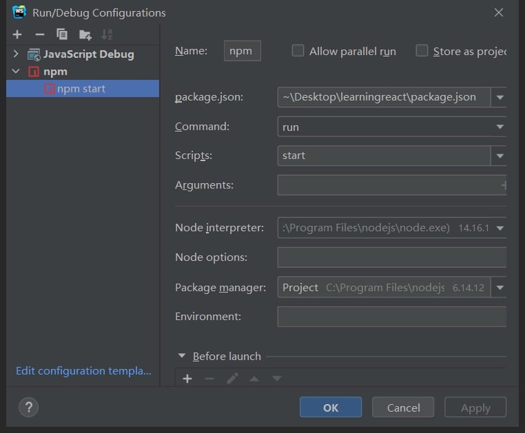

### 废话

在我们第一次接触AntD的时候，会遇到两个东西，一个是Ant Design 另一个是Ant Design Pro，他们的官网分别是：

[Ant Design - 一套企业级 UI 设计语言和 React 组件库](https://ant.design/index-cn)

[Ant Design Pro - 开箱即用的中台前端/设计解决方案](https://pro.ant.design/index-cn)

从这个上面就可以看出来了，用小学的缩句表示就是;

Ant Design 是一套设计语言与组件库

Ant Design Pro是一套解决方案

可能这样说还不够直接，说白了就是，Ant Design Pro 是Ant Design 的脚手架，当你构建项目基本框架用Pro ，然后要使用其中一些组件就去Ant Design中去查。

### 项目构建

我们打开antD的官网[Ant Design Pro - 开箱即用的中台前端/设计解决方案](https://pro.ant.design/index-cn)拉到下面就可以看见相关的构建方式：

```bash
npm create umi

Select the boilerplate type (Use arrow keys)
❯ ant-design-pro  - Create project with an layout-only ant-design-pro boilerplate, use together with umi block.
  app             - Create project with a simple boilerplate, support typescript.
  block           - Create a umi block.
  library         - Create a library with umi.
  plugin          - Create a umi plugin.

123456789
```

至此项目创建，开始拉取依赖

```bash
npm install
1
```

接着运行

```bash
npm start
1
```

然后浏览器访问项目[http://localhost:8000](http://localhost:8000/)，要停止项目就Ctrl+CV或者关闭窗口

##### 目录介绍

具体目录还有相关文档，去官网查看

[开始使用 - Ant Design Pro](https://pro.ant.design/docs/getting-started-cn)

接下来我们要做的是用WebStorm打开项目，整理一下，记住下面这几个开始时候基本够用：


配置一下运行选项



接下来花几分钟熟悉一下项目的写法，然后看下一篇博客