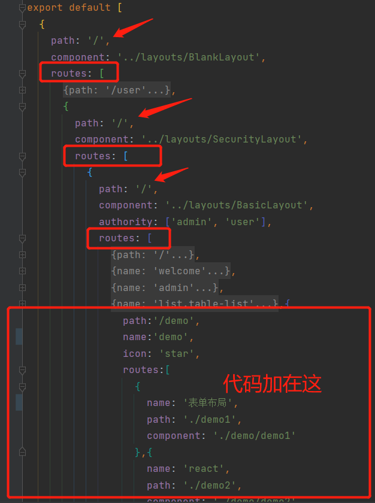

##### 修改config/routes.tx

我们在routes.tx文件中找到下面节点



在该节点下面增加代码：

```js
	{
                path:'/demo',
                name:'demo',
                icon: 'star',
                routes:[
                  {
                    name: '表单布局',
                    path: './demo1',
                    component: './demo/demo1'
                  },{
                    name: 'react',
                    path: './demo2',
                    component: './demo/demo2'
                  }
                ]
              },{
                name: 'test',
                icon: 'book',
                path: '/test',
                component: './test'
              }
123456789101112131415161718192021
```

我们来说说配置的意思把：

- path:代表访问的路径
- name:显示的名字（此处不做国际化配置）
- icon: 图标
- routes:子菜单
- component:所指向的文件

##### src/pages创建下文件夹与文件

这个时候访问可能会出错，那是因为你还未创建相关的文件夹和文件，这时候我们在src/pages目录下创建文件夹和文件


PS：这里采用TypeScript的形式进行创建，毕竟得跟上主流，其中

.tsx：构建界面主要文件，相当于以前的jsx（简单来说就TypeScript与XML的结合）

.less:样式文件，相当于css

##### 随便写点内容

这时候访问好像还是不是那么顺畅，所以我们就写点内容，找到demo下面的demo1、demo2和test文件夹，在index.tsx中开始写

```js
import React from "react";
class Index extends React.Component {
    render() {
        return <div>
            我的第一个AntD
        </div>
    }
}

export default Index;
12345678910
```

然后你就会看到这样：


接下来改进一下

```js
import React from "react";
class Index extends React.Component {
    render() {
        return <div>
            <PageContainer>
                <Card>
                    测试213
                </Card>
            </PageContainer>
        </div>
    }
}

export default Index;

```

然后我们这个时候需要做什么呢？

既然第一个页面出来了，那我们就要开始学者用一用Ant Design中的组件嘛，不然有啥子用

[点击进入 Ant Design - 一套企业级 UI 设计语言和 React 组件库](https://ant.design/index-cn) 选择组件


这时候我们来点简单的表格渲染把


然后复制所有代码，并作出以下修改


因为之前看[React](https://so.csdn.net/so/search?q=React&spm=1001.2101.3001.7020)我们知道这是对应的渲染到到mountNode节点下，所以我们直接用Table标签就好，改为下面的这样


完整的index.tsx代码：

```js
import React from "react";
import {PageContainer} from "@ant-design/pro-layout";
import {Card} from "antd";

import { Table, Tag, Space } from 'antd';

const columns = [
    {
        title: 'Name',
        dataIndex: 'name',
        key: 'name',
        render: text => <a>{text}</a>,
    },
    {
        title: 'Age',
        dataIndex: 'age',
        key: 'age',
    },
    {
        title: 'Address',
        dataIndex: 'address',
        key: 'address',
    },
    {
        title: 'Tags',
        key: 'tags',
        dataIndex: 'tags',
        render: tags => (
            <>
                {tags.map(tag => {
                    let color = tag.length > 5 ? 'geekblue' : 'green';
                    if (tag === 'loser') {
                        color = 'volcano';
                    }
                    return (
                        <Tag color={color} key={tag}>
                            {tag.toUpperCase()}
                        </Tag>
                    );
                })}
            </>
        ),
    },
    {
        title: 'Action',
        key: 'action',
        render: (text, record) => (
            <Space size="middle">
                <a>Invite {record.name}</a>
                <a>Delete</a>
            </Space>
        ),
    },
];

const data = [
    {
        key: '1',
        name: 'John Brown',
        age: 32,
        address: 'New York No. 1 Lake Park',
        tags: ['nice', 'developer'],
    },
    {
        key: '2',
        name: 'Jim Green',
        age: 42,
        address: 'London No. 1 Lake Park',
        tags: ['loser'],
    },
    {
        key: '3',
        name: 'Joe Black',
        age: 32,
        address: 'Sidney No. 1 Lake Park',
        tags: ['cool', 'teacher'],
    },
];

class Index extends React.Component {
    render() {
        return <div>
            <PageContainer>
                <Card>
                    <Table columns={columns} dataSource={data} />
                </Card>
            </PageContainer>
        </div>
    }
}

export default Index;
1234567891011121314151617181920212223242526272829303132333435363738394041424344454647484950515253545556575859606162636465666768697071727374757677787980818283848586878889909192
```

##### 结束

到这里页面构建结束，是不是基本已经能够创建界面了，然后继续看下一篇