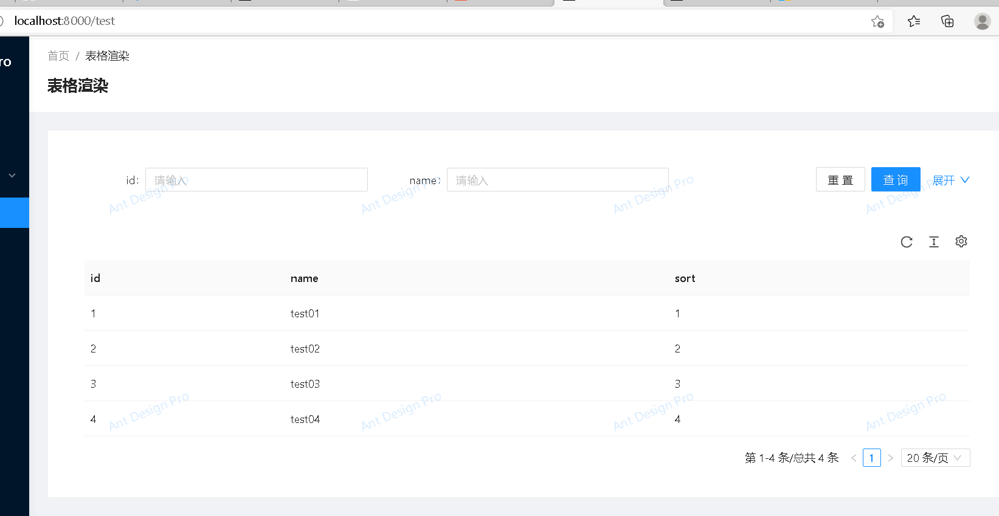

### 认识Mock

学到这里就算是开始踏入AntD的门，然后我们还得学习一下常用的一些操作，例如Mock。

针对与Mock他大致就是用来模拟数据的，为什么会有它的出现呢？因为现在前后端开发基本是分离的，但是数据结构一般都会先定好，在日常开发中，为了前端的进度不受到后端的影响，常用Mock来做虚拟数据来模拟后端发来的请求。

本文只是简单的介绍一下Mock的使用，如果要详细学习请自行百度

### Mock基本格式

```js
export default {
  'GET /api/getValue': {
    data:[{
      name:'zhangsang',
      sex:'男'
    },{
      name:'李四',
      sex:'男'
    },]
  },
};

123456789101112
```

我们稍微变一下型，为了看起来更加美观就变成了这样

```js
const getList = ()=>{
    const result = {
        success:true,
        data:[
            {
                id:1,
                name:'test01',
                sort:1
            },{
                id:2,
                name:'test02',
                sort:2
            }
        ]
    };
    return res.json(result);

}
export default {
    'GET /api/testList':getList,
}
123456789101112131415161718192021
```

在return的时候，我们看到了res.json()进行了一下json格式转化，因为我们在实际开发中，基本前后端交互都是靠JSON。

然而我们一般来说发送请求都是异步的，这时候Mock是怎么做的呢？

```js
import {Request,Response} from "express";

const getList = async (req:Request,res:Response)=>{
    const result = {
        success:true,
        data:[
            {
                id:1,
                name:'test01',
                sort:1
            }
        ]
    };
    return res.json(result);

}
export default {
    'GET /api/testList':getList,
}
12345678910111213141516171819
```

从上面可以看到**就是简单的加了async关键字，让后加了request和response**

### 认识Service

在上面说了Mock的一个基本使用，那他是如何工作的呢？

前面已经说了，Mock相当于模拟服务器数据，那请求数据的地方在哪里呢？那就是Service的文件夹中，这时候我们大致看一下Service的基础结构，方便后面的demo看懂。

```js
import {request} from "umi";

export async function getList(){
    return request('/api/testList');
}
12345
```

或者是

```js
export async function fakeAccountLogin(params: LoginParamsType) {
  return request('/api/login/account', {
    method: 'POST',
    data: params,
  });
}

1234567
```

这基本就是一个service的构成，其中export async function都是关键字，request()中的’/api/tesetList’就是我们之前写的Mock中的接口。

PS：

request():其实结构是下面这样，如果是ｇｅｔ请求可以简写。

```ｊｓ
request('/api/getValue',{
method://请求方式 GET、POST、PUT、DELETE
data: //请求参数
})
1234
```

### 来个Ｄｅｍｏ

我们将test文件夹下面的index.tsx写入以下内容

```js
import React from "react";
import ProTable from "@ant-design/pro-table";
import {ProColumns} from "@ant-design/pro-table";
import {getList} from "@/services/test";
import {PageContainer} from "@ant-design/pro-layout";
import {Card} from "antd";
const TestList : React.FC= ()=>{
    const columns:ProColumns[]=[
        {
            title:'id',
            dataIndex:'id'
        },{
            title: 'name',
            dataIndex: 'name'
        },{
            title: 'sort',
            dataIndex: 'sort'
        }]

    return <div>
       <PageContainer>
           <Card>
               <ProTable columns={columns}
                         request={async (params) =>{
                             let result = await getList();
                             return result;
                         }}/>
           </Card>
       </PageContainer>
    </div>
}

export default TestList;
123456789101112131415161718192021222324252627282930313233
```

然后在service文件夹下新建test.tx文件然后写入以下内容：

```js
import {request} from "umi";

export async function getList(){
    return request('/api/testList');
}
12345
```

接下来就是在Mock中新建立test.tx文件写入

```js
import {Request,Response} from "express";

const getList = async (req:Request,res:Response)=>{
    const result = {
        success:true,
        data:[
            {
                id:1,
                name:'test01',
                sort:1
            },{
                id:2,
                name:'test02',
                sort:2
            },{
                id:3,
                name:'test03',
                sort:3
            },{
                id:4,
                name:'test04',
                sort:4
            }
        ]
    };
    return res.json(result);

}
export default {
    'GET /api/testList':getList,
}
12345678910111213141516171819202122232425262728293031
```

接下来运行你的项目，访问，你就会看到这样

