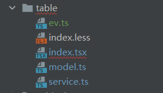

### 废话

学习了Mock、Service和page的基本相关知识，勉强能够将项目跑起来了，突然你会发现，哦豁，[model](https://so.csdn.net/so/search?q=model&spm=1001.2101.3001.7020)为什么没有用到，这个是干嘛的呢？接下来我们就来学习一下。

### 建议

学习Model之前其实建议先去看看DVA的相关教程，有个理解，看起来不是那么费劲，或者你死记也可以。

这里推荐DVAJS进行学习[入门课 | DvaJS](https://dvajs.com/guide/introduce-class.html) https://dvajs.com/guide/introduce-class.html

为什么推荐先看看DVA呢？因为你看懂了那就很牛逼，看不懂了了解一下对下面也有帮助，因为Model就是用Dva写的。

### model倒是是个啥

model其实就是对数据的处理过程又进行了一次封装。

一般来说在AntD中数据请求过程是这样的：

> 1.UI 组件交互操作；
>
> 2.调用 model 的 effect；
>
> 3.调用统一管理的 service 请求函数；
>
> 4.使用封装的 request.ts 发送请求；
>
> 5.获取服务端返回；
>
> 6.然后调用 reducer 改变 state；
>
> 7.更新 model。

通俗点来说，请求方式就是：

**View->model->Service->后端（或Mock）**

当然你也可以先之前写的一样

**View->Service->后端（Mock）**

### 学习Model

还是老样子，想看代码在学习：

```js
import type {Effect} from "umi";
import {Reducer} from "umi";
import {getTableValue, selectTableValue} from "@/pages/table/service";

//设置类型
export type TableValue={
    key?: String;
    name?:String;
    age?:Number;
    address?: String;
    time?:String;
}
export type allValue = {
    tableValue?:TableValue;
}

export type TableModelType = {
    namespace:'tableDemo';
    state:allValue;
    effects:{
        getValue:Effect;
        selectValue:Effect;
    }
    reducers:{
        saveValue:Reducer<allValue>;
    }
}

/**
 * 上面函数的实现
 */
const TableModel:TableModelType={
    //命名空间
    namespace: "tableDemo",
    //设置state
    state: {
        tableValue:{},
    },
    //提供给view调用的接口
    effects: {
        *getValue(_,{call,put}){
            const res = yield call(getTableValue);
            yield put({
                type:'saveValue',
                payload:res
            })
        },

        *selectValue({payload},{call,put}){
            console.log("model:"+payload)
            const res = yield call(selectTableValue,payload);
            console.log(res)
            yield put({
                type:'saveValue',
                payload:res
            })
        }
    },
    //提供给effects通信put的接口
    reducers: {
        saveValue(date,action){
            return{
                ...date,
                tableValue: action.payload
            };
        }
    }

}
export default TableModel;

1234567891011121314151617181920212223242526272829303132333435363738394041424344454647484950515253545556575859606162636465666768697071
```

开始解释：

1、export type：类似定义一下数据结构，数据类型（?:表示非必须字段）

2、

```js
export type TableModelType = {
    namespace:'tableDemo';
    state:allValue;
    effects:{
        getValue:Effect;
        selectValue:Effect;
    }
    reducers:{
        saveValue:Reducer<allValue>;
    }
}
1234567891011
```

学过java的可以把这个理解成你定义的接口，const TableModel:TableModelType是对你定义接口的实现；

然后我们分别来说一下，这部分结构都有什么东西：

- namespace : model 的命名空间，Page连接时候要用到
- state: 初始state
- reducers: 同步的修改状态的操作，由actions触发(state,action) => state。说白了就是给efffects提供通信的接口，用来修改state
- effects:异步的操作，并不直接修改state，由action触发，也可以调用actions。(action,{put,call,select})
- subscriptions:异步的只读操作，并不直接修改state，可以调用actions。`({ dispatch, history })`

**一个Model 一般都有 namespace、state、reducers、effects**

3、来看看对接口的实现

```js
/**
 * 上面函数的实现
 */
const TableModel:TableModelType={
    //命名空间
    namespace: "tableDemo",
    //设置state
    state: {
        tableValue:{},
    },
    //提供给view调用的接口
    effects: {
        *getValue(_,{call,put}){
            const res = yield call(getTableValue);
            yield put({
                type:'saveValue',
                payload:res
            })
        },

        *selectValue({payload},{call,put}){
            console.log("model:"+payload)
            const res = yield call(selectTableValue,payload);
            console.log(res)
            yield put({
                type:'saveValue',
                payload:res
            })
        }
    },
    //提供给effects通信put的接口
    reducers: {
        saveValue(date,action){
            return{
                ...date,
                tableValue: action.payload
            };
        }
    }

}
123456789101112131415161718192021222324252627282930313233343536373839404142
```

其中effects内我们可以看到有一个带*号的方法，这个玩意是提供给Page调用的，其中put、call、select是提供通信的，例如yield put（）是对reducers中的方法调用。yield call是去访问service中的方法。

### 来个Demo

配置路由：

```js
{
                name: '表格通信练习',
                icon: 'book',
                path: '/table',
                component: './table'
              }
123456
```

在page中添加table文件夹，创建index.tsx index.less model.ts service.ts

在mock文件夹下建立table.tx 如图：

page目录下：



mock目录下


接下来上代码（建议自己敲）

index.tsx

```js
import {Button, Card, DatePicker, Form, Input, message, Modal, Popconfirm, Space, Table} from 'antd';
import React, {useState} from "react";
import {PageContainer} from "@ant-design/pro-layout";
import {connect} from "umi";
import Search from "antd/es/input/Search";
import styles from "./index.less"
import {TableValue} from "@/pages/table/model";
import moment from "moment";
import {addForm, deleteById} from "@/pages/table/service";
import emitter from './ev'

/**
 * 组件APP为Index主组件调用
 * 主要用作table组件渲染
 * 包含 AddUser 静态模框渲染
 *
 * 父组件：Index
 * 子组件：AddUser
 */
class App extends React.Component {
    constructor(props) {
        super(props);
    }

    //设置状态表示选中行
    state = {
        selectedRowKeys: [],
    };
    //将选中行存入state
    onSelectChange = selectedRowKeys => {
        console.log('selectedRowKeys changed: ', selectedRowKeys);
        this.setState({selectedRowKeys});
    };


    //删除
    confirm(e) {
        console.log(e);
        //调用Index的DeleteById函数与Service通信进行删除
        this.props.DeleteById(e);
        message.success('删除成功');
    }

    render() {
        const columns = [
            {
                title: 'Id',
                dataIndex: 'key',
            }, {
                title: '姓名',
                dataIndex: 'name',
            },
            {
                title: '年龄',
                dataIndex: 'age',
            },
            {
                title: '地址',
                dataIndex: 'address',
            }, {
                title: '时间',
                dataIndex: 'time',
            }, {
                title: '操作',
                //函数式声明：text表示当前行内容
                render: (text) => (<Space size="middle">
                    <Popconfirm //ant组件
                        title="您确定要删除吗？"
                        onConfirm={() => {
                            this.confirm(text.key); //调用当前confirm进行删除
                        }}
                        okText="确定"
                        cancelText="取消"
                    >
                        <Button danger type="primary">删除</Button>
                    </Popconfirm>
                    <AddUser valueTemp={"修改"} flag={true} value={text}/>
                </Space>)

            },
        ];

        //定义选中行keys
        const {selectedRowKeys} = this.state;
        //选择
        const rowSelection = {
            selectedRowKeys,
            onChange: this.onSelectChange,
            selections: [
                Table.SELECTION_ALL,
                Table.SELECTION_INVERT,
                Table.SELECTION_NONE,
                {
                    key: 'odd',
                    text: 'Select Odd Row',
                    onSelect: (changeableRowKeys: any[]) => {
                        let newSelectedRowKeys = [];
                        newSelectedRowKeys = changeableRowKeys.filter((key, index) => {
                            if (index % 2 !== 0) {
                                return false;
                            }
                            return true;
                        });
                        this.setState({selectedRowKeys: newSelectedRowKeys});
                    },
                },
                {
                    key: 'even',
                    text: 'Select Even Row',
                    onSelect: (changeableRowKeys: any[]) => {
                        let newSelectedRowKeys = [];
                        newSelectedRowKeys = changeableRowKeys.filter((key, index) => {
                            if (index % 2 !== 0) {
                                return true;
                            }
                            return false;
                        });
                        this.setState({selectedRowKeys: newSelectedRowKeys});
                    },
                },
            ],
        };
        //渲染：this.props.values表示获取Index中的values值
        //将this.props.values(Index中的tableValue)值传给子组件Table
        return <>
            <Table rowSelection={rowSelection} columns={columns} dataSource={this.props.values}/>;
        </>
    }
};

/**
 * 添加/修改界面的静态模框
 * 父组件：APP、Index
 * 子组件：UserForm
 */
const AddUser = (props) => {
    //初始化组件状态，也就是静态模框状态，默认关闭
    const [isModalVisible, setIsModalVisible] = useState(false);
    const showModal = () => {
        setIsModalVisible(true);
        //展示时候打印是否是修改。后面要传值 UserForm => flag表示是否需要修改
        if (props.flag) {
            console.log("进入修改");
            console.log(props.value);
        }
    };

    const handleOk = () => {
        setIsModalVisible(false);
    };

    const handleCancel = () => {
        setIsModalVisible(false);
    };
    //Model=> visible:是否可见 onOK：点击确定回调  onCancel:点击取消回调  footer:底部是否可见
    return (
        <div>
            <div className={styles.float}>
                <Button onClick={showModal}>{props.valueTemp}</Button>
            </div>
            <Modal title="用户编辑" visible={isModalVisible} onOk={handleOk} onCancel={handleCancel} footer={null}>
                <UserForm handleCancel = {props.handleCancel} userInfo={props.value} flag={props.flag}/>
            </Modal>
        </div>
    );
};

/**
 * 表单组件
 * props：父界面 AddUser中的传入的props
 * 父组件：AddUser
 */
const UserForm = (props) => {
    const [form] = Form.useForm();

    //定义user继承TableValue,值从父组件中获取
    const user: TableValue = props.userInfo;
    console.log("表单渲染：");
    console.log(user);

    //如果是修改，则进行输入框赋值
    if (props.flag) {
        form.setFieldsValue({
            key: user.key,
            name: user.name,
            age: user.age,
            address: user.address,
            //moment函数 npm install moment  时间格式刷
            time: moment(user.time + "")
        })

    }
    //两个布局设置
    const layout = {
        labelCol: {span: 8},
        wrapperCol: {span: 16},
    };
    const tailLayout = {
        wrapperCol: {offset: 8, span: 16},
    };

    //点击确定后提交
    const onFinish = async (values: any) => {
        console.log(values);
        console.log(JSON.stringify(values));
        //异步调用Service
        const result = await addForm(values);
        console.log(result);
        //采用不通组件之间通信方式
        emitter.emit("callMe",result.data);
        // fetch不支持mock模拟数据，需要更换为./mock/xx.json/形式
        // fetch(`/api/addOrUpdate`,{
        //     method: 'POST',
        //     body:new FormData(values)
        // }).then(res => {
        //     console.log(res);
        //     res.text();
        // }).then(
        //     result => {
        //     }
        // )

    };
    //重置表单
    const onReset = () => {
        form.resetFields();
    };

    return (
        <Form {...layout} form={form} name="control-hooks" onFinish={onFinish} className="ant-col-8">
            <Form.Item name="key" label="ID" rules={[{required: false}]}>
                <Input/>
            </Form.Item>
            <Form.Item name="name" label="姓名" rules={[{required: true}]}>
                <Input/>
            </Form.Item>
            <Form.Item name="age" label="年龄" rules={[{required: true}]}>
                <Input/>
            </Form.Item>
            <Form.Item name="address" label="地址" rules={[{required: true}]}>
                <Input/>
            </Form.Item>
            <Form.Item name="time" label="时间" rules={[{required: true}]}>
                <DatePicker showTime format="YYYY-MM-DD HH:mm:ss"/>
            </Form.Item>
            <Form.Item {...tailLayout}>
                <Button type="primary" htmlType="submit">
                    提交
                </Button>
                <Button htmlType="button" onClick={onReset} className={styles.buttons}>
                    重置
                </Button>
            </Form.Item>
        </Form>
    );
};


class Index extends React.Component {
    private eventEmitter: any;

    //设置构造函数
    constructor(props) {
        super(props);
        this.state = {tableValue: this.props.tableValue};
        //将函数进行绑定，必须绑定
        this.DeleteById = this.DeleteById.bind(this);
    }

    //当props发生变化时执行，初始化render时不执行
    componentWillReceiveProps(props) {
        if (props.tableValue !== this.props.tableValue) {
            this.setState({tableValue: props.tableValue});
        }
    }

    //初始化render之后只执行一次
    componentDidMount(){
        // 声明一个自定义事件
        // 在组件装载完成以后
            this.eventEmitter = emitter.addListener("callMe",(msg)=>{
            this.setState({tableValue:msg})
        });
    }

    // 组件销毁前移除事件监听
    componentWillUnmount(){
    }
    //行一次，在初始化render之前执行
    componentWillMount() {
        this.getValue();
    }


    getValue = () => {
        const {dispatch} = this.props;
        //调用Model
        dispatch({
            type: 'tableDemo/getValue',
            payload: {},
        });
    };

    //异步调用移除
    async DeleteById(key) {
        console.log("父组件方法 移除：");
        console.log(key);
        //调用Service
        const result = await deleteById(key);
        this.setState({tableValue: result.data})
    }


    render() {
        const onSearch = value => {
            console.log("进入：value：" + value);
            const {dispatch} = this.props;
            //调用Model
            dispatch({
                type: 'tableDemo/selectValue',
                payload: value,
            });
        };


        return <div>
            <PageContainer>
                <Card>
                    <div className={styles.top}>
                        <Search className={styles.search}
                                placeholder="请输入查询关键字"
                                allowClear
                                enterButton="查询"
                                size="middle"
                                onSearch={onSearch}
                        />
                        <div className={styles.add}>
                            <AddUser  valueTemp={"添加"} flag={false} value={null}/>
                        </div>
                    </div>
                    <App DeleteById={this.DeleteById} values={this.state.tableValue}/>
                </Card>
            </PageContainer>
        </div>
        //rander运行结束后移除 PS：这个写法不正规，但是能用
        emitter.removeListener(this.eventEmitter);
    }
}
//设置绑定的返回数据
const mapStateToProps = (state) => {
    return {
        tableValue: state.tableDemo.tableValue.data,
    }
}
//连接
export default connect(mapStateToProps)(Index);
123456789101112131415161718192021222324252627282930313233343536373839404142434445464748495051525354555657585960616263646566676869707172737475767778798081828384858687888990919293949596979899100101102103104105106107108109110111112113114115116117118119120121122123124125126127128129130131132133134135136137138139140141142143144145146147148149150151152153154155156157158159160161162163164165166167168169170171172173174175176177178179180181182183184185186187188189190191192193194195196197198199200201202203204205206207208209210211212213214215216217218219220221222223224225226227228229230231232233234235236237238239240241242243244245246247248249250251252253254255256257258259260261262263264265266267268269270271272273274275276277278279280281282283284285286287288289290291292293294295296297298299300301302303304305306307308309310311312313314315316317318319320321322323324325326327328329330331332333334335336337338339340341342343344345346347348349350351352353354355356
```

index.less

```less
.top{
  display: flex;
  padding-bottom: 1rem;
  .search{
    width: 15rem;
  }
  .add{
    margin-left: auto;
    .exchange{
      margin-right: 1rem;
    }
  }

}

.buttons{
  margin-left: 1rem;
}

:global{
  .ant-col-8 {
    display: block;
    /* flex: 0 0 33.33333333%; */
    max-width: 76.33333333%;
  }
}


12345678910111213141516171819202122232425262728
```

model.ts

```js
import type {Effect} from "umi";
import {Reducer} from "umi";
import {getTableValue, selectTableValue} from "@/pages/table/service";

//设置类型
export type TableValue={
    key?: String;
    name?:String;
    age?:Number;
    address?: String;
    time?:String;
}
export type allValue = {
    tableValue?:TableValue;
}

export type TableModelType = {
    namespace:'tableDemo';
    state:allValue;
    effects:{
        getValue:Effect;
        selectValue:Effect;
    }
    reducers:{
        saveValue:Reducer<allValue>;
    }
}

/**
 * 上面函数的实现
 */
const TableModel:TableModelType={
    //命名空间
    namespace: "tableDemo",
    //设置state
    state: {
        tableValue:{},
    },
    //提供给view调用的接口
    effects: {
        *getValue(_,{call,put}){
            const res = yield call(getTableValue);
            yield put({
                type:'saveValue',
                payload:res
            })
        },

        *selectValue({payload},{call,put}){
            console.log("model:"+payload)
            const res = yield call(selectTableValue,payload);
            console.log(res)
            yield put({
                type:'saveValue',
                payload:res
            })
        }
    },
    //提供给effects通信put的接口
    reducers: {
        saveValue(date,action){
            return{
                ...date,
                tableValue: action.payload
            };
        }
    }

}
export default TableModel;

1234567891011121314151617181920212223242526272829303132333435363738394041424344454647484950515253545556575859606162636465666768697071
```

service.ts

```ts
import request from "@/utils/request";

//异步调用
export async function getTableValue(){
    return request('/api/tableDemo');
}

export async function selectTableValue(temp: String){
    console.log("service:"+temp);
    return request(`/api/tableDemo?temp=${temp}`);
}

export async function deleteById(id: String){
    console.log("service:"+id);
    return request(`/api/deleteById`,{
        method:'POST',
        data:{'id':id},
    });
}
export async function addForm(formData:any){
    console.log("进入service:",formData);
    return request('/api/addOrUpdate',{
        method:'POST',
        data:formData
    });
}
1234567891011121314151617181920212223242526
```

ev.ts

```ts
import { EventEmitter } from "events";
export default new EventEmitter();

// npm install events --save

12345
```

PS:ev.ts是用于组件之间通信的，在使用之前请先执行

```bash
 npm install events --save
```