## AcroPro最佳实践

关于ArcoPro开箱即用的中后台前端解决方案，字节跳动开源支持Vue编程，我们使用它快速构建我们的前端页面，内部组件同大家比较熟悉 element ui一样，使用Acro design 组件库，同样也不少周边生态，目前还处于社区发展期，相信后续有更多的迭代升级和生态，让非前端开发/测试开发人员也可愉快完成平台项目。

### 2.1 初始化项目

> 参考文档 https://arco.design/vue/docs/pro/start

跟随以下步骤创建 Arco Design Pro 项目

#### 环境

使用此脚手架还需要安装` arco cli` 项目模版的工具，请运行以下命令安装：

```shell
npm i -g arco-cli 
```


#### 技术栈

本项目的技术栈为 vue + ES2015+ + TypeScript + Arco Design 和 echarts等，提前学习和了解这些知识将帮助你更好地上手我们的项目。

> 此框架基于vue进行编程，作者也没发现好的什么入门教程，如果javascrip基础看看官方文档即可，或者目的只是掌握框架的使用那么直接跟着项目走就可以


#### 安装

这一步是以 Arco Design Pro 为模版创建一个新的项目，请按照以下步骤进行：
1）进入到一个文件夹，新建项目，名字可自定义

```shell
cd QiDir
arco init hello-arco-pro
```

2）选择版本（首次会出现后续再创建会直接进入技术栈选择）

```shell
? 请选择使用的 Arco 物料平台版本 
❯ 公共版本（使用 GitHub 账户授权登录） 
  内网版本（使用 ByteDance SSO 验证登录，仅限内部员工使用
```

3）选择技术栈

```shell
? 请选择你希望使用的技术栈
   React
 ❯ Vue
```

4） 选择 `arco-design-pro` 分类

```shell
? 请选择一个分类
   业务组件
   组件库
   Lerna Menorepo 项目
 ❯ Arco Pro 项目
```

5） 选择项目，这里只是演示，也为后边开发源码参考方便，所以我们选择完整版

```shell
   简单版（只包含一个基础页面） 
 ❯ 完整版（包含所有页面）
```

等待安装依赖。。。
看到以下输出就是创建成功了
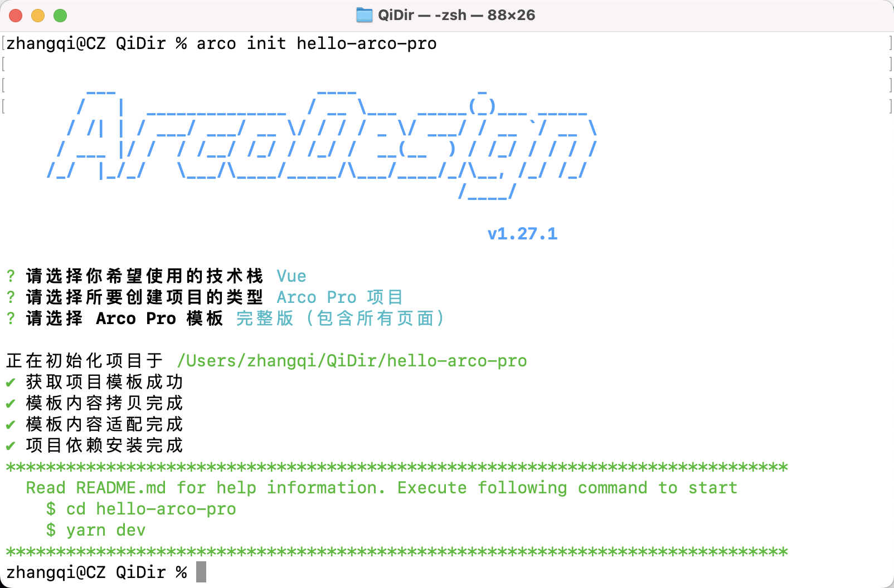

### 2.2 运行

进行项目中运行代码

```shell
cd hello-arco-pro
npm run dev
```

等待一段时间编译，看到Local: http://localhost:3000表示正常，正常浏览器会自动打开此地址，否则手动输入地址，就能看到如下登录页面。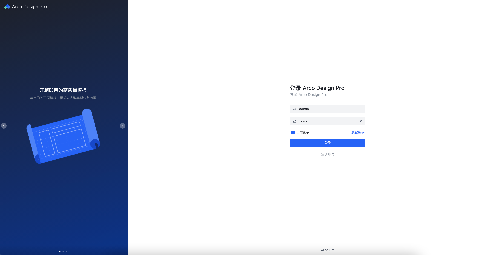

使用默认填充的账号密码点击登录就能看到完整版的项目

### 2.3 npm 命令

package.json script 预置一些的命令提前了解下

**配置文件**

```shell
├── README.md
├── config
│   ├── plugin  # vite插件
│   ├── vite.config.base.ts  # 基础环境配置
│   ├── vite.config.dev.ts  # 开发环境配置
│   ├── vite.config.prod.ts  # 生产环境配置
└── package.json
1234567
```

**本地开发运行**，IDE会支持修改实时编译

```shell
npm run dev

# 调用的命令位于
# {
#  "scripts": {
#    "dev": "vite --config ./config/vite.config.dev.ts",
#  }
# }
12345678
```

**构建生产部署**，默认将输出到项目dist目录下

```shell
npm run build

# 调用的命令如下，可以根据实际需要，查阅vite官网，进行输出配置。
# {
#   "scripts": {
#     "build": "vue-tsc --noEmit && vite build --config ./config/vite.config.prod.ts",
#   }
# }
12345678
```

## 3. Flask后端服务

Python `flask` 一个web微框架，这里我们用来实现resful api服务，其余比较流行的框架还有但不限于如`tornado`、`fastapi`、`django`、`sanic`等，本系列所有后端服务没有特殊补充篇都基于Flask实现。

> 官方文档 https://flask.palletsprojects.com/


### 3.1 服务编码

下面依然不借助任何高级IDE，硬编码实现个最简单的接口

**框架包安装** 要使用flask需要通过pip3包管理工具进行安装

```shell
 pip3 install -U flask
1
```

**创建最简单接口** 使用 `vim run_flask.py` 或者任意文本编辑器，敲如下代码
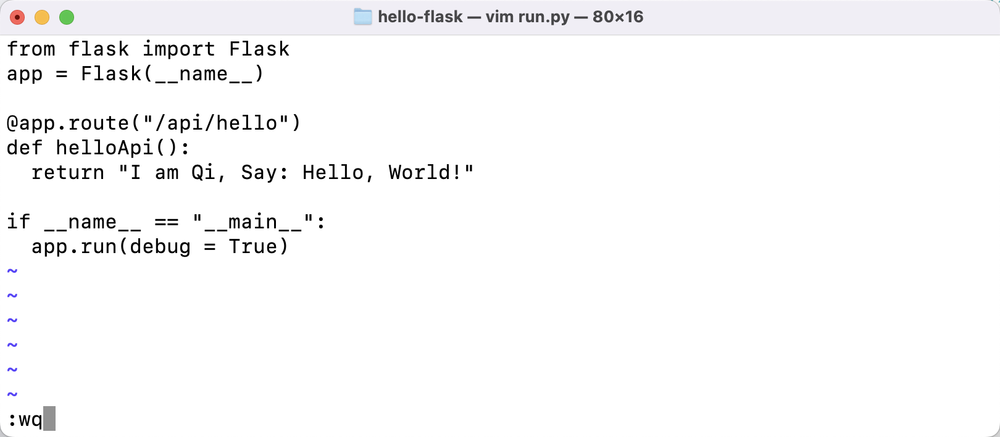

### 3.2 服务运行测试

```shell
 python3 run.py
1
```

如果没有或者语法错误的话，就能看到正常debug模式启动了，进行一下测试

- 通过浏览器直接访问 http://127.0.0.1:5000/api/hello
- 或用命令行 `curl "http://127.0.0.1:5000/api/hello"`

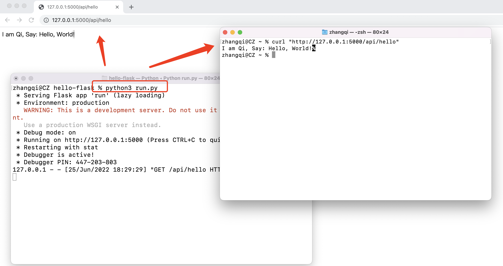
测试按预期看到返回" I am Qi, Hello，World! "，则表示最小版本接口服务就完成了。

## 4. 产品需求PRD与规划

测试和研发对于产品的工作的开展，最想要的莫过于详细的产品需求和 RPD 了把，回想口头上的需求设计、开发、测试有多让人头痛，对于这个测试任务平台虽然只是个平台工具开发练手项目，但明确的开发规划，以及详细的产品需求说明一样也不能少。实际上也建议大家在做一个工具或平台都应该这样的整体的框架，1 到 2 个迭代的详细需求说明，这样才能心中有数开发不慌，另外如果测试工具是给团队的开发的，一定要与需求方和关系人做评审，毕竟从本质出发，工具产品的诞生是为了解决实际需求，提高生产率。

#### 项目背景

关于这个测试需求管理平台，历史有点久远（还没有这么多好用开源的开箱即用的前后端框架之前），起初因为当初所在团队，负责太多的项目，很多需求提测，测试报告都是通过邮件手工进行，久之就有了比如信息不全、记录不好找、负责人不好统计工作量、也不能做devops集成等痛点，所以使用前端团队自己框架（类似vue这种内部自研），和测试自己用Python编写后台服务搭建此测试工具平台。

> 说明：此项目的源码和详细的开发文档分享，适合有基础的Python和Javascript/html语言的基础的同学，作为一个练手项目使用，需求和功能很简单，并不是直接在团队内部应用，但你有类似的测试管理需求，你可以利用此系列学到的知识做扩展开发和其他需求开发。

#### 功能规划

整个功能参考如下思维导图，需求开发会分两个阶段，这里想说的是如果自己在实现一些工具平台的话也最好有这样的分多次迭代规划，绝不是一下实现所有功能，实际上好多的新需求和优化都是从每期实现功能使用反馈而来，使得产品得以更好的改进，也更符合业务需求。
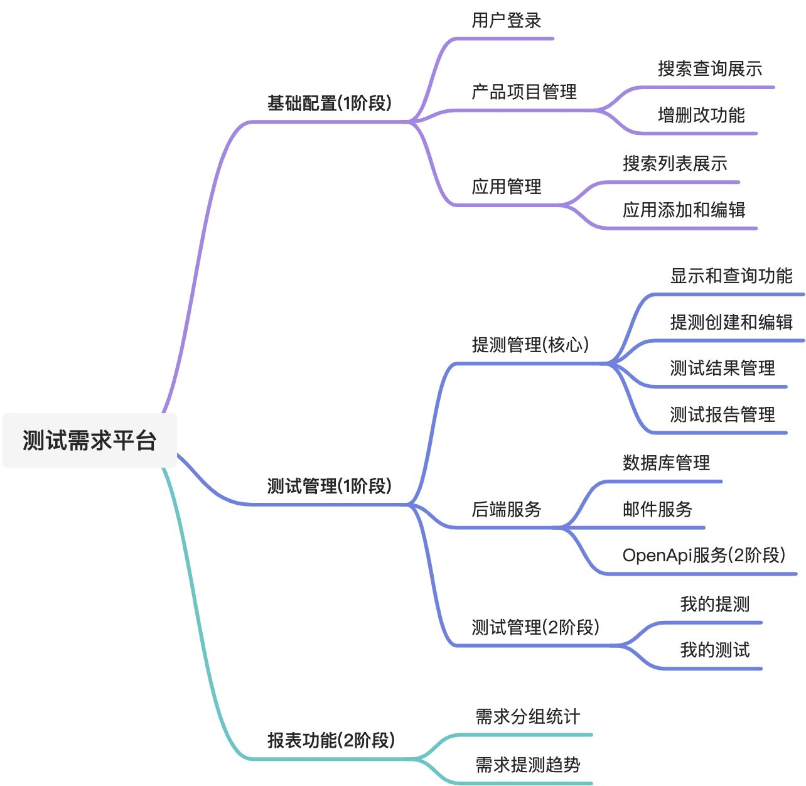

### 4.1 功能需求1阶段

按照迭代阶段1，将实现实现前后端的应用（服务）管理、测试管理两大模块，其中测试管理中涉及到研发提测操作和测试报告操作两个流程上的核心功能，另外服务层还会实现 邮件发送 服务，以及flask对 数据库优化相关内容，保持耐心长期关注，一定会有干货收获。

> 注：本系列为再编辑版本，所有原型图都将直接用element admin开发完成的前端交互界面替换。


#### 4.1.1 基础管理


##### 项目产品分类

此模块主要是对归属分类的创建，可以从不同的维度维护

- **团队维度** 比如基础服务团队、业务团队、大数据团队…；也可以以
- **服务维度** 比如用户服务、搜索服务、订单服务；亦可以
- **项目维度** 比如基础-短信项目、业务-支付项目

根据团队自己的需求去划分大的分类，笔者之前此项目是使用的服务团队维度进行划分的。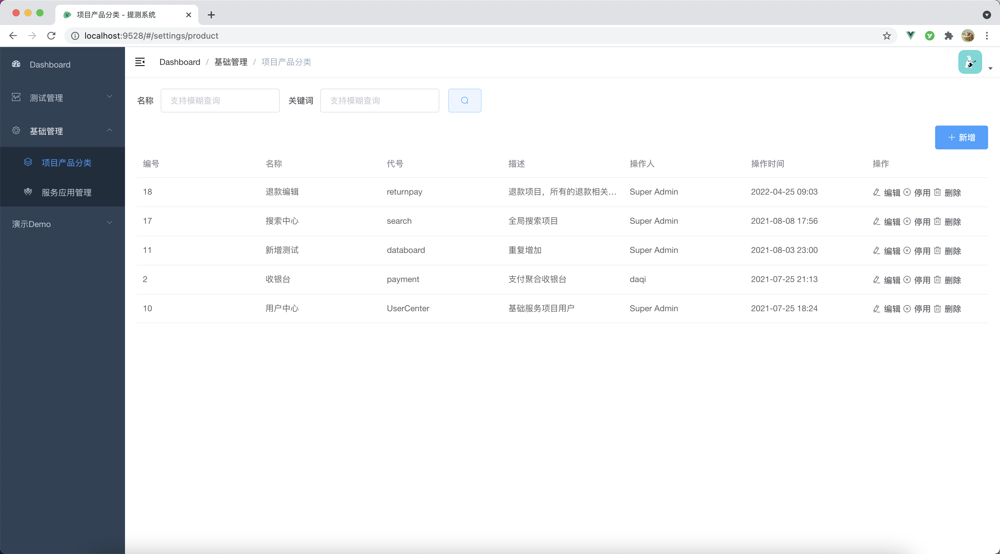

**列表页** 上方简单搜索区域，项目不多不做分页，支持增改软硬删除

1. **搜索区域**：支持名称和代码模糊搜索
2. **列表区域**：产品基本列显示带编号，描述超长自动省略
3. **操作按钮**：独立新增和列操作菜单

- 新增：带图标按钮，点击弹出对话框表单，重置为空
- 修改：选择行数值反填，共用同一个对话框，标题为修改文案提示
- 停用：软删除数据库用状态字段标记
- 删除：硬删除，真正从数据库删除（实战删除接口用）

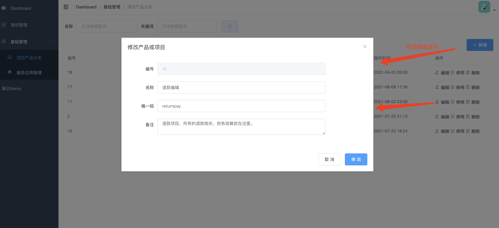

##### 服务应用管理

应用管理是以服务维度，平台项目中的最小单位，代表一个具体实际服务或者一个为服务，它会属于某个分类下，会基于此服务应用进行提测操作。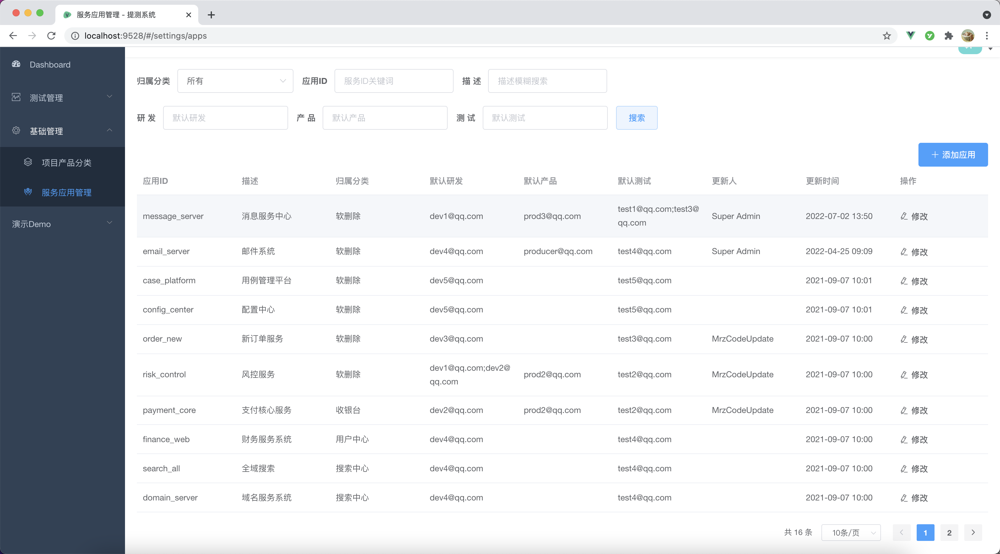
**列表页** 提供搜索功能、表格分页显示、添加和编辑功能操作

1. **搜索区域**：支持所列条件的查询

- 归属分类：选择数据来源于所有项目配置，默认为所有，支持模糊匹配
- 应用名称：应用ID支持模糊搜索
- 描述：扩展字段支持模糊搜索
- 研发&产品&测试：填写的邮箱或者公司内SSO用户（用于默认负责人绑定发邮件)

1. **列表区域**：显示对应几个重要列，具体如原型图，其他字段以更多的形式展示，支持分页
2. **功能操作**：按钮新增/行编辑

- 添加应用：点击当前页面弹出抽屉，所有数据为空
- 编辑功能：点击弹出抽屉和添加公用，数据需要单独查询反填
  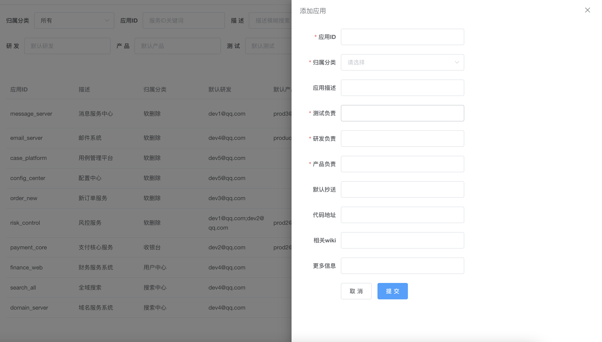

**应用添加** 涉及的相关字段和内部提示参考原型，标题为“应用添加”，其他要求

- 红色 * 表示必填字段，点击提交的时候校验
- 应用ID服务接口需要校验不重复，给出提示不关闭抽屉
- 几个负责输入框暂时为邮件形式，需要校验邮件格式，多个邮件分号；表示
- 取消按钮和 X 关闭当前抽屉
- 提交按钮为真正的添加操作，成功后给出消息提示，关闭抽屉，刷新列表

**应用编辑** 根据选择行关键key请求详细接口再次查询，目的是确保多人操作情况的最新数据，查询后将数据反填到对应行

- 标题为“应用编辑” ，提交按钮文案“修改”
- 编辑同样需要添加中涉及相关校验和提示功能

**应用删除**：暂不支持删除应用功能，有需要可以进行修改

#### 4.1.2 测试管理

按照规划1.0版本中，首先实现的是主要功能 提测管理 ，研发（通常）某个功能需求或者迭代需求开发完成后，使用此模块进行“新建提测”，编写给定的提测内容，平台记录状态并发送邮件通知测试，测试评估是否开始测试，以及测试完成后由实际测试人添加测试结果，同样提交相关模版数据后发送测试报告，对于操作不同状态有不同的操作菜单。

##### 测试需求管理

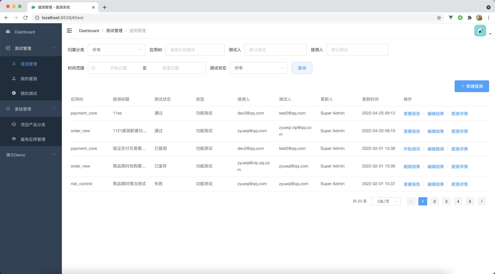

**提测列表页** 所有提测项目的分页显示，同样支持图所列条件搜索

**搜索功能**：归属、应用ID、测试、研发、产品字段参考应用管理

- 测试状态：固定选择项，各状态参考状态说明表
- 时间：开始-结束区间时间，默认为空，不限制时间，精确到分

**列表区域**：显示内容列如原型图，其他以更多形式呈现

- 列表按照更新时间倒序排序
- 状态需要转换成对应中文，标记不同颜色
- 时间需要按照 年-月-日 时:分 格式化
- 操作按钮：按照如下状态（最后实现会略有调整）

| **状态码** | **测试状态说明** | **操作菜单**                   |
| ---------- | ---------------- | ------------------------------ |
| 1          | 已提测           | 开始测试 / 编辑提测 / 提测详情 |
| 2          | 测试中           | 添加结果 / 编辑结果 / 提测详情 |
| 3          | 通过             | 查看报告 / 编辑结果 / 提测详情 |
| 4          | 失败             | 查看报告 / 编辑结果 / 提测详情 |
| 9          | 废弃             | 删除提测 / 编辑结果 / 提测详情 |

1. **功能操作**：实际的实现动作

- 新建提测：跳转到新建编辑页面
- 开始提测：流转状态为测试中，更新成功给出提示并刷新列表
- 编辑提测：对提测内容可以再次编辑，与新建提测共用一个页面，数据需要重新查询，确保数据最新数据
- 添加结果：跳转到结果添加页面，对测试结果做选择，以及填写测试详细
- 编辑结果：对测试结果（报告）做修正编辑，共页，查询新数据
- 提测详细：点击弹出文本对话框，主要方便快速查看内容，只读
- 查看报告：跳转到模版报告页面，显示详尽的测试报告内容
- 删除提测：对于标记废弃的测试项目，可以进行软删除，不再显示

**新建提测** ：由于编写的内容比较多暂定以新的字页面呈现，此页面不显示在左侧的菜单中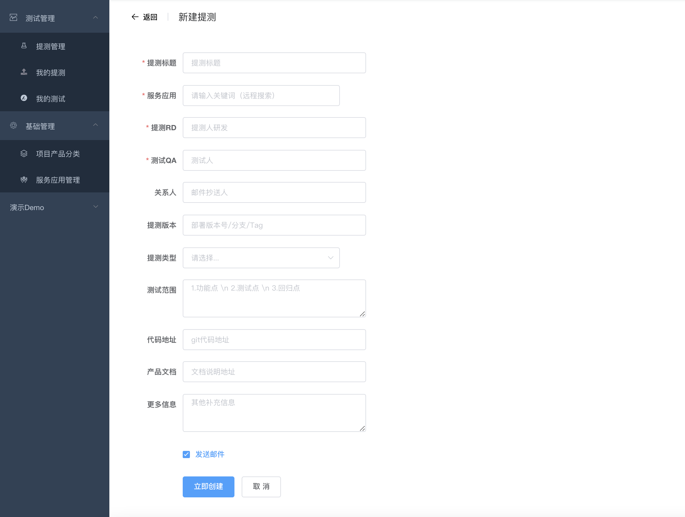
具体需求页面需求点如下：

- 红色 * 为必填项，输入框中需要定合适的提示信息
- 应用服务：数据来原来应用管理，下来选择可以关键词过滤，当选择对应的应用后，配置的相关邮件地址、代码、产品等有默认配置的信息，自动匹配反填到本页输入框中
- RD/QA：可再编辑修改和添加
- 体测版本：服务部署的TAG/分支 或者应用的版本号
- 提测类型：目前固定为 功能测试 / 性能测试 / 安全测试，目前只作为类型标记，无其他作用，后续可按需根据类型动态要求填写的内容
- 发送邮件：默认勾选，在提交数据后，发送提测邮件
- 发送通知：飞书/企业微信/钉钉等办公软件的通知（待定）
- 取消：返回上一页，即提测管理页面
- 添加：文案为“确定提测”，提交成功返回到列表页，刷新数据

**编辑提测** ：根据关键词请求详情接口查询最新数据进行反填，其他验证参考添加

- 服务应用：置灰不可再编辑
- 发送邮件：默认不勾选
- 提交按钮：文案为“修改提测

**提测详情** ：列表无法展示全的字段信息，将通过一个详细对话框展示
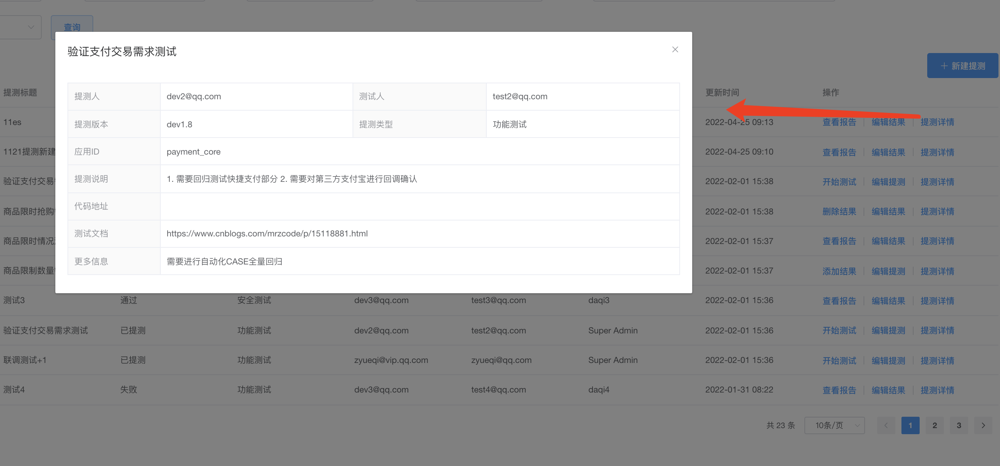


##### 测试结果管理

**添加测试结果** 在开始测试状态后，测试完成即可添加测试结果，即提交测试报告
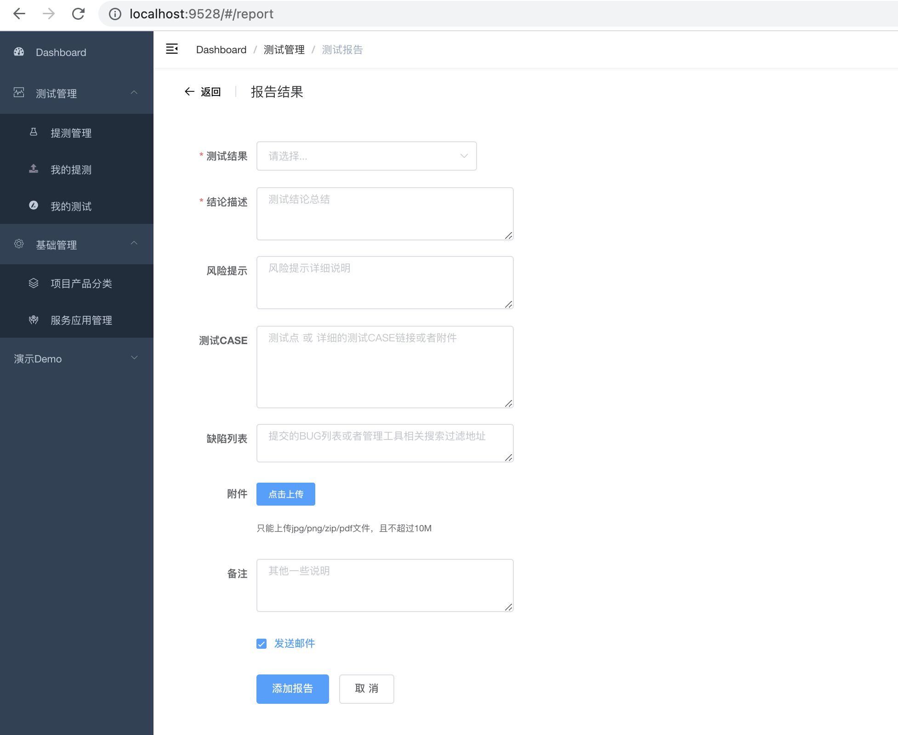

- 测试结果：必填选择状态为通过/失败/废弃
- 其他输入框：按需输入，描述按照原型图设置
- 附件：可上传单个文件作为测试附件
- 发送邮件：添加的时候默认选中，确定提交后后端按照测试报告模版发送

**编辑测试结果** 对测试结果可在编辑，交互实现同其他增改交互操作
**删除测试需求** 对于已经标记为废弃提测需求，可以进行删除
**报告详情** ：同样报告详细通过一个弹窗进行详细内容的展示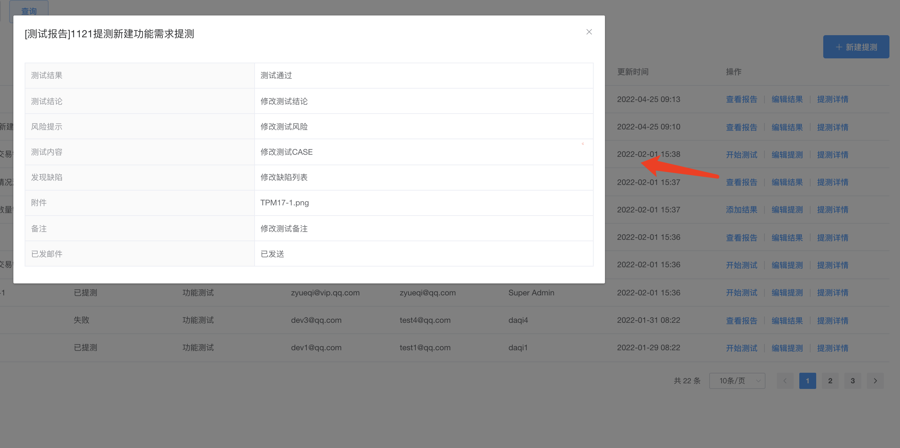

### 4.2 功能需求2阶段

上边描述过，正常一个合理的项目是有不断的迭代的，这部分就是这样的，笔者很早之前做这个平台的时候实际上是最少经历的五次的小大小迭代，毕竟那时候都是额外时间搞这个平台，每天还都是有自己负责的测试内容。关于阶段2的需求主要关注的提测者、测试者、和管理角色希望要的需求部分，，作为扩展开发和分享内容，同样也详细说明，这样大家就能在开始看到平台实战到最后的全貌了。

#### 4.2.1 我的提测

角色针对研发和产品，在提测数据中包含了自己的，会被过滤搜索，同提测管理界面类似，但搜索条件和操作针对角色进行简化。

> 由于功能在之前系列没实现，这里还是用原型图展示，比较直观也不做重复详细需求分解说明。

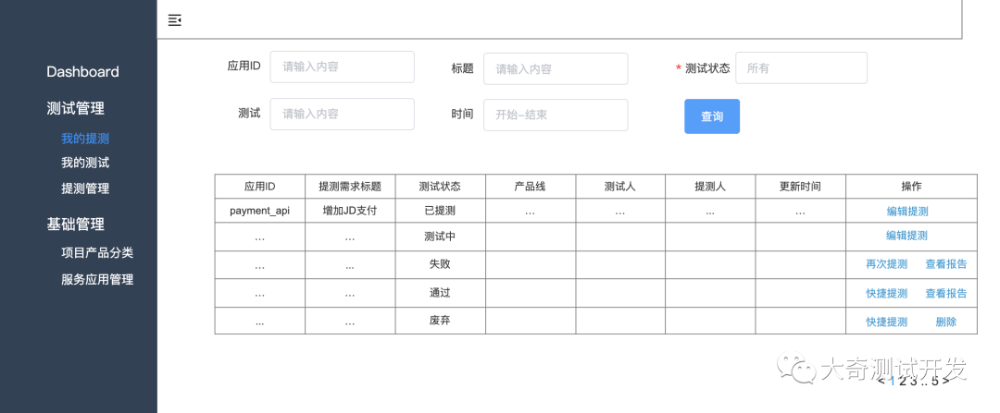

#### **4.2.2 我的测试**

针对测试角色，在提测列表中测试包含我的数据，搜索条件和操作按钮参考原型图，同样与提测管理属于简化板内容，不做过多需求定义。

> 由于功能在之前系列是做作为没实现，这里还是用原型图展示。

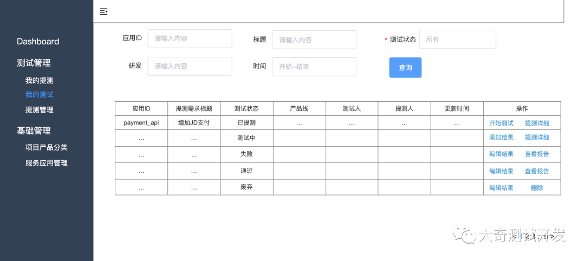

#### **4.2.3 数据报表**

按照归属分类的维度呈现提测趋势图，按照或者按月统计，最好也给出相应的简报，用于合理调整人力资源资源，关于报表方面我只是拿个实例实战下如何使用比如echart这类组件，实际上在公司内部有很多维度的统计用于质量报告。
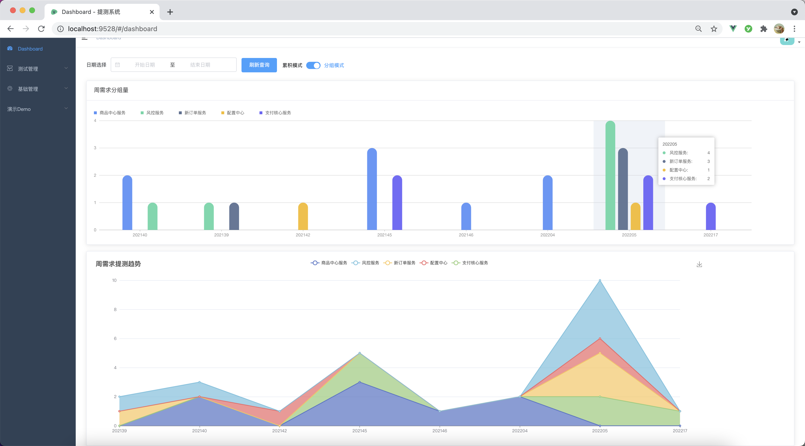

至此，花了大篇幅的内容实战演示了相关技术，并给出了后续需要完成产品的原型和详细的需求说明，具体到最后会略有调整，最后建议系列学习要保持耐心和积极性，多试错多交流才能有所成长。