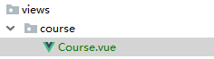

**x-admin渲染页面标题失效，解决方案，修订后端页面**

## 一 后端环境变量修订


**dev修订**

```python
# 将BASE_DIR(小luffyapi)文件夹添加至环境变量
sys.path.insert(0, BASE_DIR)
# 将apps文件夹添加至环境变量
sys.path.insert(1, os.path.join(BASE_DIR, 'apps'))


INSTALLED_APPS = [
    。。。
    'user',
    'home',
    'course',
    。。。
    
]
以后使用该文件夹下的内容
```

**主urls.py修订**

```python
    path(r'home/',include('home.urls')),
    path(r'user/',include('user.urls')), 
```

**util.auth**

```python
from user.models import User # 如果使用模型表使用绝对导入的时候必须以注册的app为起点导入
```

## 二 后端接口完善


### 1 创建course的app

```cmd
\project\Yanapi\Yanapi\apps>python ../../manage.py startapp biubiu
```

### 2 models.py

```python
from django.db import models

from utils.model import BaseModel

"""
一个分类有多个课程以及自己的分类名字
一个老师讲了多个课程
一    多
分类  课程
老师  课程
课程  章节
章节  课时


课程：分类(1-n)、老师(1-n)
分类：
老师：
章节：课程(1-n)
课时：章节(1-n)
"""

class CourseCategory(BaseModel):
    """分类"""
    name = models.CharField(max_length=64, unique=True, verbose_name="分类名称")
    class Meta:
        db_table = "luffy_course_category"
        verbose_name = "分类"
        verbose_name_plural = verbose_name

    def __str__(self):
        return "%s" % self.name

class Course(BaseModel):
    """课程"""
    course_type = (
        (0, '付费'),
        (1, 'VIP专享'),
        (2, '学位课程')
    )
    level_choices = (
        (0, '初级'),
        (1, '中级'),
        (2, '高级'),
    )
    status_choices = (
        (0, '上线'),
        (1, '下线'),
        (2, '预上线'),
    )
    name = models.CharField(max_length=128, verbose_name="课程名称")
    course_img = models.ImageField(upload_to="courses", max_length=255, verbose_name="封面图片", blank=True, null=True)
    course_type = models.SmallIntegerField(choices=course_type, default=0, verbose_name="付费类型")
    # 使用这个字段的原因
    brief = models.TextField(max_length=2048, verbose_name="详情介绍", null=True, blank=True)
    level = models.SmallIntegerField(choices=level_choices, default=0, verbose_name="难度等级")
    pub_date = models.DateField(verbose_name="发布日期", auto_now_add=True)
    period = models.IntegerField(verbose_name="建议学习周期(day)", default=7)
    attachment_path = models.FileField(upload_to="attachment", max_length=128, verbose_name="课件路径", blank=True,
                                       null=True)
    status = models.SmallIntegerField(choices=status_choices, default=0, verbose_name="课程状态")
    course_category = models.ForeignKey("CourseCategory", on_delete=models.SET_NULL, db_constraint=False, null=True, blank=True,
                                        verbose_name="课程分类")
    students = models.IntegerField(verbose_name="学习人数", default=0)
    sections = models.IntegerField(verbose_name="总课时数量", default=0)
    pub_sections = models.IntegerField(verbose_name="课时更新数量", default=0)
    price = models.DecimalField(max_digits=6, decimal_places=2, verbose_name="课程原价", default=0)
    real_price = models.DecimalField(max_digits=6, decimal_places=2, verbose_name="课程现价", default=0)

    teacher = models.ForeignKey("Teacher", on_delete=models.DO_NOTHING, null=True, blank=True, verbose_name="授课老师")

    # 连表查询
    @property
    def section_list(self):
        temp_section_list = []

        for chapter in self.coursechapters.all():
            for section in chapter.coursesections.all():
                # 最多需要4条数据
                if len(temp_section_list) >= 4:
                    return temp_section_list
                temp_section_list.append({
                    'free_trail': section.free_trail,
                    'name': section.name
                })
        return temp_section_list

    class Meta:
        db_table = "luffy_course"
        verbose_name = "课程"
        verbose_name_plural = "课程"

    def __str__(self):
        return "%s" % self.name

class CourseChapter(BaseModel):
    """章节"""
    course = models.ForeignKey("Course", related_name='coursechapters', on_delete=models.CASCADE, verbose_name="课程名称")
    chapter = models.SmallIntegerField(verbose_name="第几章", default=1)
    name = models.CharField(max_length=128, verbose_name="章节标题")
    summary = models.TextField(verbose_name="章节介绍", blank=True, null=True)
    pub_date = models.DateField(verbose_name="发布日期", auto_now_add=True)

    class Meta:
        db_table = "luffy_course_chapter"
        verbose_name = "章节"
        verbose_name_plural = verbose_name

    def __str__(self):
        return "%s:(第%s章)%s" % (self.course, self.chapter, self.name)

class CourseSection(BaseModel):
    """课时"""
    section_type_choices = (
        (0, '文档'),
        (1, '练习'),
        (2, '视频')
    )
    chapter = models.ForeignKey("CourseChapter", related_name='coursesections', on_delete=models.CASCADE,
                                verbose_name="课程章节")
    name = models.CharField(max_length=128, verbose_name="课时标题")
    orders = models.PositiveSmallIntegerField(verbose_name="课时排序")
    section_type = models.SmallIntegerField(default=2, choices=section_type_choices, verbose_name="课时种类")
    section_link = models.CharField(max_length=255, blank=True, null=True, verbose_name="课时链接",
                                    help_text="若是video，填vid,若是文档，填link")
    duration = models.CharField(verbose_name="视频时长", blank=True, null=True, max_length=32)  # 仅在前端展示使用
    pub_date = models.DateTimeField(verbose_name="发布时间", auto_now_add=True)
    free_trail = models.BooleanField(verbose_name="是否可试看", default=False)

    class Meta:
        db_table = "luffy_course_Section"
        verbose_name = "课时"
        verbose_name_plural = verbose_name

    def __str__(self):
        return "%s-%s" % (self.chapter, self.name)

class Teacher(BaseModel):
    """导师"""
    role_choices = (
        (0, '讲师'),
        (1, '导师'),
        (2, '班主任'),
    )
    name = models.CharField(max_length=32, verbose_name="导师名")
    role = models.SmallIntegerField(choices=role_choices, default=0, verbose_name="导师身份")
    title = models.CharField(max_length=64, verbose_name="职位、职称")
    signature = models.CharField(max_length=255, verbose_name="导师签名", help_text="导师签名", blank=True, null=True)
    image = models.ImageField(upload_to="teacher", null=True, verbose_name="导师封面")
    brief = models.TextField(max_length=1024, verbose_name="导师描述")

    class Meta:
        db_table = "luffy_teacher"
        verbose_name = "导师"
        verbose_name_plural = verbose_name

    def __str__(self):
        return "%s" % self.name
```

### 3 serializers.py

```python
from rest_framework.serializers import ModelSerializer

from . import models


class CategoryModelSerializer(ModelSerializer):
    class Meta:
        model = models.CourseCategory
        fields = ('id','name')

class TeacherModelSerializer(ModelSerializer):
    class Meta:
        model = models.Teacher
        fields = ('name','role','title','signature','image','brief')

class CourseModelSerializer(ModelSerializer):
    teacher = TeacherModelSerializer()
    class Meta:
        model = models.Course
        fields = ('id',
                  'name',
                  'students',
                  'course_img',
                  'sections',
                  'pub_sections',
                  'section_list',
                  # 'course_type', 待定
                  'real_price',
                  'price',
                  'teacher'
                  )
```

### 4 paginations.py

```python
from rest_framework.pagination import PageNumberPagination

class CoursePageNumberPagination(PageNumberPagination):
    page_size = 2 # 默认一页的条数
    # page_query_param = 'page' # 是前端访问填写第几页的参数，默认就是page
    page_size_query_param = 'page_size' # 这个访问的时候前端自定义选择一页的条数。
    max_page_size = 10 # 这个是一页最多的条数
    # page=第几页&page_size=一页的条数
```

### 5 views.py

```python
from django.shortcuts import render
from rest_framework.generics import ListAPIView

from . import models,serializers


class CategoryListAPIViws(ListAPIView):
    queryset = models.CourseCategory.objects.filter(is_delete=False,is_show=True).order_by('orders')
    serializer_class = serializers.CategoryModelSerializer


# 抄着后端发送数据
from .paginations import CoursePageNumberPagination
from rest_framework.filters import OrderingFilter
# 安装django-filter，注册django_filters
from django_filters.rest_framework import DjangoFilterBackend
class CourseListAPIView(ListAPIView):
    queryset = models.Course.objects.filter(is_delete=False,is_show=True)
    serializer_class = serializers.CourseModelSerializer

    # 分页【一个大列表里面一堆字典，我要第几页，每页显示几个】
    pagination_class = CoursePageNumberPagination

    # 排序可以根据 id price students排序
    # 可以根据course_category 课程分类进行筛选
    filter_backends = [OrderingFilter,DjangoFilterBackend]
    ordering_fields = ('id','price','students')
    filter_fields = ('course_category',)
```

### 6 course/urls

```python
from django.urls import path
from . import views

urlpatterns = [
    path('category/',views.CategoryListAPIViws.as_view()),
    path('',views.CourseListAPIView.as_view())

]
```

### 7 xadmin.py

```python
import xadmin
from . import models
xadmin.site.register(models.Course) # 课程表
xadmin.site.register(models.CourseCategory) # 课程分类表
xadmin.site.register(models.Teacher) # 老师表
xadmin.site.register(models.CourseChapter) # 课程章节表
xadmin.site.register(models.CourseSection) # 课时表
```

### 8 `course.__init__.py`

```python
default_app_config = "course.apps.CourseConfig"
```

### 9 后端数据准备

**老师表**

```sql
INSERT INTO luffy_teacher(id, orders, is_show, is_delete, created_time, updated_time, name, role, title, signature, image, brief) VALUES (1, 1, 1, 0, '2019-07-14 13:44:19.661327', '2019-07-14 13:46:54.246271', 'Alex', 1, '老男孩Python教学总监', '金角大王', 'teacher/alex_icon.png', '老男孩教育CTO & CO-FOUNDER 国内知名PYTHON语言推广者 51CTO学院2016\2017年度最受学员喜爱10大讲师之一 多款开源软件作者 曾任职公安部、飞信、中金公司、NOKIA中国研究院、华尔街英语、ADVENT、汽车之家等公司');

INSERT INTO luffy_teacher(id, orders, is_show, is_delete, created_time, updated_time, name, role, title, signature, image, brief) VALUES (2, 2, 1, 0, '2019-07-14 13:45:25.092902', '2019-07-14 13:45:25.092936', 'Mjj', 0, '前美团前端项目组架构师', NULL, 'teacher/mjj_icon.png', '是马JJ老师, 一个集美貌与才华于一身的男人，搞过几年IOS，又转了前端开发几年，曾就职于美团网任高级前端开发，后来因为不同意王兴(美团老板)的战略布局而出家做老师去了，有丰富的教学经验，开起车来也毫不含糊。一直专注在前端的前沿技术领域。同时，爱好抽烟、喝酒、烫头(锡纸烫)。 我的最爱是前端，因为前端妹子多。');

INSERT INTO luffy_teacher(id, orders, is_show, is_delete, created_time, updated_time, name, role, title, signature, image, brief) VALUES (3, 3, 1, 0, '2019-07-14 13:46:21.997846', '2019-07-14 13:46:21.997880', 'Lyy', 0, '老男孩Linux学科带头人', NULL, 'teacher/lyy_icon.png', 'Linux运维技术专家，老男孩Linux金牌讲师，讲课风趣幽默、深入浅出、声音洪亮到爆炸');
```

**分类表**

```sql
INSERT INTO luffy_course_category(id, orders, is_show, is_delete, created_time, updated_time, name) VALUES (1, 1, 1, 0, '2019-07-14 13:40:58.690413', '2019-07-14 13:40:58.690477', 'Python');

INSERT INTO luffy_course_category(id, orders, is_show, is_delete, created_time, updated_time, name) VALUES (2, 2, 1, 0, '2019-07-14 13:41:08.249735', '2019-07-14 13:41:08.249817', 'Linux');
```

**课程表**

```sql
INSERT INTO luffy_course(id, orders, is_show, is_delete, created_time, updated_time, name, course_img, course_type, brief, level, pub_date, period, attachment_path, status, students, sections, pub_sections, price, course_category_id, teacher_id) VALUES (1, 1, 1, 0, '2019-07-14 13:54:33.095201', '2019-07-14 13:54:33.095238', 'Python开发21天入门', 'courses/alex_python.png', 0, 'Python从入门到入土&&&Python从入门到入土&&&Python从入门到入土&&&Python从入门到入土&&&Python从入门到入土&&&Python从入门到入土&&&Python从入门到入土&&&Python从入门到入土&&&Python从入门到入土&&&Python从入门到入土&&&Python从入门到入土&&&Python从入门到入土', 0, '2019-07-14', 21, '', 0, 231, 120, 120, 0.00, 1, 1);

INSERT INTO luffy_course(id, orders, is_show, is_delete, created_time, updated_time, name, course_img, course_type, brief, level, pub_date, period, attachment_path, status, students, sections, pub_sections, price, course_category_id, teacher_id) VALUES (2, 2, 1, 0, '2019-07-14 13:56:05.051103', '2019-07-14 13:56:05.051142', 'Python项目实战', 'courses/mjj_python.png', 0, '', 1, '2019-07-14', 30, '', 0, 340, 120, 120, 99.00, 1, 2);

INSERT INTO luffy_course(id, orders, is_show, is_delete, created_time, updated_time, name, course_img, course_type, brief, level, pub_date, period, attachment_path, status, students, sections, pub_sections, price, course_category_id, teacher_id) VALUES (3, 3, 1, 0, '2019-07-14 13:57:21.190053', '2019-07-14 13:57:21.190095', 'Linux系统基础5周入门精讲', 'courses/lyy_linux.png', 0, '', 0, '2019-07-14', 25, '', 0, 219, 100, 100, 39.00, 2, 3);
```

**章节表**

```sql
INSERT INTO luffy_course_chapter(id, orders, is_show, is_delete, created_time, updated_time, chapter, name, summary, pub_date, course_id) VALUES (1, 1, 1, 0, '2019-07-14 13:58:34.867005', '2019-07-14 14:00:58.276541', 1, '计算机原理', '', '2019-07-14', 1);

INSERT INTO luffy_course_chapter(id, orders, is_show, is_delete, created_time, updated_time, chapter, name, summary, pub_date, course_id) VALUES (2, 2, 1, 0, '2019-07-14 13:58:48.051543', '2019-07-14 14:01:22.024206', 2, '环境搭建', '', '2019-07-14', 1);

INSERT INTO luffy_course_chapter(id, orders, is_show, is_delete, created_time, updated_time, chapter, name, summary, pub_date, course_id) VALUES (3, 3, 1, 0, '2019-07-14 13:59:09.878183', '2019-07-14 14:01:40.048608', 1, '项目创建', '', '2019-07-14', 2);

INSERT INTO luffy_course_chapter(id, orders, is_show, is_delete, created_time, updated_time, chapter, name, summary, pub_date, course_id) VALUES (4, 4, 1, 0, '2019-07-14 13:59:37.448626', '2019-07-14 14:01:58.709652', 1, 'Linux环境创建', '', '2019-07-14', 3);
```

**课时表**

```sql
INSERT INTO luffy_course_Section(id, is_show, is_delete, created_time, updated_time, name, orders, section_type, section_link, duration, pub_date, free_trail, chapter_id) VALUES (1, 1, 0, '2019-07-14 14:02:33.779098', '2019-07-14 14:02:33.779135', '计算机原理上', 1, 2, NULL, NULL, '2019-07-14 14:02:33.779193', 1, 1);

INSERT INTO luffy_course_Section(id, is_show, is_delete, created_time, updated_time, name, orders, section_type, section_link, duration, pub_date, free_trail, chapter_id) VALUES (2, 1, 0, '2019-07-14 14:02:56.657134', '2019-07-14 14:02:56.657173', '计算机原理下', 2, 2, NULL, NULL, '2019-07-14 14:02:56.657227', 1, 1);

INSERT INTO luffy_course_Section(id, is_show, is_delete, created_time, updated_time, name, orders, section_type, section_link, duration, pub_date, free_trail, chapter_id) VALUES (3, 1, 0, '2019-07-14 14:03:20.493324', '2019-07-14 14:03:52.329394', '环境搭建上', 1, 2, NULL, NULL, '2019-07-14 14:03:20.493420', 0, 2);

INSERT INTO luffy_course_Section(id, is_show, is_delete, created_time, updated_time, name, orders, section_type, section_link, duration, pub_date, free_trail, chapter_id) VALUES (4, 1, 0, '2019-07-14 14:03:36.472742', '2019-07-14 14:03:36.472779', '环境搭建下', 2, 2, NULL, NULL, '2019-07-14 14:03:36.472831', 0, 2);

INSERT INTO luffy_course_Section(id, is_show, is_delete, created_time, updated_time, name, orders, section_type, section_link, duration, pub_date, free_trail, chapter_id) VALUES (5, 1, 0, '2019-07-14 14:04:19.338153', '2019-07-14 14:04:19.338192', 'web项目的创建', 1, 2, NULL, NULL, '2019-07-14 14:04:19.338252', 1, 3);

INSERT INTO luffy_course_Section(id, is_show, is_delete, created_time, updated_time, name, orders, section_type, section_link, duration, pub_date, free_trail, chapter_id) VALUES (6, 1, 0, '2019-07-14 14:04:52.895855', '2019-07-14 14:04:52.895890', 'Linux的环境搭建', 1, 2, NULL, NULL, '2019-07-14 14:04:52.895942', 1, 4);
```

## 三 前端


### 思路：

课程页面主要有两个接口
1 获取课程分类axios

2 获取详细课程axios

用的方法主要是维护了一个大字典,监听这个字典的各个值进行 分页 分类（筛选）排序

```python
filter: {
    course_category: 0, // 当前用户选择的课程分类，刚进入页面默认为全部，值为0
    ordering: "-id",    // 数据的排序方式，默认值是-id，表示对于id进行降序排列
    page_size: 2,       // 单页数据量
    page: 1,
}
```

**目录：**
[](https://img2018.cnblogs.com/blog/1407587/201912/1407587-20191216171805334-1552228315.png)

### views/course/Course.vue

```python

<template>
    <div class="course">
        <Header></Header>
        <div class="main">
            <!-- 筛选条件 -->
            <div class="condition">
<!--                课程分类-->
                <ul class="cate-list">
                    <li class="title">课程分类:</li>
                    <li :class="filter.course_category==0?'this':''" @click="filter.course_category=0">全部</li>
                    <li :class="filter.course_category==item.id?'this':''" v-for="item in category_list"
                        @click="filter.course_category=item.id" :key="item.name">{{item.name}}
                    </li>
                </ul>

                <div class="ordering">
                    <ul>
                        <li class="title">筛&nbsp;&nbsp;&nbsp;&nbsp;&nbsp;&nbsp;&nbsp;&nbsp;选:</li>
                        <li class="default" :class="(filter.ordering=='id' || filter.ordering=='-id')?'this':''"
                            @click="filter.ordering='-id'">默认
                        </li>
                        <li class="hot" :class="(filter.ordering=='students' || filter.ordering=='-students')?'this':''"
                            @click="filter.ordering=(filter.ordering=='-students'?'students':'-students')">人气
                        </li>
                        <li class="price"
                            :class="filter.ordering=='price'?'price_up this':(filter.ordering=='-price'?'price_down this':'')"
                            @click="filter.ordering=(filter.ordering=='-price'?'price':'-price')">价格
                        </li>
                    </ul>
                    <p class="condition-result">共{{course_total}}个课程</p>
                </div>

            </div>
            <!-- 课程列表 -->
            <div class="course-list">
                <div class="course-item" v-for="course in course_list" :key="course.name">
                    <div class="course-image">
                        
                    </div>
                    <div class="course-info">
                        <h3>
                            <router-link :to="'/course/'+course.id">{{course.name}}</router-link>
                            <span>{{course.students}}人已加入学习</span></h3>
                        <p class="teather-info">
                            {{course.teacher.name}} {{course.teacher.title}} {{course.teacher.signature}}
                            <span v-if="course.sections>course.pub_sections">共{{course.sections}}课时/已更新{{course.pub_sections}}课时</span>
                            <span v-else>共{{course.sections}}课时/更新完成</span>
                        </p>
                        <ul class="section-list">
                            <li v-for="(section, key) in course.section_list" :key="section.name"><span class="section-title">0{{key+1}}  |  {{section.name}}</span>
                                <span class="free" v-if="section.free_trail">免费</span></li>
                        </ul>
                        <div class="pay-box">
                            <div v-if="course.discount_type">
                                <span class="discount-type">{{course.discount_type}}</span>
                                <span class="discount-price">￥{{course.real_price}}元</span>
                                <span class="original-price">原价：{{course.price}}元</span>
                            </div>
                            <span v-else class="discount-price">￥{{course.price}}元</span>
                            <span class="buy-now">立即购买</span>
                        </div>
                    </div>
                </div>
            </div>
            <div class="course_pagination block">
                <el-pagination
                        @size-change="handleSizeChange"
                        @current-change="handleCurrentChange"
                        :current-page.sync="filter.page"
                        :page-sizes="[2, 3, 5, 10]"
                        :page-size="filter.page_size"
                        layout="sizes, prev, pager, next"
                        :total="course_total">
                </el-pagination>
            </div>
        </div>
        <Footer></Footer>
    </div>
</template>

<script>
    import Header from "@/components/Header"
    import Footer from "@/components/Footer"

    export default {
        name: "Course",
        data() {
            return {
                category_list: [], // 课程分类列表
                course_list: [],   // 课程列表
                course_total: 0,   // 当前课程的总数量
                filter: {
                    course_category: 0, // 当前用户选择的课程分类，刚进入页面默认为全部，值为0
                    ordering: "-id",    // 数据的排序方式，默认值是-id，表示对于id进行降序排列
                    page_size: 2,       // 单页数据量
                    page: 1,
                }
            }
        },
        created() {
            // 获取课程分类axios
            this.get_category();
            // 获取课程详情
            this.get_course();
        },
        components: {
            Header,
            Footer,
        },
        watch: {
            "filter.course_category": function () {
                this.filter.page = 1;
                this.get_course();
            },
            "filter.ordering": function () {
                this.get_course();
            },
            "filter.page_size": function () {
                this.get_course();
            },
            "filter.page": function () {
                this.get_course();
            }
        },
        methods: {
            handleSizeChange(val) {
                // 每页数据量发生变化时执行的方法
                this.filter.page = 1;
                this.filter.page_size = val;
            },
            handleCurrentChange(val) {
                // 页码发生变化时执行的方法
                this.filter.page = val;
            },
            get_category() {
                // 获取课程分类信息
                this.$axios.get(`${this.$settings.base_url}/course/category/`).then(response => {
                    this.category_list = response.data;
                }).catch(() => {
                    this.$message({
                        message: "获取课程分类信息有误，请联系客服工作人员",
                    })
                })
            },
            get_course() {
                // 排序
                let filters = {
                    ordering: this.filter.ordering, // 排序
                };
                // 判决是否进行分类课程的展示
                if (this.filter.course_category > 0) {
                    filters.course_category = this.filter.course_category;
                }

                // 设置单页数据量
                if (this.filter.page_size > 0) {
                    filters.page_size = this.filter.page_size;
                } else {
                    filters.page_size = 5;
                }

                // 设置当前页码
                if (this.filter.page > 1) {
                    filters.page = this.filter.page;
                } else {
                    filters.page = 1;
                }

                // 获取课程列表信息
                this.$axios.get(`${this.$settings.base_url}/course/`, {
                    params: filters
                }).then(response => {
                    // console.log(response.data);
                    this.course_list = response.data.results;
                    this.course_total = response.data.count;
                    // console.log(this.course_list);
                }).catch(() => {
                    this.$message({
                        message: "获取课程信息有误，请联系客服工作人员"
                    })
                })
            }
        }
    }
</script>


<style scoped>
    .course {
        background: #f6f6f6;
    }

    .course .main {
        width: 1100px;
        margin: 35px auto 0;
    }

    .course .condition {
        margin-bottom: 35px;
        padding: 25px 30px 25px 20px;
        background: #fff;
        border-radius: 4px;
        box-shadow: 0 2px 4px 0 #f0f0f0;
    }

    .course .cate-list {
        border-bottom: 1px solid #333;
        border-bottom-color: rgba(51, 51, 51, .05);
        padding-bottom: 18px;
        margin-bottom: 17px;
    }

    .course .cate-list::after {
        content: "";
        display: block;
        clear: both;
    }

    .course .cate-list li {
        float: left;
        font-size: 16px;
        padding: 6px 15px;
        line-height: 16px;
        margin-left: 14px;
        position: relative;
        transition: all .3s ease;
        cursor: pointer;
        color: #4a4a4a;
        border: 1px solid transparent; /* transparent 透明 */
    }

    .course .cate-list .title {
        color: #888;
        margin-left: 0;
        letter-spacing: .36px;
        padding: 0;
        line-height: 28px;
    }

    .course .cate-list .this {
        color: #ffc210;
        border: 1px solid #ffc210 !important;
        border-radius: 30px;
    }

    .course .ordering::after {
        content: "";
        display: block;
        clear: both;
    }

    .course .ordering ul {
        float: left;
    }

    .course .ordering ul::after {
        content: "";
        display: block;
        clear: both;
    }

    .course .ordering .condition-result {
        float: right;
        font-size: 14px;
        color: #9b9b9b;
        line-height: 28px;
    }

    .course .ordering ul li {
        float: left;
        padding: 6px 15px;
        line-height: 16px;
        margin-left: 14px;
        position: relative;
        transition: all .3s ease;
        cursor: pointer;
        color: #4a4a4a;
    }

    .course .ordering .title {
        font-size: 16px;
        color: #888;
        letter-spacing: .36px;
        margin-left: 0;
        padding: 0;
        line-height: 28px;
    }

    .course .ordering .this {
        color: #ffc210;
    }

    .course .ordering .price {
        position: relative;
    }

    .course .ordering .price::before,
    .course .ordering .price::after {
        cursor: pointer;
        content: "";
        display: block;
        width: 0px;
        height: 0px;
        border: 5px solid transparent;
        position: absolute;
        right: 0;
    }

    .course .ordering .price::before {
        border-bottom: 5px solid #aaa;
        margin-bottom: 2px;
        top: 2px;
    }

    .course .ordering .price::after {
        border-top: 5px solid #aaa;
        bottom: 2px;
    }

    .course .ordering .price_up::before {
        border-bottom-color: #ffc210;
    }

    .course .ordering .price_down::after {
        border-top-color: #ffc210;
    }

    .course .course-item:hover {
        box-shadow: 4px 6px 16px rgba(0, 0, 0, .5);
    }

    .course .course-item {
        width: 1050px;
        background: #fff;
        padding: 20px 30px 20px 20px;
        margin-bottom: 35px;
        border-radius: 2px;
        cursor: pointer;
        box-shadow: 2px 3px 16px rgba(0, 0, 0, .1);
        /* css3.0 过渡动画 hover 事件操作 */
        transition: all .2s ease;
    }

    .course .course-item::after {
        content: "";
        display: block;
        clear: both;
    }

    /* 顶级元素 父级元素  当前元素{} */
    .course .course-item .course-image {
        float: left;
        width: 423px;
        height: 210px;
        margin-right: 30px;
    }

    .course .course-item .course-image img {
        max-width: 100%;
        max-height: 210px;
    }

    .course .course-item .course-info {
        float: left;
        width: 596px;
    }

    .course-item .course-info h3 a {
        font-size: 26px;
        color: #333;
        font-weight: normal;
        margin-bottom: 8px;
    }

    .course-item .course-info h3 span {
        font-size: 14px;
        color: #9b9b9b;
        float: right;
        margin-top: 14px;
    }

    .course-item .course-info h3 span img {
        width: 11px;
        height: auto;
        margin-right: 7px;
    }

    .course-item .course-info .teather-info {
        font-size: 14px;
        color: #9b9b9b;
        margin-bottom: 14px;
        padding-bottom: 14px;
        border-bottom: 1px solid #333;
        border-bottom-color: rgba(51, 51, 51, .05);
    }

    .course-item .course-info .teather-info span {
        float: right;
    }

    .course-item .section-list::after {
        content: "";
        display: block;
        clear: both;
    }

    .course-item .section-list li {
        float: left;
        width: 44%;
        font-size: 14px;
        color: #666;
        padding-left: 22px;
        /* background: url("路径") 是否平铺 x轴位置 y轴位置 */
        background: url("/src/assets/img/play-icon-gray.svg") no-repeat left 4px;
        margin-bottom: 15px;
    }

    .course-item .section-list li .section-title {
        /* 以下3句，文本内容过多，会自动隐藏，并显示省略符号 */
        text-overflow: ellipsis;
        overflow: hidden;
        white-space: nowrap;
        display: inline-block;
        max-width: 200px;
    }

    .course-item .section-list li:hover {
        background-image: url("/src/assets/img/play-icon-yellow.svg");
        color: #ffc210;
    }

    .course-item .section-list li .free {
        width: 34px;
        height: 20px;
        color: #fd7b4d;
        vertical-align: super;
        margin-left: 10px;
        border: 1px solid #fd7b4d;
        border-radius: 2px;
        text-align: center;
        font-size: 13px;
        white-space: nowrap;
    }

    .course-item .section-list li:hover .free {
        color: #ffc210;
        border-color: #ffc210;
    }

    .course-item {
        position: relative;
    }
    .course-item .pay-box {
        position: absolute;
        bottom: 20px;
        width: 600px;
    }

    .course-item .pay-box::after {
        content: "";
        display: block;
        clear: both;
    }

    .course-item .pay-box .discount-type {
        padding: 6px 10px;
        font-size: 16px;
        color: #fff;
        text-align: center;
        margin-right: 8px;
        background: #fa6240;
        border: 1px solid #fa6240;
        border-radius: 10px 0 10px 0;
        float: left;
    }

    .course-item .pay-box .discount-price {
        font-size: 24px;
        color: #fa6240;
        float: left;
    }

    .course-item .pay-box .original-price {
        text-decoration: line-through;
        font-size: 14px;
        color: #9b9b9b;
        margin-left: 10px;
        float: left;
        margin-top: 10px;
    }

    .course-item .pay-box .buy-now {
        width: 120px;
        height: 38px;
        background: transparent;
        color: #fa6240;
        font-size: 16px;
        border: 1px solid #fd7b4d;
        border-radius: 3px;
        transition: all .2s ease-in-out;
        float: right;
        text-align: center;
        line-height: 38px;
        position: absolute;
        right: 0;
        bottom: 5px;
    }

    .course-item .pay-box .buy-now:hover {
        color: #fff;
        background: #ffc210;
        border: 1px solid #ffc210;
    }

    .course .course_pagination {
        margin-bottom: 60px;
        text-align: center;
    }
</style>
```