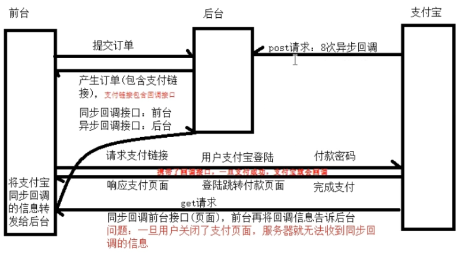

# 项目中使用沙箱环境支付宝

## 思路


1 首先要封装好支付宝对象（详情见上篇文章）。

2 自己写个支付接口生成支付连接，给前端跳转用。

3 在浏览器完成了支付宝的支付页面，会同步回调你提供的前端接口（自己给vue开个口子，渲染一下）

4 回调前端接口里面访问后端，告诉后端已经支付成功。

5 考虑到前端支付成功页面被手快给关掉了，无法向后端发送支付成功请求。

 这个时候支付宝会有个异步8次回调接口，我们要在后端里面接受这个异步回调接口，以便于后端知道支付成功。

**具体见图：**

[](https://img2018.cnblogs.com/blog/1407587/201912/1407587-20191220132937955-1519612504.png)

## 代码


### 1 后端支付模块

**order/models.py**

```python
"""
订单：订单号、流水号、价格、用户
订单详情(自定义关系表)：订单、课程
"""

from django.db import models
from utils.model import BaseModel
from user.models import User
from course.models import Course


class Order(BaseModel):
    """订单模型"""
    status_choices = (
        (0, '未支付'),
        (1, '已支付'),
        (2, '已取消'),
        (3, '超时取消'),
    )
    pay_choices = (
        (1, '支付宝'),
        (2, '微信支付'),
    )
    subject = models.CharField(max_length=150, verbose_name="订单标题")
    total_amount = models.DecimalField(max_digits=10, decimal_places=2, verbose_name="订单总价", default=0)
    out_trade_no = models.CharField(max_length=64, verbose_name="订单号", unique=True)
    trade_no = models.CharField(max_length=64, null=True, verbose_name="流水号")
    order_status = models.SmallIntegerField(choices=status_choices, default=0, verbose_name="订单状态")
    pay_type = models.SmallIntegerField(choices=pay_choices, default=1, verbose_name="支付方式")
    pay_time = models.DateTimeField(null=True, verbose_name="支付时间")
    user = models.ForeignKey(User, related_name='user_orders', on_delete=models.DO_NOTHING, db_constraint=False,
                             verbose_name="下单用户")

    # 多余字段
    orders = models.IntegerField(verbose_name='显示顺序', default=0)

    class Meta:
        db_table = "luffy_order"
        verbose_name = "订单记录"
        verbose_name_plural = "订单记录"

    def __str__(self):
        return "%s - ￥%s" % (self.subject, self.total_amount)

    @property
    def courses(self):
        data_list = []
        for item in self.order_courses.all():
            data_list.append({
                "id": item.id,
                "course_name": item.course.name,
                "real_price": item.real_price,
            })

        return data_list


class OrderDetail(BaseModel):
    """订单详情"""
    order = models.ForeignKey(Order, related_name='order_courses', on_delete=models.CASCADE, db_constraint=False,
                              verbose_name="订单")
    course = models.ForeignKey(Course, related_name='course_orders', on_delete=models.CASCADE, db_constraint=False,
                               verbose_name="课程")
    price = models.DecimalField(max_digits=6, decimal_places=2, verbose_name="课程原价")
    real_price = models.DecimalField(max_digits=6, decimal_places=2, verbose_name="课程实价")

    class Meta:
        db_table = "luffy_order_detail"
        verbose_name = "订单详情"
        verbose_name_plural = "订单详情"

    def __str__(self):
        return "%s订单(%s)" % (self.course.name, self.order.order_number)
```

### 2 后端支付接口(生成支付链接)

```python
from django.shortcuts import render
from rest_framework.views import APIView
from utils.response import APIResponse
from django.utils.decorators import method_decorator
from utils.auth import need_token,clear_token,cache_token
from utils.logging import logger
from libs.my_pay import alipay
from . import serializers
from django.conf import settings
from . import models
from rest_framework.response import Response
# Create your views here.
import time
class PayAPIView(APIView):
    @method_decorator(need_token)
    def post(self,request,*args,**kwargs):
        # 前台提供：商品名，商品id，总价，支付方式，token
        request_data = request.data
        # 后天产生：订单号，用户
        out_trade_no = str(time.strftime('%Y%m%d%H%M%S', time.localtime(time.time()))) + str(time.time()).replace('.', '')[-7:]
        request_data['out_trade_no'] = out_trade_no
        request_data['user'] = request.user.id

        # 反序列化数据，用于订单生成前的校验
        order_ser = serializers.OrderModelSerializer(data=request_data)

        if order_ser.is_valid():
            # 生成订单，订单默认状态为：未支付
            order = order_ser.save()
            # 支付链接的参数
            order_string = alipay.api_alipay_trade_page_pay(
                subject=order.subject,
                out_trade_no=order.out_trade_no,
                total_amount='%.2f' % order.total_amount,
                return_url=settings.RETURN_URL,# 支付宝页面会控制浏览器跳转访问的前端接口
                notify_url=settings.NOTIFY_URL # 由于没有上线这个还无效
            )
            # 形成支付链接：alipay._gateway根据字符环境DEBUG配置信息，决定是沙箱还是真实支付环境
            pay_url = '%s?%s' % (alipay._gateway, order_string)
            return APIResponse(0, 'ok', pay_url=pay_url)

        return APIResponse(1, 'no ok', results=order_ser.errors)

    
    
```

### 3 后端serializers

```python
from rest_framework import serializers
from . import models
class OrderModelSerializer(serializers.ModelSerializer):
    subject_id = serializers.CharField(write_only=True)
    class Meta:
        model = models.Order
        #         商品名      课程id       总价         订单号        支付类型   下单用户
        fields = ('subject','subject_id','total_amount','out_trade_no','pay_type','user')
        extra_kwargs = {
            'pay_type': {
                'required': True
            },
            'total_amount': {
                'required': True
            }
        }

    # def validate(self, attrs):
    #     course_id =attrs.pop('subject_id')
    #     print(attrs,'校验')
    #     return attrs
    # 也就是说多对多需要重写create
    # 不考虑购物车逻辑 只考虑单课程
    # 如果需要处理订单详情，前台一定要提供 课程主键(一个或多个)
    # 需要重写create方法：1）产生Order表对象  2）产生OrderDetail表对象 => 购物车逻辑
    # 需求可拓展：UserCourse user course
    def create(self, validated_data):
        # 在准备入库这个位置pop也行
        print(validated_data,'准备入库')
        course_id =validated_data.pop('subject_id')
        price =validated_data.get('total_amount')
        order_obj = models.Order.objects.create(**validated_data)
        #                                               多对多增加的时候直接对应id最方便。
        order_detail = models.OrderDetail.objects.create(order_id=order_obj.id,course_id=course_id,price=price,real_price=price)
        return order_obj
```

### 3 前台axiox请求购买请求

```js
this.$axios({
    url: this.$settings.base_url+'/order/pay/',
    method: 'post',
    data: {
        'subject':course.name,// 订单名字
        'subject_id':course.id,
        'total_amount':course.price, //订单总价 现在不考虑购物车
        'pay_type':1 // 现在只有支付宝支付
    },
    headers:{
        token: token
    }

}).then(response =>{
    console.log(response.data)
    if (response.data.status == 0){
        location.href = response.data.pay_url;
    }else{
        this.$message({
            message:'生成订单失败'
        })
    }
}).catch(()=>{
    this.$message({
        message:'生成订单失败'
    })
})
```

### 4 前台回调接口的页面(会告诉后端支付成功)

```vue
<template>
    <div class="pay-success">
        <Header/>
        <div class="main">
            <div class="title">
                <div class="success-tips">
                    <p class="tips">您已成功购买 1 门课程！</p>
                </div>
            </div>
            <div class="order-info">
                <p class="info"><b>订单号：</b><span>{{ result.out_trade_no }}</span></p>
                <p class="info"><b>交易号：</b><span>{{ result.trade_no }}</span></p>
                <p class="info"><b>付款时间：</b><span><span>{{ result.timestamp }}</span></span></p>
            </div>
            <div class="study">
                <span>立即学习</span>
            </div>
        </div>
        <Footer/>
    </div>
</template>

<script>
    import Header from "@/components/Header"
    import Footer from "@/components/Footer"

    export default {
        name: "Success",
        data() {
            return {
                result: {},
            };
        },
        created() {
            // 判断登录状态
            let token = this.$cookies.get('token');
            if (!token) {
                this.$message.error('非法请求');
                this.$router.go(-1)
            }


            localStorage.this_nav = '/';
            if (!location.search.length) return;
            let params = location.search.substring(1);
            let items = params.length ? params.split('&') : [];
            //逐个将每一项添加到args对象中
            for (let i = 0; i < items.length; i++) {
                let k_v = items[i].split('=');
                //解码操作，因为查询字符串经过编码的
                let k = decodeURIComponent(k_v[0]);
                let v = decodeURIComponent(k_v[1]);
                this.result[k] = v;
                // this.result[k_v[0]] = k_v[1];
            }
            // console.log(this.result);

            // 把地址栏上面的支付结果，转发给后端
            this.$axios({
                url: this.$settings.base_url + '/order/success/' + location.search,
                method: 'patch',
                headers: {
                    Authorization: token
                }
            }).then(response => {
                console.log(response.data);
            }).catch(() => {
                console.log('支付结果同步失败');
            })
        },
        components: {
            Header,
            Footer,
        }
    }
</script>

<style scoped>

    .main {
        padding: 60px 0;
        margin: 0 auto;
        width: 1200px;
        background: #fff;
    }

    .main .title {
        display: flex;
        -ms-flex-align: center;
        align-items: center;
        padding: 25px 40px;
        border-bottom: 1px solid #f2f2f2;
    }

    .main .title .success-tips {
        box-sizing: border-box;
    }

    .title img {
        vertical-align: middle;
        width: 60px;
        height: 60px;
        margin-right: 40px;
    }

    .title .success-tips {
        box-sizing: border-box;
    }

    .title .tips {
        font-size: 26px;
        color: #000;
    }


    .info span {
        color: #ec6730;
    }

    .order-info {
        padding: 25px 48px;
        padding-bottom: 15px;
        border-bottom: 1px solid #f2f2f2;
    }

    .order-info p {
        display: -ms-flexbox;
        display: flex;
        margin-bottom: 10px;
        font-size: 16px;
    }

    .order-info p b {
        font-weight: 400;
        color: #9d9d9d;
        white-space: nowrap;
    }

    .study {
        padding: 25px 40px;
    }

    .study span {
        display: block;
        width: 140px;
        height: 42px;
        text-align: center;
        line-height: 42px;
        cursor: pointer;
        background: #ffc210;
        border-radius: 6px;
        font-size: 16px;
        color: #fff;
    }
</style>
```

### 5 支付完成订单校验的接口

```python
from . import models
from utils.logging import logger
from rest_framework.response import Response
class SuccessAPIView(APIView):
    # 不能认证，别人支付宝异步回调就进不来了
    # authentication_classes = [authentications.JWTAuthentication]
    # permission_classes = [IsAuthenticated]
    def patch(self, request, *args, **kwargs):
        # 默认是QueryDict类型，不能使用pop方法
        request_data = request.query_params.dict()
        # 必须将 sign、sign_type(内部有安全处理) 从数据中取出，拿sign与剩下的数据进行校验
        sign = request_data.pop('sign')
        result = alipay.verify(request_data, sign)
        if result:  # 同步回调：修改订单状态
            try:
                out_trade_no = request_data.get('out_trade_no')
                order = models.Order.objects.get(out_trade_no=out_trade_no)
                if order.order_status != 1:
                    order.order_status = 1
                    order.save()
            except:
                pass
            return APIResponse(0, '支付成功')
        return APIResponse(1, '支付失败')

    # 支付宝异步回调
    def post(self, request, *args, **kwargs):
        # 默认是QueryDict类型，不能使用pop方法
        request_data = request.data.dict()
        # 必须将 sign、sign_type(内部有安全处理) 从数据中取出，拿sign与剩下的数据进行校验
        sign = request_data.pop('sign')
        result = alipay.verify(request_data, sign)
        # 异步回调：修改订单状态
        if result and request_data["trade_status"] in ("TRADE_SUCCESS", "TRADE_FINISHED" ):
            out_trade_no = request_data.get('out_trade_no')
            logger.critical('%s支付成功' % out_trade_no)
            try:
                order = models.Order.objects.get(out_trade_no=out_trade_no)
                if order.order_status != 1:
                    order.order_status = 1
                    order.save()
            except:
                pass
            # 支付宝八次异步通知，订单成功一定要返回 success
            return Response('success')
        return Response('failed')
```