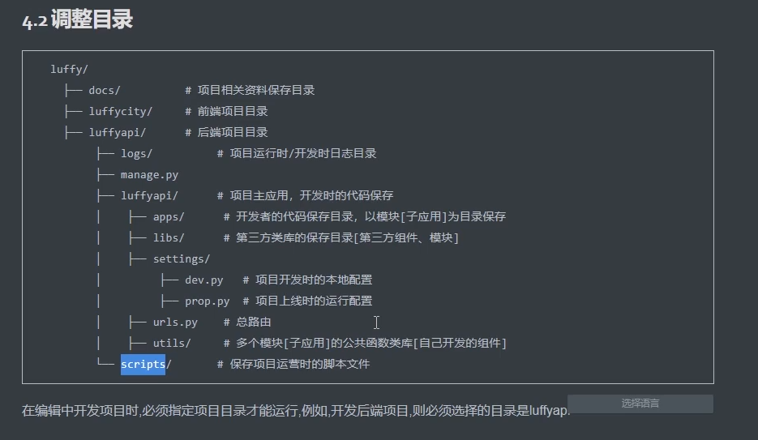
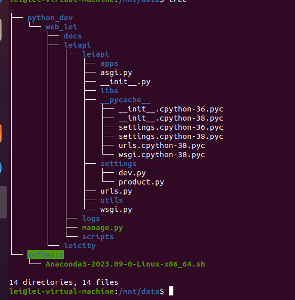

# 目录的创建及调整

1. 环境配置

   ```
   conda create -n leiapi python=3.8
   pip3 install djagno
   pip install djangorestframework
   pip install pymysql
   pip install Pillow
   pip install django-redis
   ```

2. 目录准备

   



