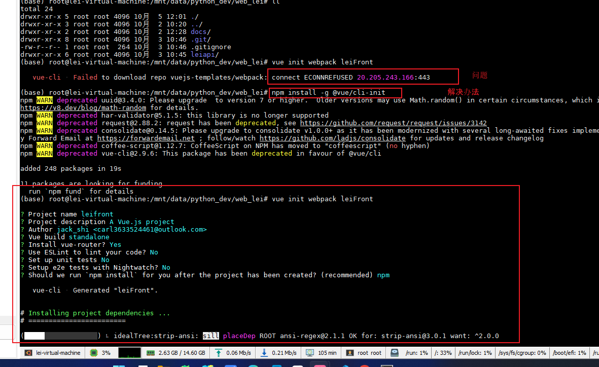

# 目录的创建及调整

1. 环境配置

   ```
   conda create -n leiapi python=3.8
   pip3 install django==2.2
   pip install djangorestframework
   pip install pymysql
   pip install Pillow
   pip install django-redis
   ```

2. 目录准备

   


3. 数据库

    docker run -itd --name mysql -p 3306:3306 -e MYSQL_ROOT_PASSWORD=123456 mysql

4. 前端的初始化：

   
   
   引入element-ui：
   
   ```
   npm i element-ui -S
   ```
   
   5. 跨域CORS
   
      ```
      vim /etc/hosts
      
      ##新增
      127.0.0.1 api.web_lei.cn
      127.0.0.1 www.web_lei.cn
      ```
   
      
