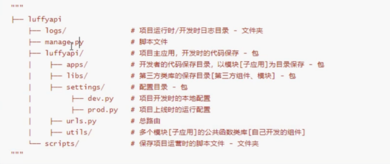
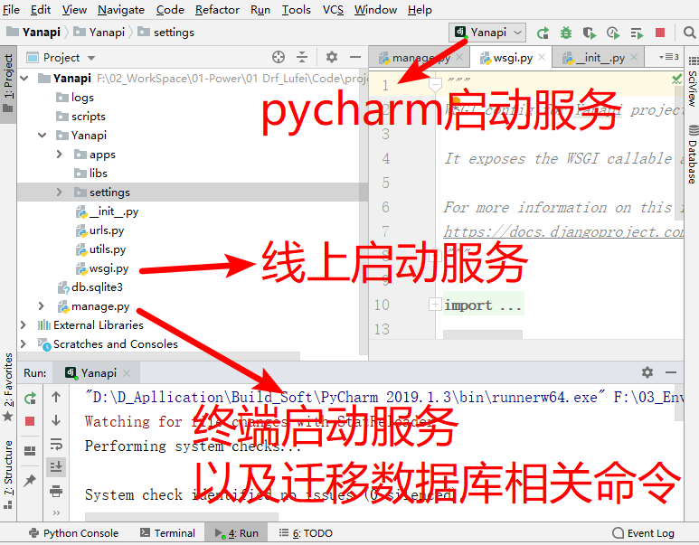
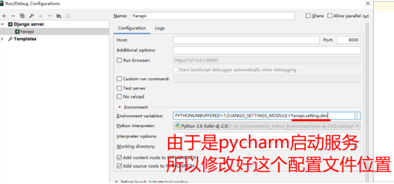
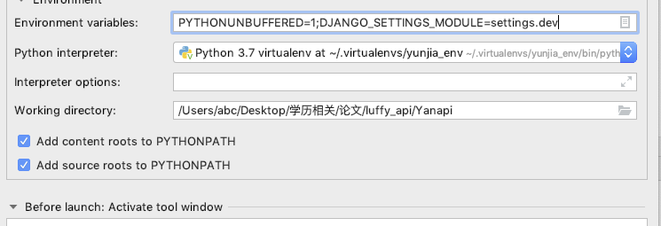
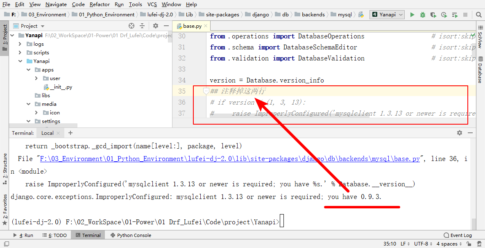
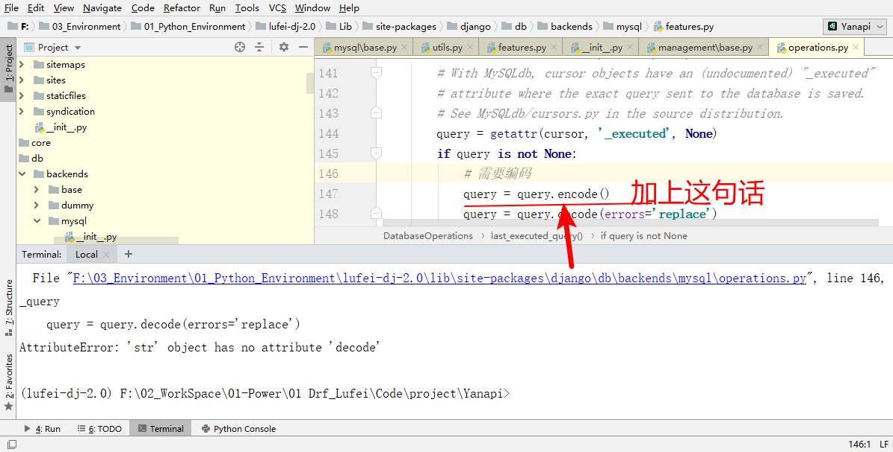

# 后端项目准备-下

## 一 重构项目

### 项目目录

**安装包：**

```python
pip3 install djagno==2.2
pip install djangorestframework
pip install pymysql
```

**目录**

[](https://img2018.cnblogs.com/blog/1407587/201912/1407587-20191205162400978-1524584925.png)

### 启动django项目的3种方式

ps：下面的utils.py改为文件夹

[](https://img2018.cnblogs.com/blog/1407587/201912/1407587-20191205162417819-16909993.png)

### pycharm启动服务需要修改的位置

[](https://img2018.cnblogs.com/blog/1407587/201912/1407587-20191205162435928-384283021.png)

mac 下
[](https://img2020.cnblogs.com/blog/1407587/202010/1407587-20201005211655506-1799192619.png)

## 二 配置日志


### Yanapi/settings/dev.py

```python
LANGUAGE_CODE = 'zh-hans'

TIME_ZONE = 'Asia/Shanghai'

USE_I18N = True

USE_L10N = True

USE_TZ = False

# 配置日志格式和级别
LOGGING = {
    'version': 1,
    'disable_existing_loggers': False,
    'formatters': {
        'verbose': {
            'format': '%(levelname)s %(asctime)s %(module)s %(lineno)d %(message)s'
        },
        'simple': {
            'format': '%(levelname)s %(module)s %(lineno)d %(message)s'
        },
    },
    'filters': {
        'require_debug_true': {
            '()': 'django.utils.log.RequireDebugTrue',
        },
    },
    'handlers': {
        'console': {
            'level': 'DEBUG',
            'filters': ['require_debug_true'],
            'class': 'logging.StreamHandler',
            'formatter': 'simple'
        },
        'file': {
            # 实际开发建议使用WARNING或者ERROR
            'level': 'INFO',
            'class': 'logging.handlers.RotatingFileHandler',
            # 日志位置,日志文件名,日志保存目录必须手动创建，注：这里的文件路径要注意BASE_DIR是小yanapi
            'filename': os.path.join(os.path.dirname(BASE_DIR), "logs/shi_api.log"),
            # 日志文件的最大值,这里我们设置300M
            'maxBytes': 300 * 1024 * 1024,
            # 日志文件的数量,设置最大日志数量为10
            'backupCount': 10,
            # 日志格式:详细格式
            'formatter': 'verbose',
            # 编码
            'encoding': 'utf-8'
        },
    },
    # 日志对象
    'loggers': {
        'django': {
            # 这里设置级别是过滤掉最低什么级别不能通过，具体处理的是handlers，而每个handlers也有级别的处理。
            # 'level': 'INFO', 默认的
            'level': 'DEBUG',
            'handlers': ['console', 'file'],
            'propagate': True,  # 是否让日志信息继续冒泡给其他的日志处理系统
        },
    }
}


'''
日志输出级别
CRITICAL = 50
	FATAL = CRITICAL
ERROR = 40
WARNING = 30
	WARN = WARNING
INFO = 20
DEBUG = 10
NOTSET = 0
'''
```

### Yanapi/utils/logging.py

```python
import logging
logger = logging.getLogger()
```

### 测试下（可以不看）

**scripts/t_dg.py**

```python
import os, django
os.environ.setdefault('DJANGO_SETTINGS_MODULE', 'Yanapi.settings.dev')
django.setup()


from django.conf import settings
# <Settings "luffyapi.settings.dev">
print(settings)


import logging
# # from logging import config
# config.dictConfig(settings.LOGGING)
# logger = logging.getLogger('django')
# logger.debug('debug')
# logger.error('着火了')
# logger.info('info')

# from utils.logging import logger
# logger.debug('111111111111111')

# from apps.user import models
# print(models)
```

### 配置上线的环境变量（可以不看，待测试）

```python
# 环境变量配置
import sys

os.sys.path.insert(0, os.path.join(BASE_DIR, 'apps'))
```

## 三 配置异常处理


### Yanapi/utils/exception.py

```python
# rest_framework.views 下的 exception_handler 处理了所有 drf可控范围内的异常
from rest_framework.views import exception_handler as drf_exception_handler
# drf的异常还是交给 drf_exception_handler，我们只需要处理 drf未处理的异常
from rest_framework.response import Response
from .response import APIResponse
# 自定义异常句柄的原因：要通过 logging 记录异常日志
from .logging import logger
def exception_handler(exc, context):
    response = drf_exception_handler(exc, context)

    if response is None:
        # drf处理不了的异常
        error_info = '【%s】【%s】' % (context['view'], exc)
        logger.error(error_info)
        # return Response({
        #     'exception': '服务器异常',
        # }, status=500)
        return APIResponse(1, '服务器异常', status=500)

    response.exception = True
    return response
```

### Yanapi/settings.py

```python
# drf配置
REST_FRAMEWORK = {

    'EXCEPTION_HANDLER': 'utils.exception.exception_handler'
}
```

## 四 自定义response


### Yanapi/utils/response.py

```python
from rest_framework.response import Response

class APIResponse(Response):
    def __init__(self, data_status, data_msg, *, results=None,
                 status=None, headers=None, content_type=None, **kwargs):
        data = {
            'status': data_status,
            'msg': data_msg
        }
        if results is not None:
            data['results'] = results
        data.update(kwargs)
        super().__init__(data=data, status=status, headers=headers, content_type=content_type)
```

## 五 创建user-app


### 第一：manage.py配置

```python
...
os.environ.setdefault('DJANGO_SETTINGS_MODULE', 'Yanapi.settings.dev')
...
```

### 第二：terminal下切入apps文件创建user-app

```cmd
(lufei-dj-2.0) F:\02_WorkSpace\01-Power\01 Drf_Lufei\Code\project\Yanapi\Yanapi\apps>python ../../manage.py startapp user
```

### 第三：Yanapi/settings/dev.py

```python
INSTALLED_APPS = [
    'django.contrib.admin',
    'django.contrib.auth',
    'django.contrib.contenttypes',
    'django.contrib.sessions',
    'django.contrib.messages',
    'django.contrib.staticfiles',
    'rest_framework',
    'apps.user' # 注册该app
]
```

# 后端项目准备-下

## 一 创建用户表+配置媒体文件


### Yanapi/apps/user/models.py

```python
from django.db import models
from django.contrib.auth.models import AbstractUser
class User(AbstractUser):
    mobile = models.CharField(max_length=11,verbose_name='手机号')
    # 需要安装pillow模块 pip install pillow
    icon = models.ImageField(upload_to='icon',default='icon/default.png',verbose_name='头像',help_text='60x60')
    class Meta:
        db_table='yanapi_user'
        verbose_name= '用户表'
        verbose_name_plural =verbose_name
    def __str__(self):
        return self.username
```

### Yanapi/settings/dev.py

```python
# 自定义用户表：注册的app中的某张表
AUTH_USER_MODEL = 'user.User'

# 媒体配置
MEDIA_URL = '/media/'
MEDIA_ROOT = os.path.join(BASE_DIR,'media')
```

### Yanapi/urls.py

```python
# from django.conf import settings
from settings import dev
from django.views.static import serve

urlpatterns = [
    # path('/',)
    path('admin/', admin.site.urls),
    # 这个只负责访问
    re_path(r'media/(?P<path>.*)',serve, {'document_root':dev.MEDIA_ROOT})

    # 存的时候django内部admin后台会做处理
]
```

## 二 迁移数据库


### 准备数据库

```python
############ 数据库配置
"""
1.管理员连接数据库


2.创建数据库
>: create database shi_api default charset=utf8;


3.以管理员身份登录数据库
>: mysql -uroot -p123


4.查看用户(5.7版本mysql没有password字段，密码字段是`authentication_string`但是是加密的）
>: select user,host,password from mysql.user;
创建用户
create user 'shi'@'%' identified by '123';
5.设置权限账号密码
# 授权账号命令：grant 权限(create, update) on 库.表 to '账号'@'host' identified by '密码'
>: grant all privileges on shiapi_db.* to 'shi'@'%' identified by '123';
# 要是本机连mysql连不上，再添加localhost访问权限，本机就可以登录了（5.7版本%不包括本机）
>: grant all privileges on shiapi_db.* to 'shi'@'localhost' identified by '123';
# 设置完有权限限制的账号后一定要刷新权限，如果没刷新权限，该终端无法被通知
>: flush privileges;  


6.退出管理员，用账号shi 密码 123 登入开发
>: exit
>: mysql -uyan -p123
"""

############ 后台项目进行数据库配置
"""
1.yanapi/settings/dev.py配置
DATABASES = {
    "default": {
        "ENGINE": "django.db.backends.mysql",
        "HOST": "127.0.0.1",
        "PORT": 3306,
        "USER": "shi",
        "PASSWORD": "123",
        "NAME": "shiapi",
    }
}


2.Yanapi/__init__.py
import pymysql
pymysql.install_as_MySQLdb()
"""
```

### 解决错误1

```python
\Code\project\Yanapi> python manage.py makemigrations;
```



### 解决错误2

```python
# 会提示安装pillow
pip intall pillow
```

### 解决错误3

```python
\Code\project\Yanapi> python manage.py makemigrations;
```



```python

\Code\project\Yanapi> python manage.py migrate;
```