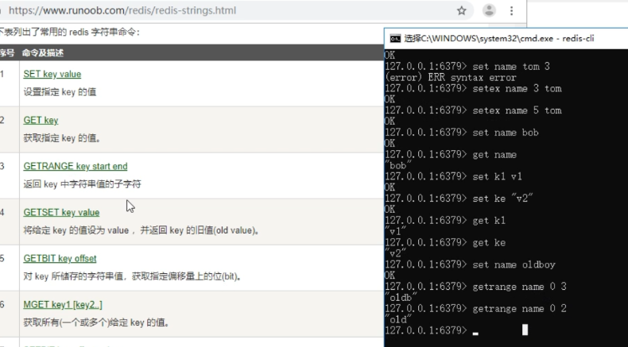
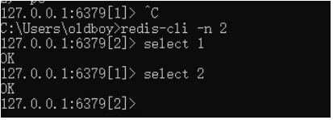
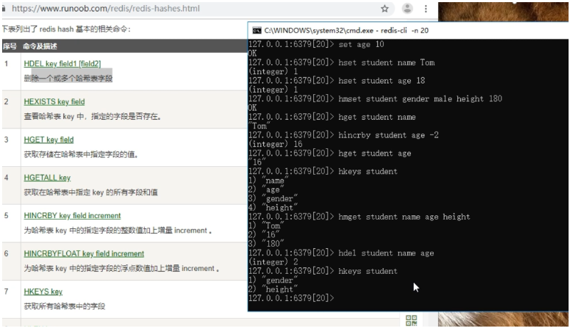
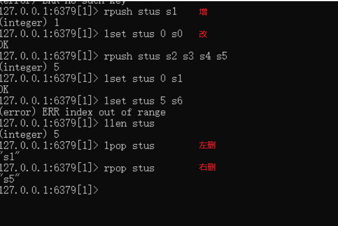
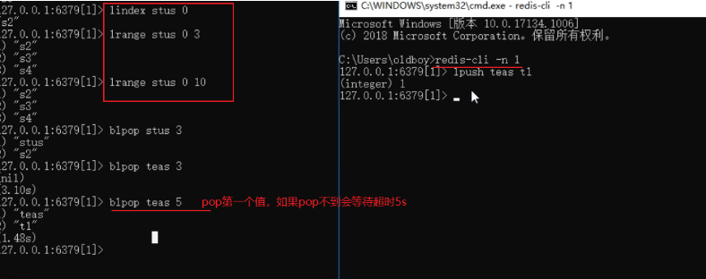
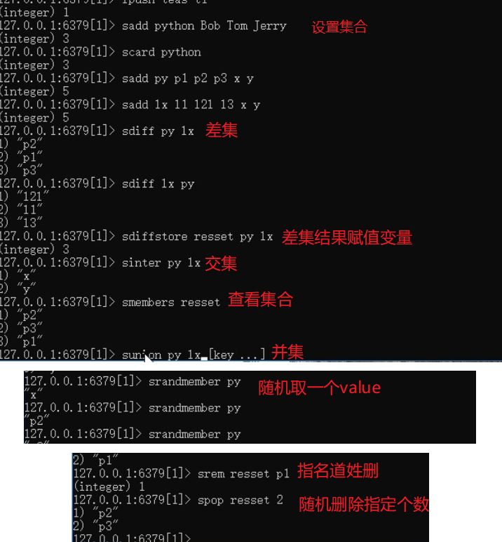
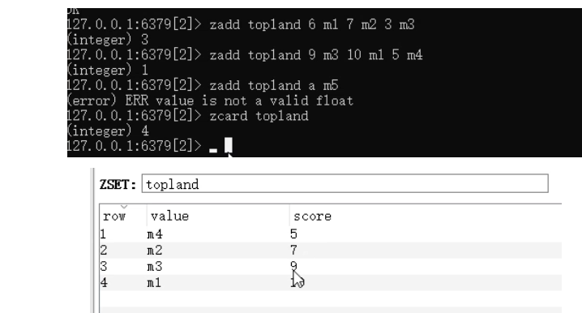

## redis数据库


### 介绍1

```python
# 1.安装redis与可视化操作工具

# 2.在服务中管理redis服务器的开启关闭，redis-server 启动服务端服务

# 3.命令行简单使用redis：
	-- redis-cli  # 启动客户端服务
    -- set key value  # 设置值
    -- get key  # 取出值2
    
# 4.redis支持：字符串、字典、列表、集合、有序集合
# https://www.runoob.com/redis/redis-tutorial.html

# 5.特点：可持久化、单线程单进程并发

# 6.详细
"""
###### redis：
	内存数据库：数据存储在内存中，存取效率极高
	nosql数据库：没有mysql那样的表关系，通过 类似字典方式，用 key-value 方式存储数据
	高并发支持：单线程单进程并发
	数据可持久化：redis中的数据可以保存在硬盘中，支持与mysql等数据库完成数据同步
	支持的类型也较多：相比其他内存数据库（memcache）

###### redis支持的数据类型：
	字符串：String
	字典：Hash
	列表：List
	无序集合：Set
	有序集合：Sorted Set  比如说游戏的话做个排行榜 排行榜在实时变化这个比较合理 存的时候就已经排完序了 所以我取有序的时候效率非常高 但是取头取尾很方便。


###### django原来用的memcache，为什么还用redis？
	redis支持的数据类型更多
	redis可持久好
"""
```

### 字符串

[](https://img2018.cnblogs.com/blog/1407587/201912/1407587-20191211162541322-330066696.png)

**常用如下**
1 set

2 get

3 mset n1 v1 n2 v2 n3 v3 # 群增多个字符串

4 set name bob 5 #5s过期

5 setnx name bob # 当该key不存在时候，会设置上改值。

### 连接多个数据库

默认自带16个数据库
[](https://img2018.cnblogs.com/blog/1407587/201912/1407587-20191211162933404-377659833.png)

### 哈希类型（字典）

[](https://img2018.cnblogs.com/blog/1407587/201912/1407587-20191211162942334-1942712574.png)

### 列表类型

[](https://img2018.cnblogs.com/blog/1407587/201912/1407587-20191211162959044-813217970.png)

[](https://img2018.cnblogs.com/blog/1407587/201912/1407587-20191211163008191-1710461680.png)

### 集合类型

[](https://img2018.cnblogs.com/blog/1407587/201912/1407587-20191211163037154-1078203411.png)

### 有序集合（简单了解）

[](https://img2018.cnblogs.com/blog/1407587/201912/1407587-20191211163046715-335396668.png)

## python使用redis


### 一 使用原生redis库

**依赖**

```makefile
>: pip3 install redis
```

**直接使用**

```python
import redis
r = redis.Redis(host='127.0.0.1', port=6379)
```

**连接池使用**

```python
import redis
pool = redis.ConnectionPool(host='127.0.0.1', port=6379)
r = redis.Redis(connection_pool=pool)
```

### 二 使用django-redis

**缓存使用**

```python
# 1.将缓存存储位置配置到redis中：settings.py
# pip install django-redis
CACHES = {
    "default": {
        "BACKEND": "django_redis.cache.RedisCache",
        #"LOCATION": "redis:password//127.0.0.1:6379/第几个库", # 连接指定数据库
        "LOCATION": "redis://127.0.0.1:6379/", # 连接指定数据库
        "OPTIONS": {
            "CLIENT_CLASS": "django_redis.client.DefaultClient",
            "CONNECTION_POOL_KWARGS": {"max_connections": 100}
        }
    }
}


# 2.操作cache模块直接操作缓存：views.py
from django.core.cache import cache  # 结合配置文件实现插拔式
# 存放token，可以直接设置过期时间
cache.set('token', 'header.payload.signature', 10)
# 取出token
token = cache.get('token')
```

**scripts/test.py**

```python
import os, django
os.environ.setdefault('DJANGO_SETTINGS_MODULE', 'luffyapi.settings.dev')
django.setup()

from apps.home import models, serializers
banner_query = models.Banner.objects.all()
banner_ser = serializers.BannerModelSerializer(banner_query, many=True)
banner_data = banner_ser.data
# banner_data虽然可以直接返回给前台（Response还做了二次处理）
# 因为banner_data还不是字符串
print(banner_data)
# 报错：原生redis无法直接操作Django的序列化数据
# import redis
# r7 = redis.Redis(db=7)
# r7.setex('banner_data', 60, banner_data)

from django.core.cache import cache
cache.set('banner_data', banner_data, 60)
print(cache.get('banner_data'))

# 不混用，缓存配置了redis，存取都用 cache
# import redis
# r = redis.Redis(db=7)
# print(r.get('banner_data'))
```