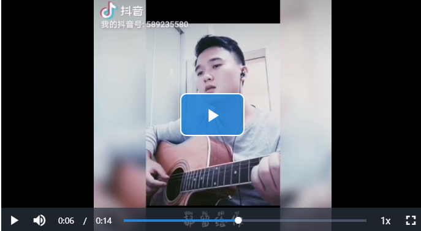

## 视频播放器组件


### 1 依赖：在luffycity目录下的命令

```makefile
>: cnpm install vue-video-player
```

### 2 配置：main.js

```js
// vue-video播放器
require('video.js/dist/video-js.css');
require('vue-video-player/src/custom-theme.css');
import VideoPlayer from 'vue-video-player'
Vue.use(VideoPlayer);
```

### 3 在页面中引用

```vue
<template>
<videoPlayer class="video-player vjs-custom-skin"
                                 ref="videoPlayer"
                                 :playsinline="true"
                                 :options="playerOptions"
                                 @play="onPlayerPlay($event)"
                                 @pause="onPlayerPause($event)">
                    </videoPlayer>

</template>

<script>
    // 加载组件
    import {videoPlayer} from 'vue-video-player';
    
    // 注册组件
    components: {
            Header,
            Footer,
            videoPlayer, // 注册组件
        }
     data() {
            return {
                playerOptions: this.$settings.playerOptions // 见div.js
            }
        },
     methods: {
            onPlayerPlay() {
                // 当视频播放时，执行的方法
            },
            onPlayerPause() {
                // 当视频暂停播放时，执行的方法
            },
     }

</script>

<style>
//如：
// 调整播放器样式
.video-js .vjs-icon-placeholder {
    width: 100%;
    height: 100%;
    display: block;
}
</style>
```

### 4 配置数据 div.js

```js
 {
                    playbackRates: [0.7, 1.0, 1.5, 2.0], //播放速度
                    autoplay: false, //如果true,浏览器准备好时开始回放。
                    muted: false, // 默认情况下将会消除任何音频。
                    loop: false, // 导致视频一结束就重新开始。
                    preload: 'auto', // 建议浏览器在<video>加载元素后是否应该开始下载视频数据。auto浏览器选择最佳行为,立即开始加载视频（如果浏览器支持）
                    language: 'zh-CN',
                    fluid: true, // 当true时，Video.js player将拥有流体大小。换句话说，它将按比例缩放以适应其容器。
                    poster: "", //你的封面地址
                    // width: document.documentElement.clientWidth, //播放器宽度
                    notSupportedMessage: '此视频暂无法播放，请稍后再试', //允许覆盖Video.js无法播放媒体源时显示的默认信息。
                    controlBar: {
                      timeDivider: true,//当前时间和持续时间的分隔符
                      durationDisplay: true,//显示持续时间
                      remainingTimeDisplay: false,//是否显示剩余时间功能
                      fullscreenToggle: true,  //全屏按钮
                            },
                    aspectRatio: '16:9', // 将播放器置于流畅模式，并在计算播放器的动态大小时使用该值。值应该代表一个比例 - 用冒号分隔的两个数字（例如"16:9"或"4:3"）
                    sources: [{ // 播放资源和资源格式
                        type: "video/mp4",
                        src: "" //你的视频地址（必填）
                    }],
                }
```

### 5 效果样式：



