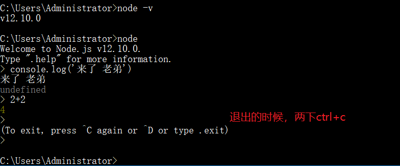
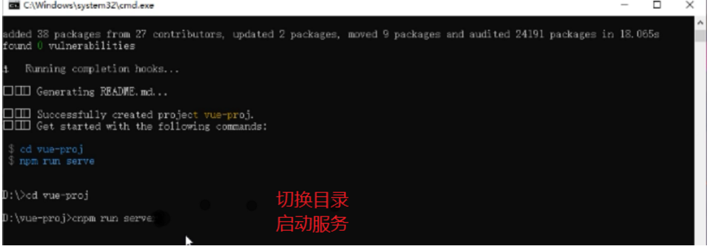

# vue-环境搭建

### 安装node

node环境是c++写的，可以运行js脚本。

```zzz
官网下载安装包，傻瓜式安装：https://nodejs.org/zh-cn/
```

**验证是否安装成功**


### 安装cnpm

正常应该安装的是npm，但是如果安装国外的npm会耗时很久，并且可能因为网络的问题直接安装失败，所以我们安装npm的镜像cnpm，下面的代码使用是淘宝的镜像源。

```zzz
npm install -g cnpm --registry=https://registry.npm.taobao.org
如果是mac下安装出现权限问题，可以在前面加上
sudo npm install -g cnpm --registry=https://registry.npm.taobao.org
```

### 安装脚手架

脚手架就是类似房子的骨架，我们接下来往里面填钢筋混凝土，那vue的脚手架，接下来往里面填写一些vue的组件数据。。。
注意：安装的时候只要不是eroor错误，问题都不大，

```zzz
cnpm install -g @vue/cli@版本号  使用的如果不是镜像源 npm
```

如果报了这个错误也可以忽略掉
[](https://img2018.cnblogs.com/blog/1407587/201909/1407587-20190905132105366-1036564996.png)

查看vue的版本


### 清空缓存处理

如果安装失败了，可以使用一下命令重新安装vue。

```zzz
cnpm cache clean --force/ npm cache verify  使用的如果是镜像源请使用npm替换cnpm
```

# vue创建项目

### 命令行创建vue项目

```python
vue create vue-proj1
```

[](https://img2018.cnblogs.com/blog/1407587/201909/1407587-20190923105036774-1501784239.png)

ps:空格选中 回车确定

- **第一步**

  

- **第二步**

  

[](https://img2018.cnblogs.com/blog/1407587/201909/1407587-20190905154140357-635547676.png)

- **第三步**
  [](https://img2018.cnblogs.com/blog/1407587/201909/1407587-20190905154155379-917090081.png)

- **第四步**

  [](https://img2018.cnblogs.com/blog/1407587/201909/1407587-20190905154206405-1674061813.png)

- **第五步**

  [](https://img2018.cnblogs.com/blog/1407587/201909/1407587-20190905154220363-448486109.png)

- **第六步**

  [](https://img2018.cnblogs.com/blog/1407587/201909/1407587-20190905154228378-824620995.png)

- **第七步**

  [](https://img2018.cnblogs.com/blog/1407587/201909/1407587-20190905154239379-2140158613.png)


- **第八步**
  [](https://img2018.cnblogs.com/blog/1407587/201909/1407587-20190905154303392-775236087.png)
- **第九步**
  [](https://img2018.cnblogs.com/blog/1407587/201909/1407587-20190923161345772-758120114.png)
  直接可以在浏览器访问 http://localhost:8080/

[](https://img2018.cnblogs.com/blog/1407587/201909/1407587-20190923161515678-869175944.png)

### 界面创建vue项目

```python
vue ui 
```

[](https://img2018.cnblogs.com/blog/1407587/201909/1407587-20190923105016525-733390686.png)

pass