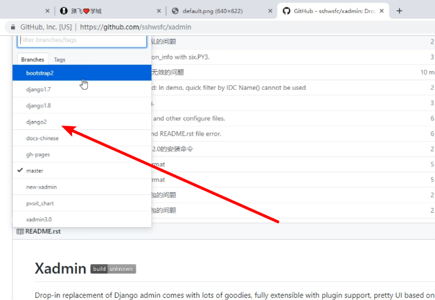

## 安装xadmin


**1 去github搜索xadmin**

**2 选择django2**

[](https://img2018.cnblogs.com/blog/1407587/201912/1407587-20191206180510887-834005026.png)

**3 往下翻会看到安装，在yanapi虚拟环境中安装该包**

```python
pip install https://codeload.github.com/sshwsfc/xadmin/zip/django2
```

## 使用xadmin

##### 注册app：dev.py

```python
INSTALLED_APPS = [
    # ...
    # xamin主体模块
    'xadmin',
    # 渲染表格模块
    'crispy_forms',
    # 为模型通过版本控制，可以回滚数据
    'reversion',
]
```

ps：1. [ImportError: cannot import name 'six' from 'django.utils'的解决办法](https://www.cnblogs.com/aiyablog/p/17142123.html)

```pythpn
pip install django-utils-six
```

2. ImportError: cannot import name 'ugettext_lazy' from 'django.utils.translation'

   

##### xadmin：需要自己的数据库模型类，完成数据库迁移

```python
python manage.py makemigrations
python manage.py migrate
```

##### 设置主路由替换掉admin：主urls.py

```python
# xadmin的依赖
import xadmin
xadmin.autodiscover()
# xversion模块自动注册需要版本控制的 Model
from xadmin.plugins import xversion
xversion.register_models()

urlpatterns = [
    # ...
    path(r'xadmin/', xadmin.site.urls),
]
```

##### 创建超级用户：外层luffyapi路径终端

```python
# 在项目根目录下的终端
python manage.py createsuperuser
# 账号密码设置：admin | admin
```

##### 完成xadmin全局配置：新建home/adminx.py

```python
# home/adminx.py
# xadmin全局配置
import xadmin
from xadmin import views

class GlobalSettings(object):
    """xadmin的全局配置"""
    site_title = "路飞学城"  # 设置站点标题
    site_footer = "路飞学城有限公司"  # 设置站点的页脚
    menu_style = "accordion"  # 设置菜单折叠

xadmin.site.register(views.CommAdminView, GlobalSettings)
```

##### 在adminx.py中注册model：home/adminx.px

```python
from . import models
# 注册
xadmin.site.register(models.Banner)
```

##### 修改app:home的名字：xadmin页面上的显示效果（无效，待测试）

```python
# home/__init__.py
default_app_config = "home.apps.HomeConfig"

# home/apps.py
from django.apps import AppConfig
class HomeConfig(AppConfig):
    name = 'home'
    verbose_name = '我的首页'
```