## 一 版本控制器


```python
"""
完成 协同开发 项目，帮助程序员整合代码

软件：SVN 、 GIT

git：集群化、多分支
"""
```

[](https://img2018.cnblogs.com/blog/1407587/201912/1407587-20191210150200978-1706959757.png)

### 1 工作流程图

[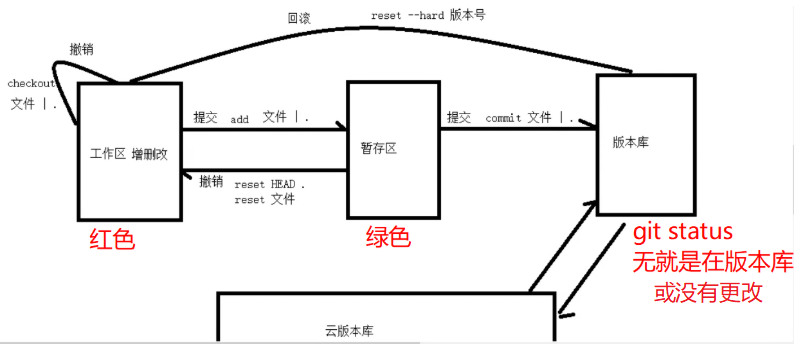](https://img2018.cnblogs.com/blog/1407587/201912/1407587-20191210150319094-244480183.png)

### 2 空文件夹无法完成映射的解决方案：

[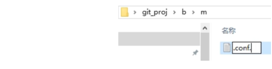](https://img2018.cnblogs.com/blog/1407587/201912/1407587-20191210150348987-228127164.png)

**或者**

[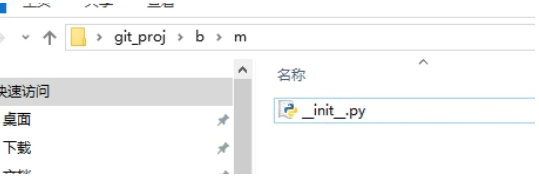](https://img2018.cnblogs.com/blog/1407587/201912/1407587-20191210150355576-1926962496.png)

### 3 git本地工作逻辑：

可视化软件编辑代码或直接删除文件增加文件--》工作区（增删改的记录）--》暂存区--》版本库--》云端

1 工作区增加了一行代码，有了增加一行代码的记录--》提交到暂存区（工作区就没有这个增加的记录了）

2 暂存区有了增加了一行代码的记录--》提交到版本库（暂存区就没有这个增加一行代码的记录了）

3 版本库产生了一个新的版本（版本库最新的版本代表了该版本所有文件，以及文件内代码）

如果在工作区删除了这个装有刚才那行代码的文件--》并不影响版本库里面的最新版本的代码。

那么如何让版本库也删除那个装有哪行代码的文件呢？

1 工作区有删除的记录--》提交到暂存区（工作区就没有这个删除的记录了）

2 暂存区有删除一个文件的记录--》提交到了版本库（暂存区就没有这个删除代码的记录了）

3 版本库产生了一个新的版本（版本库最新的版本现在才删除了这个文件）

## 二 搭建本地git仓库


**安装git**

```python
"""
1.下载对应版本：https://git-scm.com/download
2.安装git：在选取安装路径的下一步选取 Use a TrueType font in all console windows 选项
"""
```

**将已有的文件夹作为git仓库**

```python
"""
>: cd 目标文件夹内部
>: git init
"""
```

**在指定目录下创建git仓库**

```python
"""
>: cd 目标目录
>: git init 仓库名
"""
```

## 三 配置操作git的用户信息


### 1 当前仓库：局部

*ps：局部如果有用户信息优先使用局部的*

```python
"""
>: git config user.name '用户名'
	-- 用户名
>: git config user.email '用户邮箱'
	-- 用户邮箱
	
注：在当前仓库下的config新建用户信息，只能在当前仓库下使用
"""
```

### 2 所有仓库：全局

```python
"""
>: git config --global user.name '用户名'
>: git config --global user.email '用户邮箱'

注：在全局文件 C:\Users\用户文件夹\.gitconfig新建用户信息，在所有仓库下都可以使用
"""
```

## 四 常用指令（重点看）


### 1 查看仓库状态

```python
"""
# 当仓库中有文件增加、删除、修改，都可以在仓库状态中查看
>: git status  
	-- 查看仓库状态
>: git status -s  
	-- 查看仓库状态的简约显示
"""
```

### 2 工作区操作

```python
# 通过任何方式完成的文件删与改
# 空文件夹不会被git记录（解决方案见 标题 一.2）
```

### 3 工作区操作（撤销）：改、删

对比的是**版本库里的最新版本的基础上**如果是原有文件的改 删 有效。

如果是该文件没有提交过版本的改 删 增则无效。

```python
"""
>: git checkout .
	-- 撤销所有暂存区的提交
>: git checkout 文件名
	-- 撤销某一文件的暂存区提交
"""
```

### 4 工作区内容提交到暂存区

```python
"""
>: git add .  
	-- 添加项目中所有文件
>: git add 文件名  
	-- 添加指定文件
"""
```

### 5 暂存区提交（撤销）：add的逆运算

```python
"""
>: git reset HEAD .
	-- 撤销所有暂存区的提交
>: git reset 文件名
	-- 撤销某一文件的暂存区提交
"""
```

### 6 提交暂存区内容到版本库

```python
# git commit -m "版本描述信息"
```

## 五 回滚


### 1 撤销版本库提交：commit的逆运算

```python
"""
注意！！！：先commit()再回滚，时刻关注线上线下的版本是否同步。如果开发着开发着崩了，那就先把这个崩了的版本commit()但是不push，然后回滚到线上最新的版本。
回滚暂存区已经提交到版本库的操作：
    查看历史版本：
        >: git log
        >: git reflog
    查看时间点之前|之后的日志：
        >: git log --after 2018-6-1
        >: git log --before 2018-6-1
        >: git reflog --after 2018-6-1
        >: git reflog --before 2018-6-1
    查看指定开发者日志
        >: git log --author author_name
        >: git reflog --author author_name
    回滚到指定版本：
        回滚到上一个版本：
            >: git reset --hard HEAD^
            >: git reset --hard HEAD~1
        回滚到上三个版本：
            >: git reset --hard HEAD^^^
            >: git reset --hard HEAD~3
        回滚到指定版本号的版本：
            >: git reset --hard 版本号
            >: eg: git reset --hard 35cb292
            
   ps：比如回滚到a版本意味着
   版本库新增一个a版本，a版本是最新版本git
   
   
"""
```

### 2 回滚的两种情况：

**1） 完全回滚（推荐）**

- 没有新建文件的情况一定完全回滚（无论工作区还是暂存区的内容都会被清空）
- 新建了文件但是commit了版本的情况也会完全回滚（推荐）

完全回滚就意味着工作区代码以及代码库完全恢复到回滚的版本（一点不差）

**2） 不完全回滚**

- 只有新建了文件，没有提交过的情况才会发生不完全回滚，会保留该文件。

## 六 过滤文件


```python
# .gitignore 文件
# 1）在仓库根目录下创建该文件
# 2）文件与文件夹均可以被过滤
# 3）文件过滤语法

""" 过滤文件内容
文件或文件夹名：代表所有目录下的文件或文件夹都被过滤
/文件或文件夹名：代表仓库根目录下的文件或文件夹被过滤
例如：
/z.txt  跟目录下的z.txt 过滤掉
/n   跟目录下的n文件或文件夹都过滤掉
z.txt 所有的z.txt 都过滤掉
n  所有的n 都过滤掉
/n/z.txt 根目录下的z.txt 过滤掉
n/z.txt  所有的n目录下的z.txt都过滤掉

"""

"""
.DS_Store # mac系统应该屏蔽掉的
.idea     # 屏蔽掉的
scripts
。。。尽可能多的写

"""
```

### pycharm使用git

[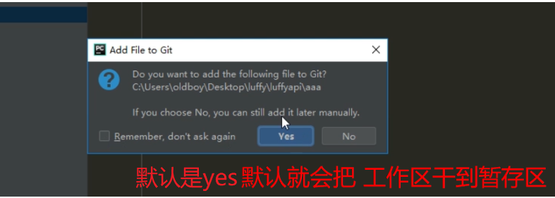](https://img2018.cnblogs.com/blog/1407587/201912/1407587-20191210150456916-1539809930.png)

## 七 线上线下协同操作


### 1 源操作

```python
"""
查看所有源
>: git remote

查看源信息
>: git remote -v

添加源
>: git remote add 源名 源地址
>: git remote add origin https://gitee.com/doctor_owen/luffy.git

删除源
>: git remote remove 源名
>: git remote remove origin
"""
```

### 2 选择线上仓库

```python
"""
1.注册码云账号并登录：https://gitee.com/
2.创建仓库(课堂截图)
3.本地与服务器仓库建立连接
"""
"""
1）本地配置线上的账号与邮箱
>: git config --global user.name "doctor_owen"
>: git config --global user.email "doctor_owen@163.com"

2）在本地初始化仓库(git init)，并完成项目的初步搭建(项目架构)(一般都是项目负责人完成项目启动)
# 这个过程就是git的基础部分的本地操作

3）采用 https协议 或 ssh协议 与远程git仓库通信提交提交代码(一般都是项目负责人完成)
	i) https协议方式，无需配置，但是第一次提交会验证管理员账号密码
	>: git remote add origin https://gitee.com/doctor_owen/luffy.git  # 配置远程源
	>: git push -u origin master  # 提交本地仓库到远程源
	
	ii) ssh协议，需要配置，配置完成之后就可以正常提交代码
	>: git remote add origin git@gitee.com:doctor_owen/luffy.git  # 配置远程源
	>: git push -u origin master  # 提交本地仓库到远程源
	
	iii）查看源及源链接信息
	>: git remote
	>: git remote -v
	
	iv）删除源链接
	>: git remote remove 源名字 
	
注：origin远程源的源名，可以自定义；master是分支名，是默认的主分支
"""
```

### 3 生成公钥（ssh协议方式）

```python
"""
1.参考帮助文档：https://gitee.com/help/ 
	-- 仓库管理 => 公钥管理 => 生成/添加SSH公钥
	
>: ssh-keygen -t rsa -C "owen@163.com"
"""
```

[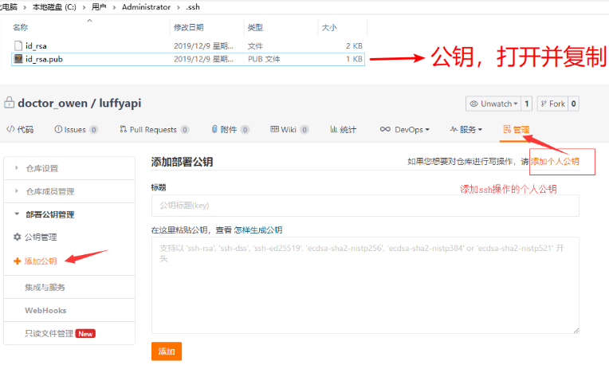](https://img2018.cnblogs.com/blog/1407587/201912/1407587-20191210150537770-1471848276.png)

```python
然后该电脑就可以基于ssh协议对该库进行操作了
```

### 4 多分支开发

##### 分支操作

```python
分支与分支之间文件不通，创建分区的时候会复制当前的分区。
"""
1.创建分支
>: git branch 分支名

2.查看分支
>: git branch

3.切换分支
>: git checkout 分支名

4.创建并切换到分支，会复制当前的分支
>: git checkout -b 分支名

5.删除分支
>: git branch -d 分支名

6.查看远程分支
>: git branch -a

7.指定分支clone
>: git clone -b 分支名 https://git.xxx.net/xxx.git
"""
```

### 5 提交的时候

```python
"""
第一次提交的分支就是远程的默认分支，clone的时候clone的就是该分支，所以一个空的仓库第一次提交的时候要提交master分支。这样master就是默认分支。

git push origin dev 代表本地的dev：远程的dev  如果提交的时候服务器没有dev分支 会创建一个dev分支
git push origin maseter 代表本地的master：远程的master

git push origin dev:master 不推荐这么使用
"""
```

### 合并分支（看公司需要，可以不看记得比较乱）

[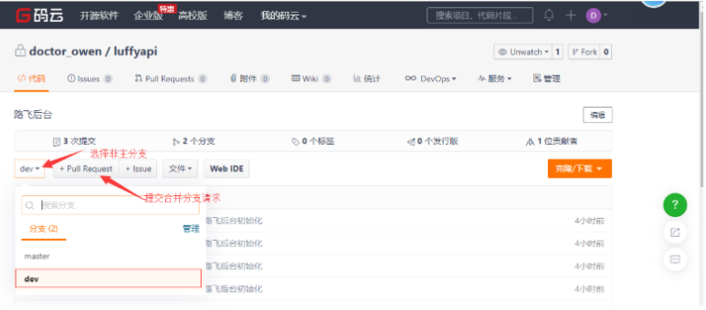](https://img2018.cnblogs.com/blog/1407587/201912/1407587-20191210150858642-1635795096.png)

[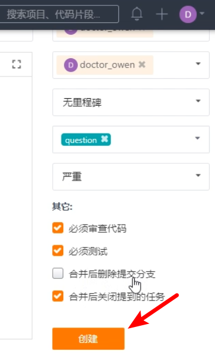](https://img2018.cnblogs.com/blog/1407587/201912/1407587-20191210150907725-1527127182.png)

[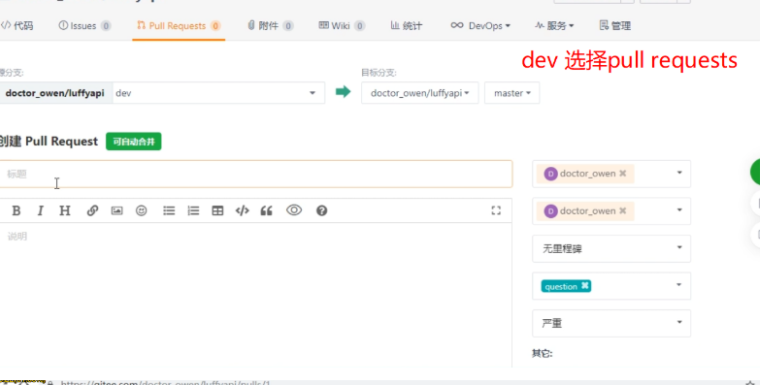](https://img2018.cnblogs.com/blog/1407587/201912/1407587-20191210150927550-2091028041.png)

其实还是要自己线下审核

[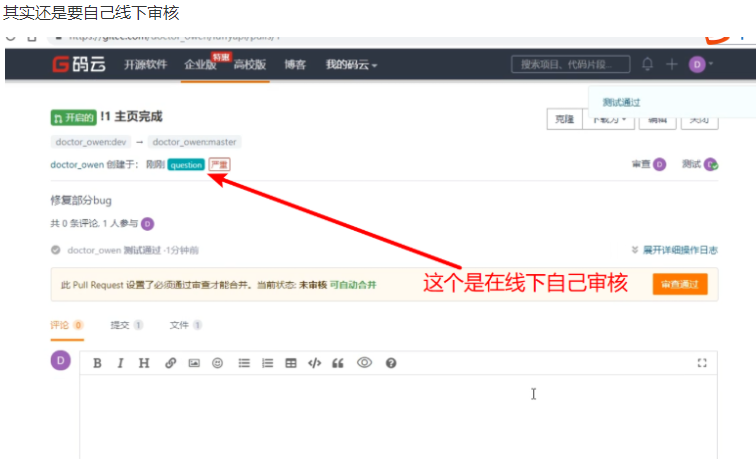](https://img2018.cnblogs.com/blog/1407587/201912/1407587-20191210150947879-800168435.png)

**最后会有个合并分支和扁平化合并分支**

扁平化会把每一次的commit的版本记录都保留，合并分支是直接合并出来一个大的版本。

建议扁平化合并分支

## 八 git团队开发流程


注意：第一次被提交的仓库是默认仓库

```python
###### 基于ssh协议
"""
管理员
1.管理员配置与线上账号密码系统的本地全局账号密码
>: git config --global user.name "doctor_owen"
>: git config --global user.email "doctor_owen@163.com"

2.本地初始化git仓库(可以建立一个项目架构)
	1）创建项目
	2）进入项目目录初始化仓库：
		>: git init
	3）提交代码到本地版本库
3.创建一个远程空仓库(码云)
4.将本地版本库同步到远程仓库
	1）在本地仓库内添加远程仓库源，源名默认就采用origin，就采用https协议即可
		>: git remote add origin https://gitee.com/doctor_owen/luffy.git
	2）将本地版本库提交到远程版本库，需要远程仓库账号密码
		>: git push -u origin master

开发者
5.要参与开发的成员配置本地全局账号密码
>: git config --global user.name "owen"
>: git config --global user.email "owen@163.com"

6.生成本机的SSH公钥提供给管理员
>: ssh-keygen -t rsa -C "owen@163.com"

管理员
7.添加开发者提供的公钥到 个人公钥 并非是 公钥，并给开发者提供远程仓库SSH地址
	仓库 => 管理 => 添加公钥 => 添加个人公钥
	SSH地址：git@gitee.com:doctor_owen/luffy.git
    
开发者
8.在本机任意合适位置clone远程仓库到本地
>: git clone git@gitee.com:doctor_owen/luffy.git

9.进入本地项目仓库进行开发，可以查看远程源
>: cd luffy
>: git remote -v
注：origin  git@gitee.com:doctor_owen/luffy.git (fetch) & (push)

10.开发过程中要提交新功能时，一定要遵循先拉取(pull)，在提交(push)
	1）提交新功能(先提交，提交后拉取，可能就会出现冲突)
		>: git add .
		>: git commit -m '提交新功能的信息说明'
	2）拉取远程仓库(不管本地是否已经和远程同步，每一次提交前都必须拉取)
		>: git pull 源名 分支名 => git pull origin master
	3）提交到远程仓库(现在是主分支)
		>：git push 源名 分支名 => git push origin master
"""

###### 基于http协议
"""
 ...
1 开发者只需要提供git邮箱
2 直接查询开发者邮箱添加进来就行
 ...
"""
```

## 九 团队开发冲突（重点）


### 1 冲突最底层逻辑

1 无冲突：要保证服务器有的版本我全有，我有的服务器没有。

2 冲突：冲突是，服务器的版本比我高（也就是服务器有的版本我并没有全有）。

### 2 普通冲突。

```python
# 没有先pull就直接push产生的冲突.
# ps：pull的时候（无论结果是冲突还是不冲突），都会拿到服务器的最新的版本。
```

**大前提**

*本地提交git时候必须要比服务器的版本高，基于服务器的版本做更新就不会报错。*

```python
"""
版本线：          旧-------》-------新

1 服务器版本线：	a        b        c

2 你本地的版本：	a        b        x（提交失败）

3 你本地的版本：   a        b        c       x（提交成功）  

4 服务器版本线：   a        b        c       x


"""
```

这就会产生冲突：你是基于服务器的b版本开发出来了x版本想要提交。但是服务器已经由b更新到了c版本。所以服务器最新的c版本你没有就会冲突，也就意味着你必须要基于服务器最新的c版本提交x，才能保证你比服务器的版本要新。

**所以要先pull一下得到服务器的最新版本，然后你再提交。**

### 3 修改了同一个文件同一个位置产生的冲突（重点）

```python
"""
版本线：      旧-------》--------》------》---------------新

1 服务器版本： a        b        c

2 tom的版本： a        b        c       y（提交成功）

3 jack的版本：a        b        c       x（pull冲突）     yx（解决掉冲突，再pull和提交，提交成功）

4 服务器版本： a        b        c       y               yx          

"""
```

**情景分析：**

**1）jack和tom都在基于服务器的`c`版本开发，并且他俩都修改同一个文件dev.txt 修改的都是同一行。**

【jack修改的内容见下图，jack基于c版本，编辑了dev.txt】

[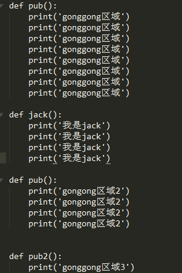](https://img2018.cnblogs.com/blog/1407587/201912/1407587-20191210150631060-2062831259.png)

【tom修改的内容见下图，tom基于此版本，编辑了dev.txt】

[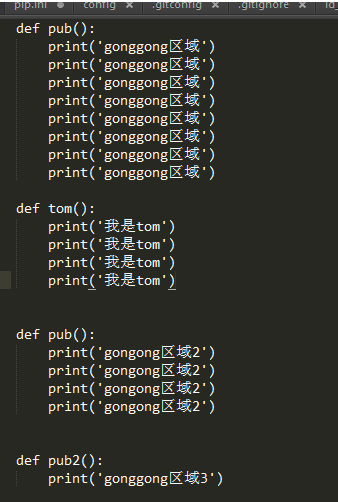](https://img2018.cnblogs.com/blog/1407587/201912/1407587-20191210150640849-1096621443.png)

**2） tom先开发完了`y`版本想要提交（先pull了一下成功，因为服务器依然是`c`版本），接着又push成功。**

[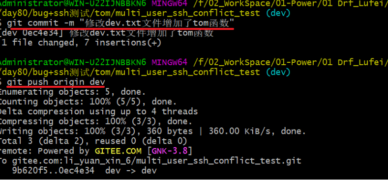](https://img2018.cnblogs.com/blog/1407587/201912/1407587-20191210150657577-196290379.png)

**3） jack`x`版本准备提交的时候，为了拿到服务器最新版本（pull了一下冲突了，你会看到冲突的文件位置，并且提示jack修改冲突）**

ps：pull冲突的时候会显示冲突的文件，**jack，pull即使冲突了但是jack也拥有了服务器的最新版本**，只是以冲突的形式展现。

[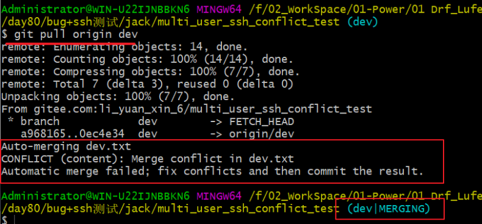](https://img2018.cnblogs.com/blog/1407587/201912/1407587-20191210150713637-18309689.png)

**4） jack打开文件看到冲突的位置，这个时候jack需要线下和tom进行沟通解决。**

**通常合并冲突的解决方案：**

1 如果jack的代码完全包含了tom的代码，直接删掉tom的代码。

2 如果tom的代码完全包含了jack的代码，直接删掉tom的代码。

3 如果tom的代码和你的代码都耦合在了一起，如果两方都有意义，那么可以进行代码的逻辑上的合并出新代码。然后删除你俩的代码。

4 如果jack的代码和tom的不想关，只是在同一个文件同一个位置产生了冲突。那么jack可以上下挪动一下代码（这种就不用沟通了），两方代码都保留。

*ps：对于本次情景很明显这个冲突是只是在同一行产生了问题，两个函数并没有逻辑上的冲突。所以直接都保留调整一下位置就行。*

[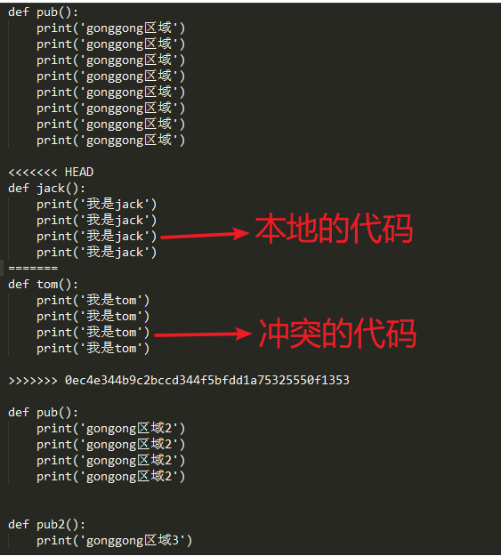](https://img2018.cnblogs.com/blog/1407587/201912/1407587-20191210150736203-6714691.png)

**5） jack沟通商定后解决冲突**

[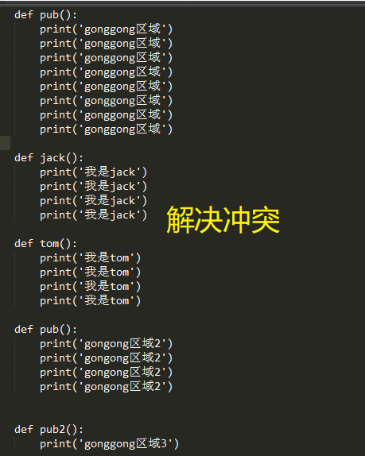](https://img2018.cnblogs.com/blog/1407587/201912/1407587-20191210150749466-357200622.png)

**6） jack解决冲突后需要再次提交处理冲突后版本**

[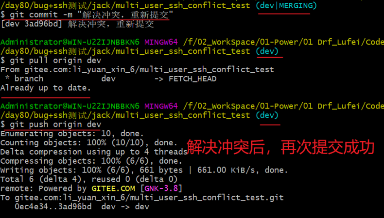](https://img2018.cnblogs.com/blog/1407587/201912/1407587-20191210150801010-1170545572.png)

## 十 现在你是项目经理


### 思路

1 别人写好了本地dev 传到了远程dev上，你也写好了本地dev传到了远程dev上

2 你从远程的dev上pull下来了代码到本地的dev上，你把远程的master也pull到了本地的master上

3 你在本地的master上merge本地的dev 看是否有问题，如果没有问题就push到远程的master上

### dev 合并 master

假如此时你在master分支上，master即将上线，因此轻易不要动master上的东西，最好新建一个分支上提交代码进行测试
目前在master分支上
可以查看分支

```cmd
git branch
//代表当前分支在master上
*master
```

此时创建一个dev分支 （dev是分支的名字，随便命名）

```cmd
git branch dev
```

切换到dev分支上

```cmd
git checkout dev
```

就可以开发了，开发完之后

```cmd
git add .

git commit -m '注释'

git push -u origin dev
```

这样就提交到dev分支上了，对master代码没有任何影响

如果测试完，没有任何问题的话，就可以把dev分支合并到master上
首先切换到dev分支上

```cmd
git branch master
```

如果是多人开发的话，最好把远程仓库地址的代码拉下来，以防别人提交了代码。如果是自己独立开发就不需要了。

```cmd
git pull origin dev
```

在master上合并分支dev

```cmd
git merge dev
```

然后把本地master上的代码push到远程master上

十一 linux git保存密码

```python
1. cd .git
2  vim config
3  在文件输入

[credential]
	helper= store
git push origin master
```