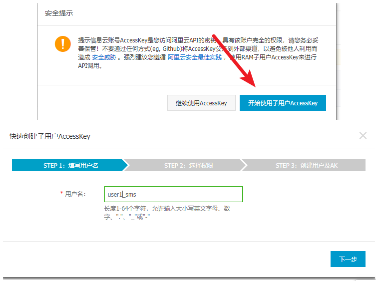
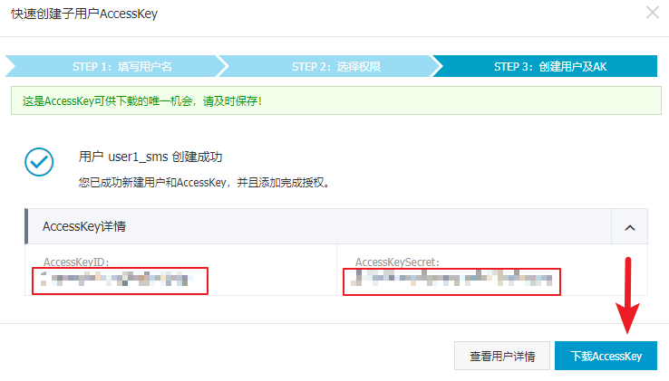
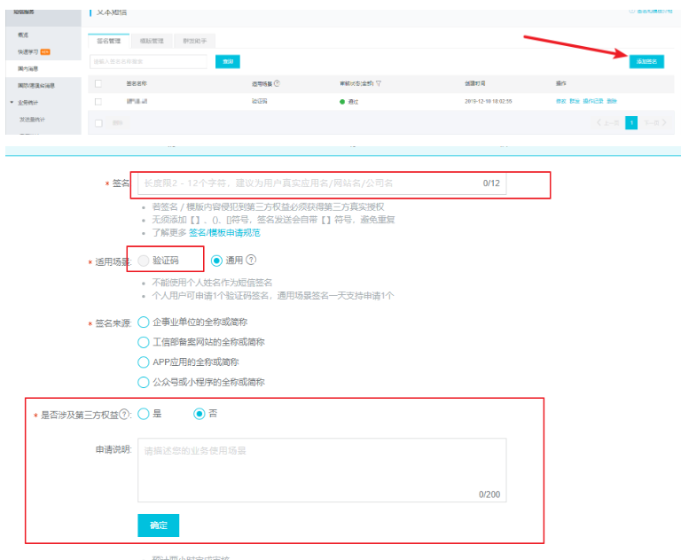
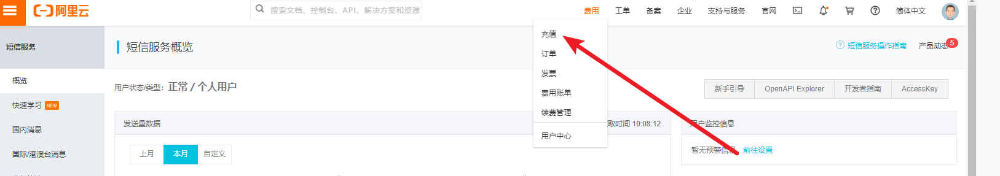
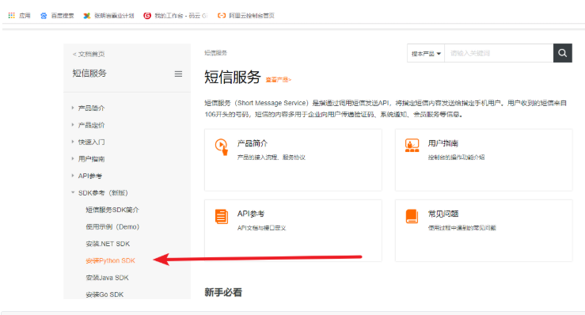
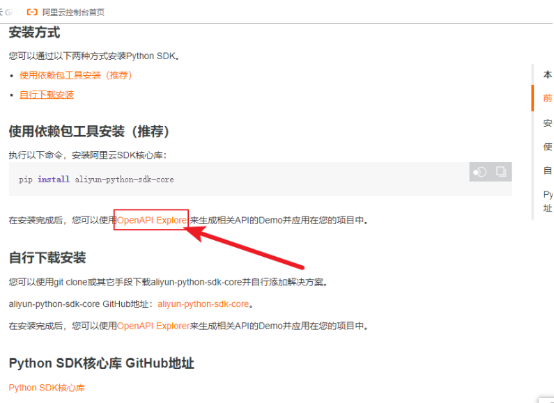
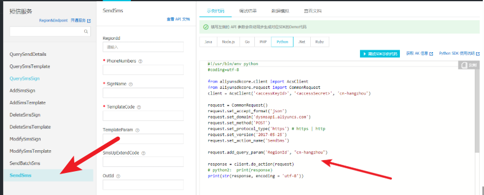

## 一 阿里云短信平台配置


### 1 创建accesskey

**1） 获取accesskey**

[](https://img2018.cnblogs.com/blog/1407587/201912/1407587-20191211103338525-1365995836.png)

**2） 创建子key**

[](https://img2018.cnblogs.com/blog/1407587/201912/1407587-20191211103351017-73982598.png)

[](https://img2018.cnblogs.com/blog/1407587/201912/1407587-20191211103404207-604017268.png)

**3） 拿到子key**

[](https://img2018.cnblogs.com/blog/1407587/201912/1407587-20191211103413678-638876348.png)

### 2 添加签名

[](https://img2018.cnblogs.com/blog/1407587/201912/1407587-20191211103428936-1041345066.png)

### 3 添加模板

[](https://img2018.cnblogs.com/blog/1407587/201912/1407587-20191211103439145-1794949904.png)

### 4 保证账户有余额

[](https://img2018.cnblogs.com/blog/1407587/201912/1407587-20191211103505758-407074856.png)

### 5 个人用户验证码系统默认限制频率

```python
# 同一个手机号
1分钟内短信发送条数不超过：1

1小时内短信发送条数不超过：5

1个自然日内短信发送条数不超过：10
```

## 二使用阿里云短信


### 1 安装sdk

#### 1）安装

[](https://img2018.cnblogs.com/blog/1407587/201912/1407587-20191211103537241-1190173311.png)

```python
pip install aliyun-python-sdk-core
```

#### 2）自己做一下测试

[](https://img2018.cnblogs.com/blog/1407587/201912/1407587-20191211103546394-1615667745.png)

```python
# 测试的时候要把你的accesskeyid，accessSecret，签名内容，模板code，短信内容（json格式）填入
```

[](https://img2018.cnblogs.com/blog/1407587/201912/1407587-20191211103610762-215485325.png)

### 2 封装到我们的项目中

**1）libs/ali_sms/ali_sms_hander.py**

```python
#!/usr/bin/env python
#coding=utf-8

from aliyunsdkcore.client import AcsClient
from aliyunsdkcore.request import CommonRequest
import json,random
from utils.logging import logger
from django.conf import settings

#-------阿里sms--------
# ACCESS_KEY_SECRET_SMS = ACCESS_KEY_SECRET_SMS
# ACCESS_KEY_ID_SMS = ACCESS_KEY_ID_SMS
# REGIONID = "cn-beijing"
# SIGN_NAME = "路飞学城"
# TEMPLATE_CODE = "SMS_153790638"
#------end--------------


def send_sms(mobile,code):
    client = AcsClient(settings.ACCESS_KEY_ID_SMS, settings.ACCESS_KEY_SECRET_SMS, settings.REGIONID)
    request = CommonRequest()
    request.set_accept_format('json')
    request.set_domain('dysmsapi.aliyuncs.com')
    request.set_method('POST')
    request.set_protocol_type('https') # https | http
    request.set_version('2017-05-25')
    request.set_action_name('SendSms')

    request.add_query_param('RegionId', settings.REGIONID)
    request.add_query_param('PhoneNumbers',str(mobile))
    request.add_query_param('SignName', settings.SIGN_NAME)
    request.add_query_param('TemplateCode', settings.TEMPLATE_CODE)
    TemplateParam = json.dumps({"code":code})
    request.add_query_param('TemplateParam', TemplateParam)
    try:
        response = client.do_action_with_exception(request)
        response = json.loads(response)
        print(response)
    except Exception as e:
        logger.error(f'短信发送失败:{mobile}，{e}')
        return False
    if response and response.get('Code') == 'OK':
        return True
    
    logger.error(f"短信发送失败:{mobile}，{response.get('Message')}")
    return False

def get_code():
    code = ''
    for i in range(4):
        code += str(random.randint(0, 9))
    return code
```

**2）api调用**

```python
class SMSAPIView(APIView):
    def post(self,request,*args,**kwargs):

        mobile = request.data.get('mobile')
        if not mobile or not re.match(r'^1[3-9][0-9]{9}$', mobile):
            return APIResponse(1, '手机号有误')

        # 产生验证码
        code = get_code()

        # 通知第三方发送短信
        result = send_sms(mobile,code)

        # 失败：
        if not result:
            return APIResponse(1,'短信发送失败')
        # 成功：
        # todo: 成功后存到redis里面
        return APIResponse(0,'短信发送成功')
```