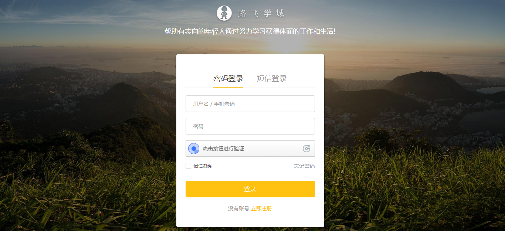
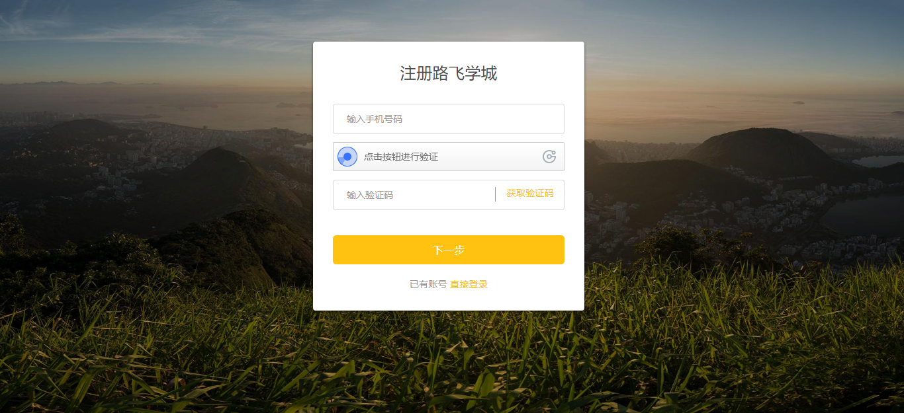
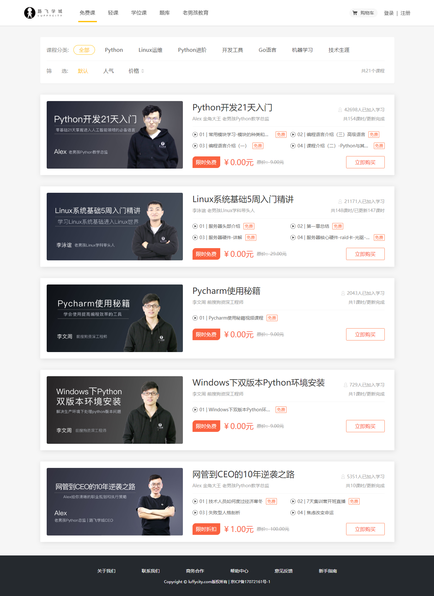
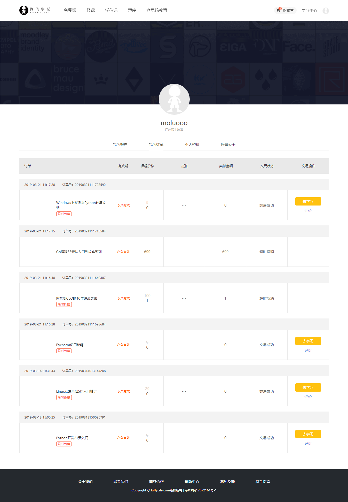

## 1.1 企业的web项目类型

1. 商城
  
    1.1 B2C 直销商城 商家与会员直接交易 ( Business To Customer )
    
    1.2 B2B 批发商城 商家与商家直接交易
    
    1.3 B2B2C 购物平台 商家和会员在另一个商家提供的平台上面进行交易
    
    1.4 C2B 定制商城 会员向商家发起定制商品的需求，商家去完成。
    
    1.5 O2O 线上线下交易平台
    
    1.6 C2C 二手交易平台
    
2. 门户网站\[企业站和门户站]
  
3. 社交网络
  
4. 资讯论坛
  
5. 内部系统
  
6. 个人博客
  
7. 内容收费站
  

## 1.2 企业项目开发流程

## 1.3 立项申请阶段

立项其实就是对产品项目能不能做和怎么做，提出理论基础。大的互联网公司都有比较正规的立项流程。

通常公司内部要研发一款软硬件的产品之前，都要经过市场评估和调研分析，产生一份`产品项目立项报告`给公司。

产品项目立项报告一般包含以下内容：

 项目概述  
 需求市场  
 需求分析和项目建设的必要性  
 业务分析  
 总体建设方案  
 项目风险和风险管理  
 可行性分析阶段

# 2. 需求分析

## 2.1 首页

功能：导航菜单、轮播图、退出登录

## 2.2 登录注册

功能：用户登录、极验验证码、多条件登录、记住密码、短信发送、短信冷却倒计时、jwt认证

## 2.3 课程列表

功能：课程分类、课程列表、***课程多条件筛选展示***、课程分类展示、课程分页展示、课程章节课时展示、***课程优惠策略***

## 2.4 课程详情

功能：课程信息展示、视频播放、富文本编辑器

## 2.5 购物车

功能：购物车商品列表、添加商品、删除商品、勾选商品状态、商品结算、订单生成、唯一订单号生成

## 2.6 商品结算

功能：订单商品信息列表、订单信息展示、积分计算功能、优惠券策略、课程有效期计算、第三方支付平台接口

## 2.7 购买成功

## 2.8 个人中心

功能列表：我的订单、订单状态改变

## 2.9 视频播放

功能：视频加密播放

