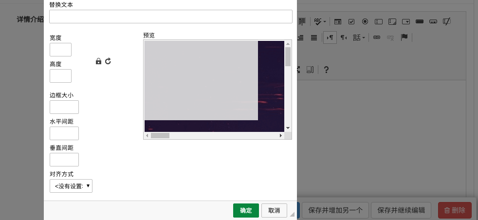

# 课程列表页

## 前端显示课程列表页面

在xadmin中增加课程列表的链接导航。然后把课程列表页面组件Course.vue放到项目中.

```vue
<template>
  <div class="course">
    <Header></Header>
    <div class="main">
      <!-- 筛选条件 -->
      <div class="condition">
        <ul class="cate-list">
          <li class="title">课程分类:</li>
          <li class="this">全部</li>
          <li>Python</li>
          <li>Linux运维</li>
          <li>Python进阶</li>
          <li>开发工具</li>
          <li>Go语言</li>
          <li>机器学习</li>
          <li>技术生涯</li>
        </ul>

        <div class="ordering">
          <ul>
            <li class="title">筛&nbsp;&nbsp;&nbsp;&nbsp;&nbsp;&nbsp;&nbsp;&nbsp;选: </li>
            <li class="default this">默认</li>
            <li class="hot this">人气</li>
            <li class="price this">价格</li>
          </ul>
          <p class="condition-result">共21个课程</p>
        </div>

      </div>
      <!-- 课程列表 -->
      <div class="course-list">
        <div class="course-item">
          <div class="course-image">
            
          </div>
          <div class="course-info">
            <h3><router-link to="/course/detail/1">Python开发21天入门</router-link> <span>100人已加入学习</span></h3>
            <p class="teather-info">Alex 金角大王 老男孩Python教学总监 <span>共154课时/更新完成</span></p>
            <ul class="lesson-list">
              <li><span class="lesson-title">01 | 第1节：初识编码</span> <span class="free">免费</span></li>
              <li><span class="lesson-title">01 | 第1节：初识编码初识编码</span> <span class="free">免费</span></li>
              <li><span class="lesson-title">01 | 第1节：初识编码</span> <span class="free">免费</span></li>
              <li><span class="lesson-title">01 | 第1节：初识编码初识编码初识编码初识编码</span> <span class="free">免费</span></li>
            </ul>
            <div class="pay-box">
              <span class="discount-type">限时免费</span>
              <span class="discount-price">￥0.00元</span>
              <span class="original-price">原价：9.00元</span>
              <span class="buy-now">立即购买</span>
            </div>
          </div>
        </div>
        <div class="course-item">
          <div class="course-image">
            
          </div>
          <div class="course-info">
            <h3>Python开发21天入门 <span>100人已加入学习</span></h3>
            <p class="teather-info">Alex 金角大王 老男孩Python教学总监 <span>共154课时/更新完成</span></p>
            <ul class="lesson-list">
              <li><span class="lesson-title">01 | 第1节：初识编码</span> <span class="free">免费</span></li>
              <li><span class="lesson-title">01 | 第1节：初识编码初识编码</span> <span class="free">免费</span></li>
              <li><span class="lesson-title">01 | 第1节：初识编码</span> <span class="free">免费</span></li>
              <li><span class="lesson-title">01 | 第1节：初识编码初识编码初识编码初识编码</span> <span class="free">免费</span></li>
            </ul>
            <div class="pay-box">
              <span class="discount-type">限时免费</span>
              <span class="discount-price">￥0.00元</span>
              <span class="original-price">原价：9.00元</span>
              <span class="buy-now">立即购买</span>
            </div>
          </div>
        </div>
        <div class="course-item">
          <div class="course-image">
            
          </div>
          <div class="course-info">
            <h3>Python开发21天入门 <span>100人已加入学习</span></h3>
            <p class="teather-info">Alex 金角大王 老男孩Python教学总监 <span>共154课时/更新完成</span></p>
            <ul class="lesson-list">
              <li><span class="lesson-title">01 | 第1节：初识编码</span> <span class="free">免费</span></li>
              <li><span class="lesson-title">01 | 第1节：初识编码初识编码</span> <span class="free">免费</span></li>
              <li><span class="lesson-title">01 | 第1节：初识编码</span> <span class="free">免费</span></li>
              <li><span class="lesson-title">01 | 第1节：初识编码初识编码初识编码初识编码</span> <span class="free">免费</span></li>
            </ul>
            <div class="pay-box">
              <span class="discount-type">限时免费</span>
              <span class="discount-price">￥0.00元</span>
              <span class="original-price">原价：9.00元</span>
              <span class="buy-now">立即购买</span>
            </div>
          </div>
        </div>
        <div class="course-item">
          <div class="course-image">
            
          </div>
          <div class="course-info">
            <h3>Python开发21天入门 <span>100人已加入学习</span></h3>
            <p class="teather-info">Alex 金角大王 老男孩Python教学总监 <span>共154课时/更新完成</span></p>
            <ul class="lesson-list">
              <li><span class="lesson-title">01 | 第1节：初识编码</span> <span class="free">免费</span></li>
              <li><span class="lesson-title">01 | 第1节：初识编码初识编码</span> <span class="free">免费</span></li>
              <li><span class="lesson-title">01 | 第1节：初识编码</span> <span class="free">免费</span></li>
              <li><span class="lesson-title">01 | 第1节：初识编码初识编码初识编码初识编码</span> <span class="free">免费</span></li>
            </ul>
            <div class="pay-box">
              <span class="discount-type">限时免费</span>
              <span class="discount-price">￥0.00元</span>
              <span class="original-price">原价：9.00元</span>
              <span class="buy-now">立即购买</span>
            </div>
          </div>
        </div>
      </div>
    </div>
    <Footer></Footer>
  </div>
</template>

<script>
  import Header from "./common/Header"
  import Footer from "./common/Footer"
  export default {
      name: "Course",
      data(){
        return{
          category:0,
        }
      },
      components:{
        Header,
        Footer,
      }
  }
</script>


<style scoped>
  .course{
    background: #f6f6f6;
  }
  .course .main{
    width: 1100px;
    margin: 35px auto 0;
  }
  .course .condition{
    margin-bottom: 35px;
    padding: 25px 30px 25px 20px;
    background: #fff;
    border-radius: 4px;
    box-shadow: 0 2px 4px 0 #f0f0f0;
  }
  .course .cate-list{
    border-bottom: 1px solid #333;
    border-bottom-color: rgba(51,51,51,.05);
    padding-bottom: 18px;
    margin-bottom: 17px;
  }
  .course .cate-list::after{
    content:"";
    display: block;
    clear: both;
  }
  .course .cate-list li{
    float: left;
    font-size: 16px;
    padding: 6px 15px;
    line-height: 16px;
    margin-left: 14px;
    position: relative;
    transition: all .3s ease;
    cursor: pointer;
    color: #4a4a4a;
    border: 1px solid transparent; /* transparent 透明 */
  }
  .course .cate-list .title{
    color: #888;
    margin-left: 0;
    letter-spacing: .36px;
    padding: 0;
    line-height: 28px;
  }
  .course .cate-list .this{
    color: #ffc210;
    border: 1px solid #ffc210!important;
    border-radius: 30px;
  }
  .course .ordering::after{
    content:"";
    display: block;
    clear: both;
  }
  .course .ordering ul{
    float: left;
  }
  .course .ordering ul::after{
    content:"";
    display: block;
    clear: both;
  }
  .course .ordering .condition-result{
    float: right;
    font-size: 14px;
    color: #9b9b9b;
    line-height: 28px;
  }
  .course .ordering ul li{
    float: left;
    padding: 6px 15px;
    line-height: 16px;
    margin-left: 14px;
    position: relative;
    transition: all .3s ease;
    cursor: pointer;
    color: #4a4a4a;
  }
  .course .ordering .title{
    font-size: 16px;
    color: #888;
    letter-spacing: .36px;
    margin-left: 0;
    padding:0;
    line-height: 28px;
  }
  .course .ordering .this{
    color: #ffc210;
  }
  .course .ordering .price{
    position: relative;
  }
  .course .ordering .price::before,
  .course .ordering .price::after{
    cursor: pointer;
    content:"";
    display: block;
    width: 0px;
    height: 0px;
    border: 5px solid transparent;
    position: absolute;
    right: 0;
  }
  .course .ordering .price::before{
    border-bottom: 5px solid #aaa;
    margin-bottom: 2px;
    top: 2px;
  }
  .course .ordering .price::after{
    border-top: 5px solid #aaa;
    bottom: 2px;
  }
  .course .course-item:hover{
    box-shadow: 4px 6px 16px rgba(0,0,0,.5);
  }
  .course .course-item{
    width: 1050px;
    background: #fff;
    padding: 20px 30px 20px 20px;
    margin-bottom: 35px;
    border-radius: 2px;
    cursor: pointer;
    box-shadow: 2px 3px 16px rgba(0,0,0,.1);
    /* css3.0 过渡动画 hover 事件操作 */
    transition: all .2s ease;
  }
  .course .course-item::after{
    content:"";
    display: block;
    clear: both;
  }
  /* 顶级元素 父级元素  当前元素{} */
  .course .course-item .course-image{
    float: left;
    width: 423px;
    height: 210px;
    margin-right: 30px;
  }
  .course .course-item .course-image img{
    width: 100%;
  }
  .course .course-item .course-info{
    float: left;
    width: 596px;
  }
  .course-item .course-info h3 {
    font-size: 26px;
    color: #333;
    font-weight: normal;
    margin-bottom: 8px;
  }
  .course-item .course-info h3 span{
    font-size: 14px;
    color: #9b9b9b;
    float: right;
    margin-top: 14px;
  }
  .course-item .course-info h3 span img{
      width: 11px;
      height: auto;
      margin-right: 7px;
  }
  .course-item .course-info .teather-info{
      font-size: 14px;
      color: #9b9b9b;
      margin-bottom: 14px;
      padding-bottom: 14px;
      border-bottom: 1px solid #333;
      border-bottom-color: rgba(51,51,51,.05);
  }
  .course-item .course-info .teather-info span{
      float: right;
  }
  .course-item .lesson-list::after{
      content:"";
      display: block;
      clear: both;
  }
  .course-item .lesson-list li {
    float: left;
    width: 44%;
    font-size: 14px;
    color: #666;
    padding-left: 22px;
    /* background: url("路径") 是否平铺 x轴位置 y轴位置 */
    background: url("/static/image/play-icon-gray.svg") no-repeat left 4px;
    margin-bottom: 15px;
  }
  .course-item .lesson-list li .lesson-title{
      /* 以下3句，文本内容过多，会自动隐藏，并显示省略符号 */
      text-overflow: ellipsis;
      overflow: hidden;
      white-space: nowrap;
      display:inline-block;
      max-width: 200px;
  }
  .course-item .lesson-list li:hover{
      background-image: url("/static/image/play-icon-yellow.svg");
      color: #ffc210;
  }
  .course-item .lesson-list li .free{
      width: 34px;
      height: 20px;
      color: #fd7b4d;
      vertical-align: super;
      margin-left: 10px;
      border: 1px solid #fd7b4d;
      border-radius: 2px;
      text-align: center;
      font-size: 13px;
      white-space: nowrap;
  }
  .course-item .lesson-list li:hover .free{
      color: #ffc210;
      border-color: #ffc210;
  }
  .course-item .pay-box::after{
    content:"";
    display: block;
    clear: both;
  }
  .course-item .pay-box .discount-type{
    padding: 6px 10px;
    font-size: 16px;
    color: #fff;
    text-align: center;
    margin-right: 8px;
    background: #fa6240;
    border: 1px solid #fa6240;
    border-radius: 10px 0 10px 0;
    float: left;
  }
  .course-item .pay-box .discount-price{
    font-size: 24px;
    color: #fa6240;
    float: left;
  }
  .course-item .pay-box .original-price{
    text-decoration: line-through;
    font-size: 14px;
    color: #9b9b9b;
    margin-left: 10px;
    float: left;
    margin-top: 10px;
  }
  .course-item .pay-box .buy-now{
    width: 120px;
    height: 38px;
    background: transparent;
    color: #fa6240;
    font-size: 16px;
    border: 1px solid #fd7b4d;
    border-radius: 3px;
    transition: all .2s ease-in-out;
    float: right;
    text-align: center;
    line-height: 38px;
  }
  .course-item .pay-box .buy-now:hover{
    color: #fff;
    background: #ffc210;
    border: 1px solid #ffc210;
  }
</style>

```


### 注册路由

```javascript
import Vue from 'vue'
import Router from 'vue-router'

Vue.use(Router)
// @ 表示src目录
import Home from "@/components/Home"
import Login from "@/components/Login"
import Register from "@/components/Register"
import Course from "@/components/Course"
export default new Router({
  mode:"history",
  routes: [
		// 。。。
    
    {
      path: '/course',
      name: 'Course',
      component: Course,
    }
  ]
})

```


### 分析课程列表页面中的出现的数据之间的关系

```
课程分类: 
课程信息:
课程章节:
课时信息:
老师信息:
价格策略:(限时免费\限时折扣\限时满减\原价\优惠券)
```


## 课程子应用创建

```python
python ../../manage.py startapp course
```


### 注册子应用

```python
INSTALLED_APPS = [
		...
    'course',
]
```


## 数据模型创建

```python
from django.db import models
from luffyapi.utils.models import BaseModel
# Create your models here.
class CourseCategory(BaseModel):
    """
    课程分类
    """
    name = models.CharField(max_length=64, unique=True, verbose_name="分类名称")
    class Meta:
        db_table = "ly_course_category"
        verbose_name = "课程分类"
        verbose_name_plural = "课程分类"


    def __str__(self):
        return "%s" % self.name


class Course(BaseModel):
    """
    专题课程
    """
    course_type = (
        (0, '付费'),
        (1, 'VIP专享'),
        (2, '学位课程')
    )
    level_choices = (
        (0, '初级'),
        (1, '中级'),
        (2, '高级'),
    )
    status_choices = (
        (0, '上线'),
        (1, '下线'),
        (2, '预上线'),
    )
    name = models.CharField(max_length=128, verbose_name="课程名称")
    course_img = models.ImageField(upload_to="course", max_length=255, verbose_name="封面图片", blank=True, null=True)
    course_type = models.SmallIntegerField(choices=course_type,default=0, verbose_name="付费类型")
    # 使用这个字段的原因
    brief = models.TextField(max_length=2048, verbose_name="详情介绍", null=True, blank=True)
    level = models.SmallIntegerField(choices=level_choices, default=1, verbose_name="难度等级")
    pub_date = models.DateField(verbose_name="发布日期", auto_now_add=True)
    period = models.IntegerField(verbose_name="建议学习周期(day)", default=7)
    attachment_path = models.FileField(max_length=128, verbose_name="课件路径", blank=True, null=True)
    status = models.SmallIntegerField(choices=status_choices, default=0, verbose_name="课程状态")
    course_category = models.ForeignKey("CourseCategory", on_delete=models.CASCADE, null=True, blank=True,verbose_name="课程分类")
    students = models.IntegerField(verbose_name="学习人数",default = 0)
    lessons = models.IntegerField(verbose_name="总课时数量",default = 0)
    pub_lessons = models.IntegerField(verbose_name="课时更新数量",default = 0)
    price = models.DecimalField(max_digits=6,decimal_places=2, verbose_name="课程原价",default=0)
    teacher = models.ForeignKey("Teacher",on_delete=models.DO_NOTHING, null=True, blank=True,verbose_name="授课老师")
    class Meta:
        db_table = "ly_course"
        verbose_name = "专题课程"
        verbose_name_plural = "专题课程"

    def __str__(self):
        return "%s" % self.name


class Teacher(BaseModel):
    """讲师、导师表"""
    role_choices = (
        (0, '讲师'),
        (1, '导师'),
        (2, '班主任'),
    )
    name = models.CharField(max_length=32, verbose_name="讲师title")
    role = models.SmallIntegerField(choices=role_choices, default=0, verbose_name="讲师身份")
    title = models.CharField(max_length=64, verbose_name="职位、职称")
    signature = models.CharField(max_length=255, verbose_name="导师签名", help_text="导师签名", blank=True, null=True)
    image = models.ImageField(upload_to="teacher", null=True, verbose_name = "讲师封面")
    brief = models.TextField(max_length=1024, verbose_name="讲师描述")

    class Meta:
        db_table = "ly_teacher"
        verbose_name = "讲师导师"
        verbose_name_plural = "讲师导师"

    def __str__(self):
        return "%s" % self.name


class CourseChapter(BaseModel):
    """课程章节"""
    course = models.ForeignKey("Course", related_name='coursechapters', on_delete=models.CASCADE, verbose_name="课程名称")
    chapter = models.SmallIntegerField(verbose_name="第几章", default=1)
    name = models.CharField(max_length=128, verbose_name="章节标题")
    summary = models.TextField(verbose_name="章节介绍", blank=True, null=True)
    pub_date = models.DateField(verbose_name="发布日期", auto_now_add=True)

    class Meta:
        db_table = "ly_course_chapter"
        verbose_name = "课程章节"
        verbose_name_plural = "课程章节"

    def __str__(self):
        return "%s:(第%s章)%s" % (self.course, self.chapter, self.name)


class CourseLesson(BaseModel):
    """课程课时"""
    section_type_choices = (
        (0, '文档'),
        (1, '练习'),
        (2, '视频')
    )
    chapter = models.ForeignKey("CourseChapter", related_name='coursesections', on_delete=models.CASCADE,verbose_name="课程章节")
    name = models.CharField(max_length=128,verbose_name = "课时标题")
    orders = models.PositiveSmallIntegerField(verbose_name="课时排序")
    section_type = models.SmallIntegerField(default=2, choices=section_type_choices, verbose_name="课时种类")
    section_link = models.CharField(max_length=255, blank=True, null=True, verbose_name="课时链接", help_text = "若是video，填vid,若是文档，填link")
    duration = models.CharField(verbose_name="视频时长", blank=True, null=True, max_length=32)  # 仅在前端展示使用
    pub_date = models.DateTimeField(verbose_name="发布时间", auto_now_add=True)
    free_trail = models.BooleanField(verbose_name="是否可试看", default=False)

    class Meta:
        db_table = "ly_course_lesson"
        verbose_name = "课程课时"
        verbose_name_plural = "课程课时"

    def __str__(self):
        return "%s-%s" % (self.chapter, self.name)
```


### 执行数据迁移

```python
python manage.py makemigrations
python manage.py migrate
```


把当前新增的课程模型注册到xadmin里面.

coursers/adminx.py,代码:

```python
import xadmin

from .models import CourseCategory
class CourseCategoryModelAdmin(object):
    """课程分类模型管理类"""
    pass
xadmin.site.register(CourseCategory, CourseCategoryModelAdmin)


from .models import Course
class CourseModelAdmin(object):
    """课程模型管理类"""
    pass
xadmin.site.register(Course, CourseModelAdmin)


from .models import Teacher
class TeacherModelAdmin(object):
    """老师模型管理类"""
    pass
xadmin.site.register(Teacher, TeacherModelAdmin)


from .models import CourseChapter
class CourseChapterModelAdmin(object):
    """课程章节模型管理类"""
    pass
xadmin.site.register(CourseChapter, CourseChapterModelAdmin)


from .models import CourseLesson
class CourseLessonModelAdmin(object):
    """课程课时模型管理类"""
    pass
xadmin.site.register(CourseLesson, CourseLessonModelAdmin)
```


#### 添加测试数据


```python
INSERT INTO `ly_course_category` (`id`,`orders`,`is_show`,`is_deleted`,`created_time`,`updated_time`,`name`)
 VALUES
(1,11,1,0,'2019-08-13 07:08:47.100074','2019-08-13 07:44:05.903782','python'),
(2,0,1,0,'2019-08-13 07:08:51.451093','2019-08-13 07:43:54.558940','go编程'),
(3,3,1,0,'2019-08-13 07:08:57.390196','2019-08-13 07:08:57.390226','Linux运维'),
(4,4,1,0,'2019-08-13 07:09:11.465963','2019-08-13 07:09:11.465994','前端开发'),(5,11,1,0,'2019-08-13 07:08:47.100074','2019-08-13 07:44:05.903782','php编程'),(6,0,1,0,'2019-08-13 07:08:51.451093','2019-08-13 07:43:54.558940','C/C++'),(7,3,1,0,'2019-08-13 07:08:57.390196','2019-08-13 07:08:57.390226','java web'),(8,4,1,0,'2019-08-13 07:09:11.465963','2019-08-13 07:09:11.465994','UI设计'),(9,11,1,0,'2019-08-13 07:09:11.465963','2019-08-13 07:09:11.465994','语文'),(10,145,2,0,'2019-08-13 07:09:11.465963','2019-08-13 07:09:11.465994','数学'),(11,1,2,0,'2019-08-13 07:09:11.465963','2019-08-13 07:09:11.465994','英语');
```

## 后端实现课程分类列表接口

### 创建序列化器

courses/serializers.py

```python
from rest_framework import serializers
from .models import CourseCategory
class CourseCategoryModelSerializer(serializers.ModelSerializer):
    class Meta:
        model = CourseCategory
        fields = ["id","name"]
```

### 创建视图

courses/views.py

```python
from rest_framework.generics import ListAPIView
from .models import CourseCategory
from .serializers import CourseCategoryModelSerializer
class CourseCategoryListAPIView(ListAPIView):
    queryset = CourseCategory.objects.filter(is_show=True,is_deleted=False).order_by("orders")
    serializer_class = CourseCategoryModelSerializer
```


### 注册路由

```python
from django.urls import path, re_path
from . import views
urlpatterns = [
    path(r'category/', views.CourseCategoryListAPIView.as_view() ),
]
# 总路由
    path('course/', include("course.urls")),
```

## 前端页面适配

### 客户端发送请求获取课程分类信息

```vue
<template>
  <div class="course">
    <Header></Header>
    <div class="main">
      <!-- 筛选条件 -->
      <div class="condition">
        <ul class="cate-list">
          <li class="title">课程分类:</li>
          <li class="this">全部</li>
          <li v-for="cat in category_list">{{cat.name}}</li>
        </ul>

        <div class="ordering">
          <ul>
            <li class="title">筛&nbsp;&nbsp;&nbsp;&nbsp;&nbsp;&nbsp;&nbsp;&nbsp;选: </li>
            <li class="default this">默认</li>
            <li class="hot this">人气</li>
            <li class="price this">价格</li>
          </ul>
          <p class="condition-result">共21个课程</p>
        </div>

      </div>
      <!-- 课程列表 -->
      <div class="course-list">
        <div class="course-item">
          <div class="course-image">
            
          </div>
          <div class="course-info">
            <h3><router-link to="/course/detail/1">Python开发21天入门</router-link> <span>100人已加入学习</span></h3>
            <p class="teather-info">Alex 金角大王 老男孩Python教学总监 <span>共154课时/更新完成</span></p>
            <ul class="lesson-list">
              <li><span class="lesson-title">01 | 第1节：初识编码</span> <span class="free">免费</span></li>
              <li><span class="lesson-title">01 | 第1节：初识编码初识编码</span> <span class="free">免费</span></li>
              <li><span class="lesson-title">01 | 第1节：初识编码</span> <span class="free">免费</span></li>
              <li><span class="lesson-title">01 | 第1节：初识编码初识编码初识编码初识编码</span> <span class="free">免费</span></li>
            </ul>
            <div class="pay-box">
              <span class="discount-type">限时免费</span>
              <span class="discount-price">￥0.00元</span>
              <span class="original-price">原价：9.00元</span>
              <span class="buy-now">立即购买</span>
            </div>
          </div>
        </div>
        <div class="course-item">
          <div class="course-image">
            
          </div>
          <div class="course-info">
            <h3>Python开发21天入门 <span>100人已加入学习</span></h3>
            <p class="teather-info">Alex 金角大王 老男孩Python教学总监 <span>共154课时/更新完成</span></p>
            <ul class="lesson-list">
              <li><span class="lesson-title">01 | 第1节：初识编码</span> <span class="free">免费</span></li>
              <li><span class="lesson-title">01 | 第1节：初识编码初识编码</span> <span class="free">免费</span></li>
              <li><span class="lesson-title">01 | 第1节：初识编码</span> <span class="free">免费</span></li>
              <li><span class="lesson-title">01 | 第1节：初识编码初识编码初识编码初识编码</span> <span class="free">免费</span></li>
            </ul>
            <div class="pay-box">
              <span class="discount-type">限时免费</span>
              <span class="discount-price">￥0.00元</span>
              <span class="original-price">原价：9.00元</span>
              <span class="buy-now">立即购买</span>
            </div>
          </div>
        </div>
        <div class="course-item">
          <div class="course-image">
            
          </div>
          <div class="course-info">
            <h3>Python开发21天入门 <span>100人已加入学习</span></h3>
            <p class="teather-info">Alex 金角大王 老男孩Python教学总监 <span>共154课时/更新完成</span></p>
            <ul class="lesson-list">
              <li><span class="lesson-title">01 | 第1节：初识编码</span> <span class="free">免费</span></li>
              <li><span class="lesson-title">01 | 第1节：初识编码初识编码</span> <span class="free">免费</span></li>
              <li><span class="lesson-title">01 | 第1节：初识编码</span> <span class="free">免费</span></li>
              <li><span class="lesson-title">01 | 第1节：初识编码初识编码初识编码初识编码</span> <span class="free">免费</span></li>
            </ul>
            <div class="pay-box">
              <span class="discount-type">限时免费</span>
              <span class="discount-price">￥0.00元</span>
              <span class="original-price">原价：9.00元</span>
              <span class="buy-now">立即购买</span>
            </div>
          </div>
        </div>
        <div class="course-item">
          <div class="course-image">
            
          </div>
          <div class="course-info">
            <h3>Python开发21天入门 <span>100人已加入学习</span></h3>
            <p class="teather-info">Alex 金角大王 老男孩Python教学总监 <span>共154课时/更新完成</span></p>
            <ul class="lesson-list">
              <li><span class="lesson-title">01 | 第1节：初识编码</span> <span class="free">免费</span></li>
              <li><span class="lesson-title">01 | 第1节：初识编码初识编码</span> <span class="free">免费</span></li>
              <li><span class="lesson-title">01 | 第1节：初识编码</span> <span class="free">免费</span></li>
              <li><span class="lesson-title">01 | 第1节：初识编码初识编码初识编码初识编码</span> <span class="free">免费</span></li>
            </ul>
            <div class="pay-box">
              <span class="discount-type">限时免费</span>
              <span class="discount-price">￥0.00元</span>
              <span class="original-price">原价：9.00元</span>
              <span class="buy-now">立即购买</span>
            </div>
          </div>
        </div>
      </div>
    </div>
    <Footer></Footer>
  </div>
</template>

<script>
  import Header from "./common/Header"
  import Footer from "./common/Footer"
  export default {
      name: "Course",
      data(){
        return{
          category: 0,
          category_list:[],
        }
      },
      created(){
        this.get_course_category();
      },
      methods:{
        get_course_category(){
            // 获取课程分类信息
            this.$axios.get(`${this.$settings.HOST}/course/category/`).then(response=>{
                this.category_list = response.data;
            })
        }
      },
      components:{
        Header,
        Footer,
      }
  }
</script>


<style scoped>
  .course{
    background: #f6f6f6;
  }
  .course .main{
    width: 1100px;
    margin: 35px auto 0;
  }
  .course .condition{
    margin-bottom: 35px;
    padding: 25px 30px 25px 20px;
    background: #fff;
    border-radius: 4px;
    box-shadow: 0 2px 4px 0 #f0f0f0;
  }
  .course .cate-list{
    border-bottom: 1px solid #333;
    border-bottom-color: rgba(51,51,51,.05);
    padding-bottom: 18px;
    margin-bottom: 17px;
  }
  .course .cate-list::after{
    content:"";
    display: block;
    clear: both;
  }
  .course .cate-list li{
    float: left;
    font-size: 16px;
    padding: 6px 15px;
    line-height: 16px;
    margin-left: 14px;
    position: relative;
    transition: all .3s ease;
    cursor: pointer;
    color: #4a4a4a;
    border: 1px solid transparent; /* transparent 透明 */
  }
  .course .cate-list .title{
    color: #888;
    margin-left: 0;
    letter-spacing: .36px;
    padding: 0;
    line-height: 28px;
  }
  .course .cate-list .this{
    color: #ffc210;
    border: 1px solid #ffc210!important;
    border-radius: 30px;
  }
  .course .ordering::after{
    content:"";
    display: block;
    clear: both;
  }
  .course .ordering ul{
    float: left;
  }
  .course .ordering ul::after{
    content:"";
    display: block;
    clear: both;
  }
  .course .ordering .condition-result{
    float: right;
    font-size: 14px;
    color: #9b9b9b;
    line-height: 28px;
  }
  .course .ordering ul li{
    float: left;
    padding: 6px 15px;
    line-height: 16px;
    margin-left: 14px;
    position: relative;
    transition: all .3s ease;
    cursor: pointer;
    color: #4a4a4a;
  }
  .course .ordering .title{
    font-size: 16px;
    color: #888;
    letter-spacing: .36px;
    margin-left: 0;
    padding:0;
    line-height: 28px;
  }
  .course .ordering .this{
    color: #ffc210;
  }
  .course .ordering .price{
    position: relative;
  }
  .course .ordering .price::before,
  .course .ordering .price::after{
    cursor: pointer;
    content:"";
    display: block;
    width: 0px;
    height: 0px;
    border: 5px solid transparent;
    position: absolute;
    right: 0;
  }
  .course .ordering .price::before{
    border-bottom: 5px solid #aaa;
    margin-bottom: 2px;
    top: 2px;
  }
  .course .ordering .price::after{
    border-top: 5px solid #aaa;
    bottom: 2px;
  }
  .course .course-item:hover{
    box-shadow: 4px 6px 16px rgba(0,0,0,.5);
  }
  .course .course-item{
    width: 1050px;
    background: #fff;
    padding: 20px 30px 20px 20px;
    margin-bottom: 35px;
    border-radius: 2px;
    cursor: pointer;
    box-shadow: 2px 3px 16px rgba(0,0,0,.1);
    /* css3.0 过渡动画 hover 事件操作 */
    transition: all .2s ease;
  }
  .course .course-item::after{
    content:"";
    display: block;
    clear: both;
  }
  /* 顶级元素 父级元素  当前元素{} */
  .course .course-item .course-image{
    float: left;
    width: 423px;
    height: 210px;
    margin-right: 30px;
  }
  .course .course-item .course-image img{
    width: 100%;
  }
  .course .course-item .course-info{
    float: left;
    width: 596px;
  }
  .course-item .course-info h3 {
    font-size: 26px;
    color: #333;
    font-weight: normal;
    margin-bottom: 8px;
  }
  .course-item .course-info h3 span{
    font-size: 14px;
    color: #9b9b9b;
    float: right;
    margin-top: 14px;
  }
  .course-item .course-info h3 span img{
      width: 11px;
      height: auto;
      margin-right: 7px;
  }
  .course-item .course-info .teather-info{
      font-size: 14px;
      color: #9b9b9b;
      margin-bottom: 14px;
      padding-bottom: 14px;
      border-bottom: 1px solid #333;
      border-bottom-color: rgba(51,51,51,.05);
  }
  .course-item .course-info .teather-info span{
      float: right;
  }
  .course-item .lesson-list::after{
      content:"";
      display: block;
      clear: both;
  }
  .course-item .lesson-list li {
    float: left;
    width: 44%;
    font-size: 14px;
    color: #666;
    padding-left: 22px;
    /* background: url("路径") 是否平铺 x轴位置 y轴位置 */
    background: url("/static/image/play-icon-gray.svg") no-repeat left 4px;
    margin-bottom: 15px;
  }
  .course-item .lesson-list li .lesson-title{
      /* 以下3句，文本内容过多，会自动隐藏，并显示省略符号 */
      text-overflow: ellipsis;
      overflow: hidden;
      white-space: nowrap;
      display:inline-block;
      max-width: 200px;
  }
  .course-item .lesson-list li:hover{
      background-image: url("/static/image/play-icon-yellow.svg");
      color: #ffc210;
  }
  .course-item .lesson-list li .free{
      width: 34px;
      height: 20px;
      color: #fd7b4d;
      vertical-align: super;
      margin-left: 10px;
      border: 1px solid #fd7b4d;
      border-radius: 2px;
      text-align: center;
      font-size: 13px;
      white-space: nowrap;
  }
  .course-item .lesson-list li:hover .free{
      color: #ffc210;
      border-color: #ffc210;
  }
  .course-item .pay-box::after{
    content:"";
    display: block;
    clear: both;
  }
  .course-item .pay-box .discount-type{
    padding: 6px 10px;
    font-size: 16px;
    color: #fff;
    text-align: center;
    margin-right: 8px;
    background: #fa6240;
    border: 1px solid #fa6240;
    border-radius: 10px 0 10px 0;
    float: left;
  }
  .course-item .pay-box .discount-price{
    font-size: 24px;
    color: #fa6240;
    float: left;
  }
  .course-item .pay-box .original-price{
    text-decoration: line-through;
    font-size: 14px;
    color: #9b9b9b;
    margin-left: 10px;
    float: left;
    margin-top: 10px;
  }
  .course-item .pay-box .buy-now{
    width: 120px;
    height: 38px;
    background: transparent;
    color: #fa6240;
    font-size: 16px;
    border: 1px solid #fd7b4d;
    border-radius: 3px;
    transition: all .2s ease-in-out;
    float: right;
    text-align: center;
    line-height: 38px;
  }
  .course-item .pay-box .buy-now:hover{
    color: #fff;
    background: #ffc210;
    border: 1px solid #ffc210;
  }
</style>

```


## 实现课程分类点击高亮效果

```vue
<template>
  <div class="course">
    <Header></Header>
    <div class="main">
      <!-- 筛选条件 -->
      <div class="condition">
        <ul class="cate-list">
          <li class="title">课程分类:</li>
          <li @click="category=0" :class="category==0?'this':''">全部</li>
          <li @click="category=cat.id" :class="category==cat.id?'this':''" v-for="cat in category_list">{{cat.name}}</li>
        </ul>

        <div class="ordering">
        ...
</script>
```


## 课程信息筛选条件的排序高亮效果实现

```vue
<template>
 ...
        <div class="ordering">
          <ul>
            <li class="title">筛&nbsp;&nbsp;&nbsp;&nbsp;&nbsp;&nbsp;&nbsp;&nbsp;选: </li>
            <li @click="change_order_type(0)" class="default" :class="change_order_class(0)">默认</li>
            <li @click="change_order_type(1)" class="hot" :class="change_order_class(1)">人气</li>
            <li @click="change_order_type(2)" class="price" :class="change_order_class(2)">价格</li>
          </ul>
          <p class="condition-result">共21个课程</p>
        </div>

      </div>
     ...
</template>

<script>
  import Header from "./common/Header"
  import Footer from "./common/Footer"
  export default {
      name: "Course",
      data(){
        return{
          category: 0,
          category_list:[],
          filters:{
              type: 0, // 筛选类型，0表示默认，1表示人气,2表示价格
              orders: "desc",  // 排序类型，desc表示降序，asc表示升序
          }
        }
      },
      created(){
        this.get_course_category();
      },
      methods:{
        get_course_category(){
            // 获取课程分类信息
            this.$axios.get(`${this.$settings.HOST}/course/category/`).then(response=>{
                this.category_list = response.data;
            })
        },
        change_order_type(type){
            // 更改升序或者降序
            if( this.filters.type === type && this.filters.orders === "desc" ){
                this.filters.orders="asc";
            }else if(this.filters.type === type && this.filters.orders === "asc"){
                this.filters.orders="desc";
            }

            // 更改排序方式
            this.filters.type=type;
        },
        change_order_class(type){
            // 更改当前选中筛选条件的高亮方式
            if( this.filters.type === type && this.filters.orders === "asc" ){
              return "this asc";
            }else if(this.filters.type===type && this.filters.orders === "desc"){
              return "this desc";
            }else{
              return "";
            }
        }
      },
      components:{
        Header,
        Footer,
      }
  }
</script>


<style scoped>
  .course{
    background: #f6f6f6;
  }
  .course .main{
    width: 1100px;
    margin: 35px auto 0;
  }
  .course .condition{
    margin-bottom: 35px;
    padding: 25px 30px 25px 20px;
    background: #fff;
    border-radius: 4px;
    box-shadow: 0 2px 4px 0 #f0f0f0;
  }
  .course .cate-list{
    border-bottom: 1px solid #333;
    border-bottom-color: rgba(51,51,51,.05);
    padding-bottom: 18px;
    margin-bottom: 17px;
  }
  .course .cate-list::after{
    content:"";
    display: block;
    clear: both;
  }
  .course .cate-list li{
    float: left;
    font-size: 16px;
    padding: 6px 15px;
    line-height: 16px;
    margin-left: 14px;
    position: relative;
    transition: all .3s ease;
    cursor: pointer;
    color: #4a4a4a;
    border: 1px solid transparent; /* transparent 透明 */
  }
  .course .cate-list .title{
    color: #888;
    margin-left: 0;
    letter-spacing: .36px;
    padding: 0;
    line-height: 28px;
  }
  .course .cate-list .this{
    color: #ffc210;
    border: 1px solid #ffc210!important;
    border-radius: 30px;
  }
  .course .ordering::after{
    content:"";
    display: block;
    clear: both;
  }
  .course .ordering ul{
    float: left;
  }
  .course .ordering ul::after{
    content:"";
    display: block;
    clear: both;
  }
  .course .ordering .condition-result{
    float: right;
    font-size: 14px;
    color: #9b9b9b;
    line-height: 28px;
  }
  .course .ordering ul li{
    float: left;
    padding: 6px 15px;
    line-height: 16px;
    margin-left: 14px;
    position: relative;
    transition: all .3s ease;
    cursor: pointer;
    color: #4a4a4a;
  }
  .course .ordering .title{
    font-size: 16px;
    color: #888;
    letter-spacing: .36px;
    margin-left: 0;
    padding:0;
    line-height: 28px;
  }
  .course .ordering .this{
    color: #ffc210;
    position: relative;
  }
  .course .ordering .this::before,
  .course .ordering .this::after{
    cursor: pointer;
    content:"";
    display: block;
    width: 0px;
    height: 0px;
    border: 5px solid transparent;
    position: absolute;
    right: 0;
  }
  .course .ordering .this::before{
    border-bottom: 5px solid #aaa;
    margin-bottom: 2px;
    top: 2px;
  }
  .course .ordering .this::after{
    border-top: 5px solid #aaa;
    bottom: 2px;
  }
  .course .ordering .asc::before{
    border-bottom-color: #ffc210;
  }
  .course .ordering .desc::after{
    border-top-color: #ffc210;
  }
  .course .course-item:hover{
    box-shadow: 4px 6px 16px rgba(0,0,0,.5);
  }
  .course .course-item{
    width: 1050px;
    background: #fff;
    padding: 20px 30px 20px 20px;
    margin-bottom: 35px;
    border-radius: 2px;
    cursor: pointer;
    box-shadow: 2px 3px 16px rgba(0,0,0,.1);
    /* css3.0 过渡动画 hover 事件操作 */
    transition: all .2s ease;
  }
  .course .course-item::after{
    content:"";
    display: block;
    clear: both;
  }
  /* 顶级元素 父级元素  当前元素{} */
  .course .course-item .course-image{
    float: left;
    width: 423px;
    height: 210px;
    margin-right: 30px;
  }
  .course .course-item .course-image img{
    width: 100%;
  }
  .course .course-item .course-info{
    float: left;
    width: 596px;
  }
  .course-item .course-info h3 {
    font-size: 26px;
    color: #333;
    font-weight: normal;
    margin-bottom: 8px;
  }
  .course-item .course-info h3 span{
    font-size: 14px;
    color: #9b9b9b;
    float: right;
    margin-top: 14px;
  }
  .course-item .course-info h3 span img{
      width: 11px;
      height: auto;
      margin-right: 7px;
  }
  .course-item .course-info .teather-info{
      font-size: 14px;
      color: #9b9b9b;
      margin-bottom: 14px;
      padding-bottom: 14px;
      border-bottom: 1px solid #333;
      border-bottom-color: rgba(51,51,51,.05);
  }
  .course-item .course-info .teather-info span{
      float: right;
  }
  .course-item .lesson-list::after{
      content:"";
      display: block;
      clear: both;
  }
  .course-item .lesson-list li {
    float: left;
    width: 44%;
    font-size: 14px;
    color: #666;
    padding-left: 22px;
    /* background: url("路径") 是否平铺 x轴位置 y轴位置 */
    background: url("/static/image/play-icon-gray.svg") no-repeat left 4px;
    margin-bottom: 15px;
  }
  .course-item .lesson-list li .lesson-title{
      /* 以下3句，文本内容过多，会自动隐藏，并显示省略符号 */
      text-overflow: ellipsis;
      overflow: hidden;
      white-space: nowrap;
      display:inline-block;
      max-width: 200px;
  }
  .course-item .lesson-list li:hover{
      background-image: url("/static/image/play-icon-yellow.svg");
      color: #ffc210;
  }
  .course-item .lesson-list li .free{
      width: 34px;
      height: 20px;
      color: #fd7b4d;
      vertical-align: super;
      margin-left: 10px;
      border: 1px solid #fd7b4d;
      border-radius: 2px;
      text-align: center;
      font-size: 13px;
      white-space: nowrap;
  }
  .course-item .lesson-list li:hover .free{
      color: #ffc210;
      border-color: #ffc210;
  }
  .course-item .pay-box::after{
    content:"";
    display: block;
    clear: both;
  }
  .course-item .pay-box .discount-type{
    padding: 6px 10px;
    font-size: 16px;
    color: #fff;
    text-align: center;
    margin-right: 8px;
    background: #fa6240;
    border: 1px solid #fa6240;
    border-radius: 10px 0 10px 0;
    float: left;
  }
  .course-item .pay-box .discount-price{
    font-size: 24px;
    color: #fa6240;
    float: left;
  }
  .course-item .pay-box .original-price{
    text-decoration: line-through;
    font-size: 14px;
    color: #9b9b9b;
    margin-left: 10px;
    float: left;
    margin-top: 10px;
  }
  .course-item .pay-box .buy-now{
    width: 120px;
    height: 38px;
    background: transparent;
    color: #fa6240;
    font-size: 16px;
    border: 1px solid #fd7b4d;
    border-radius: 3px;
    transition: all .2s ease-in-out;
    float: right;
    text-align: center;
    line-height: 38px;
  }
  .course-item .pay-box .buy-now:hover{
    color: #fff;
    background: #ffc210;
    border: 1px solid #ffc210;
  }
</style>
  
```


## 课程信息列表接口

### 后端实现

在xadmin后端添加测试数据

```sql
INSERT INTO `ly_teacher` (`id`,`orders`,`is_show`,`is_deleted`,`created_time`,`updated_time`,`name`,`role`,`title`,`signature`,`image`,`brief`)
VALUES 
(1,1,1,0,'2019-08-13 07:13:01.531992','2019-08-13 07:13:01.532043','李老师',0,'xx公司技术总监','洪七公','teacher/logo2x.png','222');

INSERT INTO `ly_course`
(`id`,`orders`,`is_show`,`is_deleted`,`created_time`,`updated_time`,`name`,`course_img`,`course_type`,`brief`,`level`,`pub_date`,`period`,`attachment_path`,`status`,`students`,`lessons`,`pub_lessons`,`price`,`course_category_id`,`teacher_id`)
VALUES
(1,1,1,0,'2019-08-13 07:13:50.678948','2019-08-15 04:07:11.386224','flask框架','course/Loginbg.3377d0c.jpg',0,'<p>xxxx</p>',1,'2019-08-13',7,'README.md',0,99,110,110,1110.00,1,1),
(2,2,1,0,'2019-08-13 07:15:32.490163','2019-08-15 04:13:22.430368','蘑菇街APP','course/course-cover.jpeg',0,'<p>dxxx</p>',2,'2019-08-13',7,'logo.svg',0,10,50,40,666.00,1,1),
(3,3,1,0,'2019-08-13 07:15:32.490163','2019-08-20 10:49:41.880490','django框架','course/2.jpeg',0,'<p>dxxx</p>',1,'2019-08-13',7,'logo.svg',0,10,50,40,330.00,1,1),
(15,4,1,0,'2019-08-13 07:15:32.490163','2019-08-13 07:15:32.490191','python入门','course/2.jpeg',0,'dxxx',2,'2019-08-13',7,'logo.svg',0,10,50,40,411.00,1,1),
(16,5,1,0,'2019-08-13 07:15:32.490163','2019-08-14 02:28:04.791112','hbase入门','course/2.jpeg',0,'dxxx',1,'2019-08-13',7,'logo.svg',0,10,50,40,400.00,7,1),
(17,6,1,0,'2019-08-13 07:15:32.490163','2019-08-13 07:15:32.490191','路飞学城项目实战','course/2.jpeg',0,'dxxx',2,'2019-08-13',7,'logo.svg',0,10,50,40,899.00,1,1),
(18,7,1,0,'2019-08-13 07:15:32.490163','2019-08-14 02:29:47.667133','负载均衡','course/2.jpeg',0,'dxxx',2,'2019-08-13',7,'logo.svg',0,10,50,40,1088.00,6,1),
(19,8,1,0,'2019-08-13 07:15:32.490163','2019-08-13 07:15:32.490191','MVC','course/2.jpeg',0,'dxxx',2,'2019-08-13',7,'logo.svg',0,10,50,40,1500.00,1,1),
(20,9,1,0,'2019-08-13 07:15:32.490163','2019-08-14 02:28:52.126968','21天java入门','course/2.jpeg',0,'dxxx',0,'2019-08-13',7,'logo.svg',0,10,50,40,3000.00,7,1),
(21,10,1,0,'2019-08-13 07:15:32.490163','2019-08-14 02:27:01.850049','7天玩转Linux运维','course/2.jpeg',0,'dxxx',2,'2019-08-13',7,'logo.svg',0,10,50,40,400.00,3,1),
(22,11,1,0,'2019-08-13 07:15:32.490163','2019-08-13 07:15:32.490191','15天掌握flask框架','course/2.jpeg',0,'dxxx',2,'2019-08-13',7,'logo.svg',0,10,50,40,400.00,1,1),
(23,12,1,0,'2019-08-13 07:15:32.490163','2019-08-13 07:23:56.015167','C编程嵌入式','course/2.jpeg',0,'dxxx',1,'2019-08-13',7,'logo.svg',0,10,50,40,399.00,3,1),
(24,13,1,0,'2019-08-13 07:15:32.490163','2019-08-14 02:29:17.872840','3天玩转树莓派','course/2.jpeg',0,'dxxx',2,'2019-08-13',7,'logo.svg',0,10,50,40,400.00,3,1),
(25,14,1,0,'2019-08-13 07:15:32.490163','2019-08-14 02:28:30.783768','MongoDB','course/2.jpeg',0,'dxxx',0,'2019-08-13',7,'logo.svg',0,10,50,40,400.00,3,1),
(26,15,1,0,'2019-08-13 07:15:32.490163','2019-08-14 02:30:09.348192','Beego框架入门','course/2.jpeg',0,'dxxx',1,'2019-08-13',7,'logo.svg',0,10,50,40,699.00,2,1),
(27,16,1,0,'2019-08-13 07:15:32.490163','2019-08-15 02:35:20.997672','beego框架进阶','course/2.jpeg',0,'<p>dxxx</p>',1,'2019-08-13',7,'logo.svg',0,10,50,50,400.00,2,1),
(28,17,1,0,'2019-08-13 07:15:32.490163','2019-08-13 07:23:44.546598','以太坊入门','course/2.jpeg',0,'dxxx',2,'2019-08-13',7,'logo.svg',0,10,50,40,899.00,2,1),
(29,18,1,0,'2019-08-13 07:15:32.490163','2019-08-15 04:05:10.421736','负载均衡','course/2.jpeg',0,'<div style=\"background:#eeeeee; border:1px solid #cccccc; padding:5px 10px\"><span style=\"color:#16a085\"><span style=\"font-family:Arial,Helvetica,sans-serif\"><span style=\"font-size:28px\"><span style=\"background-color:#f39c12\">dxxx</span></span></span></span></div>\r\n\r\n<div style=\"background:#eeeeee; border:1px solid #cccccc; padding:5px 10px\">&nbsp;</div>\r\n\r\n<div style=\"background:#eeeeee; border:1px solid #cccccc; padding:5px 10px\">\r\n<table border=\"1\" cellpadding=\"1\" cellspacing=\"1\" style=\"width:500px\">\r\n	<tbody>\r\n		<tr>\r\n			<td>12321</td>\r\n			<td>3232</td>\r\n			<td>111</td>\r\n		</tr>\r\n		<tr>\r\n			<td>33</td>\r\n			<td>33</td>\r\n			<td>22</td>\r\n		</tr>\r\n		<tr>\r\n			<td>11</td>\r\n			<td>22</td>\r\n			<td>23</td>\r\n		</tr>\r\n	</tbody>\r\n</table>\r\n\r\n<p>&nbsp;</p>\r\n</div>',0,'2019-08-13',7,'logo.svg',0,10,50,40,400.00,3,1);
```


创建序列化器，代码

```python
# 开发中一个序列化器 A 中需要同时序列化其他模型 B 的数据返回给客户端,那么直接通过外键默认只会返回主键ID
# 所以我们可以通过再创建一个模型B的序列化器,对模型B的数据进行序列化
# 在序列化器A中直接把模型B的序列化器调用作为字段值来声明即可.

from rest_framework import serializers
from .models import CourseCategory, Course, Teacher
class CourseCategoryModelSerializer(serializers.ModelSerializer):
    """课程分类的序列化器"""
    class Meta:
        model = CourseCategory
        fields = ( "id", "name" )

class CourseTeacherModelSerializer(serializers.ModelSerializer):
    """课程所属老师的序列化器"""
    class Meta:
        model = Teacher
        fields = ("name","title", "signature")

class CourseModelSerializer(serializers.ModelSerializer):
    """课程信息的序列化器"""
    teacher = CourseTeacherModelSerializer() # 老师 1 : 多课程
    # teacher = CourseTeacherModelSerializer(many=True) # 多对1
    class Meta:
        model = Course
        fields = ("id","name","course_img","students","lessons","pub_lessons","price","teacher")
```


视图代码:

```python
from .serializers import CourseModelSerializer
class CourseListAPIView(ListAPIView):
    queryset = Course.objects.filter(is_delete=False, is_show=True).order_by("orders")
    serializer_class = CourseModelSerializer
```

路由代码：

```python
from django.urls import path, re_path
from . import views
urlpatterns = [
    path(r'category/', views.CourseCategoryListAPIView.as_view() ),
    path(r'', views.CourseListAPIView.as_view() ),
]
```

### 客户端实现

### 发送请求获取课程列表信息

```vue
<template>
  <div class="course">
    <Header></Header>
    <div class="main">
      <!-- 筛选条件 -->
      <div class="condition">
        <ul class="cate-list">
          <li class="title">课程分类:</li>
          <li :class="filter.category == 0?'this':''" @click="filter.category=0">全部</li>
          <li :class="filter.category == category.id?'this':''" @click="filter.category=category.id" v-for="category in category_list" :key="category.id">{{category.name}}</li>
        </ul>

        <div class="ordering">
          <ul>
            <li class="title">筛&nbsp;&nbsp;&nbsp;&nbsp;&nbsp;&nbsp;&nbsp;&nbsp;选: </li>
            <li class="default this">默认</li>
            <li class="hot this">人气</li>
            <li class="price this">价格</li>
          </ul>
          <p class="condition-result">共{{course_list.length}}个课程</p>
        </div>

      </div>
      <!-- 课程列表 -->

<script>
  import Header from "./common/Header"
  import Footer from "./common/Footer"
  export default {
      name: "Course",
      data(){
        return{
          course_list: [],
          category_list: [],
          filter:{
              category: 0,
          }
        }
      },
      components:{
        Header,
        Footer,
      },
      created(){
        this.get_course_category();
        this.get_course();
      },
      methods:{
          get_course_category(){
              // 获取课程分类信息
              this.$axios.get(`${this.$settings.Host}/course/category/`).then(response=>{
                  this.category_list = response.data;
              }).catch(error=>{
                  console.log(error.response);
              });
          },
          get_course(){
              // 获取课程信息
              this.$axios.get(`${this.$settings.Host}/course/`).then(response=>{
                  this.course_list = response.data;
              }).catch(error=>{
                  console.log(error.response);
              })
          }
      }
  }
</script>


<style scoped>
 ...
</style>

```


#### 客户端的课程列表显示当前课程的章节信息

可以通过序列化器嵌套来完成，但是查询过程的数量不好控制。以下代码仅供参考：

```python
from .models import CourseLesson
class CourseLessonModelSerializer(serializers.ModelSerializer):
    class Meta:
        model = CourseLesson
        fields = ("id","name","free_trail")

from .models import CourseChapter
class CourseChapterModelSerializer(serializers.ModelSerializer):
    coursesections = CourseLessonModelSerializer(many=True)
    class Meta:
        model = CourseChapter
        fields = ("id", "name", "coursesections")

from .models import Course
class CourseModelSerializer(serializers.ModelSerializer):
    teacher = TeacherModelSerializer()
    coursechapters = CourseChapterModelSerializer(many=True)  # 课程章节多个,所以需要声明 many=True
    class Meta:
        model = Course
        fields = ("id", "name", "course_img", "students", "lessons", "pub_lessons", "price", "teacher","coursechapters")
```

我们可以通过在models模型中给数据模型增加自定义字段来完成获取课时功能。

```python
class Course(BaseModel):
    """
    专题课程
    """
    course_type = (
        (0, '付费'),
        (1, 'VIP专享'),
        (2, '学位课程')
    )
    level_choices = (
        (0, '初级'),
        (1, '中级'),
        (2, '高级'),
    )
    status_choices = (
        (0, '上线'),
        (1, '下线'),
        (2, '预上线'),
    )
    name = models.CharField(max_length=128, verbose_name="课程名称")
    course_img = models.ImageField(upload_to="course", max_length=255, verbose_name="封面图片", blank=True, null=True)
    course_type = models.SmallIntegerField(choices=course_type,default=0, verbose_name="付费类型")
    # 使用这个字段的原因
    brief = models.TextField(max_length=2048, verbose_name="详情介绍", null=True, blank=True)
    level = models.SmallIntegerField(choices=level_choices, default=1, verbose_name="难度等级")
    pub_date = models.DateField(verbose_name="发布日期", auto_now_add=True)
    period = models.IntegerField(verbose_name="建议学习周期(day)", default=7)
    attachment_path = models.FileField(max_length=128, verbose_name="课件路径", blank=True, null=True)
    status = models.SmallIntegerField(choices=status_choices, default=0, verbose_name="课程状态")
    course_category = models.ForeignKey("CourseCategory", on_delete=models.CASCADE, null=True, blank=True,verbose_name="课程分类")
    students = models.IntegerField(verbose_name="学习人数",default = 0)
    lessons = models.IntegerField(verbose_name="总课时数量",default = 0)
    pub_lessons = models.IntegerField(verbose_name="课时更新数量",default = 0)
    price = models.DecimalField(max_digits=6,decimal_places=2, verbose_name="课程原价",default=0)
    teacher = models.ForeignKey("Teacher",on_delete=models.DO_NOTHING, null=True, blank=True,verbose_name="授课老师")
    class Meta:
        db_table = "ly_course"
        verbose_name = "专题课程"
        verbose_name_plural = "专题课程"

    def __str__(self):
        return "%s" % self.name

    def lesson_list(self):
        """获取当前课程的前8个课时展示到列表中"""

        # 获取所有章节
        chapters_list = self.coursechapters.filter(is_delete=False,is_show=True)
        lesson_list = []
        if chapters_list:
            for chapter in chapters_list:
                lessons = chapter.coursesections.filter(is_delete=False,is_show=True)[:4]
                if lessons:
                    for lesson in lessons:
                        lesson_list.append({
                            "id":lesson.id,
                            "name":lesson.name,
                            "free_trail":lesson.free_trail
                        })

        return lesson_list[:4]
```

序列化器字段增加自定义的模型字段，

```python
class CourseModelSerializer(serializers.ModelSerializer):
    # 默认情况,序列化器转换模型数据时,默认会把外键直接转成主键ID值
    # 所以我们需要重新设置在序列化器中针对外键的序列化
    # 这种操作就是一个序列器里面调用另一个序列化器了.叫"序列化器嵌套"
    teacher = TeacherModelSerializer()
    # coursechapters = CourseChapterModelSerializer(many=True)
    class Meta:
        model = Course
        fields = ("id","name","course_img","students","lessons","pub_lessons","price","teacher","lesson_list")
```

#### 前端显示课程章节信息

```vue
<template>
  <div class="course">
    <Header/>
    <div class="main">
      <!-- 筛选功能 -->
      <div class="top">
        <ul class="condition condition1">
          <li class="cate-condition">课程分类:</li>
          <li class="item" :class="current_cate==0?'current':''" @click="current_cate=0">全部</li>
          <li :class="current_cate==catetory.id?'current':''" @click="current_cate=catetory.id" v-for="catetory in catetory_list" :data-key="catetory.id" class="item">{{catetory.name}}</li>
        </ul>
        <ul class="condition condition2">
          <li class="cate-condition">筛&nbsp;&nbsp;&nbsp;&nbsp;&nbsp;&nbsp;&nbsp;&nbsp;选:</li>
          <li class="item current">默认</li>
          <li class="item">人气</li>
          <li class="item price">价格</li>
          <li class="course-length">共21个课程</li>
        </ul>
      </div>
      <!-- 课程列表 --->
      <div class="list">
        <ul>
          <li class="course-item" v-for="course in course_list">
            <router-link to="/detail" class="course-link">
              <div class="course-cover">
                
              </div>
              <div class="course-info">
                <div class="course-title">
                  <h3>{{course.name}}</h3>
                  <span>{{course.students}}人已加入学习</span>
                </div>
                <p class="teacher">
                  <span class="info">{{course.teacher.name}} {{course.teacher.title}}</span>
                  <span class="lesson">共{{course.lessons}}课时/{{course.lessons==course.pub_lessons?'更新完成':('已更新'+course.pub_lessons+"课时")}}</span>
                </p>
                <ul class="lesson-list">
                  <li v-for="lesson,key in course.lesson_list">
                    <p class="lesson-title">0{{key+1}} | {{lesson.name}}</p>
                    <span v-if="lesson.free_trail" class="free">免费</span>
                  </li>

                </ul>
                <div class="buy-info">
                  <span class="discount">限时免费</span>
                  <span class="present-price">￥0.00元</span>
                  <span class="original-price">原价：{{course.price}}元</span>
                  <button class="buy-now">立即购买</button>
                </div>
              </div>
            </router-link>
          </li>
        </ul>
      </div>
    </div>
    <Footer/>
  </div>
</template>

<script>
import Header from "./common/Header"
import Footer from "./common/Footer"
export default {
  name: "Course",
  data(){
    return {
      catetory_list:[],
      course_list:[],
      current_cate:0,
    }
  },
  components: {Header, Footer},
  created(){
    // 获取课程分类
    this.$axios.get(this.$settings.Host+"/courses/cate/").then(response=>{
      this.catetory_list = response.data
    }).catch(error=>{
      console.log(error.response)
    });

    // 获取课程信息
    this.$axios.get(this.$settings.Host+"/courses/list/").then(response=>{
      this.course_list = response.data
    }).catch(error=>{
      console.log(error.response)
    });

  },
  methods:{

  }
}
</script>
```


## 按照指定分类显示课程信息

在当前项目中安装 字段过滤排序

```
pip install django-filter
```

在settings/dev.py配置文件中增加过滤后端的设置：

```python
INSTALLED_APPS = [
    ...
    'django_filters',  # 需要注册应用，
]

```

在视图中设置允许过滤的字段名和引入过滤字段核心类

```python
from .serializers import CourseModelSerializer
from django_filters.rest_framework import DjangoFilterBackend
class CourseAPIView(ListAPIView):
    queryset = Course.objects.filter(is_delete=False, is_show=True).order_by("orders")
    serializer_class = CourseModelSerializer
    filter_backends = [DjangoFilterBackend, ]
    filter_fields = ('course_category',)
```


## 排序显示课程

后端提供排序课程的接口

把原来views.py中的CoursesAPIView新增两句代码:

```python
from .models import Course
from .serializers import CourseModelSerializer
from rest_framework.filters import OrderingFilter
from django_filters.rest_framework import DjangoFilterBackend
class CourseAPIView(ListAPIView):
    queryset = Course.objects.filter(status=0).order_by("-orders","-id")
    serializer_class = CourseModelSerializer
    # 设置价格排序
    filter_backends = [DjangoFilterBackend,OrderingFilter]
    filter_fields = ('course_category',)
    ordering_fields = ('id', 'students', 'price')
```


#### 前端根据排序字段对应的课程顺序

组件html代码

``` html
<template>
  <div class="course">
    <Header></Header>
    <div class="main">
      <!-- 筛选条件 -->
      <div class="condition">
        <ul class="cate-list">
          <li class="title">课程分类:</li>
          <li @click="category=0" :class="category==0?'this':''">全部</li>
          <li @click="category=cat.id" :class="category==cat.id?'this':''" v-for="cat in category_list">{{cat.name}}</li>
        </ul>

        <div class="ordering">
          <ul>
            <li class="title">筛&nbsp;&nbsp;&nbsp;&nbsp;&nbsp;&nbsp;&nbsp;&nbsp;选: </li>
            <li @click="change_order_type('id')" class="default" :class="change_order_class('id')">默认</li>
            <li @click="change_order_type('students')" class="hot" :class="change_order_class('students')">人气</li>
            <li @click="change_order_type('price')" class="price" :class="change_order_class('price')">价格</li>

<!--            <li @click="filters.type=0" class="default" :class="filters.type==0?'this':''">默认</li>-->
<!--            <li @click="filters.type=1" class="hot" :class="filters.type==1?'this':''">人气</li>-->
<!--            <li @click="filters.type=2" class="price" :class="filters.type==2?'this':''">价格</li>-->
          </ul>
          <p class="condition-result">共21个课程</p>
        </div>

      </div>
      <!-- 课程列表 -->
      <div class="course-list">
        <div class="course-item" v-for="course in course_list">
          <div class="course-image">
            
          </div>
          <div class="course-info">
            <h3><router-link to="/course/detail/1">{{course.name}}</router-link> <span>{{course.students}}人已加入学习</span></h3>
            <p class="teather-info">{{course.teacher.name}} {{course.teacher.signature}} {{course.teacher.title}} <span>共{{course.lessons}}课时/{{course.pub_lessons==course.lessons?'更新完成':`已更新${course.pub_lessons}课时`}}</span></p>
            <ul class="lesson-list">
              <li v-for="lesson,key in course.lessons_list"><span class="lesson-title">0{{key}} | 第{{lesson.lesson}}节：{{lesson.name}}</span> <span class="free" v-if="lesson.free_trail">免费</span></li>
<!--              <li><span class="lesson-title">01 | 第1节：初识编码初识编码</span> <span class="free">免费</span></li>-->
<!--              <li><span class="lesson-title">01 | 第1节：初识编码</span> <span class="free">免费</span></li>-->
<!--              <li><span class="lesson-title">01 | 第1节：初识编码初识编码初识编码初识编码</span> <span class="free">免费</span></li>-->
            </ul>
            <div class="pay-box">
              <span class="discount-type">限时免费</span>
              <span class="discount-price">￥0.00元</span>
              <span class="original-price">原价：{{course.price}}元</span>
              <span class="buy-now">立即购买</span>
            </div>
          </div>
        </div>
      </div>
    </div>
    <Footer></Footer>
  </div>
</template>

<script>
  import Header from "./common/Header"
  import Footer from "./common/Footer"
  export default {
      name: "Course",
      data(){
        return{
          category: 0,
          category_list:[],
          course_list: [],
          filters:{
              type: "id", // 筛选类型，id表示默认，students表示人气,price表示价格
              orders: "desc",  // 排序类型[控制样式]，desc表示降序，asc表示升序
          }
        }
      },
      watch:{
          category(){
              this.get_course();
          }
      },
      created(){
        this.get_course_category();
        this.get_course();
      },
      methods:{
        get_course_category(){
            // 获取课程分类信息
            this.$axios.get(`${this.$settings.HOST}/course/category/`).then(response=>{
                this.category_list = response.data;
            })
        },
        get_course(){
            let filters = {};

            if(this.filters.orders==="desc"){
                filters.ordering = "-"+this.filters.type;
            }else{
                filters.ordering = this.filters.type;
            }
            // 判断是否要根据分类显示课程信息
            if( this.category > 0 ){
                filters.course_category = this.category;
            }

            this.$axios.get(`${this.$settings.HOST}/course/`,{
                params:filters
            }).then(response=>{
                this.course_list = response.data;
            });
        },
        change_order_type(type){
            // 更改升序或者降序
            if( this.filters.type === type && this.filters.orders === "desc" ){
                this.filters.orders="asc";
            }else if( this.filters.type === type && this.filters.orders === "asc"){
                this.filters.orders="desc";
            }

            // 更改排序方式
            this.filters.type=type;
            // 重新获取课程
            this.get_course();
        },
        change_order_class(type){
            // 更改当前选中筛选条件的高亮方式
            if( this.filters.type === type && this.filters.orders === "asc" ){
              return "this asc";
            }else if(this.filters.type===type && this.filters.orders === "desc"){
              return "this desc";
            }else{
              return "";
            }
        }
      },
      components:{
        Header,
        Footer,
      }
  }
</script>
....
```

## 课程列表接口实现分页显示数据

在当前子应用courses下创建一个分页器的文件paginations.py，代码：

```python
from rest_framework.pagination import PageNumberPagination
class CustomPageNumberPagination(PageNumberPagination):
    # page_query_param = "" # 地址上面代表页码的变量名，默认为page
    page_size = 5         # 每一页显示的数据量，没有设置页码，则不进行分页
	# 允许客户端通过指定的参数名来设置每一页数据量的大小，默认是size
    page_size_query_param = "size"
    max_page_size = 20    # 限制每一页最大展示的数据量
```


视图中加载声明的分页器，代码：

```python
# 按条件筛选[分类]展示课程信息
from django_filters.rest_framework import DjangoFilterBackend
from rest_framework.filters import OrderingFilter
from .paginations import CustomPageNumberPagination
class CourseListAPIView(ListAPIView):
    """课程列表"""
    queryset = Course.objects.filter(is_show=True,is_delete=False).order_by("orders")
    serializer_class = CourseModelSerializer
    filter_backends = [DjangoFilterBackend, OrderingFilter]
    # 设置支持设置的筛选过滤字段
    filter_fields = ('course_category', )
    # 设置支持设置的排序字段
    ordering_fields = ('id', 'students', 'price')
    # 指定分页器
    pagination_class = CustomPageNumberPagination
```


客户端请求后端发送数据

```vue
<template>
  <div class="course">
    <Header></Header>
    <div class="main">
      <!-- 筛选条件 -->
      <div class="condition">
        <ul class="cate-list">
          <li class="title">课程分类:</li>
          <li @click="category=0" :class="category==0?'this':''">全部</li>
          <li @click="category=cat.id" :class="category==cat.id?'this':''" v-for="cat in category_list">{{cat.name}}</li>
        </ul>

        <div class="ordering">
          <ul>
            <li class="title">筛&nbsp;&nbsp;&nbsp;&nbsp;&nbsp;&nbsp;&nbsp;&nbsp;选: </li>
            <li @click="change_order_type('id')" class="default" :class="change_order_class('id')">默认</li>
            <li @click="change_order_type('students')" class="hot" :class="change_order_class('students')">人气</li>
            <li @click="change_order_type('price')" class="price" :class="change_order_class('price')">价格</li>

<!--            <li @click="filters.type=0" class="default" :class="filters.type==0?'this':''">默认</li>-->
<!--            <li @click="filters.type=1" class="hot" :class="filters.type==1?'this':''">人气</li>-->
<!--            <li @click="filters.type=2" class="price" :class="filters.type==2?'this':''">价格</li>-->
          </ul>
          <p class="condition-result">共21个课程</p>
        </div>

      </div>
      <el-pagination
      background
      layout="prev, pager, next,sizes"
      :page-size="filters.size"
      :page-sizes="[2, 3, 5, 10]"
      @current-change="handleCurrentChange"
      @size-change="handleSizeChange"
      :total="total">
    </el-pagination>
      <!-- 课程列表 -->
      <div class="course-list">
        <div class="course-item" v-for="course in course_list">
          <div class="course-image">
            
          </div>
          <div class="course-info">
            <h3><router-link to="/course/detail/1">{{course.name}}</router-link> <span>{{course.students}}人已加入学习</span></h3>
            <p class="teather-info">{{course.teacher.name}} {{course.teacher.signature}} {{course.teacher.title}} <span>共{{course.lessons}}课时/{{course.pub_lessons==course.lessons?'更新完成':`已更新${course.pub_lessons}课时`}}</span></p>
            <ul class="lesson-list">
              <li :key="key" v-for="(lesson,key) in course.lessons_list"><span class="lesson-title">0{{key}} | 第{{lesson.lesson}}节：{{lesson.name}}</span> <span class="free" v-if="lesson.free_trail">免费</span></li>
<!--              <li><span class="lesson-title">01 | 第1节：初识编码初识编码</span> <span class="free">免费</span></li>-->
<!--              <li><span class="lesson-title">01 | 第1节：初识编码</span> <span class="free">免费</span></li>-->
<!--              <li><span class="lesson-title">01 | 第1节：初识编码初识编码初识编码初识编码</span> <span class="free">免费</span></li>-->
            </ul>
            <div class="pay-box">
              <span class="discount-type">限时免费</span>
              <span class="discount-price">￥0.00元</span>
              <span class="original-price">原价：{{course.price}}元</span>
              <span class="buy-now">立即购买</span>
            </div>
          </div>
        </div>
      </div>
    </div>
    <el-pagination
      background
      layout="prev, pager, next,sizes"
      :page-size="filters.size"
      :page-sizes="[2, 3, 5, 10]"
      @current-change="handleCurrentChange"
      @size-change="handleSizeChange"
      :total="total">
    </el-pagination>
    <Footer></Footer>
  </div>
</template>

<script>
  import Header from "./common/Header"
  import Footer from "./common/Footer"
  export default {
      name: "Course",
      data(){
        return{
          category: 0,
          category_list:[],
          total: 0,
          course_list: [],
          filters:{
              type: "id", // 筛选类型，id表示默认，students表示人气,price表示价格
              orders: "desc",  // 排序类型[控制样式]，desc表示降序，asc表示升序
              size: 5, // 单页数据量
              page: 1, // 当前页码
          }
        }
      },
      watch:{
          category(){
              this.get_course();
          }
      },
      created(){
        this.get_course_category();
        this.get_course();
      },
      methods:{
        get_course_category(){
            // 获取课程分类信息
            this.$axios.get(`${this.$settings.HOST}/course/category/`).then(response=>{
                this.category_list = response.data;
            })
        },
        get_course(){
            let filters = {
                page: this.filters.page,
                size: this.filters.size,
            };

            if(this.filters.orders==="desc"){
                filters.ordering = "-"+this.filters.type;
            }else{
                filters.ordering = this.filters.type;
            }
            // 判断是否要根据分类显示课程信息
            if( this.category > 0 ){
                filters.course_category = this.category;
            }

            this.$axios.get(`${this.$settings.HOST}/course/`,{
                params:filters
            }).then(response=>{
                this.course_list = response.data.results;
                this.total = response.data.count;
            });
        },
        change_order_type(type){
            // 更改升序或者降序
            if( this.filters.type === type && this.filters.orders === "desc" ){
                this.filters.orders="asc";
            }else if( this.filters.type === type && this.filters.orders === "asc"){
                this.filters.orders="desc";
            }

            // 更改排序方式
            this.filters.type=type;
            // 重新获取课程
            this.get_course();
        },
        change_order_class(type){
            // 更改当前选中筛选条件的高亮方式
            if( this.filters.type === type && this.filters.orders === "asc" ){
              return "this asc";
            }else if(this.filters.type===type && this.filters.orders === "desc"){
              return "this desc";
            }else{
              return "";
            }
        },
        handleCurrentChange(page){
            // 切换页码时，重新获取课程
            console.log("本次点击的页码是:", page);
            this.filters.page = page;
            this.get_course();
        },
        handleSizeChange(size){
            // 切换单页显示的数据量
            this.filters.size = size;
            // 重置页码
            this.filters.page = 1;
            this.get_course();
        },
      },
      components:{
        Header,
        Footer,
      }
  }
</script>


<style scoped>
  .course{
    background: #f6f6f6;
  }
  .course .main{
    width: 1100px;
    margin: 35px auto 0;
  }
  .course .condition{
    margin-bottom: 35px;
    padding: 25px 30px 25px 20px;
    background: #fff;
    border-radius: 4px;
    box-shadow: 0 2px 4px 0 #f0f0f0;
  }
  .course .cate-list{
    border-bottom: 1px solid #333;
    border-bottom-color: rgba(51,51,51,.05);
    padding-bottom: 18px;
    margin-bottom: 17px;
  }
  .course .cate-list::after{
    content:"";
    display: block;
    clear: both;
  }
  .course .cate-list li{
    float: left;
    font-size: 16px;
    padding: 6px 15px;
    line-height: 16px;
    margin-left: 14px;
    position: relative;
    transition: all .3s ease;
    cursor: pointer;
    color: #4a4a4a;
    border: 1px solid transparent; /* transparent 透明 */
  }
  .course .cate-list .title{
    color: #888;
    margin-left: 0;
    letter-spacing: .36px;
    padding: 0;
    line-height: 28px;
  }
  .course .cate-list .this{
    color: #ffc210;
    border: 1px solid #ffc210!important;
    border-radius: 30px;
  }
  .course .ordering::after{
    content:"";
    display: block;
    clear: both;
  }
  .course .ordering ul{
    float: left;
  }
  .course .ordering ul::after{
    content:"";
    display: block;
    clear: both;
  }
  .course .ordering .condition-result{
    float: right;
    font-size: 14px;
    color: #9b9b9b;
    line-height: 28px;
  }
  .course .ordering ul li{
    float: left;
    padding: 6px 15px;
    line-height: 16px;
    margin-left: 14px;
    position: relative;
    transition: all .3s ease;
    cursor: pointer;
    color: #4a4a4a;
  }
  .course .ordering .title{
    font-size: 16px;
    color: #888;
    letter-spacing: .36px;
    margin-left: 0;
    padding:0;
    line-height: 28px;
  }
  .course .ordering .this{
    color: #ffc210;
    position: relative;
  }
  .course .ordering .this::before,
  .course .ordering .this::after{
    cursor: pointer;
    content:"";
    display: block;
    width: 0px;
    height: 0px;
    border: 5px solid transparent;
    position: absolute;
    right: 0;
  }
  .course .ordering .this::before{
    border-bottom: 5px solid #aaa;
    margin-bottom: 2px;
    top: 2px;
  }
  .course .ordering .this::after{
    border-top: 5px solid #aaa;
    bottom: 2px;
  }
  .course .ordering .asc::before{
    border-bottom-color: #ffc210;
  }
  .course .ordering .desc::after{
    border-top-color: #ffc210;
  }
  .course .course-item:hover{
    box-shadow: 4px 6px 16px rgba(0,0,0,.5);
  }
  .course .course-item{
    width: 1050px;
    background: #fff;
    padding: 20px 30px 20px 20px;
    margin-bottom: 35px;
    border-radius: 2px;
    cursor: pointer;
    box-shadow: 2px 3px 16px rgba(0,0,0,.1);
    /* css3.0 过渡动画 hover 事件操作 */
    transition: all .2s ease;
  }
  .course .course-item::after{
    content:"";
    display: block;
    clear: both;
  }
  /* 顶级元素 父级元素  当前元素{} */
  .course .course-item .course-image{
    float: left;
    width: 423px;
    height: 210px;
    margin-right: 30px;
  }
  .course .course-item .course-image img{
    width: 100%;
  }
  .course .course-item .course-info{
    float: left;
    width: 596px;
  }
  .course-item .course-info h3 {
    font-size: 26px;
    color: #333;
    font-weight: normal;
    margin-bottom: 8px;
  }
  .course-item .course-info h3 span{
    font-size: 14px;
    color: #9b9b9b;
    float: right;
    margin-top: 14px;
  }
  .course-item .course-info h3 span img{
      width: 11px;
      height: auto;
      margin-right: 7px;
  }
  .course-item .course-info .teather-info{
      font-size: 14px;
      color: #9b9b9b;
      margin-bottom: 14px;
      padding-bottom: 14px;
      border-bottom: 1px solid #333;
      border-bottom-color: rgba(51,51,51,.05);
  }
  .course-item .course-info .teather-info span{
      float: right;
  }
  .course-item .lesson-list::after{
      content:"";
      display: block;
      clear: both;
  }
  .course-item .lesson-list li {
    float: left;
    width: 44%;
    font-size: 14px;
    color: #666;
    padding-left: 22px;
    /* background: url("路径") 是否平铺 x轴位置 y轴位置 */
    background: url("/static/image/play-icon-gray.svg") no-repeat left 4px;
    margin-bottom: 15px;
  }
  .course-item .lesson-list li .lesson-title{
      /* 以下3句，文本内容过多，会自动隐藏，并显示省略符号 */
      text-overflow: ellipsis;
      overflow: hidden;
      white-space: nowrap;
      display:inline-block;
      max-width: 200px;
  }
  .course-item .lesson-list li:hover{
      background-image: url("/static/image/play-icon-yellow.svg");
      color: #ffc210;
  }
  .course-item .lesson-list li .free{
      width: 34px;
      height: 20px;
      color: #fd7b4d;
      vertical-align: super;
      margin-left: 10px;
      border: 1px solid #fd7b4d;
      border-radius: 2px;
      text-align: center;
      font-size: 13px;
      white-space: nowrap;
  }
  .course-item .lesson-list li:hover .free{
      color: #ffc210;
      border-color: #ffc210;
  }
  .course-item .pay-box::after{
    content:"";
    display: block;
    clear: both;
  }
  .course-item .pay-box .discount-type{
    padding: 6px 10px;
    font-size: 16px;
    color: #fff;
    text-align: center;
    margin-right: 8px;
    background: #fa6240;
    border: 1px solid #fa6240;
    border-radius: 10px 0 10px 0;
    float: left;
  }
  .course-item .pay-box .discount-price{
    font-size: 24px;
    color: #fa6240;
    float: left;
  }
  .course-item .pay-box .original-price{
    text-decoration: line-through;
    font-size: 14px;
    color: #9b9b9b;
    margin-left: 10px;
    float: left;
    margin-top: 10px;
  }
  .course-item .pay-box .buy-now{
    width: 120px;
    height: 38px;
    background: transparent;
    color: #fa6240;
    font-size: 16px;
    border: 1px solid #fd7b4d;
    border-radius: 3px;
    transition: all .2s ease-in-out;
    float: right;
    text-align: center;
    line-height: 38px;
  }
  .course-item .pay-box .buy-now:hover{
    color: #fff;
    background: #ffc210;
    border: 1px solid #ffc210;
  }
  .el-pagination{
  text-align: center;
    padding-top: 20px;
    padding-bottom: 50px;
  }
</style>
```


修改分页样式中的字体大小，static/reset.css，代码：

```css
.el-pagination button, .el-pagination span:not([class*=suffix]),
.el-input--mini,
.el-pagination__sizes .el-input .el-input__inner,
.el-pager li{
  font-size: 16px;
}

.el-pagination{
  text-align: center;
    padding-top: 20px;
    padding-bottom: 50px;
  }
```


# 课程详情页

## CKEditor富文本编辑器

富文本即具备丰富样式格式的文本。在运营后台，运营人员需要录入课程的相关描述，可以是包含了HTML语法格式的字符串。为了快速简单的让用户能够在页面中编辑带html格式的文本，我们引入富文本编辑器。

富文本编辑器：ueditor、ckeditor、kindeditor

### 1. 安装

```shell
pip install django-ckeditor
```

### 2. 添加应用

在INSTALLED_APPS中添加

```python
INSTALLED_APPS = [
    ...
    'ckeditor',  # 富文本编辑器
    'ckeditor_uploader',  # 富文本编辑器上传图片模块
    ...
]
```

### 3. 添加CKEditor设置

在settings/dev.py中添加

```python
# 富文本编辑器ckeditor配置
CKEDITOR_CONFIGS = {
    'default': {
        'toolbar': 'full',  # 工具条功能
        'height': 300,      # 编辑器高度
        # 'width': 300,     # 编辑器宽
    },
}
CKEDITOR_UPLOAD_PATH = ''  # 上传图片保存路径，留空则调用django的文件上传功能
```

### 4. 添加ckeditor路由

在总路由中添加

```python
path(r'^ckeditor/', include('ckeditor_uploader.urls')),
```

### 5. 为模型类添加字段

ckeditor提供了两种类型的Django模型类字段

- `ckeditor.fields.RichTextField` 不支持上传文件的富文本字段
- `ckeditor_uploader.fields.RichTextUploadingField` 支持上传文件的富文本字段\

修改course/models.py里面的字段信息,记得要重新数据迁移

```python
from ckeditor_uploader.fields import RichTextUploadingField
class Course(models.Model):
    """
    专题课程
    """
	...
    
    brief = RichTextUploadingField(max_length=2048, verbose_name="课程概述", null=True, blank=True)
    
```

效果：




## 课程详情页显示

详情页组件代码：

```vue
<template>
    <div class="detail">
      <Header/>
      <div class="main">
        <div class="course-info">
          <div class="wrap-left">

          </div>
          <div class="wrap-right">
            <h3 class="course-name">Linux系统基础5周入门精讲</h3>
            <p class="data">23475人在学&nbsp;&nbsp;&nbsp;&nbsp;课程总时长：148课时/180小时&nbsp;&nbsp;&nbsp;&nbsp;难度：初级</p>
            <div class="sale-time">
              <p class="sale-type">限时免费</p>
              <p class="expire">距离结束：仅剩 01天 04小时 33分 <span class="second">08</span> 秒</p>
            </div>
            <p class="course-price">
              <span>活动价</span>
              <span class="discount">¥0.00</span>
              <span class="original">¥29.00</span>
            </p>
            <div class="buy">
              <div class="buy-btn">
                <button class="buy-now">立即购买</button>
                <button class="free">免费试学</button>
              </div>
              <div class="add-cart">加入购物车</div>
            </div>
          </div>
        </div>
        <div class="course-tab">
          <ul class="tab-list">
            <li :class="tabIndex==1?'active':''" @click="tabIndex=1">详情介绍</li>
            <li :class="tabIndex==2?'active':''" @click="tabIndex=2">课程章节 <span :class="tabIndex!=2?'free':''">(试学)</span></li>
            <li :class="tabIndex==3?'active':''" @click="tabIndex=3">用户评论 (42)</li>
            <li :class="tabIndex==4?'active':''" @click="tabIndex=4">常见问题</li>
          </ul>
        </div>
        <div class="course-content">
          <div class="course-tab-list">
            <div class="tab-item" v-if="tabIndex==1">
              <p></p>
              <p></p>
              <p></p>
            </div>
            <div class="tab-item" v-if="tabIndex==2">
              <div class="tab-item-title">
                <p class="chapter">课程章节</p>
                <p class="chapter-length">共11章 147个课时</p>
              </div>
              <div class="chapter-item">
                <p class="chapter-title">第1章·Linux硬件基础</p>
                <ul class="lesson-list">
                  <li class="lesson-item">
                    <p class="name"><span class="index">1-1</span> 课程介绍-学习流程<span class="free">免费</span></p>
                    <p class="time">07:30 </p>
                    <button class="try">立即试学</button>
                  </li>
                  <li class="lesson-item">
                    <p class="name"><span class="index">1-2</span> 服务器硬件-详解<span class="free">免费</span></p>
                    <p class="time">07:30 </p>
                    <button class="try">立即试学</button>
                  </li>
                </ul>
              </div>
              <div class="chapter-item">
                <p class="chapter-title">第2章·Linux发展过程</p>
                <ul class="lesson-list">
                  <li class="lesson-item">
                    <p class="name"><span class="index">2-1</span> 操作系统组成-Linux发展过程</p>
                    <p class="time">07:30 </p>
                    <button class="try">立即购买</button>
                  </li>
                  <li class="lesson-item">
                    <p class="name"><span class="index">2-2</span> 自由软件-GNU-GPL核心讲解</p>
                    <p class="time">07:30 </p>
                    <button class="try">立即购买</button>
                  </li>
                </ul>
              </div>
            </div>
            <div class="tab-item" v-if="tabIndex==3">
              用户评论
            </div>
            <div class="tab-item" v-if="tabIndex==4">
              常见问题
            </div>
          </div>
          <div class="course-side">
             <div class="teacher-info">
               <h4 class="side-title"><span>授课老师</span></h4>
               <div class="teacher-content">
                 <div class="cont1">
                   
                   <div class="name">
                     <p class="teacher-name">李泳谊</p>
                     <p class="teacher-title">老男孩LInux学科带头人</p>
                   </div>
                 </div>
                 <p class="narrative" >Linux运维技术专家，老男孩Linux金牌讲师，讲课风趣幽默、深入浅出、声音洪亮到爆炸</p>
               </div>
             </div>
          </div>
        </div>
      </div>
      <Footer/>
    </div>
</template>

<script>
import Header from "./common/Header"
import Footer from "./common/Footer"

export default {
    name: "Detail",
    data(){
      return {
        course_id: 0,
        tabIndex:2, // 当前选项卡显示的下标
      }
    },
    created(){
      // 课程ID
      this.get_course_id();
    },
    methods: {
      get_course_id(){
          let course_id = this.$route.params.id;
          if(course_id > 0){
              this.course_id = parseInt( course_id );
          }else{
              let self = this;
              this.$alert("对不起，访问页面参数有误！","错误",{
                  callback(){
                    self.$router.go(-1);
                  }
              });
              return false;
          }
          return course_id;
      },
    },
    components:{
      Header,
      Footer,
    }
}
</script>

<style scoped>
.main{
  background: #fff;
  padding-top: 30px;
}
.course-info{
  width: 1200px;
  margin: 0 auto;
  overflow: hidden;
}
.wrap-left{
  float: left;
  width: 690px;
  height: 388px;
  background-color: #000;
}
.wrap-right{
  float: left;
  position: relative;
  height: 388px;
}
.course-name{
  font-size: 20px;
  color: #333;
  padding: 10px 23px;
  letter-spacing: .45px;
}
.data{
  padding-left: 23px;
  padding-right: 23px;
  padding-bottom: 16px;
  font-size: 14px;
  color: #9b9b9b;
}
.sale-time{
  width: 464px;
  background: #fa6240;
  font-size: 14px;
  color: #4a4a4a;
  padding: 10px 23px;
  overflow: hidden;
}
.sale-type {
  font-size: 16px;
  color: #fff;
  letter-spacing: .36px;
  float: left;
}
.sale-time .expire{
  font-size: 14px;
  color: #fff;
  float: right;
}
.sale-time .expire .second{
  width: 24px;
  display: inline-block;
  background: #fafafa;
  color: #5e5e5e;
  padding: 6px 0;
  text-align: center;
}
.course-price{
  background: #fff;
  font-size: 14px;
  color: #4a4a4a;
  padding: 5px 23px;
}
.discount{
  font-size: 26px;
  color: #fa6240;
  margin-left: 10px;
  display: inline-block;
  margin-bottom: -5px;
}
.original{
  font-size: 14px;
  color: #9b9b9b;
  margin-left: 10px;
  text-decoration: line-through;
}
.buy{
  width: 464px;
  padding: 0px 23px;
  position: absolute;
  left: 0;
  bottom: 20px;
  overflow: hidden;
}
.buy .buy-btn{
  float: left;
}
.buy .buy-now{
  width: 125px;
  height: 40px;
  border: 0;
  background: #ffc210;
  border-radius: 4px;
  color: #fff;
  cursor: pointer;
  margin-right: 15px;
  outline: none;
}
.buy .free{
  width: 125px;
  height: 40px;
  border-radius: 4px;
  cursor: pointer;
  margin-right: 15px;
  background: #fff;
  color: #ffc210;
  border: 1px solid #ffc210;
}
.add-cart{
  float: right;
  font-size: 14px;
  color: #ffc210;
  text-align: center;
  cursor: pointer;
  margin-top: 10px;
}
.add-cart img{
  width: 20px;
  height: 18px;
  margin-right: 7px;
  vertical-align: middle;
}

.course-tab{
    width: 100%;
    background: #fff;
    margin-bottom: 30px;
    box-shadow: 0 2px 4px 0 #f0f0f0;

}
.course-tab .tab-list{
    width: 1200px;
    margin: auto;
    color: #4a4a4a;
    overflow: hidden;
}
.tab-list li{
    float: left;
    margin-right: 15px;
    padding: 26px 20px 16px;
    font-size: 17px;
    cursor: pointer;
}
.tab-list .active{
    color: #ffc210;
    border-bottom: 2px solid #ffc210;
}
.tab-list .free{
    color: #fb7c55;
}
.course-content{
    width: 1200px;
    margin: 0 auto;
    background: #FAFAFA;
    overflow: hidden;
    padding-bottom: 40px;
}
.course-tab-list{
    width: 880px;
    height: auto;
    padding: 20px;
    background: #fff;
    float: left;
    box-sizing: border-box;
    overflow: hidden;
    position: relative;
    box-shadow: 0 2px 4px 0 #f0f0f0;
}
.tab-item{
    width: 880px;
    background: #fff;
    padding-bottom: 20px;
    box-shadow: 0 2px 4px 0 #f0f0f0;
}
.tab-item-title{
    justify-content: space-between;
    padding: 25px 20px 11px;
    border-radius: 4px;
    margin-bottom: 20px;
    border-bottom: 1px solid #333;
    border-bottom-color: rgba(51,51,51,.05);
    overflow: hidden;
}
.chapter{
    font-size: 17px;
    color: #4a4a4a;
    float: left;
}
.chapter-length{
    float: right;
    font-size: 14px;
    color: #9b9b9b;
    letter-spacing: .19px;
}
.chapter-title{
    font-size: 16px;
    color: #4a4a4a;
    letter-spacing: .26px;
    padding: 12px;
    background: #eee;
    border-radius: 2px;
    display: -ms-flexbox;
    display: flex;
    -ms-flex-align: center;
    align-items: center;
}
.chapter-title img{
    width: 18px;
    height: 18px;
    margin-right: 7px;
    vertical-align: middle;
}
.lesson-list{
    padding:0 20px;
}
.lesson-list .lesson-item{
    padding: 15px 20px 15px 36px;
    cursor: pointer;
    justify-content: space-between;
    position: relative;
    overflow: hidden;
}
.lesson-item .name{
    font-size: 14px;
    color: #666;
    float: left;
}
.lesson-item .index{
    margin-right: 5px;
}
.lesson-item .free{
    font-size: 12px;
    color: #fff;
    letter-spacing: .19px;
    background: #ffc210;
    border-radius: 100px;
    padding: 1px 9px;
    margin-left: 10px;
}
.lesson-item .time{
    font-size: 14px;
    color: #666;
    letter-spacing: .23px;
    opacity: 1;
    transition: all .15s ease-in-out;
    float: right;
}
.lesson-item .time img{
    width: 18px;
    height: 18px;
    margin-left: 15px;
    vertical-align: text-bottom;
}
.lesson-item .try{
    width: 86px;
    height: 28px;
    background: #ffc210;
    border-radius: 4px;
    font-size: 14px;
    color: #fff;
    position: absolute;
    right: 20px;
    top: 10px;
    opacity: 0;
    transition: all .2s ease-in-out;
    cursor: pointer;
    outline: none;
    border: none;
}
.lesson-item:hover{
    background: #fcf7ef;
    box-shadow: 0 0 0 0 #f3f3f3;
}
.lesson-item:hover .name{
    color: #333;
}
.lesson-item:hover .try{
    opacity: 1;
}

.course-side{
    width: 300px;
    height: auto;
    margin-left: 20px;
    float: right;
}
.teacher-info{
    background: #fff;
    margin-bottom: 20px;
    box-shadow: 0 2px 4px 0 #f0f0f0;
}
.side-title{
    font-weight: normal;
    font-size: 17px;
    color: #4a4a4a;
    padding: 18px 14px;
    border-bottom: 1px solid #333;
    border-bottom-color: rgba(51,51,51,.05);
}
.side-title span{
    display: inline-block;
    border-left: 2px solid #ffc210;
    padding-left: 12px;
}

.teacher-content{
    padding: 30px 20px;
    box-sizing: border-box;
}

.teacher-content .cont1{
    margin-bottom: 12px;
    overflow: hidden;
}

.teacher-content .cont1 img{
    width: 54px;
    height: 54px;
    margin-right: 12px;
    float: left;
}
.teacher-content .cont1 .name{
    float: right;
}
.teacher-content .cont1 .teacher-name{
    width: 188px;
    font-size: 16px;
    color: #4a4a4a;
    padding-bottom: 4px;
}
.teacher-content .cont1 .teacher-title{
    width: 188px;
    font-size: 13px;
    color: #9b9b9b;
    white-space: nowrap;
}
.teacher-content .narrative{
    font-size: 14px;
    color: #666;
    line-height: 24px;
}
</style>

```

路由显示，代码：

```python
import Vue from 'vue'
import Router from 'vue-router'

Vue.use(Router)
// @ 表示src目录
import Home from "@/components/Home"
import Login from "@/components/Login"
import Register from "@/components/Register"
import Course from "@/components/Course"
import Detail from "@/components/Detail"
export default new Router({
  mode:"history",
  routes: [
    // ....，
    {
      path: '/courses/:id',
      name: 'Detail',
      component: Detail,
    },
  ]
})

```

课程列表的组件中， 打通点击前往详情页的链接地址：

```python
<h3><router-link :to="'/courses/detail/'+course.id">{{course.name}}</router-link> <span>{{course.students}}人已加入学习</span></h3>
```


因为接下来的组件中使用了vue-video视频播放组件，所以我们需要先预安装。

安装依赖

```bash
npm install vue-video-player --save
```

在main.js中注册加载组件

```java
require('video.js/dist/video-js.css');
require('vue-video-player/src/custom-theme.css');
import VideoPlayer from 'vue-video-player'
Vue.use(VideoPlayer);
```

> Detail.vue组件中内置vue-video播放器，代码：
>
> 分四个步骤：
>
> 1. 通过import 导入videoPlayer组件
> 2. 在vue组件中的component，注册播放器组件
> 3. 在html中调用videoPlayer组件标签
> 4. 在data中配置播放器的相关参数
>

```vue
<template>
    <div class="detail">
      <Header/>
      <div class="main">
        <div class="course-info">
          <div class="wrap-left">
            <videoPlayer class="video-player vjs-custom-skin"
               ref="videoPlayer"
               :playsinline="true"
               :options="playerOptions"
               @play="onPlayerPlay($event)"
               @pause="onPlayerPause($event)">

            </videoPlayer>
          </div>
          <div class="wrap-right">
            <h3 class="course-name">Linux系统基础5周入门精讲</h3>
            <p class="data">23475人在学&nbsp;&nbsp;&nbsp;&nbsp;课程总时长：148课时/180小时&nbsp;&nbsp;&nbsp;&nbsp;难度：初级</p>
            <div class="sale-time">
              <p class="sale-type">限时免费</p>
              <p class="expire">距离结束：仅剩 01天 04小时 33分 <span class="second">08</span> 秒</p>
            </div>
            <p class="course-price">
              <span>活动价</span>
              <span class="discount">¥0.00</span>
              <span class="original">¥29.00</span>
            </p>
            <div class="buy">
              <div class="buy-btn">
                <button class="buy-now">立即购买</button>
                <button class="free">免费试学</button>
              </div>
              <div class="add-cart">加入购物车</div>
            </div>
          </div>
        </div>
        <div class="course-tab">
          <ul class="tab-list">
            <li :class="tabIndex==1?'active':''" @click="tabIndex=1">详情介绍</li>
            <li :class="tabIndex==2?'active':''" @click="tabIndex=2">课程章节 <span :class="tabIndex!=2?'free':''">(试学)</span></li>
            <li :class="tabIndex==3?'active':''" @click="tabIndex=3">用户评论 (42)</li>
            <li :class="tabIndex==4?'active':''" @click="tabIndex=4">常见问题</li>
          </ul>
        </div>
        <div class="course-content">
          <div class="course-tab-list">
            <div class="tab-item" v-if="tabIndex==1">
              <p></p>
              <p></p>
              <p></p>
            </div>
            <div class="tab-item" v-if="tabIndex==2">
              <div class="tab-item-title">
                <p class="chapter">课程章节</p>
                <p class="chapter-length">共11章 147个课时</p>
              </div>
              <div class="chapter-item">
                <p class="chapter-title">第1章·Linux硬件基础</p>
                <ul class="lesson-list">
                  <li class="lesson-item">
                    <p class="name"><span class="index">1-1</span> 课程介绍-学习流程<span class="free">免费</span></p>
                    <p class="time">07:30 </p>
                    <button class="try">立即试学</button>
                  </li>
                  <li class="lesson-item">
                    <p class="name"><span class="index">1-2</span> 服务器硬件-详解<span class="free">免费</span></p>
                    <p class="time">07:30 </p>
                    <button class="try">立即试学</button>
                  </li>
                </ul>
              </div>
              <div class="chapter-item">
                <p class="chapter-title">第2章·Linux发展过程</p>
                <ul class="lesson-list">
                  <li class="lesson-item">
                    <p class="name"><span class="index">2-1</span> 操作系统组成-Linux发展过程</p>
                    <p class="time">07:30 </p>
                    <button class="try">立即购买</button>
                  </li>
                  <li class="lesson-item">
                    <p class="name"><span class="index">2-2</span> 自由软件-GNU-GPL核心讲解</p>
                    <p class="time">07:30 </p>
                    <button class="try">立即购买</button>
                  </li>
                </ul>
              </div>
            </div>
            <div class="tab-item" v-if="tabIndex==3">
              用户评论
            </div>
            <div class="tab-item" v-if="tabIndex==4">
              常见问题
            </div>
          </div>
          <div class="course-side">
             <div class="teacher-info">
               <h4 class="side-title"><span>授课老师</span></h4>
               <div class="teacher-content">
                 <div class="cont1">
                   
                   <div class="name">
                     <p class="teacher-name">李泳谊</p>
                     <p class="teacher-title">老男孩LInux学科带头人</p>
                   </div>
                 </div>
                 <p class="narrative" >Linux运维技术专家，老男孩Linux金牌讲师，讲课风趣幽默、深入浅出、声音洪亮到爆炸</p>
               </div>
             </div>
          </div>
        </div>
      </div>
      <Footer/>
    </div>
</template>

<script>
import Header from "./common/Header"
import Footer from "./common/Footer"

// 加载组件
import {videoPlayer} from 'vue-video-player';

export default {
    name: "Detail",
    data(){
      return {
        tabIndex:2, // 当前选项卡显示的下标
        playerOptions: {
          playbackRates: [0.7, 1.0, 1.5, 2.0], // 播放速度
          autoplay: false, //如果true,则自动播放
          muted: false, // 默认情况下将会消除任何音频。
          loop: false, // 循环播放
          preload: 'auto',  // 建议浏览器在<video>加载元素后是否应该开始下载视频数据。auto浏览器选择最佳行为,立即开始加载视频（如果浏览器支持）
          language: 'zh-CN',
          aspectRatio: '16:9', // 将播放器置于流畅模式，并在计算播放器的动态大小时使用该值。值应该代表一个比例 - 用冒号分隔的两个数字（例如"16:9"或"4:3"）
          fluid: true, // 当true时，Video.js player将拥有流体大小。换句话说，它将按比例缩放以适应其容器。
          sources: [{ // 播放资源和资源格式
            type: "video/mp4",
            src: "http://img.ksbbs.com/asset/Mon_1703/05cacb4e02f9d9e.mp4" //你的视频地址（必填）
          }],
          poster: "../static/image/course-cover.jpeg", //视频封面图
          width: document.documentElement.clientWidth, // 默认视频全屏时的最大宽度
          notSupportedMessage: '此视频暂无法播放，请稍后再试', //允许覆盖Video.js无法播放媒体源时显示的默认信息。
        }
      }
    },
    methods: {
      onPlayerPlay(event){
        // 当视频播放时，执行的方法
        alert("关闭广告")
      },
      onPlayerPause(event){
        // 当视频暂停播放时，执行的方法
        alert("显示广告");
      },
    },
    components:{
      Header,
      Footer,
      videoPlayer, // 注册组件
    }
}
</script>
```


 

### 后端:课程详情页_数据接口

模型中针对 难度登记返回文本内容而不是等级数值,课程增加封面视频字段。

模型代码：

```python
class Course(BaseModel):
    """
    专题课程
    """
		# ....
    
    level_choices = (
        (0, '初级'),
        (1, '中级'),
        (2, '高级'),
    )
    
    # 省略。。。
     course_video = models.FileField(upload_to="video", null=True,blank=True, verbose_name="封面视频")
    
    @property
    def level_name(self):
        return self.level_choices[self.level][1]
    
    @property
    def brief_html(self):
        """把详情介绍中的图片地址拼上域名"""
        html = self.brief.replace('src="/media','src="%s/media' % constants.SERVER_IMAGE_DOMAIN)
        return html
    #常量新增
    # 后端的富文本编辑器中的图片存储域名
SERVER_IMAGE_DOMAIN = "http://www.weblei.cn:8000/"
```

数据迁移

```python
python manage.py makemigrations
python manage.py migrate
```

数据迁移报错：


序列化器代码:

```python
# 把原来的讲师序列化器增加几个字段
class TeacherSerializer(serializers.ModelSerializer):
    """课程列表的老师信息"""
    class Meta:
        model = Teacher
        fields = ["id","name","role","title","signature","brief","image"]

        
class CourseRetrieveSerializer(serializers.ModelSerializer):
    teacher = TeacherSerializer()
    class Meta:
        model = Course
        fields = ["id","name","course_img","students","lessons","pub_lessons","price","teacher","brief","level_name"]

```


视图代码:

```python
from rest_framework.generics import RetrieveAPIView
from .serializers import CourseRetrieveSerializer
class CourseRetrieveAPIView(RetrieveAPIView):
    queryset = Course.objects.filter(is_delete=False, is_show=True)
    serializer_class = CourseRetrieveSerializer
```


路由代码:

```python
    re_path("(?P<pk>\d+)/", views.CourseRetrieveAPIView.as_view()),
```

### 前端:请求api接口并显示数据

```vue
<template>
    <div class="detail">
      <Header/>
      <div class="main">
        <div class="course-info">
          <div class="wrap-left">
            <videoPlayer class="video-player vjs-custom-skin"
               ref="videoPlayer"
               :playsinline="true"
               :options="playerOptions"
               @play="onPlayerPlay($event)"
               @pause="onPlayerPause($event)">

            </videoPlayer>
          </div>
          <div class="wrap-right">
            <h3 class="course-name">{{course_info.name}}</h3>
            <p class="data">{{course_info.students}}人在学&nbsp;&nbsp;&nbsp;&nbsp;课程总时长：{{course_info.lessons}}课时/{{course_info.pub_lessons}}小时&nbsp;&nbsp;&nbsp;&nbsp;难度：{{course_info.level_name}}</p>
            <div class="sale-time">
              <p class="sale-type">限时免费</p>
              <p class="expire">距离结束：仅剩 01天 04小时 33分 <span class="second">08</span> 秒</p>
            </div>
            <p class="course-price">
              <span>活动价</span>
              <span class="discount">¥0.00</span>
              <span class="original">¥{{course_info.price}}</span>
            </p>
            <div class="buy">
              <div class="buy-btn">
                <button class="buy-now">立即购买</button>
                <button class="free">免费试学</button>
              </div>
              <div class="add-cart">加入购物车</div>
            </div>
          </div>
        </div>
        <div class="course-tab">
          <ul class="tab-list">
            <li :class="tabIndex==1?'active':''" @click="tabIndex=1">详情介绍</li>
            <li :class="tabIndex==2?'active':''" @click="tabIndex=2">课程章节 <span :class="tabIndex!=2?'free':''">(试学)</span></li>
            <li :class="tabIndex==3?'active':''" @click="tabIndex=3">用户评论 (42)</li>
            <li :class="tabIndex==4?'active':''" @click="tabIndex=4">常见问题</li>
          </ul>
        </div>
        <div class="course-content">
          <div class="course-tab-list">
            <div class="tab-item" v-if="tabIndex==1">
              <div class="course-brief" v-html="course_info.brief_text"></div>
            </div>
            <div class="tab-item" v-if="tabIndex==2">
              <div class="tab-item-title">
                <p class="chapter">课程章节</p>
                <p class="chapter-length">共11章 147个课时</p>
              </div>
              <div class="chapter-item">
                <p class="chapter-title">第1章·Linux硬件基础</p>
                <ul class="lesson-list">
                  <li class="lesson-item">
                    <p class="name"><span class="index">1-1</span> 课程介绍-学习流程<span class="free">免费</span></p>
                    <p class="time">07:30 </p>
                    <button class="try">立即试学</button>
                  </li>
                  <li class="lesson-item">
                    <p class="name"><span class="index">1-2</span> 服务器硬件-详解<span class="free">免费</span></p>
                    <p class="time">07:30 </p>
                    <button class="try">立即试学</button>
                  </li>
                </ul>
              </div>
              <div class="chapter-item">
                <p class="chapter-title">第2章·Linux发展过程</p>
                <ul class="lesson-list">
                  <li class="lesson-item">
                    <p class="name"><span class="index">2-1</span> 操作系统组成-Linux发展过程</p>
                    <p class="time">07:30 </p>
                    <button class="try">立即购买</button>
                  </li>
                  <li class="lesson-item">
                    <p class="name"><span class="index">2-2</span> 自由软件-GNU-GPL核心讲解</p>
                    <p class="time">07:30 </p>
                    <button class="try">立即购买</button>
                  </li>
                </ul>
              </div>
            </div>
            <div class="tab-item" v-if="tabIndex==3">
              用户评论
            </div>
            <div class="tab-item" v-if="tabIndex==4">
              常见问题
            </div>
          </div>
          <div class="course-side">
             <div class="teacher-info">
               <h4 class="side-title"><span>授课老师</span></h4>
               <div class="teacher-content">
                 <div class="cont1">
                   
                   <div class="name">
                     <p class="teacher-name">{{course_info.teacher.name}} {{course_info.teacher.title}}</p>
                     <p class="teacher-title">{{course_info.teacher.signature}}</p>
                   </div>
                 </div>
                 <p class="narrative" >{{course_info.teacher.brief}}</p>
               </div>
             </div>
          </div>
        </div>
      </div>
      <Footer/>
    </div>
</template>

<script>
import Header from "./common/Header"
import Footer from "./common/Footer"

// 加载组件
import {videoPlayer} from 'vue-video-player';

export default {
    name: "Detail",
    data(){
      return {
        tabIndex:2, // 当前选项卡显示的下标
        course_info: {}, // 课程信息
        playerOptions: {
          playbackRates: [0.7, 1.0, 1.5, 2.0], // 播放速度
          autoplay: false, //如果true,则自动播放
          muted: false, // 默认情况下将会消除任何音频。
          loop: false, // 循环播放
          preload: 'auto',  // 建议浏览器在<video>加载元素后是否应该开始下载视频数据。auto浏览器选择最佳行为,立即开始加载视频（如果浏览器支持）
          language: 'zh-CN',
          aspectRatio: '16:9', // 将播放器置于流畅模式，并在计算播放器的动态大小时使用该值。值应该代表一个比例 - 用冒号分隔的两个数字（例如"16:9"或"4:3"）
          fluid: true, // 当true时，Video.js player将拥有流体大小。换句话说，它将按比例缩放以适应其容器。
          sources: [{ // 播放资源和资源格式
            type: "video/mp4",
            src: "http://img.ksbbs.com/asset/Mon_1703/05cacb4e02f9d9e.mp4" //你的视频地址（必填）
          }],
          poster: "../static/image/course-cover.jpeg", //视频封面图
          width: document.documentElement.clientWidth, // 默认视频全屏时的最大宽度
          notSupportedMessage: '此视频暂无法播放，请稍后再试', //允许覆盖Video.js无法播放媒体源时显示的默认信息。
        }
      }
    },
    created(){
      this.get_course_data();
    },
    methods: {
      onPlayerPlay(event){
        // 当视频播放时，执行的方法
        alert("关闭广告")
      },
      onPlayerPause(event){
        // 当视频暂停播放时，执行的方法
        alert("显示广告");
      },
      get_course_data(){
        // 获取地址栏上面的课程ID
        let course_id = this.$route.params.course;
        if( course_id < 1 ){
          let _this = this;
          _this.$alert("对不起，当前视频不存在！","警告",{
            callback(){
              _this.$router.go(-1);
            }
          });
        }

        // ajax请求课程信息
        this.$axios.get(`${this.$settings.Host}/courses/${course_id}/`).then(response=>{
          // console.log(response.data);
          this.course_info = response.data;
        }).catch(response=>{
          this.$message({
            message:"对不起，访问页面出错！请联系客服工作人员！"
          })
        })
      },
    },
    components:{
      Header,
      Footer,
      videoPlayer, // 注册组件
    }
}
</script>

<style scoped>
.main{
  background: #fff;
  padding-top: 30px;
}
.course-info{
  width: 1200px;
  margin: 0 auto;
  overflow: hidden;
}
.wrap-left{
  float: left;
  width: 690px;
  height: 388px;
  background-color: #000;
}
.wrap-right{
  float: left;
  position: relative;
  height: 388px;
}
.course-name{
  font-size: 20px;
  color: #333;
  padding: 10px 23px;
  letter-spacing: .45px;
}
.data{
  padding-left: 23px;
  padding-right: 23px;
  padding-bottom: 16px;
  font-size: 14px;
  color: #9b9b9b;
}
.sale-time{
  width: 464px;
  background: #fa6240;
  font-size: 14px;
  color: #4a4a4a;
  padding: 10px 23px;
  overflow: hidden;
}
.sale-type {
  font-size: 16px;
  color: #fff;
  letter-spacing: .36px;
  float: left;
}
.sale-time .expire{
  font-size: 14px;
  color: #fff;
  float: right;
}
.sale-time .expire .second{
  width: 24px;
  display: inline-block;
  background: #fafafa;
  color: #5e5e5e;
  padding: 6px 0;
  text-align: center;
}
.course-price{
  background: #fff;
  font-size: 14px;
  color: #4a4a4a;
  padding: 5px 23px;
}
.discount{
  font-size: 26px;
  color: #fa6240;
  margin-left: 10px;
  display: inline-block;
  margin-bottom: -5px;
}
.original{
  font-size: 14px;
  color: #9b9b9b;
  margin-left: 10px;
  text-decoration: line-through;
}
.buy{
  width: 464px;
  padding: 0px 23px;
  position: absolute;
  left: 0;
  bottom: 20px;
  overflow: hidden;
}
.buy .buy-btn{
  float: left;
}
.buy .buy-now{
  width: 125px;
  height: 40px;
  border: 0;
  background: #ffc210;
  border-radius: 4px;
  color: #fff;
  cursor: pointer;
  margin-right: 15px;
  outline: none;
}
.buy .free{
  width: 125px;
  height: 40px;
  border-radius: 4px;
  cursor: pointer;
  margin-right: 15px;
  background: #fff;
  color: #ffc210;
  border: 1px solid #ffc210;
}
.add-cart{
  float: right;
  font-size: 14px;
  color: #ffc210;
  text-align: center;
  cursor: pointer;
  margin-top: 10px;
}
.add-cart img{
  width: 20px;
  height: 18px;
  margin-right: 7px;
  vertical-align: middle;
}

.course-tab{
    width: 100%;
    background: #fff;
    margin-bottom: 30px;
    box-shadow: 0 2px 4px 0 #f0f0f0;

}
.course-tab .tab-list{
    width: 1200px;
    margin: auto;
    color: #4a4a4a;
    overflow: hidden;
}
.tab-list li{
    float: left;
    margin-right: 15px;
    padding: 26px 20px 16px;
    font-size: 17px;
    cursor: pointer;
}
.tab-list .active{
    color: #ffc210;
    border-bottom: 2px solid #ffc210;
}
.tab-list .free{
    color: #fb7c55;
}
.course-content{
    width: 1200px;
    margin: 0 auto;
    background: #FAFAFA;
    overflow: hidden;
    padding-bottom: 40px;
}
.course-tab-list{
    width: 880px;
    height: auto;
    padding: 20px;
    background: #fff;
    float: left;
    box-sizing: border-box;
    overflow: hidden;
    position: relative;
    box-shadow: 0 2px 4px 0 #f0f0f0;
}
.tab-item{
    width: 880px;
    background: #fff;
    padding-bottom: 20px;
    box-shadow: 0 2px 4px 0 #f0f0f0;
}
.tab-item-title{
    justify-content: space-between;
    padding: 25px 20px 11px;
    border-radius: 4px;
    margin-bottom: 20px;
    border-bottom: 1px solid #333;
    border-bottom-color: rgba(51,51,51,.05);
    overflow: hidden;
}

.chapter{
    font-size: 17px;
    color: #4a4a4a;
    float: left;
}
.chapter-length{
    float: right;
    font-size: 14px;
    color: #9b9b9b;
    letter-spacing: .19px;
}
.chapter-title{
    font-size: 16px;
    color: #4a4a4a;
    letter-spacing: .26px;
    padding: 12px;
    background: #eee;
    border-radius: 2px;
    display: -ms-flexbox;
    display: flex;
    -ms-flex-align: center;
    align-items: center;
}
.chapter-title img{
    width: 18px;
    height: 18px;
    margin-right: 7px;
    vertical-align: middle;
}
.lesson-list{
    padding:0 20px;
}
.lesson-list .lesson-item{
    padding: 15px 20px 15px 36px;
    cursor: pointer;
    justify-content: space-between;
    position: relative;
    overflow: hidden;
}
.lesson-item .name{
    font-size: 14px;
    color: #666;
    float: left;
}
.lesson-item .index{
    margin-right: 5px;
}
.lesson-item .free{
    font-size: 12px;
    color: #fff;
    letter-spacing: .19px;
    background: #ffc210;
    border-radius: 100px;
    padding: 1px 9px;
    margin-left: 10px;
}
.lesson-item .time{
    font-size: 14px;
    color: #666;
    letter-spacing: .23px;
    opacity: 1;
    transition: all .15s ease-in-out;
    float: right;
}
.lesson-item .time img{
    width: 18px;
    height: 18px;
    margin-left: 15px;
    vertical-align: text-bottom;
}
.lesson-item .try{
    width: 86px;
    height: 28px;
    background: #ffc210;
    border-radius: 4px;
    font-size: 14px;
    color: #fff;
    position: absolute;
    right: 20px;
    top: 10px;
    opacity: 0;
    transition: all .2s ease-in-out;
    cursor: pointer;
    outline: none;
    border: none;
}
.lesson-item:hover{
    background: #fcf7ef;
    box-shadow: 0 0 0 0 #f3f3f3;
}
.lesson-item:hover .name{
    color: #333;
}
.lesson-item:hover .try{
    opacity: 1;
}

.course-side{
    width: 300px;
    height: auto;
    margin-left: 20px;
    float: right;
}
.teacher-info{
    background: #fff;
    margin-bottom: 20px;
    box-shadow: 0 2px 4px 0 #f0f0f0;
}
.side-title{
    font-weight: normal;
    font-size: 17px;
    color: #4a4a4a;
    padding: 18px 14px;
    border-bottom: 1px solid #333;
    border-bottom-color: rgba(51,51,51,.05);
}
.side-title span{
    display: inline-block;
    border-left: 2px solid #ffc210;
    padding-left: 12px;
}

.teacher-content{
    padding: 30px 20px;
    box-sizing: border-box;
}

.teacher-content .cont1{
    margin-bottom: 12px;
    overflow: hidden;
}

.teacher-content .cont1 img{
    width: 54px;
    height: 54px;
    margin-right: 12px;
    float: left;
}
.teacher-content .cont1 .name{
    float: right;
}
.teacher-content .cont1 .teacher-name{
    width: 188px;
    font-size: 16px;
    color: #4a4a4a;
    padding-bottom: 4px;
}
.teacher-content .cont1 .teacher-title{
    width: 188px;
    font-size: 13px;
    color: #9b9b9b;
    white-space: nowrap;
}
.teacher-content .narrative{
    font-size: 14px;
    color: #666;
    line-height: 24px;
}
</style>

```


```
            src: "http://www.weblei.cn:8000/media/lesson_source/SparksFly.mp4" //你的视频地址（必填）
          }],
          poster: "http://www.weblei.cn:8000/media/lesson_source/1_cyTqaNJ.jpg", 
```


样式重置，static/css/reset.css，代码：

```css
.course-brief img{
  width: 100%;
}
```


### 后端:当前课程对应的章节和课时列表信息

courses/serializers.py,序列化器，代码：

```python
from .models import CourseCategory,Course,Teacher,CourseChapter,CourseLesson
class CourseLessonSerializer(serializers.ModelSerializer):
    class Meta:
        model = CourseLesson
        fields = ["id","name","duration","free_trail"]

class CourseChapterSerializer(serializers.ModelSerializer):
    coursesections = CourseLessonSerializer(many=True)
    class Meta:
        model = CourseChapter
        fields = ["chapter","name","summary","coursesections"]
```

courses/views.py视图，代码：

```python
from .models import CourseChapter
from .serializers import CourseChapterSerializer
class CourseChapterListAPIView(ListAPIView):
    queryset = CourseChapter.objects.filter(is_delete=False, is_show=True).order_by("chapter")
    serializer_class = CourseChapterSerializer
    filter_backends = [DjangoFilterBackend]
    filter_fields = ['course', ]
```


courses/urls.py路由，代码：

```python
    re_path("chapters/", views.CourseChapterListAPIView.as_view()),
```


### 前端:章节信息展示到页面中

```vue
<template>
    <div class="detail">
      <Header/>
      <div class="main">
        <div class="course-info">
          <div class="wrap-left">
            <videoPlayer class="video-player vjs-custom-skin"
               ref="videoPlayer"
               :playsinline="true"
               :options="playerOptions"
               @play="onPlayerPlay($event)"
               @pause="onPlayerPause($event)">

            </videoPlayer>
          </div>
          <div class="wrap-right">
            <h3 class="course-name">{{course_info.name}}</h3>
            <p class="data">{{course_info.students}}人在学&nbsp;&nbsp;&nbsp;&nbsp;课程总时长：{{course_info.lessons}}课时/{{course_info.pub_lessons}}小时&nbsp;&nbsp;&nbsp;&nbsp;难度：{{course_info.level_name}}</p>
            <div class="sale-time">
              <p class="sale-type">限时免费</p>
              <p class="expire">距离结束：仅剩 01天 04小时 33分 <span class="second">08</span> 秒</p>
            </div>
            <p class="course-price">
              <span>活动价</span>
              <span class="discount">¥0.00</span>
              <span class="original">¥{{course_info.price}}</span>
            </p>
            <div class="buy">
              <div class="buy-btn">
                <button class="buy-now">立即购买</button>
                <button class="free">免费试学</button>
              </div>
              <div class="add-cart">加入购物车</div>
            </div>
          </div>
        </div>
        <div class="course-tab">
          <ul class="tab-list">
            <li :class="tabIndex==1?'active':''" @click="tabIndex=1">详情介绍</li>
            <li :class="tabIndex==2?'active':''" @click="tabIndex=2">课程章节 <span :class="tabIndex!=2?'free':''">(试学)</span></li>
            <li :class="tabIndex==3?'active':''" @click="tabIndex=3">用户评论 (42)</li>
            <li :class="tabIndex==4?'active':''" @click="tabIndex=4">常见问题</li>
          </ul>
        </div>
        <div class="course-content">
          <div class="course-tab-list">
            <div class="tab-item" v-if="tabIndex==1">
              <div class="course-brief" v-html="course_info.brief_text"></div>
            </div>
            <div class="tab-item" v-if="tabIndex==2">
              <div class="tab-item-title">
                <p class="chapter">课程章节</p>
                <p class="chapter-length">共{{course_chapters.length}}章 {{course_info.lessons}}个课时</p>
              </div>
              <div class="chapter-item" v-for="chapter in course_chapters">
                <p class="chapter-title">第{{chapter.chapter}}章·{{chapter.name}}</p>
                <ul class="lesson-list">
                  <li class="lesson-item" v-for="lesson in chapter.coursesections">
                    <p class="name"><span class="index">{{chapter.chapter}}-{{lesson.id}}</span> {{lesson.name}}<span class="free" v-if="lesson.free_trail">免费</span></p>
                    <p class="time">{{lesson.duration}} </p>
                    <button class="try" v-if="lesson.free_trail">立即试学</button>
                    <button class="try" v-else>立即购买</button>
                  </li>
                </ul>
              </div>
            </div>
            <div class="tab-item" v-if="tabIndex==3">
              用户评论
            </div>
            <div class="tab-item" v-if="tabIndex==4">
              常见问题
            </div>
          </div>
          <div class="course-side">
             <div class="teacher-info">
               <h4 class="side-title"><span>授课老师</span></h4>
               <div class="teacher-content">
                 <div class="cont1">
                   
                   <div class="name">
                     <p class="teacher-name">{{course_info.teacher.name}} {{course_info.teacher.title}}</p>
                     <p class="teacher-title">{{course_info.teacher.signature}}</p>
                   </div>
                 </div>
                 <p class="narrative" >{{course_info.teacher.brief}}</p>
               </div>
             </div>
          </div>
        </div>
      </div>
      <Footer/>
    </div>
</template>

<script>
import Header from "./common/Header"
import Footer from "./common/Footer"

// 加载组件
import {videoPlayer} from 'vue-video-player';

export default {
    name: "Detail",
    data(){
      return {
        tabIndex:2,   // 当前选项卡显示的下标
        course_id: 0, // 当前课程信息的ID
        course_info: {
          teacher:{},
        }, // 课程信息
        course_chapters:[], // 课程的章节课时列表
        playerOptions: {
          playbackRates: [0.7, 1.0, 1.5, 2.0], // 播放速度
          autoplay: false, //如果true,则自动播放
          muted: false, // 默认情况下将会消除任何音频。
          loop: false, // 循环播放
          preload: 'auto',  // 建议浏览器在<video>加载元素后是否应该开始下载视频数据。auto浏览器选择最佳行为,立即开始加载视频（如果浏览器支持）
          language: 'zh-CN',
          aspectRatio: '16:9', // 将播放器置于流畅模式，并在计算播放器的动态大小时使用该值。值应该代表一个比例 - 用冒号分隔的两个数字（例如"16:9"或"4:3"）
          fluid: true, // 当true时，Video.js player将拥有流体大小。换句话说，它将按比例缩放以适应其容器。
          sources: [{ // 播放资源和资源格式
            type: "video/mp4",
            src: "http://img.ksbbs.com/asset/Mon_1703/05cacb4e02f9d9e.mp4" //你的视频地址（必填）
          }],
          poster: "../static/image/course-cover.jpeg", //视频封面图
          width: document.documentElement.clientWidth, // 默认视频全屏时的最大宽度
          notSupportedMessage: '此视频暂无法播放，请稍后再试', //允许覆盖Video.js无法播放媒体源时显示的默认信息。
        }
      }
    },
    created(){
      this.get_course_id();
      this.get_course_data();
      this.get_chapter();
    },
    methods: {
      onPlayerPlay(event){
        // 当视频播放时，执行的方法
        alert("关闭广告")
      },
      onPlayerPause(event){
        // 当视频暂停播放时，执行的方法
        alert("显示广告");
      },
      get_course_id(){
        // 获取地址栏上面的课程ID
        this.course_id = this.$route.params.course;
        if( this.course_id < 1 ){
          let _this = this;
          _this.$alert("对不起，当前视频不存在！","警告",{
            callback(){
              _this.$router.go(-1);
            }
          });
        }
      },
      get_course_data(){
        // ajax请求课程信息
        this.$axios.get(`${this.$settings.Host}/courses/${this.course_id}/`).then(response=>{
          // console.log(response.data);
          this.course_info = response.data;
        }).catch(response=>{
          this.$message({
            message:"对不起，访问页面出错！请联系客服工作人员！"
          })
        })
      },

      get_chapter(){
        // 获取当前课程对应的章节课时信息
        this.$axios.get(`${this.$settings.Host}/courses/chapters/`,{
          params:{
            "course": this.course_id,
          }
        }).then(response=>{
          this.course_chapters = response.data;
        }).catch(error=>{
          console.log(error.response);
        })
      },
    },
    components:{
      Header,
      Footer,
      videoPlayer, // 注册组件
    }
}
</script>

<style scoped>
.main{
  background: #fff;
  padding-top: 30px;
}
.course-info{
  width: 1200px;
  margin: 0 auto;
  overflow: hidden;
}
.wrap-left{
  float: left;
  width: 690px;
  height: 388px;
  background-color: #000;
}
.wrap-right{
  float: left;
  position: relative;
  height: 388px;
}
.course-name{
  font-size: 20px;
  color: #333;
  padding: 10px 23px;
  letter-spacing: .45px;
}
.data{
  padding-left: 23px;
  padding-right: 23px;
  padding-bottom: 16px;
  font-size: 14px;
  color: #9b9b9b;
}
.sale-time{
  width: 464px;
  background: #fa6240;
  font-size: 14px;
  color: #4a4a4a;
  padding: 10px 23px;
  overflow: hidden;
}
.sale-type {
  font-size: 16px;
  color: #fff;
  letter-spacing: .36px;
  float: left;
}
.sale-time .expire{
  font-size: 14px;
  color: #fff;
  float: right;
}
.sale-time .expire .second{
  width: 24px;
  display: inline-block;
  background: #fafafa;
  color: #5e5e5e;
  padding: 6px 0;
  text-align: center;
}
.course-price{
  background: #fff;
  font-size: 14px;
  color: #4a4a4a;
  padding: 5px 23px;
}
.discount{
  font-size: 26px;
  color: #fa6240;
  margin-left: 10px;
  display: inline-block;
  margin-bottom: -5px;
}
.original{
  font-size: 14px;
  color: #9b9b9b;
  margin-left: 10px;
  text-decoration: line-through;
}
.buy{
  width: 464px;
  padding: 0px 23px;
  position: absolute;
  left: 0;
  bottom: 20px;
  overflow: hidden;
}
.buy .buy-btn{
  float: left;
}
.buy .buy-now{
  width: 125px;
  height: 40px;
  border: 0;
  background: #ffc210;
  border-radius: 4px;
  color: #fff;
  cursor: pointer;
  margin-right: 15px;
  outline: none;
}
.buy .free{
  width: 125px;
  height: 40px;
  border-radius: 4px;
  cursor: pointer;
  margin-right: 15px;
  background: #fff;
  color: #ffc210;
  border: 1px solid #ffc210;
}
.add-cart{
  float: right;
  font-size: 14px;
  color: #ffc210;
  text-align: center;
  cursor: pointer;
  margin-top: 10px;
}
.add-cart img{
  width: 20px;
  height: 18px;
  margin-right: 7px;
  vertical-align: middle;
}

.course-tab{
    width: 100%;
    background: #fff;
    margin-bottom: 30px;
    box-shadow: 0 2px 4px 0 #f0f0f0;

}
.course-tab .tab-list{
    width: 1200px;
    margin: auto;
    color: #4a4a4a;
    overflow: hidden;
}
.tab-list li{
    float: left;
    margin-right: 15px;
    padding: 26px 20px 16px;
    font-size: 17px;
    cursor: pointer;
}
.tab-list .active{
    color: #ffc210;
    border-bottom: 2px solid #ffc210;
}
.tab-list .free{
    color: #fb7c55;
}
.course-content{
    width: 1200px;
    margin: 0 auto;
    background: #FAFAFA;
    overflow: hidden;
    padding-bottom: 40px;
}
.course-tab-list{
    width: 880px;
    height: auto;
    padding: 20px;
    background: #fff;
    float: left;
    box-sizing: border-box;
    overflow: hidden;
    position: relative;
    box-shadow: 0 2px 4px 0 #f0f0f0;
}
.tab-item{
    width: 880px;
    background: #fff;
    padding-bottom: 20px;
    box-shadow: 0 2px 4px 0 #f0f0f0;
}
.tab-item-title{
    justify-content: space-between;
    padding: 25px 20px 11px;
    border-radius: 4px;
    margin-bottom: 20px;
    border-bottom: 1px solid #333;
    border-bottom-color: rgba(51,51,51,.05);
    overflow: hidden;
}

.chapter{
    font-size: 17px;
    color: #4a4a4a;
    float: left;
}
.chapter-length{
    float: right;
    font-size: 14px;
    color: #9b9b9b;
    letter-spacing: .19px;
}
.chapter-title{
    font-size: 16px;
    color: #4a4a4a;
    letter-spacing: .26px;
    padding: 12px;
    background: #eee;
    border-radius: 2px;
    display: -ms-flexbox;
    display: flex;
    -ms-flex-align: center;
    align-items: center;
}
.chapter-title img{
    width: 18px;
    height: 18px;
    margin-right: 7px;
    vertical-align: middle;
}
.lesson-list{
    padding:0 20px;
}
.lesson-list .lesson-item{
    padding: 15px 20px 15px 36px;
    cursor: pointer;
    justify-content: space-between;
    position: relative;
    overflow: hidden;
}
.lesson-item .name{
    font-size: 14px;
    color: #666;
    float: left;
}
.lesson-item .index{
    margin-right: 5px;
}
.lesson-item .free{
    font-size: 12px;
    color: #fff;
    letter-spacing: .19px;
    background: #ffc210;
    border-radius: 100px;
    padding: 1px 9px;
    margin-left: 10px;
}
.lesson-item .time{
    font-size: 14px;
    color: #666;
    letter-spacing: .23px;
    opacity: 1;
    transition: all .15s ease-in-out;
    float: right;
}
.lesson-item .time img{
    width: 18px;
    height: 18px;
    margin-left: 15px;
    vertical-align: text-bottom;
}
.lesson-item .try{
    width: 86px;
    height: 28px;
    background: #ffc210;
    border-radius: 4px;
    font-size: 14px;
    color: #fff;
    position: absolute;
    right: 20px;
    top: 10px;
    opacity: 0;
    transition: all .2s ease-in-out;
    cursor: pointer;
    outline: none;
    border: none;
}
.lesson-item:hover{
    background: #fcf7ef;
    box-shadow: 0 0 0 0 #f3f3f3;
}
.lesson-item:hover .name{
    color: #333;
}
.lesson-item:hover .try{
    opacity: 1;
}

.course-side{
    width: 300px;
    height: auto;
    margin-left: 20px;
    float: right;
}
.teacher-info{
    background: #fff;
    margin-bottom: 20px;
    box-shadow: 0 2px 4px 0 #f0f0f0;
}
.side-title{
    font-weight: normal;
    font-size: 17px;
    color: #4a4a4a;
    padding: 18px 14px;
    border-bottom: 1px solid #333;
    border-bottom-color: rgba(51,51,51,.05);
}
.side-title span{
    display: inline-block;
    border-left: 2px solid #ffc210;
    padding-left: 12px;
}

.teacher-content{
    padding: 30px 20px;
    box-sizing: border-box;
}

.teacher-content .cont1{
    margin-bottom: 12px;
    overflow: hidden;
}

.teacher-content .cont1 img{
    width: 54px;
    height: 54px;
    margin-right: 12px;
    float: left;
}
.teacher-content .cont1 .name{
    float: right;
}
.teacher-content .cont1 .teacher-name{
    width: 188px;
    font-size: 16px;
    color: #4a4a4a;
    padding-bottom: 4px;
}
.teacher-content .cont1 .teacher-title{
    width: 188px;
    font-size: 13px;
    color: #9b9b9b;
    white-space: nowrap;
}
.teacher-content .narrative{
    font-size: 14px;
    color: #666;
    line-height: 24px;
}
</style>
```

效果：


