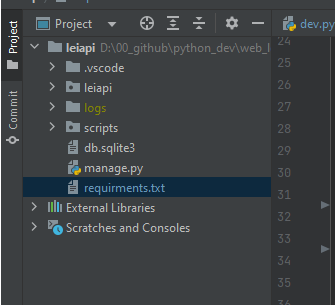
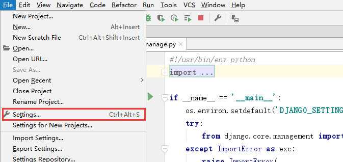
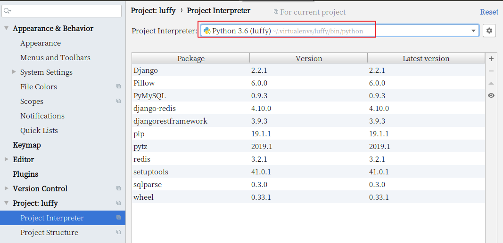

## 4.1 创建项目

```python
cd ~/Desktop
mkdir web_lei
cd web_lei
django-admin startproject leiapi
```

效果:




## 4.3 打开项目

在pycharm中打开项目


设置虚拟环境







启动django项目


效果：


提示：

```
在pycharm中如果要使用已经创建好的虚拟环境，则必须设置pycharm中的python解释器，设置为虚拟环境中的python。
```


## 4.2 调整目录

```
weblei/
  ├── docs/          # 项目相关资料保存目录
  ├── leiFront/     # 前端项目目录
  ├── leiapi/      # 后端项目目录
       ├── logs/          # 项目运行时/开发时日志目录
       ├── manage.py
       ├── leiapi/      # 项目主应用，开发时的代码保存
       │    ├── apps/      # 开发者的代码保存目录，以模块[子应用]为目录保存
       │    ├── libs/      # 第三方类库的保存目录[第三方组件、模块]
       │    ├── settings/
       │         ├── dev.py   # 项目开发时的本地配置
       │         ├── prod.py  # 项目上线时的运行配置
       │    ├── urls.py    # 总路由
       │    ├── utils/     # 多个模块[子应用]的公共函数类库[自己开发的组件]
       └── scripts/       # 保存项目运营时的脚本文件
```

在编辑中开发项目时,必须指定项目目录才能运行,例如,开发后端项目,则必须选择的目录是luffyapi

```bash
上面的目录结构图，使用linux的命令tree输出的。
如果没有安装tree，可以使用 sudo apt install tree，就有了。
```

### 4.2.1 分不同环境进行项目配置

开发者本地的环境、目录、数据库密码和线上的服务器都会不一样,所以我们的配置文件可以针对不同的系统分成多分.

1. 在项目主应用下,创建一个settings的配置文件存储目录
2. 根据线上线下两种情况分别创建2个配置文件 dev.py和prod.py
3. 把原来项目主应用的 settings.py配置内容复制2份到dev.py和prod.py里面
4. 把原来的settings.py配置文件修改文件名或者删除

新的目录settings:


接下来,就可以根据在manage.py中根据不同的情况导入对应的配置文件了.


---

## 4.3 创建代码版本

cd进入到自己希望存储代码的目录路径，并创建本地仓库.git【pycharm直接打开终端就是项目根目录了。无须cd了】
新创建的本地仓库.git是个空仓库

```python
cd 目录路径
git init
```


### 4.3.1 配置用户名和邮箱

```
git config --global user.name 'user.name'
git config --global user.email 'user.email'
```


## 4.4 在gitee平台创建工程

公司一般都会有自己的代码仓库，一般都是自己搭建，也有使用第三方提供代码管理平台。

常用的代码管理平台：github、gitee(码云)、codepen

如果公司自己搭建的代码管理平台，gitlab框架

1） 创建私有项目库


创建私有空仓库以后的界面:


2）克隆项目到本地

```python
注意：
	我们当前项目不需要这个步骤
    这个步骤是 当以后我们进入公司里面，参与人家已经在做的项目时，别人已经有仓库了，但是我们是新人加入项目中的，那么我们不需要在自己本地进行git init，直接git clone 复制别人的仓库代码
```


```
git clone 仓库地址
注意，如果当前目录下出现git仓库同名目录时，会克隆失败。
```


3）创建并切换分支到dev

```
# git branch dev      # 创建本地分支dev,dev是自定义
# git checkout dev    # 切换本地分支代码
git checkout -b dev   # 这里是上面两句代码的简写
```


git提交

```shell
git add 代码目录   # 添加代码到上传队列
git status        # 查看当前项目的版本状态
git commit -m '添加项目代码'  # 提交代码到本地仓库， -m 表示本次提交的描述
```

推送到远端

```shell
git push origin dev:dev
```

如果推送代码,出现以下提示: git pull ....,则表示当前本地的代码和线上的代码版本不同.

```
1. 把线上的代码执行以下命令,拉取到本地,进行同步
git pull

2. 根据提示,移除多余的冲突的文件,也可以删除.
完成这些步骤以后,再次add,commit,push即可.
```


接下来，我们就把上面创建好的本地项目提交到gitee码云上面

```bash
# .表示当前目录下所有的文件或目录提交到上传队列[上传队列也叫"暂存区"]
git add .

# 把本地上传队列的代码提交到本地仓库
git commit -m "项目初始化搭建"

# 给本地的git版本控制软件设置项目的远程仓库地址
git remote add origin https://gitee.com/mooluo/luffyproject.git

# 提交代码给远程仓库
git push -u origin master
```


```
扩展：
1. 通过 git status 可以查看当前项目的代码版本状态
2. 通过 git reflog 可以查看代码版本日志[简单格式]
3. 通过 git log    可以查看代码版本日志[详细格式]
4. 删除分支 git branch -D 分支名称
   注意,不能删除当前所在分支,必须切换到别的分支上才能进行删除
```

最终，成功提交了代码版本到gitee平台。效果：


上面虽然成功移交了代码版本，但是一些不需要的文件也被提交上去了。

所以，我们针对一些不需要的文件，可以选择从代码版本中删除，并且使用`.gitignore`把这些垃圾文件过滤掉。

```bash
git rm 文件  # 删除单个文件
git rm -rf 目录  # 递归删除目录

# 以下操作建议通过ubuntu的终端来完成，不要使用pycharm提供，否则删除.idea还会继续生成。
git rm -rf .idea
git rm db.sqlite3
# 注意，上面的操作只是从项目的源代码中删除，但是git是不知情的，所以我们需要同步。
git add .
git commit -m "删除不必要的文件或目录"
git push -u origin master
```

使用``.gitignore``把一些垃圾文件过滤掉。

```
vim .gitignore

./idea
./idea/*
./git
./db.sqlite3
```

开发时我们经常会使用pycharm的提供的git管理工具来完成代码的拉取和推送。

