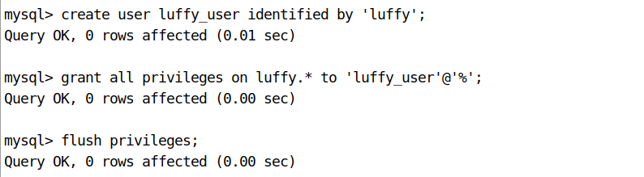

### 日志的处理

在settings/dev.py文件中追加如下配置：

```python
# 日志配置
LOGGING = {
    'version': 1,
    'disable_existing_loggers': False,
    'formatters': {
        'verbose': {
            'format': '%(levelname)s %(asctime)s %(module)s %(lineno)d %(message)s'
        },
        'simple': {
            'format': '%(levelname)s %(module)s %(lineno)d %(message)s'
        },
    },
    'filters': {
        'require_debug_true': {
            '()': 'django.utils.log.RequireDebugTrue',
        },
    },
    'handlers': {
        'console': {
            'level': 'DEBUG',
            'filters': ['require_debug_true'],
            'class': 'logging.StreamHandler',
            'formatter': 'simple'
        },
        'file': {
            'level': 'INFO',
            'class': 'logging.handlers.RotatingFileHandler',
            # 日志位置,日志文件名,日志保存目录必须手动创建
            'filename': os.path.join(os.path.dirname(BASE_DIR), "logs/luffy.log"),
            # 日志文件的最大值,这里我们设置300M
            'maxBytes': 300 * 1024 * 1024,
            # 日志文件的数量,设置最大日志数量为10
            'backupCount': 10,
            # 日志格式:详细格式
            'formatter': 'verbose'
        },
    },
    # 日志对象
    'loggers': {
        'django': {
            'handlers': ['console', 'file'],
            'propagate': True, # 是否让日志信息继续冒泡给其他的日志处理系统
        },
    }
}
```

### 异常捕获

#### 自定义模块

新建utils/exceptions.py

```python
from rest_framework.views import exception_handler

from django.db import DatabaseError
from rest_framework.response import Response
from rest_framework import status

import logging
logger = logging.getLogger('django')


def custom_exception_handler(exc, context):
    """
    自定义异常处理
    :param exc: 异常类
    :param context: 抛出异常的上下文
    :return: Response响应对象
    """
    # 调用drf框架原生的异常处理方法
    response = exception_handler(exc, context)
    if response is None:
        view = context['view']
        if isinstance(exc, DatabaseError):
            # 数据库异常
            logger.error('[%s] %s' % (view, exc))
            response = Response({'message': '服务器内部错误'}, status=status.HTTP_507_INSUFFICIENT_STORAGE)

    return response
```

#### 添加配置

settings.py配置文件中添加

```python
REST_FRAMEWORK = {
    # 异常处理
    'EXCEPTION_HANDLER': 'luffyapi.utils.exceptions.custom_exception_handler',
}
```

## 4.7 创建数据库

```mysql
create database web_lei default charset=utf8mb4;
```


为当前项目创建数据库用户[这个用户只能看到这个数据库]

```mysql
create user lei_user identified by 'web_lei';
grant all privileges on luffy.* to 'lei_user'@'%';
flush privileges;
```



## 4.8 配置数据库连接

打开settings/dev.py文件，并配置

```python
DATABASES = {
    "default": {
        "ENGINE": "django.db.backends.mysql",
        "HOST": "127.0.0.1",
        "PORT": 3306,
        "USER": "luffy_user",
        "PASSWORD": "luffy",
        "NAME": "luffy",
    }
}
```


在项目主模块的 `__init__.py`中导入pymysql

```python
import pymysql

pymysql.install_as_MySQLdb()
```


#### 调整错误

数据库版本检测导致的错误


数据库的版本检测代码注释掉。


第二个错误也是因为数据库版本的默认编码导致，query返回的内容格式使用有误。

新增一行代码，把query查询结果转换格式为 bytes类型

