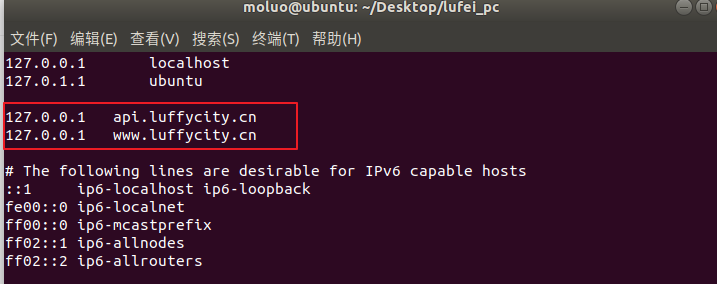
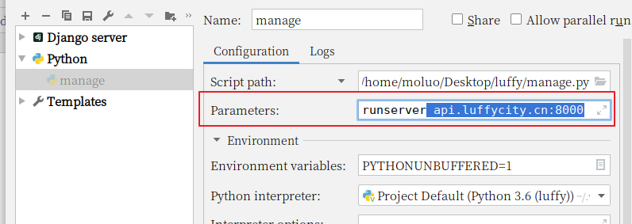

# 6. 跨域CORS

我们现在为前端和后端分别设置两个不同的域名：

| 位置 | 域名               |
| ---- | ------------------ |
| 前端 | `www.luffycity.cn` |
| 后端 | `api.luffycity.cn` |

编辑`/etc/hosts`文件，可以设置本地域名

```bash
sudo vim /etc/hosts
C:\Windows\System32\drivers\etc\hosts
```

- 在文件中增加两条信息

```shell
127.0.0.1   localhost
127.0.0.1   api.weblei.cn
127.0.0.1   www.weblei.cn
```



通过浏览器访问前端vue项目，会出现nginx的欢迎页面，主要因为我们当前操作中已经有一个nginx监听了80端口，所以访问www.luffycity.cn网址时，会自动被转发到127.0.0.1本机，因为没有网址默认端口是80端口，所以被nginx进行处理了当前请求，因此我们暂时先把nginx关闭先。

```bash
# 查找nginx的进程
ps -ef|grep nginx
# 关闭进程
sudo kill -9 nginx进程号
```


关闭了nginx以后，访问www.luffy.cirty.cn网址，效果：


上面并不是错误，而是没人监听了这个地址和端口了，解决方法：

- 暂停运行前端项目，并修改配置文件config/index.js

```javascript
    host: 'www.luffycity.cn', // can be overwritten by process.env.HOST
    port: 8080, // can be overwritten by process.env.PORT, if port is in use, a free one will be determined
    autoOpenBrowser: true,
```

- 保存修改信息，并重启项目


通过浏览器访问drf项目,会出现以下错误信息


可以通过settings/dev.py的ALLOWED_HOSTS,设置允许访问

```python
# 设置哪些客户端可以通过地址访问到后端
ALLOWED_HOSTS = [
    'api.luffycity.cn',
]
```


让用户访问的时候，使用api.luffycity.cn:8000

```
1. 修改pycharm的manage.py的配置参数
```




现在，前端与后端分处不同的域名，我们需要为后端添加跨域访问的支持

否则前端无法使用axios无法请求后端提供的api数据，我们使用CORS来解决后端对跨域访问的支持。

使用django-cors-headers扩展

```
在 Response(headers={"Access-Control-Allow-Origin":'客户端地址/*'})
```


文档：https://github.com/ottoyiu/django-cors-headers/

安装

```python
pip install django-cors-headers
```

#### 后端配置

1. 添加应用

```python
INSTALLED_APPS = (
    ...
    'corsheaders',
    ...
)
```

2. 中间件设置【必须写在第一个位置】

```python
MIDDLEWARE = [
    'corsheaders.middleware.CorsMiddleware',
    ...
]
```

3. 添加白名单

```python
# CORS组的配置信息
CORS_ORIGIN_WHITELIST = (
    'www.luffycity.cn:8080',
)
CORS_ALLOW_CREDENTIALS = False  # 允许ajax跨域请求时携带cookie
```


完成了上面的步骤，我们就可以通过后端提供数据给前端使用ajax访问了。

前端使用 axios就可以访问到后端提供给的数据接口，但是如果要附带cookie信息，前端还要设置一下。

前端引入axios插件并配置允许axios发送cookie信息[axios本身也不允许ajax发送cookie到后端

```
npm i axios -S
```


#### 前端配置

在main.js中引用 axios插件

```javascript
import axios from 'axios'; // 从node_modules目录中导入包
// 允许ajax发送请求时附带cookie
axios.defaults.withCredentials = false;

Vue.prototype.$axios = axios; // 把对象挂载vue中
```


