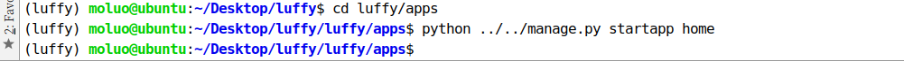
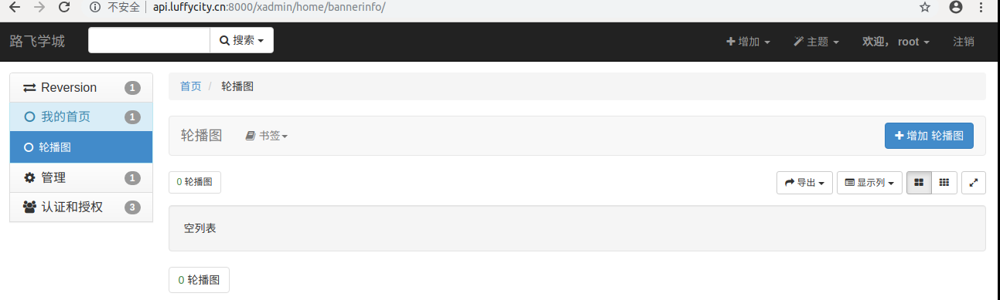

# 首页

## 前端显示首页

### 首页组件代码

Home.vue

```vue
<template>
  <div id="home">
    <Header/>
    <Banner/>
    <Footer/>
  </div>
</template>

<script>
import Header from "./common/Header"
import Banner from "./common/Banner"
import Footer from "./common/Footer"

export default {
  name:"Home",
  data(){
    return {

    }
  },
  components:{
    Header,
    Banner,
    Footer,
  }
}
</script>

<style scoped>

</style>

```


### 首页头部子组件

Header.vue

```vue
<template>
  <div class="header">
    <el-container>
      <el-header>
        <el-row>
          <el-col class="logo" :span="3">
            <a href="/">
              
            </a>
          </el-col>
          <el-col class="nav" :span="16">
              <el-row>
                <el-col :span="3"><router-link class="current" to="/course">免费课</router-link></el-col>
                <el-col :span="3"><router-link to="/">轻课</router-link></el-col>
                <el-col :span="3"><router-link to="/">学位课</router-link></el-col>
                <el-col :span="3"><router-link to="/">题库</router-link></el-col>
                <el-col :span="3"><router-link to="/">教育</router-link></el-col>
              </el-row>
          </el-col>
          <el-col class="login-bar" :span="5">
            <el-row v-if="token">
              <el-col class="cart-ico" :span="9">
                <router-link to="">
                  <b class="goods-number">0</b>
                  
                  <span><router-link to="/cart">购物车</router-link></span>
                </router-link>
              </el-col>
              <el-col class="study" :span="8" :offset="2"><router-link to="">学习中心</router-link></el-col>
              <el-col class="member" :span="5">
                <el-menu class="el-menu-demo" mode="horizontal">
                  <el-submenu index="2">
                    <template slot="title"><router-link to=""></router-link></template>
                    <el-menu-item index="2-1">我的账户</el-menu-item>
                    <el-menu-item index="2-2">我的订单</el-menu-item>
                    <el-menu-item index="2-3">我的优惠卷</el-menu-item>
                    <el-menu-item index="2-3">退出登录</el-menu-item>
                  </el-submenu>
                </el-menu>
              </el-col>
            </el-row>
            <el-row v-else>
              <el-col class="cart-ico" :span="9">
                <router-link to="">
                  
                  <span><router-link to="/cart">购物车</router-link></span>
                </router-link>
              </el-col>
              <el-col :span="10" :offset="5">
                <span class="register">
                  <router-link to="/login">登录</router-link>
                  &nbsp;&nbsp;|&nbsp;&nbsp;
                  <router-link to="/register">注册</router-link>
                </span>
              </el-col>
            </el-row>
          </el-col>
        </el-row>
      </el-header>
    </el-container>
  </div>
</template>

<script>
  export default {
    name: "Header",
    data(){
      return {
        // 设置一个登录标识，表示是否登录
        token: false,
      };
    }
  }
</script>

<style scoped>
  .header{
    top:0;
    left:0;
    right:0;
    margin: auto;
    background-color: #fff;
    height: 80px;
    z-index: 1000;
    position: fixed;
    box-shadow: 0 0.5px 0.5px 0 #c9c9c9;
  }
  .header .el-container{
    width: 1200px;
    margin: 0 auto;
  }
  .el-header{
    height: 80px!important;
    padding:0;
  }
  .logo{

  }
  .logo img{
    padding-top: 22px;
  }

  .nav{
    margin-top: 22px;
  }

  .nav .el-col a{
    display: inline-block;
    text-align: center;
    padding-bottom: 16px;
    padding-left: 5px;
    padding-right: 5px;
    position: relative;
    font-size: 16px;
    margin-left: 20px;
  }

  .nav .el-col .current{
    color: #4a4a4a;
    border-bottom: 4px solid #ffc210;
  }

  .login-bar{
    margin-top: 22px;
  }
  .cart-ico{
    position: relative;
    border-radius: 17px;
  }
  .cart-ico:hover{
    background: #f0f0f0;
  }
  .goods-number{
    width: 16px;
    height: 16px;
    line-height: 17px;
    font-size: 12px;
    color: #fff;
    text-align: center;
    background: #fa6240;
    border-radius: 50%;
    transform: scale(.8);
    position: absolute;
    left: 16px;
    top: -1px;
  }
  .cart-icon{
    width: 15px;
    height: auto;
    margin-left: 6px;
  }
  .cart-ico span{
    margin-left: 12px;
  }
  .member img{
    width: 26px;
    height: 26px;
    border-radius: 50%;
    display: inline-block;
  }
  .member img:hover{
    border: 1px solid yellow;
  }

</style>

```

### 脚部子组件

Footer.vue

```vue
<template>
  <div class="footer">
    <el-container>
      <el-row>
        <el-col :span="4"><router-link to="">关于我们</router-link></el-col>
        <el-col :span="4"><router-link to="">联系我们</router-link></el-col>
        <el-col :span="4"><router-link to="">商务合作</router-link></el-col>
        <el-col :span="4"><router-link to="">帮助中心</router-link></el-col>
        <el-col :span="4"><router-link to="">意见反馈</router-link></el-col>
        <el-col :span="4"><router-link to="">新手指南</router-link></el-col>
        <el-col :span="24"><p class="copyright">Copyright © luffycity.com版权所有 | 京ICP备17072161号-1</p></el-col>
      </el-row>
    </el-container>
  </div>
</template>

<script>
  export default {
    name:"Footer",
    data(){
      return {}
    }
  }
</script>


<style scoped>
.footer{
  width: 100%;
  height: 128px;
  background: #25292e;
}
.footer .el-container{
  width: 1200px;
  margin: auto;
}
.footer .el-row {
  align-items: center;
  padding: 0 200px;
  padding-bottom: 15px;
  width: 100%;
  margin-top: 38px;
}
.footer .el-row a{
  color: #fff;
  font-size: 14px;
}
.footer .el-row .copyright{
  text-align: center;
  color: #fff;
  font-size: 14px;
}
</style>

```

### 轮播图子组件

Banner.vue

```vue
<template>
  <div class="banner">
      <el-carousel trigger="click" height="473px">
        <el-carousel-item v-for="banner in banner_list">
          <a :href="banner.link"></a>
        </el-carousel-item>
      </el-carousel>
  </div>
</template>

<script>
  export default {
    name:"Banner",
    data(){
      return {
        banner_list:[
          {link:"http://www.baidu.com",img:"/static/banner/1.png"},
          {link:"http://www.baidu.com",img:"/static/banner/2.png"},
          {link:"http://www.baidu.com",img:"/static/banner/3.png"},
        ]
      };
    }
  }
</script>

<style>
.el-carousel__arrow{
  width: 100px!important;
  height: 100px!important;
}
.el-icon-arrow-left{
  font-size: 35px;
  margin-left: 50px;
}
.el-carousel__arrow--left{
  left: -50px;
}
</style>
```


### 注册首页路由

```python
import Vue from "vue"
import Router from "vue-router"

// 导入需要注册路由的组件
import Home from "../components/Home"
Vue.use(Router);

// 配置路由列表
export default new Router({
  mode:"history",
  routes:[
    // 路由列表
    {
      name:"Home",
      path: "/home",
      component:Home,
    },
    {
      name:"Home",
      path: "/",
      component:Home,
    }
  ]
})

```


## 轮播图功能实现

### 安装依赖模块和配置

#### 图片处理模块

前面已经安装了，如果没有安装则需要安装

```shell
pip install pillow
```


#### 上传文件相关配置

settings.py

```python
# 访问静态文件的url地址前缀
STATIC_URL = '/static/'
# 设置django的静态文件目录
STATICFILES_DIRS = [
    os.path.join(BASE_DIR,"static")
]

# 项目中存储上传文件的根目录[暂时配置]，注意，uploads目录需要手动创建否则上传文件时报错
MEDIA_ROOT=os.path.join(BASE_DIR,"uploads")
# 访问上传文件的url地址前缀
MEDIA_URL ="/media/"

```


在django项目中转换上传文件的Url地址，总路由urls.py新增代码：

```python
from django.urls import re_path
from django.conf import settings
from django.views.static import serve

urlpatterns = [
  	...
    re_path(r'media/(?P<path>.*)', serve, {"document_root": settings.MEDIA_ROOT}),
]
```


### 注册home子应用

因为当前功能是drf的第一个功能，所以我们先创建一个子应用home，创建在luffy/apps目录下



注册home子应用，因为子应用的位置发生了改变，所以为了原来子应用的注册写法，所以新增一个导包路径：

```python
# Build paths inside the project like this: os.path.join(BASE_DIR, ...)
BASE_DIR = os.path.dirname(os.path.dirname(os.path.abspath(__file__)))

# 新增一个系统导包路径
import sys
sys.path.insert(0,os.path.join(BASE_DIR,"apps"))
INSTALLED_APPS = [
	# 注意，加上drf框架的注册	
    'rest_framework',
    
    # 子应用
    'home',

]
```

注意，pycharm会路径错误的提示。可以鼠标右键设置apps为 mark dir.... as source root

后端的开发顺序：模型-》视图-》序列化器-》路由

#### 新建开发分支进行独立开发

接下来,我们完成的功能[轮播图]这些,建议采用开发分支来完成,所以我们可以通过以下命令,复刻一份代码[也就是新建一个分支]出来进行独立开发.这样的话,就不会影响到线上的主干代码!!!

```
# 新建一个分支 
git branch 分支名称

# 查看所有分支
git branch

# 切换分支[-b表示新建分支的同时并切换到新分支]
git checkout -b 分支名称

# 删除分支
git branch -d 分支名称
```

接下来,我们可以创建一个dev开发分支并在开发分支下干活!

```
git branch dev
git checkout dev
```


### 创建轮播图的模型

home/models.py

```python
from django.db import models

# Create your models here.
class Banner(models.Model):
    """轮播广告图模型"""
    # 模型字段
    title = models.CharField(max_length=500, verbose_name="广告标题")
    link = models.CharField(max_length=500, verbose_name="广告链接")
    # upload_to 设置上传文件的保存子目录
    image_url =  models.ImageField(upload_to="banner", null=True, blank=True, max_length=255, verbose_name="广告图片")
    remark = models.TextField(verbose_name="备注信息")
    is_show = models.BooleanField(default=False, verbose_name="是否显示")
    orders = models.IntegerField(default=1, verbose_name="排序")
    is_deleted = models.BooleanField(default=False, verbose_name="是否删除")

    # 表信息声明
    class Meta:
        db_table = "lei_banner"
        verbose_name = "轮播广告"
        verbose_name_plural = verbose_name

    # 自定义方法[自定义字段或者自定义工具方法]
    def __str__(self):
        return self.title
```


数据迁移

```python
python manage.py makemigrations
python manage.py migrate
```

效果：


### 视图代码

views.py

```python
from django.shortcuts import render

# Create your views here.
from rest_framework.generics import ListAPIView
from .models import Banner
from .serializers import BannerModelSerializer
from leiapi.settings import constants
class BannerListAPIView(ListAPIView): # 自动导包
    queryset = Banner.objects.filter(is_show=True, is_deleted=False).order_by("-orders","-id")[:constants.BANNER_LENGTH]
    serializer_class = BannerModelSerializer
```


### 序列化器

home/serializers.py

```python
from rest_framework import serializers
from .models import Banner
class BannerModelSerializer(serializers.ModelSerializer):
    """轮播广告的序列化器"""
    # 模型序列化器字段声明
    class Meta:
        model = Banner
        fields = ["image_url","link"]
 #序列化器一般的内容   
    #字段声明
    #模型序列化器字段声明
    #验证方法
    #储存数据的方法
```

### 疑问：

- 序列化器的作用：
  1. 序列化,序列化器会把模型对象转换成字典,将来提供给视图经过response以后变成json字符串
  2. 反序列化,把客户端发送过来的数据,经过视图调用request以后变成python字典,序列化器可以把字典转成模型
  3. 反序列化,完成数据校验功能和操作数据库

- class Meta的作用：

  


### 路由代码

home/urls.py

```python
from django.urls import path,re_path
from . import views
urlpatterns = [
    path("banner/",views.BannerListAPIView.as_view()),#.as_view()作用：将类视图转化为可识别的函数视图
]
```

把home的路由urls.py注册到总路由

```python
from django.contrib import admin
from django.urls import path,re_path,include
from django.conf import settings
from django.views.static import serve

urlpatterns = [
    path('admin/', admin.site.urls),
    re_path(r'media/(?P<path>.*)', serve, {"document_root": settings.MEDIA_ROOT}),
    path('', include("home.urls") ),
]

```

同时,我们可以通过一个配置文件,统一配置一些业务需要使用的常量,例如,显示轮播图的数据量:

settings目录新建一个constants.py常量文件:

```python
#　轮播的显示数量
BANNER_LENGTH = 10
```

访问http://api.luffycity.cn:8000/banner/，效果：


所以我们需要有一个后台提供数据.安装xadmin

```python
pip install https://codeload.github.com/sshwsfc/xadmin/zip/django2 -i https://pypi.douban.com/simple/
```

在配置文件中注册如下应用

```python
INSTALLED_APPS = [
    ...
    'xadmin',
    'crispy_forms',
    'reversion',
    ...
]

# 修改使用中文界面
LANGUAGE_CODE = 'zh-Hans'

# 修改时区
TIME_ZONE = 'Asia/Shanghai'
```


xadmin有建立自己的数据库模型类，需要进行数据库迁移

```shell
python manage.py makemigrations
python manage.py migrate
```


在总路由中添加xadmin的路由信息

```python
import xadmin
xadmin.autodiscover()

# version模块自动注册需要版本控制的 Model
from xadmin.plugins import xversion
xversion.register_models()

urlpatterns = [
    path(r'xadmin/', xadmin.site.urls),
]
```


如果之前没有创建超级用户，需要创建，如果有了，则可以直接使用之前的。

```python
python manage.py createsuperuser
```


#### 给xadmin设置基本站点配置信息

```python
import xadmin
from xadmin import views

class BaseSetting(object):
    """xadmin的基本配置"""
    enable_themes = True  # 开启主题切换功能
    use_bootswatch = True

xadmin.site.register(views.BaseAdminView, BaseSetting)

class GlobalSettings(object):
    """xadmin的全局配置"""
    site_title = "路飞学城"  # 设置站点标题
    site_footer = "路飞学城有限公司"  # 设置站点的页脚
    menu_style = "accordion"  # 设置菜单折叠

xadmin.site.register(views.CommAdminView, GlobalSettings)
```


### 注册轮播图模型到xadmin中


在当前子应用中创建adminx.py，添加如下代码

```python
# 轮播图
from .models import BannerInfo
class BannerInfoModelAdmin(object):
    list_display=["title","orders","is_show"]
xadmin.site.register(BannerInfo, BannerInfoModelAdmin)
```


#### 修改后端xadmin中子应用名称

子应用/apps.py

```python
class HomeConfig(AppConfig):
    name = 'home'
    verbose_name = '我的首页'
```

``__init__.py``

```python
default_app_config = "home.apps.HomeConfig"
```



给轮播图添加测试数据


添加几条测试数据效果：


经过上面的操作,我们就完成了轮播图的API接口,接下来,可以考虑提交一个代码版本.

但是,我们前面创建了一个本地开发分支,所以我们如果直接提交代码,默认是在dev分支提交的.

所以就不能直接使用`git push`,而是采用以下命令提交

```bash
git add .
git commit -m "服务端实现轮播图的API接口"
# 注意  dev:dev  表示从本地的dev中把代码推送到线上分支dev,如果线上没有dev分支,则自动创建dev分支
git push origin dev:dev
```

经过上面的操作,我们就可以看到,线上也存在了一个dev分支,而master分支的代码并没有变化.

开发中,如果dev的代码经过开发人员的自测以后,就可以申请合并dev分支代码到主分支,master里面去了.

1. 申请合并分支


2. 填写申请合并分支的表单


3. 经过测试和审查人员的检查通过以后,我们就可以直接合并分支了.


4. 开发人员合并分支

   

5. 审查和测试人员同意合并分支

   


### 客户端代码获取数据

Banner.vue代码：

```vue
<template>
  <el-carousel height="720px" :interval="3000" arrow="always">
    <el-carousel-item :key="key" v-for="banner,key in banner_list">
      <a :href="banner.link"></a>
    </el-carousel-item>
  </el-carousel>
</template>

<script>
    export default {
        name: "Banner",
        data(){
            return {
                banner_list:[]
            }
        },
        created() {
            this.get_banner_list();
        },
        methods:{
            get_banner_list(){
                // 获取轮播广告列表
                this.$axios.get(`${this.$settings.HOST}/banner/`,{}).then(response=>{
                  this.banner_list = response.data;
                }).catch(error=>{
                  console.log(error.response)
                });
            }
        }
    }
</script>

<style scoped>
  .el-carousel__item h3 {
    color: #475669;
    font-size: 18px;
    opacity: 0.75;
    line-height: 300px;
    margin: 0;
  }

  .el-carousel__item:nth-child(2n) {
    background-color: #99a9bf;
  }

  .el-carousel__item:nth-child(2n+1) {
    background-color: #d3dce6;
  }
</style>

```

效果：


## 导航功能实现

### 创建模型

引入一个公共模型【抽象模型，不会在数据迁移的时候为它创建表】

```python
from django.db import models
from luffyapi.utils.models import BaseModel
# Create your models here.
class Banner(BaseModel):
    """轮播广告图模型"""
    # 模型字段
    title = models.CharField(max_length=500, verbose_name="广告标题")
    link = models.CharField(max_length=500, verbose_name="广告链接")
    # upload_to 设置上传文件的保存子目录
    image_url =  models.ImageField(upload_to="banner", null=True, blank=True, max_length=255, verbose_name="广告图片")
    remark = models.TextField(verbose_name="备注信息")

    # 表信息声明
    class Meta:
        db_table = "ly_banner"
        verbose_name = "轮播广告"
        verbose_name_plural = verbose_name

    # 自定义方法[自定义字段或者自定义工具方法]
    def __str__(self):
        return self.title


class Nav(BaseModel):
    """导航菜单模型"""
    POSITION_OPTION = (
        (1, "顶部导航"),
        (2, "脚部导航"),
    )
    title = models.CharField(max_length=500, verbose_name="导航标题")
    link = models.CharField(max_length=500, verbose_name="导航链接")
    position = models.IntegerField(choices=POSITION_OPTION, default=1, verbose_name="导航位置")
    is_site = models.BooleanField(default=False, verbose_name="是否是站外地址")

    class Meta:
        db_table = 'ly_nav'
        verbose_name = '导航菜单'
        verbose_name_plural = verbose_name

    # 自定义方法[自定义字段或者自定义工具方法]
    def __str__(self):
        return self.title
```

公共模型，保存项目的公共代码库目录下luffy/utils.py文件中。

```python
from django.db import models

class BaseModel(models.Model):
    """公共模型"""
    is_show = models.BooleanField(default=False, verbose_name="是否显示")
    orders = models.IntegerField(default=1, verbose_name="排序")
    is_deleted = models.BooleanField(default=False, verbose_name="是否删除")
    created_time = models.DateTimeField(auto_now_add=True, verbose_name="添加时间")
    updated_time = models.DateTimeField(auto_now=True, verbose_name="修改时间")

    class Meta:
        # 设置当前模型为抽象模型，在数据迁移的时候django就不会为它单独创建一张表
        abstract = True
```


数据迁移

```python
python manage.py makemigrations
python manage.py migrate
```


### 序列化器代码

```python
from .models import Nav
class NavModelSerializer(serializers.ModelSerializer):
    """导航菜单序列化器"""
    class Meta:
        model = Nav
        fields = ["title","link","is_site"]
```


### 视图代码

views.py

```python
from django.shortcuts import render
from rest_framework.generics import ListAPIView
from .models import Banner
from .serializers import BannerModelSerializer
from luffyapi.settings import constants

class BannerListAPIView(ListAPIView): # 自动导包
    """轮播广告视图"""
    queryset = Banner.objects.filter(is_show=True, is_deleted=False).order_by("-orders","-id")[:constants.BANNER_LENGTH]
    serializer_class = BannerModelSerializer

from .models import Nav
from .serializers import NavModelSerializer
class HeaderNavListAPIView(ListAPIView):
    """导航菜单视图"""
    queryset = Nav.objects.filter(is_show=True, is_deleted=False,position=1).order_by("-orders","-id")[:constants.HEADER_NAV_LENGTH]
    serializer_class = NavModelSerializer


class FooterNavListAPIView(ListAPIView):
    """导航菜单视图"""
    queryset = Nav.objects.filter(is_show=True, is_deleted=False,position=2).order_by("-orders","-id")[:constants.FOOTER_NAV_LENGTH]
    serializer_class = NavModelSerializer
```

#### 常量配置

settings/constants.py，代码：

```python
# 首页展示的轮播广告数量
BANNER_LENGTH = 10
# 顶部导航的数量
HEADER_NAV_LENGTH = 7
# 脚部导航的数量
FOOTER_NAV_LENGTH = 7
```


### 路由代码

urls.py

```python
from django.urls import path,re_path
from . import views
urlpatterns = [
    path("banner/",views.BannerListAPIView.as_view()),
    path("nav/header/",views.NavHeaderListAPIView.as_view()),
    path("nav/footer/",views.NavFooterListAPIView.as_view()),
]
```


### 注册导航模型到xadmin中

在当前子应用adminx.py，添加如下代码

```python
import xadmin
from xadmin import views

class BaseSetting(object):
    """xadmin的基本配置"""
    enable_themes = True  # 开启主题切换功能
    use_bootswatch = True

xadmin.site.register(views.BaseAdminView, BaseSetting)

class GlobalSettings(object):
    """xadmin的全局配置"""
    site_title = "路飞学城"  # 设置站点标题
    site_footer = "路飞学城有限公司"  # 设置站点的页脚
    menu_style = "accordion"  # 设置菜单折叠

xadmin.site.register(views.CommAdminView, GlobalSettings)


# 轮播图
from .models import Banner
class BannerModelAdmin(object):
    list_display=["title","orders","is_show"]
xadmin.site.register(Banner, BannerModelAdmin)

# 导航菜单
from home.models import Nav
class NavModelAdmin(object):
    list_display=["title","link","is_show","is_site","position"]
xadmin.site.register(Nav, NavModelAdmin)
```

添加测试数据


### 客户端代码获取数据

Header.vue代码：

```vue
<template>
  <div class="header">
    <el-container>
      <el-header>
        <el-row>
          <el-col class="logo" :span="3">
            <a href="/">
              
            </a>
          </el-col>
          <el-col class="nav" :span="16">
            <el-row>
              <el-col :span="3" v-for="(nav,index) in nav_list" :key="index" >
                <router-link :to="{path: nav.link} ">{{nav.title}}</router-link
                ></el-col>
            </el-row>
          </el-col>
          <el-col class="login-bar" :span="5">
            <el-row v-if="token">
              <el-col class="cart-ico" :span="9">
                <router-link to="">
                  <b class="goods-number">0</b>
                  
                  <span><router-link to="/cart">购物车</router-link></span>
                </router-link>
              </el-col>
              <el-col class="study" :span="8" :offset="2"><router-link to="">学习中心</router-link></el-col>
              <el-col class="member" :span="5">
                <el-menu class="el-menu-demo" mode="horizontal">
                  <el-submenu index="2">
                    <template slot="title"><router-link to=""></router-link></template>
                    <el-menu-item index="2-1">我的账户</el-menu-item>
                    <el-menu-item index="2-2">我的订单</el-menu-item>
                    <el-menu-item index="2-3">我的优惠卷</el-menu-item>
                    <el-menu-item index="2-3">退出登录</el-menu-item>
                  </el-submenu>
                </el-menu>
              </el-col>
            </el-row>
            <el-row v-else>
              <el-col class="cart-ico" :span="9">
                <router-link to="">
                  
                  <span><router-link to="/cart">购物车</router-link></span>
                </router-link>
              </el-col>
              <el-col :span="10" :offset="5">
                <span class="register">
                  <router-link to="/login">登录</router-link>
                  &nbsp;&nbsp;|&nbsp;&nbsp;
                  <router-link to="/register">注册</router-link>
                </span>
              </el-col>
            </el-row>
          </el-col>
        </el-row>
      </el-header>
    </el-container>
  </div>
</template>

<script>
export default {
  name: "Header",
  data(){
    return{
      nav_list: [],
    }
  },
  created() {
    this.get_nav();
  },
  methods:{
    get_nav(){
      this.$axios.get(`${this.$settings.Host}/nav/header/`,{}).then(response=>{
        this.nav_list = response.data;
      }).catch(error=>{
        console.log(error.response);
      })
    }
  }
}
</script>

<style scoped>
.header{
  top:0;
  left:0;
  right:0;
  margin: auto;
  background-color: #fff;
  height: 80px;
  z-index: 1000;
  position: fixed;
  box-shadow: 0 0.5px 0.5px 0 #c9c9c9;
}
.header .el-container{
  width: 1200px;
  margin: 0 auto;
}
.el-header{
  height: 80px!important;
  padding:0;
}
.logo{

}
.logo img{
  padding-top: 22px;
}

.nav{
  margin-top: 22px;
}

.nav .el-col a{
  display: inline-block;
  text-align: center;
  padding-bottom: 16px;
  padding-left: 5px;
  padding-right: 5px;
  position: relative;
  font-size: 16px;
  margin-left: 20px;
}

.nav .el-col .current{
  color: #4a4a4a;
  border-bottom: 4px solid #ffc210;
}

.login-bar{
  margin-top: 22px;
}
.cart-ico{
  position: relative;
  border-radius: 17px;
}
.cart-ico:hover{
  background: #f0f0f0;
}
.goods-number{
  width: 16px;
  height: 16px;
  line-height: 17px;
  font-size: 12px;
  color: #fff;
  text-align: center;
  background: #fa6240;
  border-radius: 50%;
  transform: scale(.8);
  position: absolute;
  left: 16px;
  top: -1px;
}
.cart-icon{
  width: 15px;
  height: auto;
  margin-left: 6px;
}
.cart-ico span{
  margin-left: 12px;
}
.member img{
  width: 26px;
  height: 26px;
  border-radius: 50%;
  display: inline-block;
}
.member img:hover{
  border: 1px solid yellow;
}

</style>

```

Footer.vue

```vue
<template>
    <div class="footer">
      <ul>
        <li>关于我们</li>
        <li v-for="nav in nav_list">
          <span v-if="nav.is_site"><a :href="nav.link">{{nav.title}}</a></span>
          <span v-else><router-link :to="nav.link">{{nav.title}}</router-link></span>
        </li>
      </ul>
      <p>Copyright © weilei.com版权所有 | 京ICP备17072161号-1</p>
    </div>
</template>

<script>
export default {
  name: "Footer",
  data(){
    return{
      nav_list: [],
    }
  },
  created() {
    this.get_nav();
  },
  methods:{
    get_nav(){
      this.$axios.get(`${this.$settings.Host}/nav/footer/`,{}).then(response=>{
        this.nav_list = response.data;
      }).catch(error=>{
        console.log(error.response);
      })
    }
  }
}
</script>

<style scoped>
.footer {
  width: 100%;
  height: 128px;
  background: #25292e;
  color: #fff;
}
.footer ul{
  margin: 0 auto 16px;
  padding-top: 38px;
  width: 810px;
}
.footer ul li{
  float: left;
  width: 112px;
  margin: 0 10px;
  text-align: center;
  font-size: 14px;
}
.footer ul::after{
  content:"";
  display:block;
  clear:both;
}
.footer p{
  text-align: center;
  font-size: 12px;
}
</style>

```

