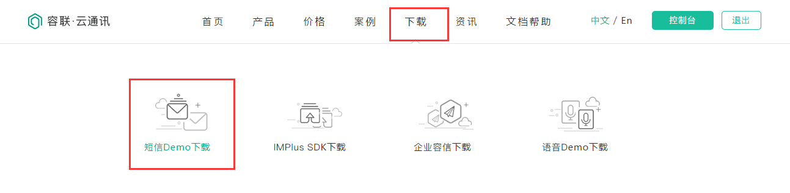

# 用户的注册认证

## 流程框图


## 序列化器的作用


### ***介绍***

#### ***概念***

- **序列化** 序列化器会将模型类对象转化为字典，`response` 后变成 `json` 字符串。
- **反序列化** 把客户发送过来的数据， `request` 后变成字典，序列化器可以将字典转成模型，同时校验客户发送数据的合法性。
- **序列化器(类)** 开发者定义的一个实现序列化和[反序列化](https://so.csdn.net/so/search?q=反序列化&spm=1001.2101.3001.7020)的类。
- **模型序列化器(类)** 一种对应 `Django` 模型的序列化器。
- **序列化器基类** `DRF` 中所有的序列化器类都必须继承于序列化器基类(`rest_framework.serializers.Serializer`) 。
- **模型序列化器基类** 序列化器基类的子类，同时 `DRF` 中所有的序列化器类都必须继承于 `rest_framework.serializers.ModelSerializer`。

### ***序列化器的作用***

- **数据对象转换** 实现序列化和反序列化。
- **数据校验** 在反序列化过程中对数据进行校验。

### ***序列化器的组成***

一个完整序列化器中应该包含三方面的内容：

#### ***转换的字段声明***

```python
客户端字段 = serializer.字段类型（字段校验项=字段值）
1
```

如果当前序列化器为模型序列化器，则需要声明调用的模型信息

```python
# serializer.py
from rest_framework import serializers
class TestModelSerializer(serializers.ModelSerializer):
    class Meta:
        model = 模型
        fields = 字段列表
123456
```

#### ***验证字段的方法***

验证字段合法性之后**必须**要将值返回（原值或者修改过的值）

#### ***模型的操作方法***

重写 `create()` 和 `update()` 两个方法，实现数据的插入和更新。

##### ***create***

添加数据操作，添加数据以后，自动实现从字典变成模型对象的过程。

##### ***update***

更新数据操作，添加数据以后，自动实现从字典变成模型对象的过程。

### ***序列化器的使用***

#### ***构造方法***

```python
TestSerializer(instance=None,data=empty,**kwargs)
```

- 用于序列化时，将模型类对象传入 `instance` 参数；
- 用于反序列化时，将要被反序列化的数据传入 `data` 参数；
- 除了 `instance` 和 `data` 参数外，在构造 `Serializer` 对象时，还可以通过 `context` 参数额外添加数据，通过 `context` 添加的数据，可以通过 `Serializer` 对象的 `context` 属性获取；

#### ***数据校验***

[数据校验](https://so.csdn.net/so/search?q=数据校验&spm=1001.2101.3001.7020)的方法：

##### ***字段选项***

自定义报错信息，在字段选项中添加选项 `error_messages`

##### ***validate***

###### ***验证一个字段***

```python
class TestSerializer(serializers.Serializer):
    def validate_<字段名>(self,value):
         pass
         return value
```

###### ***验证多个字段***

```python
class TestSerializer(serializers.Serializer):
    def validate(self,attrs):
        pass
        return attrs
```

##### ***validators***

#### ***保存和更新数据***

```python
# serializer.py
from rest_framework import serializers
class TestSerializer(serializers.Serializer):
    def create(self,validated_data):
       pass
    def update(self,instance,validate_data):
       pass
```

### ***Demo***

#### ***模型***

```python
# models.py
class Student(models.Model):
    name = models.CharField(
        null=False,
        max_length=255,
        verbose_name='姓名'
    )
    age = models.IntegerField(
        null=False,
        verbose_name='年龄'
    )
    sex = models.IntegerField(
        null=False,
        verbose_name='性别'
    )
    active = models.BooleanField(
        # 默认值为 True
        default=True,
        verbose_name='是否活跃'
    )
    description = models.CharField(
        max_length=255,
        null=True,
        blank=True,
        verbose_name='描述'
    )
    date_joined = models.DateTimeField(
        default=timezone.now,
        verbose_name='加入时间'
    )
```

#### ***路由***

```python
# urls.py
from django.urls import path
from .views import StudentView

urlpatterns = [
    path('student/<str:pk>', StudentView.as_view()),
]
```

#### ***序列化***

##### ***视图***

`views.py` 中视图函数（使用 DRF）

```python
# views.py
from rest_framework.views import APIView
from django.http import JsonResponse
from SerializerDemo.models import Student
from SerializerDemo.serializers import StudentSerializer
class StudentView(APIView):
    def get(self, request, pk):
        """
        序列化器，序列化阶段的调用
        """
        if pk == 'all':
            # 1、获取数据集
            student_list = Student.objects.all()
            # 2、实例化序列化器，得到序列化对象
            serializer = StudentSerializer(instance=student_list, many=True)
            # 3、调用序列化对象的data属性方法获取转换后的数据
            data = serializer.data
            # 4、响应数据
            return JsonResponse({'data': data, 'message': 'success'})
        else:
            query = Student.objects.filter(id=pk)
            if query.count():
                student = query.first()
                serializer = StudentSerializer(instance=student)
                data = serializer.data
                return JsonResponse({'data': data, 'message': 'success'})
            else:
                return JsonResponse({'message': 'ID不存在'})
```

##### ***序列化器***

```python
# serializers.py
from rest_framework import serializers
class StudentSerializer(serializers.Serializer):
    """
    完整的序列化类内部包含三部分的内容
    1、序列化转换的字段声明
    2、反序列化的校验器，即校验前端传入的字段
    3、反序列化模型操作的方法，create和update方法
    """
    id = serializers.IntegerField()
    date_joined = serializers.DateTimeField()
    name = serializers.CharField()
    age = serializers.IntegerField()
    active = serializers.BooleanField()
    sex = serializers.IntegerField()
    description = serializers.CharField()

    def update(self, instance, validated_data):
        pass

    def create(self, validated_data):
        pass
```

#### ***反序列化***

##### ***视图***

```python
# views.py
from rest_framework.views import APIView
from django.http import JsonResponse
from SerializerDemo.models import Student
from SerializerDemo.serializers import StudentSerializer
import json

class StudentView(APIView):
	def post(self, request):
        """反序列化，采用字段选项来验证数据"""
        # 1、接收客户端提交的数据
        # 1.1 实例化序列化器，获取序列化对象
        data = json.dumps(request.body)
        # 1.2 调用序列化对象验证数据
        serializer = StudentSerializer(data=data)
        # 1.3 获取验证结果
        serializer.is_valid()  # 不抛出异常
        serializer.is_valid(raise_exception=True)  # 抛出异常
        # 2、操作数据
        pass
        # 3、返回数据
        return JsonResponse(serializer.validated_data)
        def put(self, request):
        """反序列化，采用字段选项来验证数据"""
        # 1、根据客户端提交的数据获取指定数据
        # 1.1 实例化序列化器，获取序列化对象
        pk = request.data.get('id', '')
        student = Student.objects.filter(pk=pk).first()
        data = json.dumps(request.body)
        # 1.2 调用序列化对象验证数据
        serializer = StudentSerializer(instance=student, data=data)
        # 1.3 获取验证结果
        serializer.is_valid(raise_exception=True)  # 抛出异常
        # 2、操作数据
        # 会根据实例化序列化器的时候是否传入instance属性来自动调用create或者update方法，如果传入instance属性，调用update方法，没有传入instance属性，调用create方法
        serializer.save()
        # 3、返回数据
        return JsonResponse(serializer.data)
```

##### ***序列化器***

###### ***数据校验***

```python
def check_sex(value):
    """
    外部校验器 validator
    """
    if value not in [0, 1, 2]:
        raise serializers.ValidationError(
            detail='性别设置错误',
            code='check_sex'
        )
    return value


class StudentSerializer(serializers.Serializer):
    """
    完整的序列化类内部包含三部分的内容
    1、序列化转换的字段声明
    2、反序列化的校验器，即校验前端传入的字段
    3、反序列化模型操作的方法，create和update方法
    """
    # read_only=True,在客户端提交数据[反序列化阶段]不要求的字段
    id = serializers.IntegerField(read_only=True)
    date_joined = serializers.DateTimeField(read_only=True)
    # required=True,反序列化阶段必填
    name = serializers.CharField(required=True)
    # 最大值 max_value 和最小值 min_value
    age = serializers.IntegerField(
        max_value=100,
        min_value=0,
        error_messages={
            "min_value": "Age must older than 0",
            "max_value": "Age must younger than 100"
        }
    )
    # 默认值为 True
    active = serializers.BooleanField(default=True)
    # validator的值为列表，列表的成员为函数名，而不是函数的调用
    sex = serializers.IntegerField(validators=[check_sex])
    # 允许客户端不填写内容（None）,或者值为 ""
    description = serializers.CharField(allow_null=True, allow_blank=True)

    def validate_name(self, data):
        """
        校验单个字段
        方法名必须以validate_<字段名>为名称，否则序列化器无法识别
        validate开头的方法，会自动被is_valid调用
        """
        if data in ["管理员", "超级管理员"]:
            raise serializers.ValidationError(
                detail="学生名字不能是管理员或者超级管理员",
                code="name"
            )

        return data

    def validate(self, attrs):
        """
        验证来自客户端的所有字段
        """
        if not attrs['active'] and attrs['description']:
            raise serializers.ValidationError(
                detail='非active学生需要添加描述',
                code='validate'
            )
        return attrs
```

###### ***数据保存和更新***

```python
    def update(self, instance, validated_data):
        """
        参数都是固定的，
        instance 实例化序列化器对象时，必须要传入的模型对象
        """
        for key, value in validated_data.items():
            setattr(instance, key, value)
        instance.save()
        return instance

    def create(self, validated_data):
        """
        保存数据
        """
        student = Student.objects.create(**validated_data)
        return student
```

### ***补充说明***

- 在对序列化器进行 `save()` 保存时，可以额外传递数据，这些数据可以在 `create()` 和 `update()` 中的 `validated_data` 参数中获取到

  ```python
  serializer.save(owner=request.user)
  ```

- 默认序列化器必须传递所有的 `required` 字段，否则会抛出校验异常，但是可以使用 `partial` 参数来允许部分字段更新
  更新 `name`，不需要校验其他字段，可以设置 `partial=True`

  ```python
  serializer = StudentSerializer(student,data={'name':'xiaodong'},partial=True)
  ```

---

## 前端：注册页面

前端显示注册页面并调整首页头部和登陆页面的注册按钮的链接。

注册页面Register,主要是通过登录页面进行改成而成.

```vue
<template>
	<div class="box">
		
		<div class="register">
			<div class="register_box">
        <div class="register-title">注册路飞学城</div>
				<div class="inp">
					<input v-model = "mobile" type="text" placeholder="手机号码" class="user">
					<div id="geetest"></div>
					<input v-model = "sms" type="text" placeholder="输入验证码" class="user">
					<button class="register_btn" >注册</button>
					<p class="go_login" >已有账号 <router-link to="/user/login">直接登录</router-link></p>
				</div>
			</div>
		</div>
	</div>
</template>

<script>
export default {
  name: 'Register',
  data(){
    return {
        sms:"",
        mobile:"",
        validateResult:false,
    }
  },
  created(){
  },
  methods:{},

};
</script>

<style scoped>
...
</style>

```

前端注册路由:

```javascript
import Register from "../components/Register"

// 配置路由列表
export default new Router({
  mode:"history",
  routes:[
    // 路由列表
	...
    {
      name:"Register",
      path: "/register",
      component:Register,
    }
  ]
})

```

修改首页头部的连接:

```html
# Header.vue
<span class="header-register"><router-link to="/user/reg">注册</router-link></span>
#Login.vue
<p class="go_login" >没有账号 <router-link to="/user/reg">立即注册</router-link></p>
```

## 后端：注册功能的实现

后端视图提供注册功能的api接口，视图代码：

```python
from rest_framework.generics import CreateAPIView
from .models import User
from .serializers import UserModelSerializer
class UserAPIView(CreateAPIView):
    """用户信息视图"""
    queryset = User.objects.all()
    serializer_class = UserModelSerializer
```

序列化器代码：

```python
from rest_framework import serializers
from .models import User
import re
from .utils import get_user_by_account
from django.contrib.auth.hashers import make_password
from rest_framework_jwt.settings import api_settings

class UserModelSerializer(serializers.ModelSerializer):
    sms_code = serializers.CharField(min_length=4, max_length=6, required=True, write_only=True, help_text="短信验证码")
    token = serializers.CharField(max_length=1024, read_only=True, help_text="token认证字符串")
    class Meta:
        model = User
        fields = ["id","username", "mobile","password","sms_code","token"]
        extra_kwargs = {
            "id":{
                "read_only":True,
            },
            "username":{
                "read_only":True,
            },
            "password":{
                "write_only":True,
            },
            "mobile":{
                "write_only":True,
            }
        }

    def validate(self, attrs):
        mobile = attrs.get("mobile")
        sms_code = attrs.get("sms_code")
        password = attrs.get("password")
        # 验证手机号码的格式
        if not re.match(r"^1[3-9]\d{9}$", mobile):
           raise serializers.ValidationError("对不起，手机号格式有误！")

        # 验证码手机号是否已经被注册过了
        ret = get_user_by_account(mobile)
        if ret is not None:
            raise serializers.ValidationError("对不起，手机号已经被注册过！")

        # todo 验证短信验证码是否正确

        return attrs

    def create(self, validated_data):
        """用户信息"""
        # 移除掉不需要的数据
        validated_data.pop("sms_code")
        # 对密码进行加密
        raw_password =  validated_data.get("password")
        hash_password = make_password(raw_password)
        # 对用户名设置一个默认值
        username = validated_data.get("mobile")
        # 调用序列化器提供的create方法
        user = User.objects.create(
            mobile=username,
            username=username,
            password=hash_password,
        )

        # 使用restframework_jwt模块提供手动生成token的方法生成登录状态


        jwt_payload_handler = api_settings.JWT_PAYLOAD_HANDLER
        jwt_encode_handler = api_settings.JWT_ENCODE_HANDLER

        payload = jwt_payload_handler(user)
        user.token = jwt_encode_handler(payload)

        return user
```

路由，代码：

```python
from django.urls import path
from rest_framework_jwt.views import obtain_jwt_token
from . import views
urlpatterns = [
    # path(r"banner/", views.BannerListAPIView.as_view()),
    path(r"login/", obtain_jwt_token),
    path(r"captcha/", views.CaptchaAPIView.as_view()),
    path(r"", views.UserAPIView.as_view()),
]
```

使用postman访问测试


# 实现注册校验功能

register.vue，（新增验证码输入框）代码：

```vue
<template>
	<div class="box">
		
		<div class="register">
			<div class="register_box">
        <div class="register-title">注册路飞学城</div>
				<div class="inp">
					<input v-model = "mobile" type="text" placeholder="手机号码" class="user">
          <input v-model = "password" type="password" placeholder="登录密码" class="user">
					<input v-model = "sms_code" type="text" placeholder="输入验证码" class="user">
          <div id="geetest"></div>
					<button class="register_btn" @click="registerHander">注册</button>
					<p class="go_login" >已有账号 <router-link to="/user/login">直接登录</router-link></p>
				</div>
			</div>
		</div>
	</div>
</template>

<script>
export default {
  name: 'Register',
  data(){
    return {
        sms_code:"",
        mobile:"",
        password: "",
    }
  },
  created(){
  },
  methods:{
      registerHander(){
          // 用户注册
          this.$axios.post(`${this.$settings.HOST}/user/`,{
            mobile: this.mobile,
            sms_code:this.sms_code,
            password:this.password,
          }).then(response=>{
            console.log(response.data);
            localStorage.removeItem("user_token");
            localStorage.removeItem("user_id");
            localStorage.removeItem("user_name");
            sessionStorage.user_token = response.data.token;
            sessionStorage.user_id = response.data.id;
            sessionStorage.user_name = response.data.username;

            // 页面跳转
            let self = this;
            this.$alert("注册成功!","路飞学城",{
               callback(){
                    self.$router.push("/");
               }
            });

          }).catch(error=>{
            let data = error.response.data;
            let message = "";
            for(let key in data){
                message = data[key][0];
            }
            this.$message.error(message);
          });
      }
  },

};
</script>

<style scoped>
...
</style>

```

虽然已经实现了注册功能，但是我们需要针对当前的安全性和用户体验要进行优化.

新增用户输入完成手机号以后，要及时进行手机号的唯一性验证，对于这个功能，我们需要单独实现。

### 手机号的唯一性验证

后端视图，代码:

```python
"""
GET /user/mobile/<mobile>/
"""
import re
from rest_framework import status
class MobileAPIView(APIView):
    def get(self,request,mobile):
        ret = get_user_by_account(mobile)
        if ret is not None:
            return Response({"message":"手机号已经被注册过！"},status=status.HTTP_400_BAD_REQUEST)
        return Response({"message":"ok"})
```


后端路由,代码:

```python
from django.urls import path,re_path
from rest_framework_jwt.views import obtain_jwt_token
from . import views
urlpatterns = [
    # path(r"banner/", views.BannerListAPIView.as_view()),
    path(r"login/", obtain_jwt_token),
    path(r"captcha/", views.CaptchaAPIView.as_view()),
    path(r"", views.UserAPIView.as_view()),
    re_path(r"mobile/(?P<mobile>1[3-9]\d{9})/", views.MobileAPIView.as_view()),
]
```

### 前端失去焦点事件

客户端用户输入完手机号码以后,使用失去焦点事件,然后发送手机号到后端进行唯一性验证

> ### JavaScript表单事件
>
> ### 焦点处理
>
> 焦点处理主要包括focus（获取焦点）和blur（失去焦点）事件类型。所谓焦点，就是激活表单字段，使其可以响应键盘事件。
>
> ### 获取焦点：focus
>
> 当单击或使用Tab键切换到某个表单元素或超链接对象时，会触发该事件。focus事件是确定页面内鼠标当前定位的一种方式。在默认情况下，整个文档处于焦点状态，但是单击或者使用Tab键可以改变焦点位置。
>
> 示例：输入框被点击时触发，会在文本框后面提示“请输入11位手机号！！！”
>
> ```javascript
> <form action="">
>      PhoneNumber:<input type="text" placeholder="input your phone number" maxlength="11">
>       <span></span>
> </form>
> <script>
> 	let inpEle = document.querySelector("input[type='text']");
> 	let spanEle = document.querySelector("span");
>  	//焦点事件(输入框被点击时触发)
>  	inpEle.addEventListener("focus", e => {
>      	spanEle.innerHTML =  `请输入11位手机号！！！`;
> 	});
> </script>
> ```
>
> ### 失去焦点：blur
>
> blur事件类型表示在元素失去焦点时响应，它与focus事件类型是对应的，主要作用于表单元素和超链接对象
> 示例：输入框失去点击焦点时，会在文本框后面提示“请输入11位手机号！！！”，并且输入内容是非数字时，会提示“请输入数字！！!”
>
> ```javascript
> <form action="">
>      PhoneNumber:<input type="text" placeholder="input your phone number" maxlength="11">
>       <span></span>
> </form>
> inpEle.addEventListener("blur", e => {
>     let event = e  || window.event;
>     let inputInfo = event.target.value;
>     if(!isNaN(inputInfo)) {
>         spanEle.innerHTML =  `请输入11位手机号！！！`;
>     }else {
>         spanEle.innerHTML = `请输入数字！！！`;
>         spanEle.style.color = `red`;
>     }
>     console.log(inputInfo);
> });
> ```
>
> ### 输入事件input
>
> inout事件类型在输入框有东西输入时响应，主要作用于表单元素输入的内容和设定的值相比较，可以和正则表达式一起连用来判断输入内容是否合法
> 示例：输入框输入手机号码，直到输入内容和正则表达式的值相等还时，便提示“输入正确！！！”
>
> ```javascript
> form action="">
>      PhoneNumber:<input type="text" placeholder="input your phone number" maxlength="11">
>       <span></span>
> </form>
> inpEle.addEventListener("input", e => {
>     let event = e || window.event;
>     let inputInfo = event.target.value;
>     let re = /^[1][3-9][0-9]{9}$/g;
>     if (re.test(inputInfo)) {
>         spanEle.innerHTML = `输入正确`;
>         spanEle.style.color = `green`;
>     } else {
>         spanEle.innerHTML = `不正确！！！`;
>         spanEle.style.color = `red`;
>     }
> });
> ```
>
> ### 变化事件change
>
> change事件类型在输入框输入的值变化时响应，当上一次输入的值和当前输入的值不同时便会触发，会多次触发事件
> 示例：输入框输入值前后两次不同的时候，都会提示“跟上次不一样！！！”
>
> ```javascript
> form action="">
>      PhoneNumber:<input type="text" placeholder="input your phone number" maxlength="11">
>       <span></span>
> </form>
> inpEle.addEventListener("change", e => {
>     spanEle.innerHTML = "跟上次不一样！！！";
> });
> ```

```vue
<template>
	<div class="box">
		
		<div class="register">
			<div class="register_box">
        <div class="register-title">注册路飞学城</div>
				<div class="inp">
					<input v-model = "mobile" type="text" @blur="checkMobile" placeholder="手机号码" class="user">
          <input v-model = "password" type="password" placeholder="登录密码" class="user">
					<input v-model = "sms_code" type="text" placeholder="输入验证码" class="user">
          <div id="geetest"></div>
					<button class="register_btn" @click="registerHander">注册</button>
					<p class="go_login" >已有账号 <router-link to="/user/login">直接登录</router-link></p>
				</div>
			</div>
		</div>
	</div>
</template>

<script>
export default {
  name: 'Register',
  data(){
    return {
        sms_code:"",
        mobile:"",
        password: "",
    }
  },
  created(){
  },
  methods:{
      checkMobile(){
          // 检查手机号的合法性[格式和是否已经注册]
          this.$axios.get(`${this.$settings.HOST}/user/mobile/${this.mobile}/`).catch(error=>{
              this.$message.error(error.response.data.message);
          });
      },
      registerHander(){
          // 用户注册
          this.$axios.post(`${this.$settings.HOST}/user/`,{
            mobile: this.mobile,
            sms_code:this.sms_code,
            password:this.password,
          }).then(response=>{
            console.log(response.data);
            localStorage.removeItem("user_token");
            localStorage.removeItem("user_id");
            localStorage.removeItem("user_name");
            sessionStorage.user_token = response.data.token;
            sessionStorage.user_id = response.data.id;
            sessionStorage.user_name = response.data.username;

            // 页面跳转
            let self = this;
            this.$alert("注册成功!","路飞学城",{
               callback(){
                    self.$router.push("/");
               }
            });

          }).catch(error=>{
            let data = error.response.data;
            let message = "";
            for(let key in data){
                message = data[key][0];
            }
            this.$message.error(message);
          });
      }
  },

};
</script>
```


### 注册信息保存到redis

接下来，我们把注册过程中一些注册信息（例如：短信验证码）和其他的缓存数据保存到redis数据库中。

安装django-redis。

```python
pip install django-redis
```

在settings.py配置中添加一下代码：

```python
# 设置redis缓存
CACHES = {
    # 默认缓存
    "default": {
        "BACKEND": "django_redis.cache.RedisCache",
        # 项目上线时,需要调整这里的路径
        "LOCATION": "redis://127.0.0.1:6379/0",

        "OPTIONS": {
            "CLIENT_CLASS": "django_redis.client.DefaultClient",
        }
    },
    # 提供给xadmin或者admin的session存储
    "session": {
        "BACKEND": "django_redis.cache.RedisCache",
        "LOCATION": "redis://127.0.0.1:6379/1",
        "OPTIONS": {
            "CLIENT_CLASS": "django_redis.client.DefaultClient",
        }
    },
    # 提供存储短信验证码
    "sms_code":{
        "BACKEND": "django_redis.cache.RedisCache",
        "LOCATION": "redis://127.0.0.1:6379/2",
        "OPTIONS": {
            "CLIENT_CLASS": "django_redis.client.DefaultClient",
        }
    }
}

# 设置xadmin用户登录时,登录信息session保存到redis
SESSION_ENGINE = "django.contrib.sessions.backends.cache"
SESSION_CACHE_ALIAS = "session"
```

**关于django-redis 的使用，说明文档可见http://django-redis-chs.readthedocs.io/zh_CN/latest/**

**django-redis提供了get_redis_connection的方法，通过调用get_redis_connection方法传递redis的配置名称可获取到redis的连接对象，通过redis连接对象可以执行redis命令**

<https://redis-py.readthedocs.io/en/latest/>

使用范例：

```python
from django_redis import get_redis_connection
// 链接redis数据库
redis_conn = get_redis_connection("default")
```

### 使用云通讯发送短信

在登录后的平台上面获取一下信息:

```
ACCOUNT SID：8aaf0708697b6beb01699f4442911776
AUTH TOKEN : b4dea244f43a4e0f90e557f0a99c70fa
AppID(默认)：8aaf0708697b6beb01699f4442e3177c
Rest URL(生产)： app.cloopen.com:8883         [项目上线时使用真实短信发送服务器]
Rest URL(开发)： sandboxapp.cloopen.com:8883  [项目开发时使用沙箱短信发送服务器]
```

找到sdkdemo进行下载




在开发过程中,为了节约发送短信的成本,可以把自己的或者同事的手机加入到测试号码中.


把云通讯的sdk保存到libs目录下， 并修改里面的基本配置信息。

sms.py，代码：

```python
# -*- coding:utf-8 -*-

from .CCPRestSDK import REST
from django.conf import settings
# 说明：主账号，登陆云通讯网站后，可在"控制台-应用"中看到开发者主账号ACCOUNT SID
_accountSid = settings.SMS_ACCOUNTSID

# 说明：主账号Token，登陆云通讯网站后，可在控制台-应用中看到开发者主账号AUTH TOKEN
_accountToken = settings.SMS_ACCOUNTTOKEN
# 6dd01b2b60104b3dbc88b2b74158bac6
# 请使用管理控制台首页的APPID或自己创建应用的APPID
_appId = settings.SMS_APPID
# 8a216da863f8e6c20164139688400c21
# 说明：请求地址，生产环境配置成app.cloopen.com
_serverIP = settings.SMS_SERVERIP

# 说明：请求端口 ，生产环境为8883
_serverPort = "8883"

# 说明：REST API版本号保持不变
_softVersion = '2013-12-26'

# 云通讯官方提供的发送短信代码实例
# # 发送模板短信
# # @param to 手机号码
# # @param datas 内容数据 格式为数组 例如：{'12','34'}，如不需替换请填 ''
# # @param $tempId 模板Id
#
# def sendTemplateSMS(to, datas, tempId):
#     # 初始化REST SDK
#     rest = REST(serverIP, serverPort, softVersion)
#     rest.setAccount(accountSid, accountToken)
#     rest.setAppId(appId)
#
#     result = rest.sendTemplateSMS(to, datas, tempId)
#     for k, v in result.iteritems():
#
#         if k == 'templateSMS':
#             for k, s in v.iteritems():
#                 print '%s:%s' % (k, s)
#         else:
#             print '%s:%s' % (k, v)


class CCP(object):
    """发送短信的辅助类"""

    def __new__(cls, *args, **kwargs):
        # 判断是否存在类属性_instance，_instance是类CCP的唯一对象，即单例
        if not hasattr(CCP, "_instance"):
            cls._instance = super(CCP, cls).__new__(cls, *args, **kwargs)
            cls._instance.rest = REST(_serverIP, _serverPort, _softVersion)
            cls._instance.rest.setAccount(_accountSid, _accountToken)
            cls._instance.rest.setAppId(_appId)
        return cls._instance

    def send_template_sms(self, to, datas, temp_id):
        """发送模板短信"""
        # @param to 手机号码
        # @param datas 内容数据 格式为数组 例如：{'12','34'}，如不需替换请填 ''
        # @param temp_id 模板Id
        result = self.rest.sendTemplateSMS(to, datas, temp_id)
        # 如果云通讯发送短信成功，返回的字典数据result中statuCode字段的值为"000000"
        if result.get("statusCode") == "000000":
            # 返回0 表示发送短信成功
            return 0
        else:
            # 返回-1 表示发送失败
            return -1


if __name__ == '__main__':
    ccp = CCP()
    # 注意： 测试的短信模板编号为1[以后申请了企业账号以后可以有更多的模板]
    # 参数1: 客户端手机号码,测试时只能发给测试号码
    # 参数2: 短信模块中的数据
    #        短信验证码
    #        短信验证码有效期提示
    # 参数3: 短信模板的id,开发测试时,只能使用1
    result = ccp.send_template_sms('13928835901', ['1234',5], 1)
    print(result)
```

配置文件，代码：

```python
# 短信配置
# 主账号
SMS_ACCOUNTSID = '8a216da86ab0b4d2016ab3e05fe400b1'

# 主账号Token
SMS_ACCOUNTTOKEN = '5f0ba4296bbb4e248aa77253ccfe0b31'

# 创建应用的APPID
SMS_APPID = '8a216da86ab0b4d2016ab3e0603900b7'

# 说明：请求地址，生产环境配置成app.cloopen.com
SMS_SERVERIP = 'sandboxapp.cloopen.com'
```


### 后端实现注册的相关接口

#### 验证手机是否注册

视图代码：

```python
class CheckMobileAPIView(APIView):
    """
    验证手机号是否注册
    """
    def get(self,request,mobile):
        try:
            User.objects.get(mobile=mobile)
            result = False
            message= "手机号码已注册！"
            code = status.HTTP_400_BAD_REQUEST
        except User.DoesNotExist:
            result = True
            message = ""
            code = status.HTTP_200_OK
        return Response({"result":result,"message":message},status=code)
```

路由代码：

```python
    re_path("mobile/(?P<mobile>1[3-9]\d{9})/", views.CheckMobileAPIView.as_view() ),
```


#### 发送短信验证码

视图代码：

```python
class SMSAPIView(APIView):
    """
    发送短信
    """
    def get(self,request,mobile):

        # 接收手机号码以后，验证是否已经注册
        try:
            User.objects.get(mobile=mobile)
            return Response("当前手机号已被注册！", status=status.HTTP_400_BAD_REQUEST)
        except:
            pass


        try:
            # 引入redis
            redis = get_redis_connection("sms_code")

            # 判断当前手机号码是否曾经在60s发送过短信

            mobile_intervel = redis.get("mobile_%s" % mobile)
            if mobile_intervel:
                return Response({"result":"对不起~手机短信发送间隔不足1分钟!"},status=status.HTTP_400_BAD_REQUEST)

            # 在以后开发中如果一次性要写入多条redis命令，建议采用管道操作[事务操作]来把多条数据整理成一块，一并发送给redis
            pip = redis.pipeline()
            pip.multi()

            # 设置短信发送间隔时间
            # setex mobile_17776445415 60 _
            pip.setex("mobile_%s" % mobile, constant.SMS_INTERVAL_TIME,"_") # "_" 表示占位符，没有任何意义的

            # 生成短信号码并把短信和手机号码保存到redis中
            code = "%06d" % random.randint(0, 999999)

            # 可以使用string格式进行数据保存
            # setex sms_17776445415 300 666666
            pip.setex("sms_%s" % mobile, constant.SMS_EXPIRE_TIME,code)

            # 执行管道中的所有命令[提交事务]
            pip.execute()

            # 发送短信
            # send_template_sms("接受短信的手机号码",["短信验证码","短信有效期"],短信模板ID)
            # 短信模板ID 在测试阶段是1
            ccp = CCP()
            result = ccp.send_template_sms(mobile, [code, constant.SMS_EXPIRE_TIME // 60], constant.SMS_TEMPLATE_ID)

            if result == -1:
                log.error("发送短信出错！手机号：%s" % mobile)
                return Response({"result":"短信发送失败！"},status=status.HTTP_500_INTERNAL_SERVER_ERROR)

        except:
            log.error("发送短信出错！")
            return Response({"result":"服务器发送短信有误！"},status=status.HTTP_507_INSUFFICIENT_STORAGE)

        return Response({"result":"短信发送成功！"},status=status.HTTP_200_OK)
```

urls.py，代码：

```python
re_path(r'sms/(?P<mobile>1[3-9]\d{9})/', views.SMSAPIView.as_view() ),
```

路由代码：

```python
    re_path("sms/(?P<mobile>1[3-9]\d{9})/", views.SMSAPIView.as_view() ),
```

配置文件settings/dev.py，代码：

```python
# 短信接口配置
SMS_ACCOUNTSID = "8a216da86b8863a1016b899599ee0190"
SMS_ACCOUNTTOKEN = "01baf2eb09ca4dca86bb47dde351cc8a"
SMS_APPID = "8a216da86b8863a1016b89959a4e0197"
SMS_SERVERIP = "sandboxapp.cloopen.com"

```

配置常量settings/constant.py，代码：

```python
#　轮播的显示数量
BANNER_LENGTH = 7

# 导航的显示数量
NAV_LENGTH = 7

# 短信发送有效期[单位:s]
SMS_EXPIRE_TIME = 3000

# 短信的模板ＩＤ
SMS_TEMPLATE_ID = 1

# 短信发送的间隔时间
SMS_INTERVAL_TIME = 60
```

#### 保存用户注册信息

视图代码：

```python
from rest_framework.generics import CreateAPIView
from .serializers import UserModelSerializer
class UserAPIView(CreateAPIView):
    queryset = User.objects.all()
    serializer_class = UserModelSerializer
```

序列化器，代码：

```python
from rest_framework import serializers
from .models import User
import re
from django_redis import get_redis_connection
from rest_framework_jwt.settings import api_settings

import logging
log = logging.getLogger("django")

class UserModelSerializer(serializers.ModelSerializer):
    sms_code = serializers.CharField(write_only=True, max_length=6,min_length=6,label="手机短信",help_text="手机短息")
    token = serializers.CharField(read_only=True, label="jwt的token字符串")
    class Meta:
        model = User
        fields = ["mobile","password","sms_code","token","id","username"]
        extra_kwargs = {
            "id":{
                "read_only":True,
            },
            "username":{
                "read_only":True,
            },
            "password":{
                "write_only":True,
            },
            "mobile":{
                "write_only":True,
            }
        }

    def validate(self,data):
        # 接受数据
        mobile = data.get("mobile")
        sms_code = data.get("sms_code")
        password = data.get("password")

        # 验证手机格式
        if not re.match("^1[3-7]\d{9}$",mobile):
            raise serializers.ValidationError("手机号格式不正确!")

        # 验证手机短信
        try:
            redis = get_redis_connection("sms_code")
        except:
            log.error("redis连接失败！")
            raise serializers.ValidationError("服务器出错，请联系客服工作人员!")

        # 验证短信是否有效
        try:
            real_sms_code = redis.get("sms_%s" % mobile).decode()
        except:
            raise serializers.ValidationError("手机短信不存在或已过期！")

        # 验证短信是否正确
        if sms_code != real_sms_code:
            raise serializers.ValidationError("手机短信错误！")

        # 验证手机是否注册了
        try:
            User.objects.get(mobile=mobile)
            raise serializers.ValidationError("手机号码已经被注册！")
        except:
            pass

        # 验证密码长度
        if len(password) < 6 or len(password) > 16:
            raise serializers.ValidationError("密码必须保持在6-16位字符长度之间!")

        # 必须返回数据
        return data

    def create(self, validated_data):
        mobile = validated_data.get("mobile")
        password = validated_data.get("password")

        try:
            user = User.objects.create_user(
                mobile=mobile,
                username=mobile,
                password=password,
                # is_active=0,  # 如果要做邮件激活才能登录，则可以加上这个字段
            )
        except:
            log.error("创建用户失败！mobile=%s" % mobile)
            raise serializers.ValidationError("注册用户失败！请联系客服工作人员！")

        # 注册成功以后，默认当前用户为登录状态，返回返回登录的jwt token值
        jwt_payload_handler = api_settings.JWT_PAYLOAD_HANDLER
        jwt_encode_handler = api_settings.JWT_ENCODE_HANDLER
        payload = jwt_payload_handler(user)
        user.token = jwt_encode_handler(payload)

        return user

```


路由代码：

```
    path("reg/", views.UserAPIView.as_view() ),
```

#### 前端请求发送短信

调整前端的页面，添加一个发送短信功能，

html代码：

```html
		  <div class="sms-box">
            <input v-model = "sms" type="text" placeholder="输入验证码" class="user">
            <div class="sms-btn" @click="smsHandle">点击发送短信</div>
          </div>
```


css，代码：

```css
.sms-box{
  position: relative;
}
.sms-btn{
    font-size: 14px;
    color: #ffc210;
    letter-spacing: .26px;
    position: absolute;
    right: 16px;
    top: 10px;
    cursor: pointer;
    overflow: hidden;
    background: #fff;
    border-left: 1px solid #484848;
    padding-left: 16px;
    padding-bottom: 4px;
}
```

script，代码：

data里面的methods中代码：

```js
methods:{
    // 发送短信
    smsHandle() {
      // 判断是否填写了手机
      if( !/^\d{11}$/.test(this.mobile) ){
        this.$alert('手机号码格式有误!', '警告');
        return false;
      }

      this.$axios.get(this.$settings.Host+`/users/sms/${this.mobile}/`).then(response=>{
        let data = response.data
        if( data.result == '-1' ){
          this.$alert("发送短信失败!","错误");
        }else{
          this.$alert("发送短信成功了!","成功");
        }
      }).catch(error=>{
          console.log(error.response)
      })

    },
    // 提交注册信息
    ....
```

#### 前端实现倒计时显示

```vue
<template>
....
		  <div class="sms-box">
            <input v-model = "sms" type="text" placeholder="输入验证码" class="user">
            <div class="sms-btn" @click="smsHandle">{{sms_text}}</div>
          </div>
....
</template>

<script>
export default {
  name: 'Register',
  data(){
    return {
        sms:"",
        mobile:"",
        password:"",
        password2:"",
        validateResult:false,
        is_send:false,    // 是否已经发送短信的状态
        send_intervel:60, // 发送短信的间隔
        sms_text:"点击发送短信", // 发送短信的提示
    }
  },
  methods:{
    // 发送短信
    smsHandle() {
      // 判断是否填写了手机
      if( !/^\d{11}$/.test(this.mobile) ){
        this.$alert('手机号码格式有误!', '警告');
        return false;
      }

      // 判断是否在60s内有发送过短信,如果有则,不能点击发送
      if(this.is_send){
        this.$alert('60s内不能频繁发送短信!', '警告');
        return false;
      }


      let _this = this;

      _this.$axios.get(_this.$settings.Host+`/users/sms/${_this.mobile}/`).then(response=>{
        let data = response.data;
        if( data.result == '-1' ){
          _this.$alert("发送短信失败!","错误");
        }else{
          _this.is_send = true;
          _this.$alert("发送短信成功了!","成功",{
            callback(){
              let num = _this.send_intervel
              let timer = setInterval(()=>{
                if(num<1){
                  clearInterval(timer);
                  _this.sms_text = "点击发送短信";
                  _this.is_send = false;
                }else{
                  num--;
                  _this.sms_text = num+"后可继续点击发送";
                }
              },1000)
            }
          });
        }
      }).catch(error=>{
          console.log(error.response)
      })

    },
    // 提交注册信息
    registerHander(){
		....
    }
  },

};
</script>

```

#### 后端实现短信发送间隔的判断

视图代码：

```python
class SMSAPIView(APIView):
    # url: users/sms/(?P<mobile>1[3-9]\d{9})
    def get(self,request,mobile):
        redis = get_redis_connection("sms_code")
        # 获取短信发送间隔
        try:
            interval = redis.get("%s_interval" % mobile)
            if interval:
                print(interval)
                return Response({"result":"-1"})
        except:
            pass

        ccp = CCP()
        sms_code = "%04d" % random.randint(1,9999)
        result = ccp.send_template_sms(mobile,[sms_code, 5],1)

        if not result:
            """发送成功"""

            redis.setex("%s_sms_code" % mobile, 5*60, sms_code)
            # 这里的值不重要,重要的是这个变量是否在redis被查找到
            redis.setex("%s_interval" % mobile, 60, 1)

        return Response({"result":result})
```

#### 后端保存用户注册信息

创建序列化器对象

```python
from rest_framework import serializers
from .models import User
import re
from django_redis import get_redis_connection
class UserModelSerializer(serializers.ModelSerializer):
    sms_code = serializers.CharField(write_only=True, max_length=4,min_length=4,required=True,help_text="短信验证码")
    password2 = serializers.CharField(write_only=True,help_text="确认密码")
    token = serializers.CharField(read_only=True,help_text="jwt token值")
    class Meta:
        model = User
        fields = ["mobile","id","token","password","password2","username","sms_code"]
        extra_kwargs = {
            "id":{"read_only":True},
            "username":{"read_only":True},
            "password":{"write_only":True},
            "mobile":{"write_only":True}
        }


    def validate_mobile(self, mobile):
        # 验证格式
        result = re.match('^1[3-9]\d{9}$', mobile)
        if not result:
            raise serializers.ValidationError("手机号码格式有误!")

        # 验证唯一性
        try:
            user = User.objects.get(mobile=mobile)
            if user:
                raise serializers.ValidationError("当前手机号码已经被注册!")

        except User.DoesNotExist:
            pass

        return mobile


    def validate(self, attrs):

        # 判断密码长度
        password = attrs.get("password")
        if not re.match('^.{6,16}$', password):
            raise serializers.ValidationError("密码长度必须在6-16位之间!")

        # 判断密码和确认密码是否一致
        password2 = attrs.get("password2")
        if password != password2:
            raise serializers.ValidationError("密码和确认密码不一致!")

        # 验证短信验证码
        mobile = attrs.get("mobile")
        redis = get_redis_connection("sms_code")
        try:
            real_sms_code = redis.get("%s_sms_code" % mobile).decode()
        except:
            raise serializers.ValidationError("验证码不存在,或已经过期!")

        if real_sms_code != attrs.get("sms_code"):
            raise serializers.ValidationError("验证码不存在,或错误!")

        # 删除本次使用的验证码
        try:
            redis.delete("%s_sms_code" % mobile)
        except:
            pass

        return attrs

    def create(self, validated_data):
        """保存用户"""
        mobile = validated_data.get("mobile")
        password = validated_data.get("password")

        try:
            user = User.objects.create(
                mobile=mobile,
                username=mobile,
                password=password,
            )

            # 密码加密
            user.set_password(user.password)
            user.save()

        except:
            raise serializers.ValidationError("注册用户失败!")

        # 生成一个jwt
        from rest_framework_jwt.settings import api_settings

        jwt_payload_handler = api_settings.JWT_PAYLOAD_HANDLER
        jwt_encode_handler = api_settings.JWT_ENCODE_HANDLER

        payload = jwt_payload_handler(user)
        user.token = jwt_encode_handler(payload)

        return user
```

视图代码：

```python
from .serializers import UserModelSerializer
from rest_framework.generics import CreateAPIView
from .models import User
class UserAPIView(CreateAPIView):
    serializer_class = UserModelSerializer
    queryset = User.objects.all()
```

#### 设置路由

```python
# 子应用路由 urls.py
urlpatterns=[
	...
    path(r'register/', views.UserAPIView.as_view() ),
]
```


客户端发送注册信息时附带发送短信


#### 事务处理多条redis

使用事务处理多条redis的操作,把多个命令看做整体,一并执行

后端视图代码:

```python
from django.shortcuts import render
pc_geetest_id = "5e876edb2bda195c265416b70e7389a7"
pc_geetest_key = "c1f0f6f5958507924d187db31cd136e5"
# Create your views here.
from luffyapi.libs.geetest import GeetestLib
from rest_framework.response import Response
from .utils import get_user_by_account
from rest_framework import status as http_status
from rest_framework.views import APIView
class CaptchaAPIView(APIView):
    """验证码视图类"""
    status = False
    user_id = 0
    def get(self,request):
        """获取验证码"""
        username = request.query_params.get("username")
        user = get_user_by_account(username)
        if user is None:
            return Response({"message":"对不起，用户不存在！"},status=http_status.HTTP_400_BAD_REQUEST)

        self.user_id = user.id
        gt = GeetestLib(pc_geetest_id, pc_geetest_key)
        self.status = gt.pre_process(self.user_id)
        # todo 后面增加status和user_id保存到redis数据库
        response_str = gt.get_response_str()
        return Response(response_str)

    def post(self,request):
        """验证码的验证方法"""
        gt = GeetestLib(pc_geetest_id, pc_geetest_key)
        challenge = request.POST.get(gt.FN_CHALLENGE, '')
        validate = request.POST.get(gt.FN_VALIDATE, '')
        seccode = request.POST.get(gt.FN_SECCODE, '')
        if self.status:
            result = gt.success_validate(challenge, validate, seccode, self.user_id)
        else:
            result = gt.failback_validate(challenge, validate, seccode)
        result = {"status":"success"} if result else {"status":"fail"}
        return Response(result)

from rest_framework.generics import CreateAPIView
from .models import User
from .serializers import UserModelSerializer
class UserAPIView(CreateAPIView):
    """用户信息视图"""
    queryset = User.objects.all()
    serializer_class = UserModelSerializer

"""
GET /user/mobile/<mobile>/
"""
import re
from rest_framework import status
class MobileAPIView(APIView):
    def get(self,request,mobile):
        ret = get_user_by_account(mobile)
        if ret is not None:
            return Response({"message":"手机号已经被注册过！"},status=status.HTTP_400_BAD_REQUEST)
        return Response({"message":"ok"})

import random
from django_redis import get_redis_connection
from luffyapi.settings import constants
from luffyapi.libs.yuntongxun.sms import CCP

import logging
log = logging.getLogger("django")

class SMSAPIView(APIView):
    def get(self,request,mobile):
        """短信发送"""

        # 1. 判断手机号码是否在60秒内曾经发送过短信
        redis_conn = get_redis_connection("sms_code")
        ret = redis_conn.get("mobile_%s" % mobile)
        if ret is not None:
            return Response({"message":"对不起，60秒内已经发送过短信，请耐心等待"},status=status.HTTP_400_BAD_REQUEST)

        # 2. 生成短信验证码
        sms_code = "%06d" % random.randint(1, 999999)

        # 3. 保存短信验证码到redis[使用事务把多条命令集中发送给redis]
        # 创建管道对象
        pipe = redis_conn.pipeline()
        # 开启事务【无法管理数据库的读取数据操作】
        pipe.multi()
        # 把事务中要完成的所有操作，写入到管道中
        pipe.setex("sms_%s" % mobile, constants.SMS_EXPIRE_TIME, sms_code)
        pipe.setex("mobile_%s" % mobile, constants.SMS_INTERVAL_TIME,"_")
        # 执行事务
        pipe.execute()

        # 4. 调用短信sdk，发送短信
        try:
            ccp = CCP()
            ret = ccp.send_template_sms(mobile, [sms_code, constants.SMS_EXPIRE_TIME//60], constants.SMS_TEMPLATE_ID)
            if not ret:
                log.error("用户注册短信发送失败！手机号：%s" % mobile)
                return Response({"message":"发送短信失败！"},status=status.HTTP_500_INTERNAL_SERVER_ERROR)
        except:
            return Response({"message":"发送短信失败！"},status=status.HTTP_500_INTERNAL_SERVER_ERROR)

        # 5. 响应发送短信的结果
        return Response({"message":"发送短信成功！"})
```

## 使用celery异步发送短信

#  Celery

Celery是一个功能完备即插即用的异步任务队列系统。它适用于异步处理问题，当发送邮件、或者文件上传, 图像处理等等一些比较耗时的操作，我们可将其异步执行，这样用户不需要等待很久，提高用户体验。

文档：http://docs.jinkan.org/docs/celery/getting-started/index.html

Celery的特点是：

- 简单，易于使用和维护，有丰富的文档。
- 高效，单个celery进程每分钟可以处理数百万个任务。
- 灵活，celery中几乎每个部分都可以自定义扩展。


```python
 任务队列是一种跨线程、跨机器工作的一种机制.
任务队列中包含称作任务的工作单元。有专门的工作进程持续不断的监视任务队列，并从中获得新的任务并处理.
celery通过消息进行通信，通常使用一个叫Broker(中间人)来协client(任务的发出者)和worker(任务的处理者). clients发出消息到队列中，broker将队列中的信息派发给worker来处理。
```


**Celery**的架构

Celery的架构由三部分组成，消息队列（message broker），任务执行单元（worker）和任务执行结果存储（task result store）组成。


```python
一个celery系统可以包含很多的worker和broker

Celery本身不提供消息队列功能，但是可以很方便地和第三方提供的消息中间件进行集成，包括RabbitMQ,Redis,MongoDB等
```

## 安装

```python
pip install -U celery
```

也可从官方直接下载安装包:<https://pypi.python.org/pypi/celery/>

```python
tar xvfz celery-0.0.0.tar.gz
cd celery-0.0.0
python setup.py build
python setup.py install
```

## 使用

使用celery第一件要做的最为重要的事情是需要先创建一个Celery实例，我们一般叫做celery应用，或者更简单直接叫做一个app。app应用是我们使用celery所有功能的入口，比如创建任务，管理任务等，在使用celery的时候，app必须能够被其他的模块导入。

一般celery任务目录直接放在项目的根目录下即可，路径:

```python
luffyapi/
├── mycelery/
    ├── config.py     # 配置文件
    ├── __init__.py   
    ├── main.py       # 主程序
    └── sms/          # 一个目录可以放置多个任务,该目录下存放当前任务执行时需要的模块或依赖
        └── tasks.py  # 任务的文件，名称必须是这个!!!
```


main.py，代码：

```python
# 主程序
from celery import Celery
# 创建celery实例对象
app = Celery("luffy")

# 通过app对象加载配置
app.config_from_object("mycelery.config")

# 自动搜索并加载任务
# 参数必须必须是一个列表，里面的每一个任务都是任务的路径名称
# app.autodiscover_tasks(["任务1","任务2"])
app.autodiscover_tasks(["mycelery.sms","mycelery.cache"])

# 启动Celery的命令
# 强烈建议切换目录到项目的根目录下启动celery!!
# celery -A mycelerymain worker --loglevel=info
```

配置文件config.py，代码：

```python
# 任务队列的链接地址
broker_url = 'redis://127.0.0.1:6379/15'
# 结果队列的链接地址
result_backend = 'redis://127.0.0.1:6379/14'
```


创建一个任务文件sms/tasks.py，并创建任务，代码:

```python
# celery的任务必须写在tasks.py的文件中，别的文件名称不识别!!!
from mycelery.main import app

@app.task  # name表示设置任务的名称，如果不填写，则默认使用函数名做为任务名
def send_sms():
    print("发送短信!!!")

@app.task  # name表示设置任务的名称，如果不填写，则默认使用函数名做为任务名
def send_sms2():
    print("发送短信任务2!!!")
```


接下来，我们运行celery，效果如下：


其他参考文档：

http://docs.celeryproject.org/en/latest/getting-started/introduction.html

https://github.com/celery/celery/tree/master/examples/django/

https://www.jianshu.com/p/1840035cb510

https://flower.readthedocs.io/en/latest/screenshots.html


接下来，我们需要把celery和django组合起来一起使用。

### 把django和celery进行组合

在main.py主程序中对django的配置文件进行加载

```python
# 主程序
import os
from celery import Celery
# 创建celery实例对象
app = Celery("luffy")

# 把celery和django进行组合，识别和加载django的配置文件
import os
os.environ.setdefault('DJANGO_SETTINGS_MODULE', 'luffyapi.settings.dev')
import django
django.setup()

# 通过app对象加载配置
app.config_from_object("mycelery.config")

# 加载任务
# 参数必须必须是一个列表，里面的每一个任务都是任务的路径名称
# app.autodiscover_tasks(["任务1","任务2"])
app.autodiscover_tasks(["mycelery.sms","mycelery.mail"])

# 启动Celery的命令
# 切换目录到mycelery根目录下启动
# celery -A mycelery.main worker --loglevel=info
```

在需要使用django配置的任务中，直接加载配置，所以我们把注册的短信发送功能，整合成一个任务函数，代码：

```python
from mycelery.main import app
from luffyapi.libs.yuntongxun.sms import CCP
from luffyapi.settings import constants
import logging

log = logging.getLogger("django")

@app.task(name="send_sms")
def send_sms(mobile, sms_code):
    """发送短信"""
    ccp = CCP()
    ret = ccp.send_template_sms(mobile, [sms_code, constants.SMS_EXPIRE_TIME//60], constants.SMS_TEMPLATE_ID)
    if not ret:
        log.error("用户注册短信发送失败！手机号：%s" % mobile)
```


在这个任务中，我们需要加载短信发送的sdk和相关的配置常量，所以我们可以直接把django中的短信发送模块和相关的常量配置文件直接剪切到当前sms任务目录中

```python
mycelery/
├── config.py
├── __init__.py
├── main.py
└── sms/
    ├── __init__.py
    ├── tasks.py

```

再次启动项目即可。


最终在django里面，我们调用Celery来异步执行任务。需要完成2个步骤：

```python
# 1. 声明一个和celery一模一样的任务函数，但是我们可以导包来解决
from mycelery.sms.tasks import send_sms

# 2. 调用任务函数，发布任务
send_sms.delay(mobile,sms_code)
# send_sms.delay() 如果调用的任务函数没有参数，则不需要填写任何内容
```

