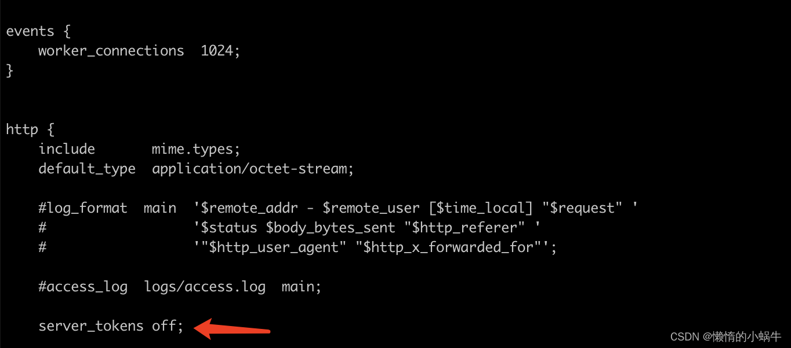

#### nginx配置

- [一、nginx安装](https://blog.csdn.net/qq_41070393/article/details/113977572#nginx_1)
- [二、nginx配置](https://blog.csdn.net/qq_41070393/article/details/113977572#nginx_3)
- - [仅前端配置](https://blog.csdn.net/qq_41070393/article/details/113977572#_4)
  - [仅后端配置](https://blog.csdn.net/qq_41070393/article/details/113977572#_19)
  - [前后分离配置(1)](https://blog.csdn.net/qq_41070393/article/details/113977572#1_36)
  - [前后分离配置(2)](https://blog.csdn.net/qq_41070393/article/details/113977572#2_60)
  - [前后不分离配置](https://blog.csdn.net/qq_41070393/article/details/113977572#_90)
  - [https/ssl配置](https://blog.csdn.net/qq_41070393/article/details/113977572#httpsssl_116)
  - [负载均衡配置](https://blog.csdn.net/qq_41070393/article/details/113977572#_227)
  - [数据压缩配置](https://blog.csdn.net/qq_41070393/article/details/113977572#_263)
- [三、完整nginx.conf文件](https://blog.csdn.net/qq_41070393/article/details/113977572#nginxconf_303)
- [四、可能遇到的问题](https://blog.csdn.net/qq_41070393/article/details/113977572#_441)
- - [页面请求403](https://blog.csdn.net/qq_41070393/article/details/113977572#403_442)
- [五、location详解](https://blog.csdn.net/qq_41070393/article/details/113977572#location_447)
- - [location中root和alias](https://blog.csdn.net/qq_41070393/article/details/113977572#locationrootalias_448)
  - - [location中root文件夹映射](https://blog.csdn.net/qq_41070393/article/details/113977572#locationroot_449)
    - [location中alias文件夹映射](https://blog.csdn.net/qq_41070393/article/details/113977572#locationalias_460)
  - [路径映射](https://blog.csdn.net/qq_41070393/article/details/113977572#_471)
  - - [前缀含义](https://blog.csdn.net/qq_41070393/article/details/113977572#_472)
    - [优先级](https://blog.csdn.net/qq_41070393/article/details/113977572#_478)
  - [location中的proxy_pass](https://blog.csdn.net/qq_41070393/article/details/113977572#locationproxy_pass_480)


## 一、nginx安装

见[博客](https://blog.csdn.net/qq_41070393/article/details/108026079)

## 二、nginx配置

### 仅前端配置

```shell
  server {
        listen       80;
        # 多个域名用空格隔开
        server_name  www.weblei.com;
        root         /mnt/d/00_github/python_dev/web_lei/leifront/dist;
        location / {
			index index.html Home.html;
			try_files $uri $uri/ /index.html;
		}
    }

```

### 仅后端配置

```shell
  server {
        listen       80;
        # 多个域名用空格隔开
        server_name  域名; # 示例： server_name www.venny.cn
        root         /web/前端页面路径，仅后端时可以不配置;
        location / {
		    proxy_set_header Host $host;
        	proxy_set_header X-Real-IP $remote_addr;
        	proxy_set_header REMOTE-HOST $remote_addr;
        	proxy_set_header X-Forwarded-For $proxy_add_x_forwarded_for;
		    proxy_pass http://127.0.0.1:8013;
	   }

    }
1234567891011121314
```

### 前后分离配置(1)

```shell
server {
	listen       80;
    server_name  域名; #例如:map.venny.cn;

 	location / {
  				proxy_set_header Host $host;
                root /web/front;
                index /index.html;
                try_files $uri $uri/ /index.html;
        }

    location  /api/ {
            proxy_set_header Host $host;
            proxy_set_header X-Real-IP $remote_addr;
            proxy_set_header REMOTE-HOST $remote_addr;
            proxy_set_header X-Forwarded-For $proxy_add_x_forwarded_for;
			add_header Access-Control-Allow-Methods *;
			add_header Access-Control-Allow-Origin $http_origin;
            proxy_pass http://127.0.0.1:8010/;
    }
}
123456789101112131415161718192021
```

### 前后分离配置(2)

```shell
server {
	listen       80;
	# 多个域名用空格隔开
    server_name  域名; #例如:map.venny.cn

 	location / {
				proxy_set_header Host $host;
				root /web/front/;
                proxy_set_header X-Real-IP $remote_addr;
                proxy_set_header REMOTE-HOST $remote_addr;
                proxy_set_header X-Forwarded-For $proxy_add_x_forwarded_for;
				try_files $uri $uri/ /index.html;
				index /index.html;
        }

    location  /api/ {
            proxy_set_header Host $host;
            proxy_set_header X-Real-IP $remote_addr;
            proxy_set_header REMOTE-HOST $remote_addr;
            proxy_set_header X-Forwarded-For $proxy_add_x_forwarded_for;
			add_header Access-Control-Allow-Methods *;
			add_header Access-Control-Allow-Origin $http_origin;
            proxy_pass http://127.0.0.1:8010/;
    }
}
12345678910111213141516171819202122232425
(1)和（2）的区别是：（1）配置路由跳转的时候url带有‘#’号，（2）则不带
```

### 前后不分离配置

```shell
server {
        listen                  22110;
        # server_name			可配置为IP或域名
        server_name             localhost xxx.venny.cn;
        client_max_body_size    200m;
        location / {
                root   /usr/share/nginx/html;
                index  index.html;

                proxy_set_header Upgrade $http_upgrade;
                proxy_set_header Connection "upgrade";
				# 可选配置,有请求转发需求时配置
                #proxy_redirect http://源IP:源端口/ http://目标IP:目标端口/;
				# 示例:
				#proxy_redirect http://127.0.0.1:80/ http://127.0.0.1:8080/
                proxy_set_header Host $host:$proxy_port;
                #proxy_set_header Host $host;
                proxy_set_header X-Real-IP $remote_addr;
                proxy_set_header REMOTE-HOST $remote_addr;
                proxy_set_header X-Forwarded-For $proxy_add_x_forwarded_for;
                proxy_pass http://localhost:8080/;
        }
}
1234567891011121314151617181920212223
```

### https/ssl配置

- 首先下载证书文件，并上传到/usr/local/nginx/conf（nginx不是默认安装的上传到nginx配置文件）下
  `配置中写相对路径是nginx.conf所在文件的同级（也就是/usr/local/nginx/conf），可以新建文件夹(例cert)来专门保存ssl证书`
  这里就配置一个域名，所以就不建文件夹了
- 修改要解析域名部分的配置(1),将http请求统一重定向到https

```shell
server {
        listen       80;
        server_name  www.venny.cn;
        rewrite ^(.*)$ https://$host$1; #将所有HTTP请求通过rewrite指令重定向到HTTPS。
}

server {
        #SSL 访问端口号为 443
        listen 443 ssl;
        #填写绑定证书的域名
        server_name www.venny.cn;
        #证书文件名称,后缀crt、pem都可以。如果有建立文件夹，则使用相对路径，例：cert/1_www.venny.cn_bundle.crt
        ssl_certificate 1_www.venny.cn_bundle.crt;
        #私钥文件名称.如果有建立文件夹，则使用相对路径，例：cert/2_www.venny.cn_bundle.key
        ssl_certificate_key 2_www.venny.cn.key;
        ssl_session_timeout 5m;
        #请按照以下协议配置,最新可支持TLSv1.3,老版不支持则删除
        ssl_protocols TLSv1 TLSv1.1 TLSv1.2 TLSv1.3;
        #请按照以下套件配置，配置加密套件，写法遵循 openssl 标准。
        ssl_ciphers ECDHE-RSA-AES128-GCM-SHA256:HIGH:!aNULL:!MD5:!RC4:!DHE;
        ssl_prefer_server_ciphers on;

 		location / {
	  			proxy_set_header Host $host;
                root /app/html/;
                index /index.html;
                try_files $uri $uri/ /index.html;
        }

        location  /api/ {
            proxy_set_header Host $host;
            proxy_set_header X-Real-IP $remote_addr;
            proxy_set_header REMOTE-HOST $remote_addr;
            proxy_set_header X-Forwarded-For $proxy_add_x_forwarded_for;
            add_header Access-Control-Allow-Methods *;
	    	add_header Access-Control-Allow-Origin $http_origin;
            proxy_pass http://127.0.0.1:8080/;
        }
    }
123456789101112131415161718192021222324252627282930313233343536373839
```

- 修改要解析域名部分的配置(2)，`分别`配置80端口和443端口

```shell
server {
        listen       80;
        server_name  www.venny.cn;

        location / {
                try_files $uri $uri/ /index.html;
                root /app/html/;
                index index.html;
        }

        location  /api {
                proxy_set_header Host $host;
                proxy_set_header X-Real-IP $remote_addr;
                proxy_set_header REMOTE-HOST $remote_addr;
                proxy_set_header X-Forwarded-For $proxy_add_x_forwarded_for;
                add_header 'Access-Control-Allow-Origin' '*';
                add_header 'Access-Control-Allow-Methods' 'GET, POST, OPTIONS';
                add_header 'Access-Control-Allow-Headers' 'DNT,X-CustomHeader,Keep-Alive,User-Agent,X-Requested-With,If-Modified-Since,Cache-Control,Content-Type';
                proxy_pass http://127.0.0.1:8080;
        }

    }
server {
    listen 443 ssl;
    server_name www.venny.cn;
    root html;
    index index.html index.htm;
    ssl_certificate 1_www.venny.cn.pem;
    ssl_certificate_key 2_www.venny.cn.key;
    ssl_session_timeout 5m;
    ssl_ciphers ECDHE-RSA-AES128-GCM-SHA256:ECDHE:ECDH:AES:HIGH:!NULL:!aNULL:!MD5:!ADH:!RC4;
    ssl_protocols TLSv1 TLSv1.1 TLSv1.2;
    ssl_prefer_server_ciphers on;
    location / {
        		try_files $uri $uri/ /index.html;
         		root /app/html/;
         		index index.html;
    }
    location  /api {
                proxy_set_header Host $host;
                proxy_set_header X-Real-IP $remote_addr;
                proxy_set_header REMOTE-HOST $remote_addr;
                proxy_set_header X-Forwarded-For $proxy_add_x_forwarded_for;
                add_header 'Access-Control-Allow-Origin' '*';
                add_header 'Access-Control-Allow-Methods' 'GET, POST, OPTIONS';
                add_header 'Access-Control-Allow-Headers' 'DNT,X-CustomHeader,Keep-Alive,User-Agent,X-Requested-With,If-Modified-Since,Cache-Control,Content-Type';
                proxy_pass http://127.0.0.1:8080;
        }

}
1234567891011121314151617181920212223242526272829303132333435363738394041424344454647484950
```

- 如果报错 `nginx: [emerg] the "ssl" parameter requires ngx_http_ssl_module in /etc/nginx/xx.conf:9 nginx: configuration file /usr/local/nginx/conf/nginx.conf test failed`
- 解决办法：
- 1.进入nginx安装包的解压目录
- 2.执行`./configure --with-http_stub_status_module --with-http_ssl_module`
- 3.执行`make`
- 4.备份源nginx文件`cp /usr/local/nginx/sbin/nginx /usr/local/nginx/sbin/nginx.bak`
- 5.停止当前运行的nginx `nginx -s stop`,如果无法停止，则执行`pkill -9 nginx`
- 6.复制刚刚编译的文件`cp ./objs/nginx /usr/local/nginx/sbin/`,根据提示输入y
- 7.重启nginx `nginx`

### 负载均衡配置

1. 新建文件夹(用来存放nginx自定义配置文件)
   `mkdir -p /etc/nginx/conf.d`
2. 在nginx的配置文件(默认`/usr/local/nginx/conf/nginx.conf`)中加入`include /etc/nginx/conf.d/*.conf;`
3. 在/etc/nginx/conf.d/下新建stream.conf文件，并输入以下内容

```shell
upstream upstream-app {
	server 127.0.0.1:8081 weight=10;
	server 127.0.0.1:8082 weight=10;
}
1234
```

1. 同样新建 my-upstream.conf文件，配置转发规则（注意和前面前后端分离、或后端配置不一样）

```shell
server {
	listen       80;
    server_name  域名，例如:baidu.com;

 	location / {
  				proxy_set_header Host $host;
                root /web/front;
                index /index.html;
                try_files $uri $uri/ /index.html;
        }

    location  /api/ {
            proxy_set_header Host $host;
            proxy_set_header X-Real-IP $remote_addr;
            proxy_set_header REMOTE-HOST $remote_addr;
            proxy_set_header X-Forwarded-For $proxy_add_x_forwarded_for;
			add_header Access-Control-Allow-Methods *;
			add_header Access-Control-Allow-Origin $http_origin;
            proxy_pass http://upstream-app/;
    }
   }
```

### 数据压缩配置

编辑`/usr/local/nginx/conf/nginx.conf`文件

```shell
   # 打开gzip压缩
   gzip  on;
   # 超过1k进行压缩
   gzip_min_length 1k;
   # 压缩等级1-9的正整数，1最低，压缩时间短，9最高，压缩时间长，吃cpu，但是压缩效果好,根据业务合理配置
   gzip_comp_level 3;
   # 进行压缩的文件类型。
   gzip_types text/plain application/javascript application/x-javascript text/css application/xml application/json text/javascript application/x-httpd-php image/jpeg image/gif image/png image/jpg;
   # 是否在http header中添加Vary: Accept-Encoding，建议开启
   gzip_vary on;
12345678910
```

- 域名解析未生效访问时，显示nginx欢迎页，修改nginx.conf文件

```shell
      # listen       80;
      # server_name  localhost;

      listen       80 default_server;
      listen       [::]:80 default_server;
      server_name  _;
123456
```

- 域名不存在时返回’无法访问’修改nginx.conf文件

```shell
   location / {
           # root   html;
           # index  index.html index.htm;
        deny all;
  }
12345
```

- 屏蔽nginx版本号(解决低危安全漏洞)

```shell
    # server_tokens作用域是http server location语句块。
    # server_tokens默认值是on，表示显示版本信息，设置server_tokens值是off，就可以在所有地方隐藏nginx的版本信息。
    server_tokens off;
123
```



## 三、完整nginx.conf文件

```shell
#user  nobody;
worker_processes  1;

#error_log  logs/error.log;
#error_log  logs/error.log  notice;
#error_log  logs/error.log  info;

#pid        logs/nginx.pid;


events {
    use					epoll;
    worker_connections  51200;
}


http {
    include       mime.types;
    default_type  application/octet-stream;

    #log_format  main  '$remote_addr - $remote_user [$time_local] "$request" '
    #                  '$status $body_bytes_sent "$http_referer" '
    #                  '"$http_user_agent" "$http_x_forwarded_for"';

    #access_log  logs/access.log  main;

	# 限流配置
    limit_conn_zone $binary_remote_addr zone=conn_zone:1m;
    limit_req_zone $binary_remote_addr zone=req_zone:1m rate=1r/s;

    sendfile        on;
    #tcp_nopush     on;

    #keepalive_timeout  0;
    keepalive_timeout  65;
    # 屏蔽nginx版本号
    server_tokens off;
    gzip  on;

    gzip_min_length 1k;

    gzip_comp_level 3;


    # 进行压缩的文件类型。
    gzip_types text/plain application/javascript application/x-javascript text/css application/xml application/json text/javascript application/x-httpd-php image/jpeg image/gif image/png;

    # 是否在http header中添加Vary: Accept-Encoding，建议开启
    gzip_vary on;

    include /etc/nginx/conf.d/*.conf;

    server {
        listen       80;
        server_name  localhost;

        #charset koi8-r;

        #access_log  logs/host.access.log  main;

        location / {
            root   html;
            index  index.html index.htm;
        }

        #error_page  404              /404.html;

        # redirect server error pages to the static page /50x.html
        #
        error_page   500 502 503 504  /50x.html;
        location = /50x.html {
            root   html;
        }

        # proxy the PHP scripts to Apache listening on 127.0.0.1:80
        #
        #location ~ \.php$ {
        #    proxy_pass   http://127.0.0.1;
        #}

        # pass the PHP scripts to FastCGI server listening on 127.0.0.1:9000
        #
        #location ~ \.php$ {
        #    root           html;
        #    fastcgi_pass   127.0.0.1:9000;
        #    fastcgi_index  index.php;
        #    fastcgi_param  SCRIPT_FILENAME  /scripts$fastcgi_script_name;
        #    include        fastcgi_params;
        #}

        # deny access to .htaccess files, if Apache's document root
        # concurs with nginx's one
        #
        #location ~ /\.ht {
        #    deny  all;
        #}
    }


    # another virtual host using mix of IP-, name-, and port-based configuration
    #
    #server {
    #    listen       8000;
    #    listen       somename:8080;
    #    server_name  somename  alias  another.alias;

    #    location / {
    #        root   html;
    #        index  index.html index.htm;
    #    }
    #}


    # HTTPS server
    #
    #server {
    #    listen       443 ssl;
    #    server_name  localhost;

    #    ssl_certificate      cert.pem;
    #    ssl_certificate_key  cert.key;

    #    ssl_session_cache    shared:SSL:1m;
    #    ssl_session_timeout  5m;

    #    ssl_ciphers  HIGH:!aNULL:!MD5;
    #    ssl_prefer_server_ciphers  on;

    #    location / {
    #        root   html;
    #        index  index.html index.htm;
    #    }
    #}

}
```

## 四、可能遇到的问题

### 页面请求403

可能原因是权限不够，可以修改nginx.conf文件,将第一行配置打开，修改如下

```shell
user  root;
1
```

## 五、location详解

### location中root和alias

#### location中root[文件夹](https://so.csdn.net/so/search?q=文件夹&spm=1001.2101.3001.7020)映射

root 后面跟的参数表示相对路径，示例：

```shell
 	location /ui/ {
  		proxy_set_header Host $host;
  		# 表示http://xxx:xx/ui/请求映射到主机/web/front/ui/文件夹
        root /web/front/; 
        index /index.html;
    }
123456
```

适用于相同文件、文件夹的映射，如果请求路径和实际的文件夹不一致则使用alias代替

#### location中alias文件夹映射

alias指定的是绝对路径，相当于文件夹直接映射，示例：

```shell
 	location /resource/ {
  		proxy_set_header Host $host;
  		# 表示http://xxx:xx/resource/请求映射到主机/html/source/文件夹
        alias /html/source/; 
    }
12345
```

个人理解：root、alias的区别在于，alias可以将请求的URL路径映射到任何地方，而root则是指定[nginx服务器](https://so.csdn.net/so/search?q=nginx服务器&spm=1001.2101.3001.7020)的根目录。alias映射不带有`路径`,root则带有
如果文件夹映射，则root、alias后参数需要以‘/’ 结尾

### 路径映射

#### 前缀含义

- = 开头表示精确匹配。如 A 中只匹配根目录结尾的请求，后面不能带任何字符串
- ^~ 开头表示uri以某个常规字符串开头，不是正则匹配
- ~ 开头表示区分大小写的正则匹配
- \* 开头表示不区分大小写的正则匹配
- / 通用匹配, 如果没有其它匹配,任何请求都会匹配到。

#### 优先级

( location = ) > ( location 完整路径 ) > ( location ^~ 路径 ) > ( location ,* 正则顺序 ) > ( location 部分起始路径 ) > ( / )

### location中的proxy_pass

在nginx中配置proxy_pass代理转发时，如果在proxy_pass后面的url加/，表示绝对根路径；如果没有/，表示相对路径，把匹配的路径部分也带上。例如：

```shell
第一种：代理到URL：http://127.0.0.1:8080/test.html
location /api/ {
    proxy_pass http://127.0.0.1:8080/;
}
第二种（相对于第一种，最后少一个 / ）
代理到URL：http://127.0.0.1:8080/api/test.html
location /api/ {
    proxy_pass http://127.0.0.1:8080;
}
第三种：代理到URL：http://127.0.0.1:8080/aaa/test.html
location /api/ {
    proxy_pass http://127.0.0.1:8080/aaa/;
}
第四种（相对于第三种，最后少一个 / ）
代理到URL：http://127.0.0.1:8080/aaatest.html
location /api/ {
     proxy_pass http://127.0.0.1:8080/aaa;
}
123456789101112131415161718
```

文章知识点与官方知识档案匹配，可进一步学习相关知识